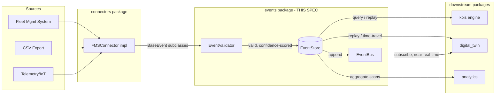
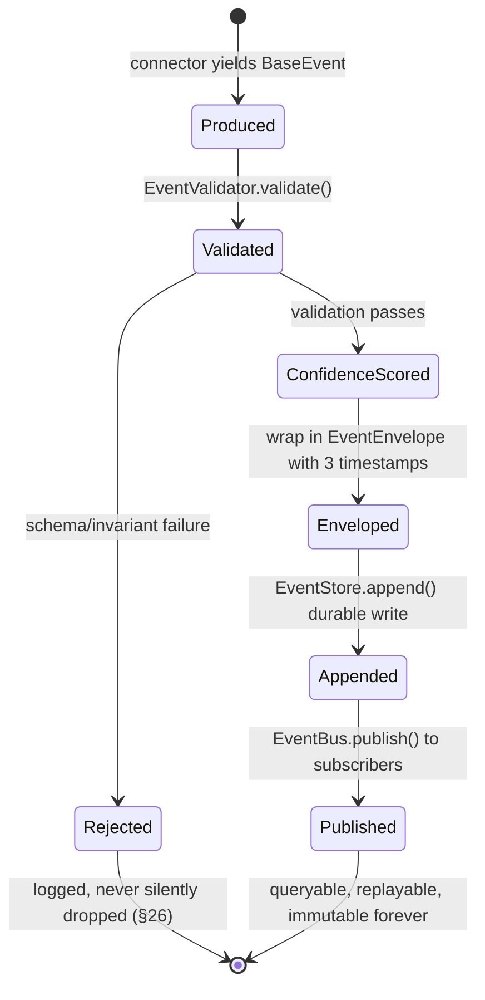
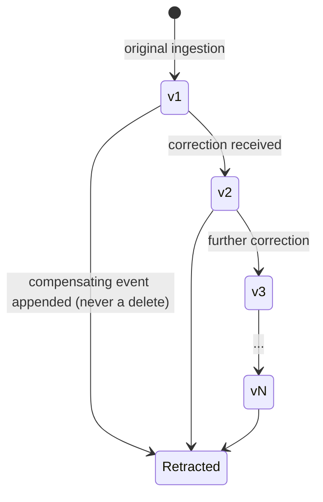
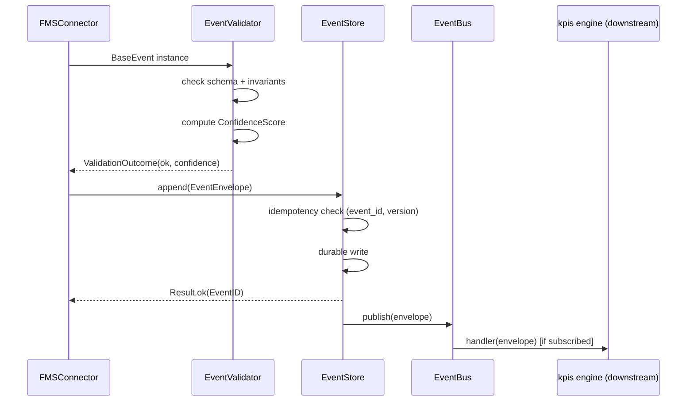
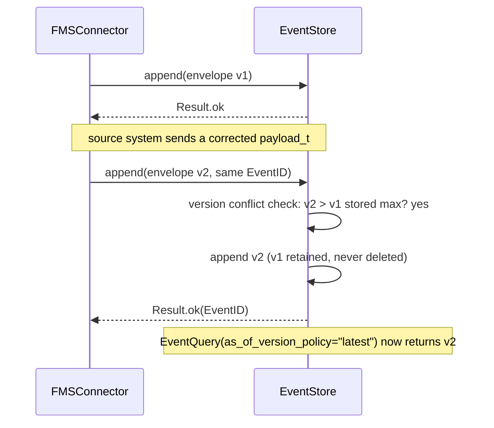
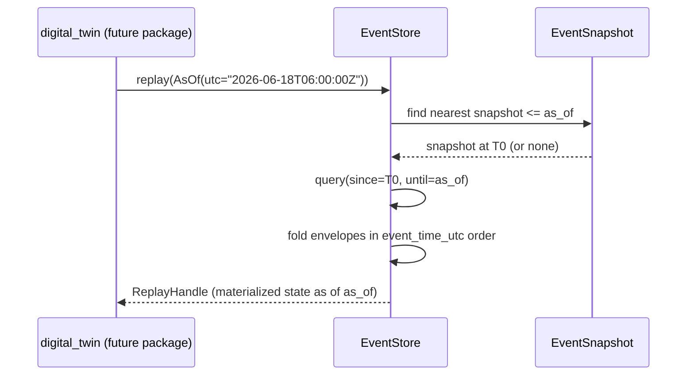
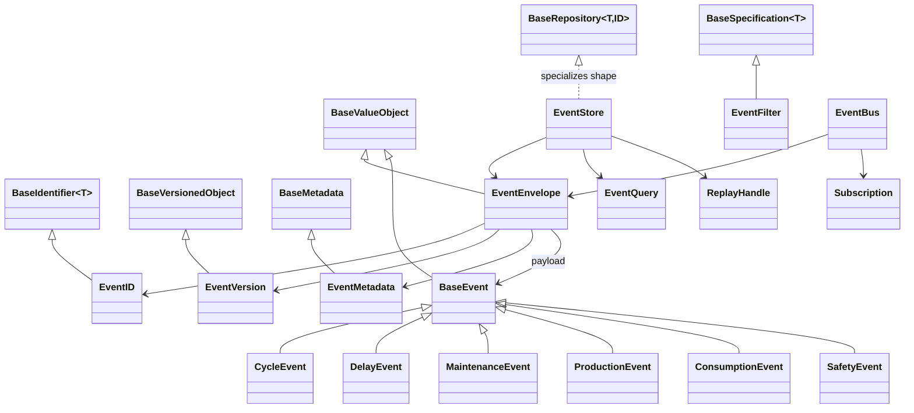

# Event Framework — Design Specification

| | |
|---|---|
| **Document ID** | AH-DS-01 |
| **Package** | `mineproductivity.events` |
| **Status** | Draft — Design Complete, Pending Implementation |
| **Version** | 1.0.0 |
| **Conforms to** | Master Architecture Handbook v1.0; Reference Implementation Blueprint v1.0; Developer & Cookbook Guide Parts I–III; Learning & Benchmark Suite v1.0 |
| **Builds on** | Repository Skeleton v0.1.0 (LOCKED); Core Foundation Library v0.2.0 (LOCKED) |
| **Author** | Chief Software Architect, MineProductivity |
| **Classification** | Public — Open Source Design Documentation |

## Document Control

This is a **design specification**, not an implementation. It contains type signatures, interface contracts, dataclass field lists, and illustrative (non-functional) code sketches for the purpose of pinning down behavior unambiguously. Nothing in this document is meant to be copied into `src/` verbatim; an implementer follows this contract, writes tests first (per `docs/design/01_Event_Implementation_Checklist.md`), and only then writes `_compute`-level logic.

Every architectural fact in this document is cross-referenced against the locked documentation set. Where the locked Developer & Cookbook Guide uses illustrative package names that differ from our locked Repository Skeleton (e.g. the Guide's narrative `core.events` vs. our locked top-level `mineproductivity.events`), this specification always resolves to the **actual locked skeleton**, per the instruction that the skeleton and Core Foundation Library are LOCKED and take precedence over illustrative prose.

---

## 1. Purpose

The Event Framework is the system of record for MineProductivity. It defines the immutable, append-only event model that every derived state in the platform — KPI values, Digital Twin state, analytics, decisions — is computed from. It exists to guarantee one property above all others: **any number the platform ever produces can be recomputed, byte-for-byte, from the events that produced it.**

This is the concrete realization of the "event-first" principle stated in the root [README.md](../../README.md#why-mineproductivity): *"Events are the immutable source of truth; everything else is a derived, rebuildable projection."*

## 2. Scope

**In scope:**

- The base event contract (`BaseEvent`), its envelope, metadata, identity, and versioning types.
- The canonical event type hierarchy (`CycleEvent`, `DelayEvent`, `MaintenanceEvent`, `ProductionEvent`, `ConsumptionEvent`, `SafetyEvent`, and the extension mechanism for future event types).
- The `EventStore` interface: append, read, query, filter, and time-travel (replay) contracts.
- The `EventBus` interface: publish/subscribe for near-real-time consumers (Digital Twin, streaming KPIs).
- Event validation, schema definition, and confidence scoring.
- Serialization contracts (JSON, Arrow, Parquet) at the interface level.
- Ordering, idempotency, duplicate detection, and the three-time-concept temporal model (Event Time / Processing Time / Ingestion Time).
- Snapshotting for replay performance.
- The relationship contracts between events and Ontology, Digital Twin, KPI Engine, and Connectors.

**Out of scope (see §4):** concrete storage backend implementations, the KPI computation engine itself, connector implementations, and the Digital Twin's live-state machinery.

## 3. Responsibilities

The `events` package is responsible for, and only for:

1. Defining what an event **is** (the contract) and what makes it **valid**.
2. Defining how events are **identified**, **versioned**, and **related** to ontology entities.
3. Defining the **storage contract** (`EventStore`) that any backend must satisfy — without implementing a specific backend.
4. Defining the **distribution contract** (`EventBus`) for real-time subscribers — without implementing a specific broker.
5. Defining **replay and time-travel** semantics precisely enough that any conformant `EventStore` implementation produces identical historical reconstructions.
6. Providing the **canonical event type catalogue** (§10) that Connectors populate and the KPI Engine consumes.

## 4. Out of Scope

The following are explicitly **not** part of this package and must not be implemented here:

- **Connector logic** (reading a CSV, calling a vendor SDK, mapping vendor reason codes) — see [`04_Connector_Framework_Design_Specification.md`](04_Connector_Framework_Design_Specification.md). `events` defines what a connector must *produce*; it never produces events itself.
- **KPI computation** — see [`05_KPI_Engine_Design_Specification.md`](05_KPI_Engine_Design_Specification.md). `events` is a dependency of `kpis`, never the reverse.
- **Ontology entity definitions** (what a `RigidHaulTruck` or `Shift` is) — see [`02_Ontology_Framework_Design_Specification.md`](02_Ontology_Framework_Design_Specification.md). Events *reference* ontology entities by identifier; they do not define them.
- **A concrete storage engine** (a specific database, file format library, or message broker client). `EventStore`/`EventBus` are interfaces; concrete adapters belong in `io` and `connectors`.
- **Digital Twin live-state management, forking, or what-if simulation.**
- **Any mining-domain business logic** beyond the shape of the canonical event types themselves.

## 5. Architecture

The Event Framework sits directly above `ontology` in the platform's dependency stack (see root README's [layering diagram](../../README.md#the-platform)):

```
core  →  ontology  →  events  →  kpis  →  analytics  →  decision  →  digital_twin
```

Architecturally, `events` implements **Event Sourcing**: the event log is the single system of record; every other piece of derived state (a KPI value, a Digital Twin snapshot, an analytics aggregate) is a pure function of the event log up to some point in time. This is why `EventStore.replay(as_of)` is not a debugging affordance — it is a first-class operational capability that the Digital Twin (a future package) will build directly upon.



## 6. Package Structure

```
src/mineproductivity/events/
├── __init__.py            # public API surface
├── envelope.py             # EventEnvelope, EventMetadata
├── identifier.py            # EventID (core.BaseIdentifier specialization)
├── versioning.py              # EventVersion, event correction/versioning rules
├── base_event.py                # BaseEvent (core.BaseValueObject specialization)
├── schema.py                      # EventSchema, schema registry integration
├── canonical/                      # the canonical event type catalogue
│   ├── __init__.py
│   ├── cycle_event.py               # CycleEvent
│   ├── delay_event.py               # DelayEvent
│   ├── maintenance_event.py          # MaintenanceEvent
│   ├── production_event.py            # ProductionEvent
│   ├── consumption_event.py            # ConsumptionEvent
│   └── safety_event.py                 # SafetyEvent
├── validation.py                    # EventValidator, confidence scoring
├── store.py                          # EventStore (abstract), query/filter types
├── bus.py                             # EventBus (abstract), subscription types
├── replay.py                           # replay/time-travel contract
├── snapshot.py                          # EventSnapshot contract
├── serialization/                        # format adapters (interfaces only)
│   ├── __init__.py
│   ├── json_codec.py
│   ├── arrow_codec.py
│   └── parquet_codec.py
├── exceptions.py                          # events-specific exception hierarchy
└── README.md
```

Rationale for this layout: it mirrors `core`'s one-concept-per-module discipline (see [`core/README.md`](../../src/mineproductivity/core/README.md#contents)), and separates the *canonical event catalogue* (`canonical/`) — which will grow over time as new event types are added — from the *framework machinery* (envelope, store, bus, replay) that stays fixed regardless of how many event types exist.

## 7. Dependency Direction

```
core  →  ontology  →  events
```

- **`events` depends on:** `core` (`BaseValueObject`, `BaseIdentifier`, `BaseVersionedObject`, `BaseMetadata`, `Result`, `Maybe`, `MineProductivityError` hierarchy, `BaseRepository` as the shape `EventStore` specializes) and `ontology` (to reference — never define — entity identifiers such as `equipment_id`, `shift_id`). It may also depend on the cross-cutting packages `registry` (to register event types and codecs) and `validation`.
- **`events` is depended on by:** `connectors` (produces events), `kpis` (consumes events), `analytics`, `decision`, `digital_twin` (all consume events transitively via `kpis` or directly via `EventStore`).
- **Forbidden:** `events` must never import `connectors`, `kpis`, `analytics`, `optimization`, `simulation`, `decision`, `digital_twin`, or `agents`. `events` has no idea a fleet-management vendor exists.

## 8. Public API

```python
from mineproductivity.events import (
    # Identity & envelope
    EventID, EventVersion, EventMetadata, EventEnvelope,
    # Base contract
    BaseEvent,
    # Canonical catalogue
    CycleEvent, DelayEvent, MaintenanceEvent, ProductionEvent,
    ConsumptionEvent, SafetyEvent,
    # Schema & validation
    EventSchema, EventValidator, ValidationOutcome, ConfidenceScore,
    # Store & bus
    EventStore, EventQuery, EventFilter, EventBus, Subscription,
    # Replay & snapshotting
    ReplayHandle, EventSnapshot, AsOf,
    # Exceptions
    EventValidationError, EventVersionConflictError,
    DuplicateEventError, EventNotFoundError, ReplayError,
)
```

## 9. Internal API

Not part of the public contract; subject to change without a major version bump.

- `events.canonical._registry` — the internal mapping of `event_type_code -> type[BaseEvent]`, populated by the `registry` package's discovery mechanism (see [`03_Registry_Framework_Design_Specification.md`](03_Registry_Framework_Design_Specification.md)).
- `events.serialization._codec_registry` — internal codec lookup by format name.
- `events.store._InMemoryEventStore` — a reference, non-production `EventStore` used by `tests/unit/events/` and `examples/events/`, analogous to `core.InMemoryRepository`.

## 10. Object Model

### 10.1 `EventID`

```python
@dataclass(frozen=True, slots=True)
class EventID(BaseIdentifier[str]):
    """Globally unique identifier for one event instance.

    Format: "<source_prefix>-<ulid>", e.g. "csv-01HZY3K9G8QXZQKD1P2E3F4G5H".
    ULIDs (not UUID4) are used so identifiers are lexicographically
    sortable by creation time -- a property EventStore range-scans rely on.
    """
```

### 10.2 `EventVersion`

```python
@dataclass(frozen=True, slots=True)
class EventVersion(BaseVersionedObject):
    """The correction/revision counter for one EventID.

    An (EventID, EventVersion) pair is the true primary key of a stored
    event -- see Learning & Benchmark Suite v1.0, "Event corrections and
    idempotency". version=1 is the original ingestion; version=2+ are
    corrections. Only ever incremented via `next_version()`; never reset.
    """
```

### 10.3 `EventMetadata`

```python
@dataclass(frozen=True, slots=True)
class EventMetadata(BaseMetadata):
    """Descriptive + provenance metadata attached to every envelope.

    In addition to BaseMetadata's name/description/tags/attributes, event
    metadata is where confidence scoring and source provenance live —
    deliberately kept OUT of BaseEvent's own fields so an event's business
    payload never mixes with its trust/provenance data.
    """
    confidence: float = field(default=1.0, kw_only=True)      # [0.0, 1.0]
    source_system: str = field(default="unknown", kw_only=True)  # e.g. "minestar", "csv"
    late_arrival: bool = field(default=False, kw_only=True)
```

### 10.4 `EventEnvelope`

The envelope is what actually gets stored and transmitted; it wraps a `BaseEvent` payload with the three-time-concept temporal model mandated by the Learning & Benchmark Suite v1.0 (§"Temporal Data Philosophy"):

```python
@dataclass(frozen=True, slots=True)
class EventEnvelope(BaseValueObject, Generic[TEvent]):
    """The stored/transmitted unit: identity + version + times + payload."""
    event_id: EventID
    version: EventVersion
    payload: TEvent                    # a BaseEvent subclass instance

    event_time_utc: datetime           # when it happened in the real world (canonical)
    processing_time_utc: datetime      # when the source system processed it (diagnostic only)
    ingestion_time_utc: datetime       # when the EventStore accepted it (audit trail)

    metadata: EventMetadata = field(default_factory=lambda: EventMetadata(name="event"))

    def validate(self) -> None:
        if not (self.event_time_utc <= self.processing_time_utc <= self.ingestion_time_utc):
            raise ValidationError(
                "envelope violates event_time <= processing_time <= ingestion_time"
            )
```

**Rule (normative, from the Learning & Benchmark Suite):** *KPI and every other downstream calculation MUST use `event_time_utc` as the aggregation basis. `processing_time_utc` is diagnostic only and must never be used to compute operating hours, shift assignment, or any other derived quantity.*

### 10.5 `BaseEvent`

```python
class BaseEvent(BaseValueObject, ABC):
    """Abstract root of every canonical event payload type.

    A BaseEvent carries only the business-domain fact; identity, version,
    and the three timestamps live one level up, on EventEnvelope (§10.4).
    This separation is deliberate: two envelopes with different
    event_ids can legitimately wrap payload instances that are field-for-
    field identical (e.g. two trucks completing structurally similar
    cycles) -- BaseEvent equality is a BaseValueObject's field equality,
    while EventEnvelope equality is additionally scoped by EventID.

    Every concrete event type MUST declare:
      - equipment_id: str            # references an ontology Equipment entity
      - shift_id: str                # references an ontology Shift entity
      - event_type_code: ClassVar[str]   # e.g. "CYCLE", "DELAY" -- registry key
    """
    equipment_id: str
    shift_id: str
    event_type_code: ClassVar[str]

    @abstractmethod
    def duration_h(self) -> float:
        """Return this event's duration in hours, however duration is defined
        for the concrete type (a cycle's total time, a delay's span, ...)."""
```

### 10.6 Canonical Event Type Catalogue

Each concrete type below is a frozen dataclass subclassing `BaseEvent`. This is the catalogue as of v1.0; new types are added by extension (§16), never by editing existing types.

| Type | `event_type_code` | Key fields | Produced by | Consumed by |
|---|---|---|---|---|
| `CycleEvent` | `CYCLE` | `queue_min, spot_min, load_min, haul_min, dump_min, return_min, payload_t, route_id, operator_id, material_type` | Any `FMSConnector` | `PROD.TPH`, `PROD.TruckCycleTime`, `PROD.Payload`, `HAUL.*`, `ENERGY.*`, `CARBON.*` |
| `DelayEvent` | `DELAY` | `delay_category` (one of the six canonical MECE categories, §19.3), `delay_reason`, `duration_min` | Any `FMSConnector` | `DELAY.Hours`, `UTIL.PA`, `UTIL.UA`, `UTIL.EU` |
| `MaintenanceEvent` | `MAINTENANCE` | `failure_start_utc, return_to_service_utc, total_downtime_h, is_planned, failure_mode_code` | Maintenance-management connectors | `MAINT.MTBF`, `MAINT.MTTR`, `MAINT.Ai` |
| `ProductionEvent` | `PRODUCTION` | `pit_code, material_type, tonnes_moved, planned_tonnes, operating_h` | Shift-summary / plant connectors | `PROD.PlanAttainment`, cost roll-ups |
| `ConsumptionEvent` | `CONSUMPTION` | `resource_type` (fuel/power/water/reagent), `quantity, unit` | Fuel/energy telemetry connectors | `ENERGY.*`, `CARBON.*`, `COST.*` |
| `SafetyEvent` | `SAFETY` | `safety_event_type` (speed-violation/fatigue/proximity/seatbelt), `severity`, `zone_id` | Telemetry/geofence connectors | `SAFE.*` |

```python
@dataclass(frozen=True, slots=True)
class CycleEvent(BaseEvent):
    event_type_code: ClassVar[str] = "CYCLE"
    queue_min: float
    spot_min: float
    load_min: float
    haul_min: float
    dump_min: float
    return_min: float
    payload_t: float
    route_id: str | None = field(default=None, kw_only=True)
    operator_id: str | None = field(default=None, kw_only=True)
    material_type: str = field(default="unspecified", kw_only=True)

    @property
    def cycle_min(self) -> float:
        return self.queue_min + self.spot_min + self.load_min + \
               self.haul_min + self.dump_min + self.return_min

    def duration_h(self) -> float:
        return self.cycle_min / 60.0

    def validate(self) -> None:
        if self.payload_t < 0:
            raise ValidationError("CycleEvent.payload_t must be >= 0")
        if any(leg < 0 for leg in (self.queue_min, self.spot_min, self.load_min,
                                    self.haul_min, self.dump_min, self.return_min)):
            raise ValidationError("CycleEvent leg minutes must be >= 0")
```

```python
@dataclass(frozen=True, slots=True)
class DelayEvent(BaseEvent):
    event_type_code: ClassVar[str] = "DELAY"
    delay_category: DelayCategory       # enum: SCHEDULED/OPERATIONAL/EQUIPMENT/PROCESS/EXTERNAL/STANDBY
    delay_reason: str
    duration_min: float

    def duration_h(self) -> float:
        return self.duration_min / 60.0

    def validate(self) -> None:
        if self.duration_min < 0:
            raise ValidationError("DelayEvent.duration_min must be >= 0")
```

The remaining four types (`MaintenanceEvent`, `ProductionEvent`, `ConsumptionEvent`, `SafetyEvent`) follow the identical shape: a frozen `BaseEvent` subclass, a `ClassVar[str] event_type_code`, a `duration_h()` implementation appropriate to the type, and a `validate()` enforcing its own field invariants. Their full field lists are specified in [`docs/design/01_Event_Implementation_Checklist.md`](../design/01_Event_Implementation_Checklist.md).

### 10.7 `EventSchema`

```python
@dataclass(frozen=True, slots=True)
class EventSchema(BaseValueObject):
    """The machine-readable shape of one event type -- used for validation,
    documentation generation, and JSON Schema export (parity with the
    ontology's `to_schema()` pattern, Cookbook Part I Ch.8)."""
    event_type_code: str
    version: EventVersion
    required_fields: tuple[str, ...]
    field_types: Mapping[str, str]           # field name -> type name
    invariants: tuple[str, ...]              # human-readable, e.g. "end_ts > start_ts"

    def to_json_schema(self) -> Mapping[str, Any]: ...
```

### 10.8 `EventStore` (abstract)

```python
TEnvelope = TypeVar("TEnvelope", bound=EventEnvelope[Any])

class EventStore(ABC, Generic[TEnvelope]):
    """The append-only, immutable system of record.

    Specializes the shape of core.BaseRepository (add/get/find/list) with
    event-sourcing-specific operations: append-only writes (no update, no
    delete), version-aware retrieval, range queries by event_time_utc, and
    replay. An EventStore never mutates a stored envelope.
    """

    @abstractmethod
    def append(self, envelope: TEnvelope) -> Result[EventID]:
        """Append one envelope. Idempotent on (event_id, version) -- see §19."""

    @abstractmethod
    def append_batch(self, envelopes: Iterable[TEnvelope]) -> Result[Sequence[EventID]]:
        """Append many envelopes atomically per the store's isolation guarantee (§25)."""

    @abstractmethod
    def get(self, event_id: EventID, *, as_of_version: EventVersion | None = None) -> TEnvelope:
        """Return the envelope for event_id, at its highest version unless
        as_of_version pins an earlier one. Raises EventNotFoundError."""

    @abstractmethod
    def find(self, event_id: EventID) -> Maybe[TEnvelope]:
        """Non-raising counterpart to get()."""

    @abstractmethod
    def query(self, query: EventQuery) -> Iterator[TEnvelope]:
        """Stream envelopes matching query. MUST be a generator (or return
        an iterator) -- never materialize the full result set in memory,
        per Cookbook Part I Ch.7's "Iterable, not list" rule."""

    @abstractmethod
    def replay(self, as_of: AsOf) -> ReplayHandle[TEnvelope]:
        """Reconstruct the store's logical state as of a point in time or
        a named scenario (§17.3). See §13.3 for the replay sequence."""

    @abstractmethod
    def snapshot(self, as_of: AsOf) -> EventSnapshot:
        """Materialize and persist a snapshot to accelerate future replay
        to or past `as_of` (§17.4)."""
```

```python
@dataclass(frozen=True, slots=True)
class EventQuery(BaseValueObject):
    event_types: tuple[str, ...] | None = field(default=None, kw_only=True)
    equipment_ids: tuple[str, ...] | None = field(default=None, kw_only=True)
    shift_ids: tuple[str, ...] | None = field(default=None, kw_only=True)
    since_utc: datetime | None = field(default=None, kw_only=True)
    until_utc: datetime | None = field(default=None, kw_only=True)
    filters: tuple[BaseSpecification[TEnvelope], ...] = field(default=(), kw_only=True)
    as_of_version_policy: Literal["latest", "as_of_ingestion"] = field(
        default="latest", kw_only=True
    )
```

`EventFilter` is an alias for `core.BaseSpecification[EventEnvelope]`, reusing the composable predicate pattern established in `core.specification` (`&`, `|`, `~`) rather than inventing a parallel filtering DSL.

### 10.9 `EventBus` (abstract)

```python
class EventBus(ABC):
    """Near-real-time publish/subscribe distribution of newly appended
    envelopes, for consumers that cannot wait for a query (streaming KPIs,
    the Digital Twin's live-state sync)."""

    @abstractmethod
    def publish(self, envelope: EventEnvelope[Any]) -> None:
        """Called by EventStore.append() after a successful, durable write.
        Never called before durability is confirmed (§25)."""

    @abstractmethod
    def subscribe(
        self, filter: BaseSpecification[EventEnvelope[Any]], handler: Callable[[EventEnvelope[Any]], None]
    ) -> Subscription:
        """Register handler for envelopes matching filter. Returns a
        Subscription whose .cancel() unregisters it."""


class Subscription(ABC):
    @abstractmethod
    def cancel(self) -> None: ...
    @property
    @abstractmethod
    def is_active(self) -> bool: ...
```

## 11. Lifecycle

An envelope moves through exactly five states from creation to queryability. This lifecycle is normative — no `EventStore` implementation may skip or reorder a stage.



Once `Appended`, an envelope is **immutable for the rest of its existence**. A correction never transitions an existing envelope backward through this lifecycle — it produces a brand-new envelope with the same `EventID` and an incremented `EventVersion`, which independently passes through the same five stages (§19.2).

## 12. State Machine

`EventVersion`'s lifecycle (distinct from the envelope lifecycle above) governs corrections:



`Retracted` is not a deletion — it is a `BaseEvent` payload flagged via `EventMetadata.attributes["retracted"] = True`, still fully queryable for audit, but excluded from `EventQuery`'s default (`as_of_version_policy="latest"`) resolution.

## 13. Sequence Diagrams

### 13.1 Normal ingestion



### 13.2 Correction



### 13.3 Replay / time travel



## 14. Class Diagrams



## 15. Data Flow

```
Source system
   │
   ▼
FMSConnector.get_cycle_data() / get_delay_data() / ...     (connectors package)
   │  yields BaseEvent instances (generator, never a list)
   ▼
EventValidator.validate(event) -> ValidationOutcome          (events package)
   │  schema check, invariant check, confidence scoring
   ▼
EventEnvelope construction (attach EventID, EventVersion,
   event_time_utc / processing_time_utc / ingestion_time_utc)
   │
   ▼
EventStore.append(envelope)                                   (events package,
   │  idempotency check on (event_id, version)                 backed by an io
   │  durable write                                             adapter)
   ▼
EventBus.publish(envelope)  ───────────────►  subscribers (digital_twin, streaming kpis)
   │
   ▼
EventStore.query(EventQuery) / .replay(AsOf)  ◄────────────  kpis engine, analytics,
                                                                digital_twin (pull path)
```

Two consumption paths exist by design: a **pull path** (`query`/`replay`, used by the KPI engine's batch execution and any historical analysis) and a **push path** (`EventBus.publish`, used by near-real-time consumers). Both read the same immutable envelopes; neither path can observe an envelope the other cannot.

## 16. Extension Points

1. **New canonical event types.** Subclass `BaseEvent`, declare a unique `event_type_code`, implement `duration_h()` and `validate()`, and register it via the `registry` package's `EventTypeRegistry` (see [`03_Registry_Framework_Design_Specification.md §10.3`](03_Registry_Framework_Design_Specification.md)). No change to `events/canonical/__init__.py`'s existing files is required or permitted.
2. **New serialization codecs.** Implement `core.BaseSerializer[EventEnvelope]` and register under a format name (§21).
3. **New `EventStore` backends.** Implement the `EventStore` ABC against a concrete storage technology (in `io` or a plugin package) — `events` never depends on the backend.
4. **New `EventBus` transports.** Implement the `EventBus` ABC against Kafka, MQTT, or an in-process pub/sub — again, `events` never depends on the transport.

## 17. Plugin Strategy

Event types, codecs, store backends, and bus transports are all discovered through the same `registry`/`plugins` mechanism used platform-wide (Cookbook Part I, Ch. 9's entry-points model, realized concretely in [`03_Registry_Framework_Design_Specification.md`](03_Registry_Framework_Design_Specification.md)):

```toml
# a plugin package's pyproject.toml
[project.entry-points."mineproductivity.event_types"]
tyre_change = "mineproductivity_haulmetrics.events:TyreChangeEvent"
```

`events` itself never imports a plugin; it only defines the `EventTypeRegistry` **protocol** that `registry` implements and that plugins register against.

### 17.1 Snapshot strategy

`EventSnapshot` (§10.8) is an extension point for performance, not correctness: an `EventStore` implementation MAY refuse to produce snapshots (falling back to full replay from genesis) and still be conformant, provided replay produces an identical result. A conformant snapshot strategy MUST satisfy: `replay(as_of) == fold(query(since=snapshot.as_of, until=as_of), initial=snapshot.state)`.

## 18. Metadata

Every `EventEnvelope` carries `EventMetadata` (§10.3). Per the platform's metadata-first principle, no event type may be added to the canonical catalogue (§10.6) without also completing:

| Metadata field | Requirement |
|---|---|
| `event_type_code` | Unique, uppercase, stable forever (never reused after retirement — mirrors the KPI naming standard's rule against reusing retired identifiers). |
| `required_fields` (via `EventSchema`) | Enumerated exhaustively; no implicit/optional business fields without a documented default. |
| `confidence` scoring rule | Documented: what inputs lower confidence below 1.0 (missing optional fields, out-of-band values, etc.). |
| Ontology references | Which `equipment_id`/`shift_id`-shaped fields this type carries, and which ontology entity types they must resolve against (§10.6's "Consumed by" column feeds directly from this). |

## 19. Validation

### 19.1 Two validation layers

1. **Structural validation** (`BaseEvent.validate()`, inherited from `core.BaseValueObject`): per-field invariants checked at construction time (e.g. `CycleEvent.payload_t >= 0`). This can never be bypassed — it runs in `__post_init__`.
2. **Contextual validation** (`EventValidator`, a `core.BaseValidator[BaseEvent]`): cross-field and cross-entity checks that need context beyond one event (e.g. "does `equipment_id` resolve to a real ontology entity?"). Runs once, at ingest, never on every read (Cookbook Part I, Ch. 5).

```python
class EventValidator(BaseValidator[BaseEvent]):
    def validate(self, candidate: BaseEvent) -> ValidationResult:
        """Returns a ValidationResult (core.validator) whose errors, if any,
        do NOT raise -- an invalid event becomes a warning-carrying,
        low-confidence envelope, never a silent drop and never a crash."""
```

### 19.2 Confidence scoring

```python
@dataclass(frozen=True, slots=True)
class ConfidenceScore(BaseValueObject):
    value: float          # [0.0, 1.0]
    reasons: tuple[str, ...] = field(default=(), kw_only=True)

    def validate(self) -> None:
        if not (0.0 <= self.value <= 1.0):
            raise ValidationError("ConfidenceScore.value must be in [0.0, 1.0]")
```

An orphaned `equipment_id` (one that does not resolve in the ontology) becomes a **warning attached to the envelope's confidence score**, never a silently-dropped or silently-fabricated event (Cookbook Part I, Ch. 8's "Common Mistake").

### 19.3 The canonical six delay categories (normative)

`DelayEvent.delay_category` MUST be exactly one of: `SCHEDULED`, `OPERATIONAL`, `EQUIPMENT`, `PROCESS`, `EXTERNAL`, `STANDBY` — mutually exclusive and collectively exhaustive, per the Developer & Cookbook Guide Part III "Canonical Semantics" ruling. Where a delay could plausibly belong to more than one category (e.g. refuelling during a breakdown), the documented precedence order applies: `EQUIPMENT` > `OPERATIONAL` > `STANDBY` > `PROCESS` > `SCHEDULED` > `EXTERNAL`. This taxonomy and its precedence order are owned as ontology reference data, not by `events` — see [`02_Ontology_Framework_Design_Specification.md §10.9`](02_Ontology_Framework_Design_Specification.md) for the authoritative `DelayCategory` definition `events.DelayEvent` consumes.

## 20. Versioning

Two independent versioning concerns exist and must not be conflated:

1. **Per-event versioning** (`EventVersion`, §10.2): the correction counter for one `EventID`. Unbounded, monotonic, never resets.
2. **Schema/type versioning** (`EventSchema.version`): governs the *shape* of an event type over time, following Semantic Versioning exactly as the KPI Standard Library does (Cookbook Part III, "Lifecycle, versioning, governance, and deprecation"):
   - **MAJOR** — a breaking change to an event type's required fields or semantics. Never mutates an existing `event_type_code`'s meaning in place; ships as a new type or a documented migration.
   - **MINOR** — a backward-compatible addition (a new optional field).
   - **PATCH** — documentation or validation-rule fix with no behavioral change.

**Idempotency rule (normative):** re-appending the same `(EventID, EventVersion)` pair to an `EventStore` MUST be a no-op that produces the same stored state and creates no duplicate — this is what makes the platform's deterministic-replay guarantee (used by the future Learning & Benchmark Suite's `ScenarioGenerator`) meaningful.

## 21. Serialization

`events` defines the *contracts*, not the format libraries' concrete bindings (those are an `io`-package concern). Three format contracts are mandated at v1.0:

| Format | Use case | Contract |
|---|---|---|
| JSON | API responses, small exports, human debugging | `JSONEventCodec(core.BaseSerializer[EventEnvelope])` — round-trips through `core.to_dict`/`DataclassSerializer` conventions. |
| Apache Arrow | In-memory, zero-copy interchange with `analytics`/`kpis` vectorized engines (Polars/DuckDB, see [`05_KPI_Engine_Design_Specification.md`](05_KPI_Engine_Design_Specification.md)) | `ArrowEventCodec` — one `RecordBatch` per event type, columns matching `EventSchema.field_types`. |
| Apache Parquet | At-rest, partitioned storage in the event lake | `ParquetEventCodec` — partitioned by `(site, event_type_code, date(event_time_utc))`, mirroring Cookbook Part I Ch.5's "partitioned by site and date." |

All three codecs implement the same `BaseSerializer[EventEnvelope]` shape from `core.serialization` — a consumer that only knows `BaseSerializer` can be handed any of the three without caring which.

## 22. Performance Considerations

- **Streaming by default.** Every connector-facing and query-facing API returns an `Iterator`/generator, never a materialized `list` — a 200-row test fixture and a 50-million-row shift export use the identical code path (Cookbook Part I, Ch. 7).
- **Column pruning at query time.** `EventQuery` should be satisfiable without deserializing fields the caller did not ask for, when the backing codec is columnar (Arrow/Parquet) — mirrors the KPI engine's "computing one KPI reads only the columns it declares" principle (Cookbook Part I, Ch. 4).
- **Pre-aggregation is an `analytics`/`kpis` concern, not an `events` concern.** `events` guarantees correct, complete replay from genesis; it does not itself maintain rollups.
- **Snapshotting (§17.1) is the only sanctioned way to bound replay cost** for long-lived, frequently-replayed stores. A conformant implementation should snapshot on a configurable cadence (e.g. daily), never silently.

## 23. Memory Considerations

- `EventEnvelope` and every `BaseEvent` subclass are frozen, `slots=True` dataclasses — no `__dict__` per instance, minimizing per-event overhead at the scale of tens of millions of events per fleet-month.
- `EventStore.query()` and `.replay()` MUST NOT buffer unbounded results in memory; backends are expected to page/stream from the underlying storage.
- `EventSnapshot` payloads are the one place where a full materialized state is expected to live in memory; implementations should document the expected snapshot size per site so operators can provision accordingly.

## 24. Thread Safety

- All `events` value types (`EventEnvelope`, `BaseEvent` subclasses, `EventID`, `EventVersion`, `EventMetadata`) are immutable and therefore trivially thread-safe to read and share.
- `EventStore` and `EventBus` implementations MUST document their own thread-safety guarantees (this specification mandates the *contract*, not the *implementation*'s internal locking strategy) but MUST, at minimum, guarantee that concurrent `append()` calls from multiple threads never corrupt stored state or violate the idempotency rule (§20).
- `Subscription` handlers registered with `EventBus.subscribe()` may be invoked from a different thread than the caller of `subscribe()`; handler implementations are responsible for their own thread safety, exactly as with any pub/sub system.

## 25. Concurrency

- **Write concurrency:** `EventStore.append_batch()` is expected to provide at-least atomic-per-envelope durability; whether the whole batch is atomic is an implementation detail an `EventStore` MUST document. Concurrent appends of *different* `EventID`s never conflict. Concurrent appends of the *same* `(EventID, EventVersion)` must resolve idempotently (§20), never as a race that corrupts state.
- **Read/write concurrency:** `query()`/`replay()` observe a consistent snapshot of the store as of the moment the call began (no torn reads across envelopes appended mid-query); an implementation may satisfy this via MVCC, a WAL, or an equivalent mechanism of its choosing.
- **Publish ordering:** `EventBus.publish()` is called only after `append()` has confirmed durability (§13.1) — never before, so a subscriber can never observe an event that a concurrent crash could make un-queryable.

## 26. Error Handling

`events` defines its own exception subtree, rooted in `core.MineProductivityError` per the platform-wide rule that every package's exceptions are catchable at the root without a broad `except Exception`:

```python
class EventValidationError(ValidationError):
    """A BaseEvent or EventEnvelope failed structural or schema validation."""

class EventVersionConflictError(MineProductivityError):
    """An append specified a version that does not extend the store's
    current version chain for that EventID (e.g. appending v1 again with
    different field values, or skipping from v1 to v3)."""

class DuplicateEventError(MineProductivityError):
    """Raised only when an implementation chooses to reject a duplicate
    rather than silently no-op it; both are conformant per §20, but the
    chosen behavior must be documented and consistent."""

class EventNotFoundError(NotFoundError):
    """EventStore.get() found no envelope for the given EventID (+ version)."""

class ReplayError(MineProductivityError):
    """A replay() or snapshot() request could not be satisfied (e.g.
    as_of predates the store's retention horizon)."""
```

**Guiding rule (from Cookbook Part I, Ch. 6's "qualify, don't coerce" stance, applied here):** a rejected event is always logged and surfaced as a `Result.err`, never silently dropped and never fabricated with a default value.

## 27. Logging

- Every `append()` rejection (validation failure, version conflict) MUST be logged at `WARNING` with the `EventID`, attempted `EventVersion`, and rejection reason — this is the primary operational signal for a mis-mapped connector.
- Every successful late-arrival acceptance (§"Watermarks and late events" in the Learning & Benchmark Suite) MUST be logged at `INFO` with the affected `EventID` and how far past the watermark it arrived, since late arrivals can retroactively change already-reported KPI values.
- `events` uses the logging configuration surface defined by `core.BaseConfiguration`-derived settings in the future `config` package; it does not configure logging handlers itself (no global state, per `core`'s "no global state" rule).

## 28. Configuration

Configuration objects for this package (e.g. `EventStoreConfiguration`, `LateEventPolicyConfiguration`) are `core.BaseConfiguration` subclasses. The one load-bearing configuration surface specified here is the **late-event policy**, per the Learning & Benchmark Suite:

```python
@dataclass(frozen=True, slots=True)
class LateEventPolicy(BaseConfiguration):
    mode: Literal["accept_and_correct", "accept_and_flag", "reject"] = "accept_and_correct"
    reject_after_certification: bool = True
```

`events` defines this configuration's *shape*; actual values are sourced by the future `config` package (environment, file, or site-level override), never hard-coded here.

## 29. Testing Strategy

Mirrors `core`'s test-first discipline (`tests/unit/events/`, one `test_*.py` per module) plus event-sourcing-specific categories:

- **Unit tests** — every `BaseEvent` subclass's `validate()` and `duration_h()`; `EventVersion` monotonicity; `EventEnvelope`'s three-timestamp invariant.
- **Property tests** — idempotency (`append(e); append(e)` twice is observably identical to once), and the replay/snapshot equivalence law from §17.1.
- **Contract tests** — any `EventStore`/`EventBus` implementation is run against a shared, backend-agnostic contract test suite (the same pattern the Cookbook uses for `FMSConnector` in Ch. 7), so a new backend proves conformance without hand-writing its own semantics tests.
- **Golden tests** — a fixed sequence of envelopes replayed to a fixed `as_of` must reproduce a pinned, version-controlled expected state, guarding against silent replay-semantics drift.

## 30. Certification Requirements

Per the Learning & Benchmark Suite's certification asset categories (Part VII), an `events` implementation is certifiable only after it passes, at minimum:

| Category | Requirement for `events` |
|---|---|
| A — Golden datasets | Replaying the canonical `cycle_events.csv`/`delay_events.csv` fixtures reproduces the published expected envelopes exactly. |
| B — Integration | The full path CSV → `FMSConnector` → `EventValidator` → `EventStore` → query produces the golden outputs without a direct function call bypassing any stage. |
| C — Edge cases | Zero-duration cycles, exactly-boundary confidence scores, and empty query windows are handled per this spec, not by a crash. |
| D — Corrupted data | Negative payloads, out-of-range delay categories, and malformed timestamps are rejected (§26), not silently coerced. |
| E — Missing data | Optional fields absent produce a lowered `ConfidenceScore`, never a fabricated value. |
| F — Timezone | Shift-boundary assignment via `event_time_utc` is correct across a DST transition (per the Learning & Benchmark Suite's Pilbara Ridge DST example). |
| G — Multi-mine | `EventID`s from five concurrently-active mine contexts never collide and query correctly scoped per mine. |

## 31. Example Usage

Illustrative only — matches the shape of the existing `examples/core/` scripts and will become `examples/events/01_first_event.py` once implemented:

```python
from mineproductivity.events import CycleEvent, EventEnvelope, EventID, EventVersion, EventMetadata
from datetime import datetime, timezone

cycle = CycleEvent(
    equipment_id="HT-214", shift_id="A-2026-06-25",
    queue_min=1.5, spot_min=0.5, load_min=2.5,
    haul_min=8.0, dump_min=1.0, return_min=6.0,
    payload_t=220.0,
)
print(cycle.cycle_min)     # 19.5

envelope = EventEnvelope(
    event_id=EventID.generate(), version=EventVersion(),
    payload=cycle,
    event_time_utc=datetime.now(timezone.utc),
    processing_time_utc=datetime.now(timezone.utc),
    ingestion_time_utc=datetime.now(timezone.utc),
    metadata=EventMetadata(name="cycle-ingest", source_system="csv"),
)

result = store.append(envelope)          # Result[EventID], never raises on business rejection
if result.is_err:
    log.warning("event rejected: %s", result.error)
```

## 32. Anti-Patterns

- ❌ **Mutating a stored envelope.** There is no `EventStore.update()`. A correction is always a new envelope, same `EventID`, incremented `EventVersion`.
- ❌ **Using `processing_time_utc` to compute operating hours or assign shifts.** Always `event_time_utc` (§10.4).
- ❌ **Materializing `EventStore.query()` into a `list` "just to see how many there are."** Use a count-aware query parameter or stream-and-count; a 50-million-row shift export must not require 50 million objects in memory at once.
- ❌ **Inventing a new `delay_category` value "just this once."** The six categories are closed (§19.3); a genuinely new distinction requires an ontology/governance change, not a silent seventh value.
- ❌ **Silently dropping an event that fails contextual validation.** It becomes a low-confidence, warning-carrying envelope or a logged rejection (§26/§19.2) — never a value that simply never got appended with no trace.
- ❌ **A connector importing `kpis` "to double-check a computed value."** `connectors` and `events` never import `kpis` (§7); this is the same anti-corruption boundary the Cookbook enforces for the whole platform.

## 33. Future Extensions

- **Additional canonical event types** as new mining sub-domains are specified (e.g. `BlastEvent`, `SurveyEvent`, `AssayEvent` — hinted at by the `GRADE`/`BLEND`/`CRUSH` KPI namespaces in Part III's Appendix A).
- **Streaming ingestion contracts** (Kafka/MQTT `EventBus` adapters) — the interface is specified now (§10.9); concrete transport adapters are a `connectors`/`io` implementation task.
- **Compression** at the codec level (e.g. Parquet's native columnar compression, or an Arrow IPC-with-LZ4 stream) — an implementation concern within the existing `BaseSerializer` contract, requiring no interface change.
- **Cross-site event federation** for enterprise-wide replay, once multi-tenant `EventStore` requirements are specified.

## 34. Known Constraints

- This specification assumes `event_time_utc` is available and trustworthy at the connector boundary; a source system with unreliable clocks is a data-quality problem `events` can flag (via confidence scoring) but cannot fully solve.
- Deterministic replay (§20) assumes a snapshot strategy, if used, is itself deterministic; a non-deterministic snapshot implementation would violate §17.1's equivalence law even though nothing in the `EventStore` ABC could detect it — implementations are trusted, not verified, on this point at the interface level (certification testing, §30, is the verification mechanism).
- `events` targets Python 3.12+ per the platform-wide `pyproject.toml` baseline; no event type may use language features beyond that baseline.

## 35. Architecture Decisions

| ID | Decision | Rationale |
|---|---|---|
| AD-EV-01 | Envelope/payload split (`EventEnvelope` wraps `BaseEvent`) rather than a single flat class. | Keeps identity/version/timing concerns (framework) separate from business fields (domain), so a new event type never needs to redeclare identity/timing plumbing — it only declares its own fields, mirroring `core.BaseEntity` vs. `core.BaseValueObject`'s separation of identity from value. |
| AD-EV-02 | `EventID` uses ULIDs, not UUID4. | ULIDs are lexicographically time-sortable, which lets a range-scan-based `EventStore` implementation retrieve events in approximate time order directly from the identifier, without a separate index. |
| AD-EV-03 | Three-timestamp model (`event_time`/`processing_time`/`ingestion_time`) is mandatory on every envelope, not optional. | The Learning & Benchmark Suite identifies confusing these as "the single most common temporal error in mining analytics"; making all three mandatory fields (with a validated ordering invariant) makes the error a validation failure, not a possible silent bug. |
| AD-EV-04 | Corrections are new versions, never in-place mutation, even for the underlying storage engine. | This is the load-bearing guarantee for reproducible replay and audit (Cookbook Part I, Ch. 5's "Common Mistake"); relaxing it anywhere breaks the platform's central "recompute, don't trust, a stored number" guarantee. |
| AD-EV-05 | `EventFilter` reuses `core.BaseSpecification` rather than a bespoke query DSL. | Composition-over-inheritance and consistency with `core.repository`'s established filtering pattern; avoids inventing a second predicate language for the same job. |
| AD-EV-06 | The six `DelayEvent` categories are a closed enum, not an open string field. | Directly implements the Developer & Cookbook Guide Part III's normative delay-classification ruling; an open string field would silently reintroduce the cross-vendor incomparability the ruling exists to prevent. |

## 36. Definition of Done

A pull request implementing (a slice of) this specification is "done" when:

- [ ] Every class/interface in §10 exists with the exact signatures specified (or a documented, reviewed deviation).
- [ ] `tests/unit/events/` exists, mirrors `src/mineproductivity/events/` 1:1, and achieves ≥95% coverage (matching `core`'s bar).
- [ ] `mypy --strict` and `ruff` are clean on the new package.
- [ ] `examples/events/` contains at least the ingestion, query, and replay examples sketched in §31.
- [ ] The contract test suite (§29) exists and a reference `_InMemoryEventStore`/`_InMemoryEventBus` (§9) pass it.
- [ ] No import from `events` reaches into `connectors`, `kpis`, `analytics`, `optimization`, `simulation`, `decision`, `digital_twin`, or `agents` (mechanically checked, mirroring `core`'s AST-based dependency test).
- [ ] `events/README.md` exists, following the same template as [`core/README.md`](../../src/mineproductivity/core/README.md).

## 37. Package Acceptance Criteria

The `events` package is accepted as v0.3.0-ready when, in addition to §36:

1. **Reproducibility proof:** replaying a fixed, version-controlled event sequence twice (in two separate processes) produces byte-identical `ReplayHandle` state both times.
2. **Idempotency proof:** appending the same `(EventID, EventVersion)` N times (N ≥ 3) leaves the store in the same observable state as appending it once.
3. **Certification fixtures pass:** all categories A–G in §30 pass against the reference `_InMemoryEventStore`.
4. **No architectural drift:** an automated check confirms `events` appears in the dependency graph exactly where §7 specifies — no new edges, no skipped layers.
5. **Cross-reference audit:** every normative rule cited from the Developer & Cookbook Guide or Learning & Benchmark Suite in this document (§10.6, §19.3, §20, §28) has a corresponding test in `tests/unit/events/` or `tests/integration/`.

---

*End of Event Framework Design Specification. See [`docs/design/01_Event_Implementation_Checklist.md`](../design/01_Event_Implementation_Checklist.md) for the actionable implementation contract derived from this document.*
