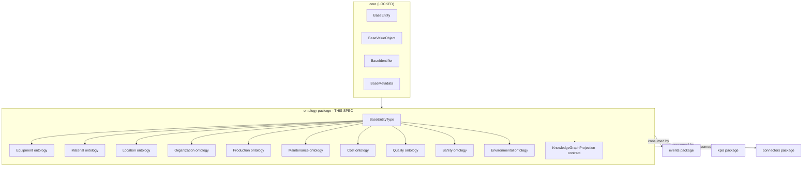
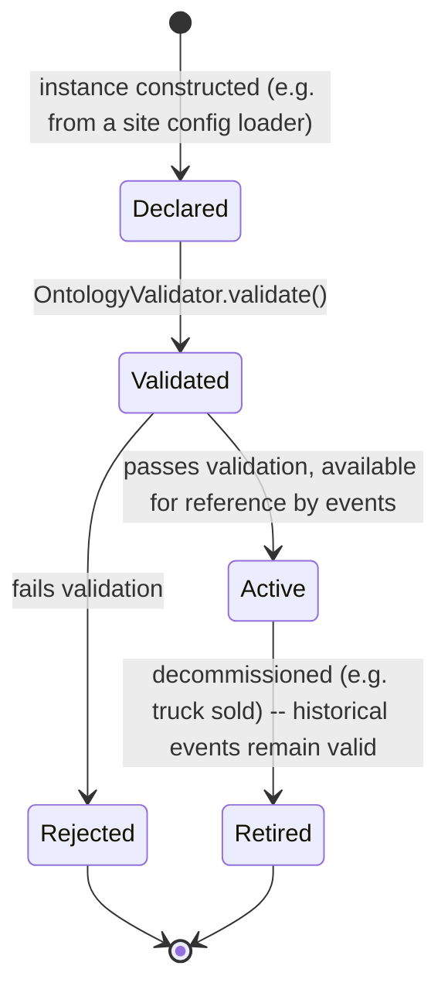
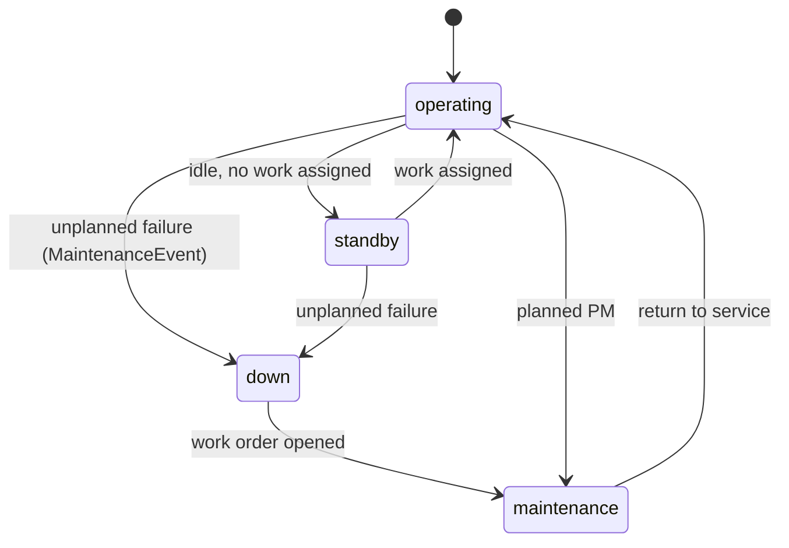
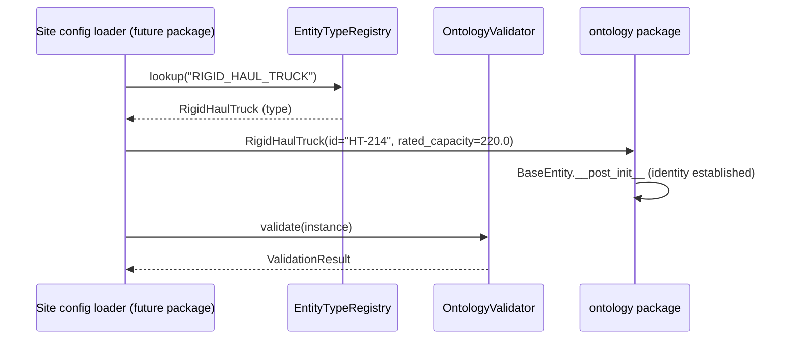
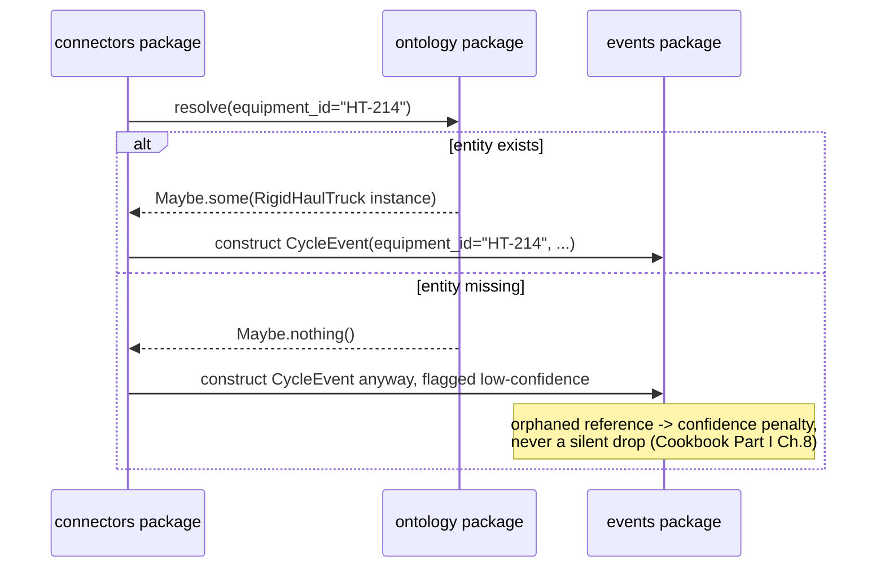
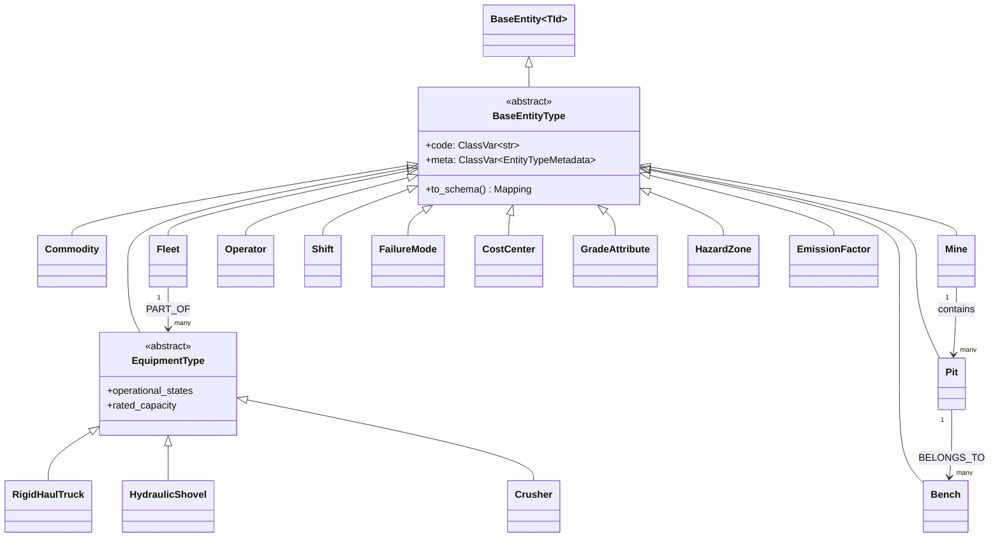

# Ontology Framework - Design Specification

| | |
|---|---|
| **Document ID** | AH-DS-02 |
| **Package** | `mineproductivity.ontology` |
| **Status** | Draft - Design Complete, Pending Implementation |
| **Version** | 1.0.0 |
| **Conforms to** | Master Architecture Handbook v1.0; Reference Implementation Blueprint v1.0; Developer & Cookbook Guide Parts I–III; Learning & Benchmark Suite v1.0 |
| **Builds on** | Repository Skeleton v0.1.0 (LOCKED); Core Foundation Library v0.2.0 (LOCKED) |
| **Author** | Chief Software Architect, MineProductivity |
| **Classification** | Public - Open Source Design Documentation |

## Document Control

Design specification only - no implementation. See [`01_Event_Framework_Design_Specification.md §Document Control`](01_Event_Framework_Design_Specification.md) for the governing note on resolving illustrative Guide package names to the locked skeleton. In this document, the Guide's narrative `mineproductivity.ontology.assets` / `.enterprise` / `.shift` sub-paths are treated as **internal module organization within the single locked top-level `mineproductivity.ontology` package**, not as separate top-level packages.

---

## 1. Purpose

The Ontology Framework is the typed, machine-readable model of the mining world: equipment, materials, locations, organizational structure, production concepts, maintenance concepts, cost concepts, quality concepts, safety concepts, and environmental concepts - and the relationships between them. It exists so that no other package ever has to answer "what is a truck?" or "what belongs to what?" informally. Per the root README's engineering philosophy, this package is the concrete home of the **ontology-first** principle: *"a shared, explicit domain vocabulary... precedes any code that operates on it."*

## 2. Scope

**In scope:**

- The entity hierarchy: `BaseEntityType` (root) and its ten sub-ontology families (§10).
- Equipment ontology: equipment classes, equipment types, operational states, rated capacities.
- Material ontology: commodities, material types (ore/waste/product), grade/quality attributes.
- Location ontology: mine, pit, bench, route, zone, geographic reference.
- Organization ontology: fleet, crew, operator, contractor, business unit.
- Production ontology: shift, cycle context, production targets.
- Maintenance ontology: failure modes, maintenance work orders (structural shape only - not scheduling logic).
- Cost ontology: cost centers, cost categories.
- Quality ontology: assay/grade attributes, quality specifications.
- Safety ontology: hazard zones, speed limits, safety event taxonomy.
- Environmental ontology: emission factors, environmental monitoring points.
- The Knowledge Graph projection interface (nodes/edges derived from the ontology - the graph itself is a future `graph`/`digital_twin`-adjacent capability; this package defines the projection contract only).
- Ontology validation, metadata, versioning, and the `OntologyRegistry` integration point.

**Out of scope (see §4).**

## 3. Responsibilities

1. Define the **type hierarchy** for every entity a mine can contain, with inheritance used deliberately (Cookbook Part I, Ch. 8: "common behaviour lives in the base; specifics live in the leaf").
2. Define **relationships** between entities (by identifier reference, forming a traversable graph).
3. Provide **metadata and JSON-Schema export** for every entity type, so dashboards, validation, and AI agents can introspect the model without reading source code.
4. Define the **projection contract** the Knowledge Graph builds from, so the graph can never drift from the declared ontology (Cookbook Part I, Ch. 8's Architecture Insight).
5. Own the **canonical delay-category taxonomy** as ontology reference data (Developer & Cookbook Guide Part III), even though `DelayEvent` itself lives in `events`.

## 4. Out of Scope

- **Event definitions** - `events` (§ dependency direction below: `ontology` is a dependency *of* `events`, never the reverse).
- **KPI definitions** - `kpis`.
- **The Knowledge Graph traversal engine itself** (`kg.neighbors()`, `kg.path()`, `kg.search()`) - a future `graph`-adjacent capability that *consumes* this package's projection contract; not implemented here.
- **Persistence of ontology instances** - `BaseRepository`-shaped storage is a concern for whatever package instantiates and stores entities (e.g. a future `datasets` or site-configuration loader); `ontology` defines the *types*, not a database of instances.
- **Any calculation** - the ontology is purely descriptive/structural.

## 5. Architecture

```
core  →  ontology  →  events  →  kpis  →  ...
```

`ontology` is the **first domain-aware package** in the dependency stack - the first package permitted to know that "mining" exists at all. Every entity type is built from `core` primitives (`BaseEntity`, `BaseValueObject`, `BaseIdentifier`, `BaseMetadata`) with zero knowledge of events, KPIs, or connectors.



## 6. Package Structure

```
src/mineproductivity/ontology/
├── __init__.py               # public API surface
├── entity_type.py              # BaseEntityType, EntityTypeMetadata
├── relationship.py               # Relationship, RelationshipKind
├── equipment/                      # Equipment ontology
│   ├── __init__.py
│   ├── equipment_type.py            # EquipmentType (abstract root)
│   ├── haul_truck.py                  # RigidHaulTruck, ArticulatedHaulTruck
│   ├── loading_unit.py                 # HydraulicShovel, WheelLoader, LHD
│   ├── drill.py                          # BlastholeDrill
│   ├── ancillary.py                       # Dozer, Grader, WaterTruck
│   └── fixed_plant.py                      # Crusher, Conveyor, Mill
├── material/                        # Material ontology
│   ├── __init__.py
│   ├── commodity.py                  # Commodity (copper, iron_ore, gold, ...)
│   └── material_type.py                # MaterialType (Ore, Waste, Product)
├── location/                         # Location ontology
│   ├── __init__.py
│   ├── mine.py                        # Mine
│   ├── pit.py                          # Pit, Bench
│   ├── route.py                         # Route, Zone
│   └── underground.py                    # Level, Stope, Drive (underground siblings)
├── organization/                     # Organization ontology
│   ├── __init__.py
│   ├── fleet.py                       # Fleet
│   ├── crew.py                         # Crew, Operator
│   └── business_unit.py                  # BusinessUnit, Contractor
├── production/                       # Production ontology
│   ├── __init__.py
│   └── shift.py                       # Shift, ShiftPattern, ShiftCalendar
├── maintenance/                      # Maintenance ontology
│   ├── __init__.py
│   └── failure_mode.py                # FailureMode, MaintenanceWorkOrder (shape only)
├── cost/                             # Cost ontology
│   ├── __init__.py
│   └── cost_center.py                 # CostCenter, CostCategory
├── quality/                          # Quality ontology
│   ├── __init__.py
│   └── grade.py                       # GradeAttribute, QualitySpecification
├── safety/                           # Safety ontology
│   ├── __init__.py
│   └── hazard.py                      # HazardZone, SpeedLimitMap, SafetyEventType
├── environmental/                    # Environmental ontology
│   ├── __init__.py
│   └── emissions.py                   # EmissionFactor, MonitoringPoint
├── reference/                        # cross-domain reference/taxonomy data
│   ├── __init__.py
│   └── delay_taxonomy.py              # the canonical six DelayCategory values
├── graph_projection.py               # KnowledgeGraphProjection contract
├── validation.py                     # OntologyValidator
├── exceptions.py
└── README.md
```

## 7. Dependency Direction

```
core  →  ontology
```

- **`ontology` depends on:** `core` only, plus the cross-cutting `registry` (to register entity types) and `validation` packages.
- **`ontology` is depended on by:** `events`, `kpis`, `connectors`, `analytics`, `decision`, `digital_twin`, `agents` - every domain-aware package references ontology entities by identifier.
- **Forbidden:** `ontology` must never import `events`, `kpis`, `connectors`, or any package above it. It is the domain heart alongside `core` and `events` (Cookbook Part I, Ch. 3's "domain heart... kept free of any vendor or infrastructure dependency").

## 8. Public API

```python
from mineproductivity.ontology import (
    # Root
    BaseEntityType, EntityTypeMetadata, Relationship, RelationshipKind,
    # Equipment
    EquipmentType, RigidHaulTruck, ArticulatedHaulTruck, HydraulicShovel,
    WheelLoader, LHD, BlastholeDrill, Dozer, Grader, WaterTruck,
    Crusher, Conveyor, Mill, OperationalState,
    # Material
    Commodity, MaterialType,
    # Location
    Mine, Pit, Bench, Route, Zone, Level, Stope, Drive,
    # Organization
    Fleet, Crew, Operator, BusinessUnit, Contractor,
    # Production
    Shift, ShiftPattern, ShiftCalendar,
    # Maintenance
    FailureMode, MaintenanceWorkOrder,
    # Cost
    CostCenter, CostCategory,
    # Quality
    GradeAttribute, QualitySpecification,
    # Safety
    HazardZone, SpeedLimitMap, SafetyEventType,
    # Environmental
    EmissionFactor, MonitoringPoint,
    # Reference
    DelayCategory,
    # Graph
    KnowledgeGraphProjection, GraphNode, GraphEdge,
    # Exceptions
    OntologyValidationError, UnknownEntityTypeError, RelationshipError,
)
```

## 9. Internal API

- `ontology._registry` - internal `EntityTypeRegistry` populated by `@register_equipment`-style decorators (§17), consumed publicly only via the `registry` package's discovery surface.
- `ontology.*._schema_cache` - per-module memoized JSON Schema generation, to avoid recomputing `to_schema()` on every call.

## 10. Object Model

### 10.1 `BaseEntityType` - the root

```python
class BaseEntityType(BaseEntity[str], ABC):
    """Root of every ontology entity type.

    A concrete leaf (RigidHaulTruck, Pit, Shift, ...) is a frozen
    dataclass subclass declaring:
      - code: ClassVar[str]                 # stable registry key, e.g. "RIGID_HAUL_TRUCK"
      - a `meta: EntityTypeMetadata` class attribute
      - whatever domain fields the type needs

    Inherits BaseEntity's identity-based equality (two instances with the
    same `id` are equal regardless of other fields), consistent with the
    Cookbook's rule that entities are identity-bearing, not
    value-bearing.
    """
    code: ClassVar[str]
    meta: ClassVar[EntityTypeMetadata]

    def to_schema(self) -> Mapping[str, Any]:
        """Export this type's shape as JSON Schema -- read by dashboards,
        validation, and AI agents without touching source code
        (Cookbook Part I, Ch. 8)."""
        ...
```

```python
@dataclass(frozen=True, slots=True)
class EntityTypeMetadata(BaseMetadata):
    """Every entity type's descriptive metadata, in addition to
    BaseMetadata's name/description/tags/attributes."""
    supported_kpis: tuple[str, ...] = field(default=(), kw_only=True)
    parent_code: str | None = field(default=None, kw_only=True)  # inheritance link
```

### 10.2 `Relationship`

```python
class RelationshipKind(Enum):
    BELONGS_TO = "belongs_to"        # Bench belongs_to Pit
    PART_OF = "part_of"              # Truck part_of Fleet
    OPERATED_BY = "operated_by"      # Equipment operated_by Operator
    LOCATED_AT = "located_at"        # Equipment located_at Zone
    SCOPED_TO = "scoped_to"          # CostCenter scoped_to BusinessUnit

@dataclass(frozen=True, slots=True)
class Relationship(BaseValueObject):
    """A declared, typed edge between two entity ids. Relationships are
    how "by pit" or "by fleet" slicing resolves (Cookbook Part I, Ch. 8)."""
    source_id: str
    kind: RelationshipKind
    target_id: str
```

### 10.3 Equipment Ontology

```python
class EquipmentType(BaseEntityType, ABC):
    """Abstract root for every machine in the mine.

    Common behaviour (state machine, availability-KPI applicability)
    lives here; specifics (rated capacity, cycle-level KPIs) live in
    leaves -- exactly the inheritance split demonstrated in Cookbook
    Part I, Ch. 8.
    """
    operational_states: ClassVar[tuple[str, ...]] = (
        "operating", "standby", "down", "maintenance",
    )
    rated_capacity: float               # tonnes, or tonnes-per-pass for loaders


@dataclass(frozen=True, slots=True, eq=False)
class RigidHaulTruck(EquipmentType):
    code: ClassVar[str] = "RIGID_HAUL_TRUCK"
    meta: ClassVar[EntityTypeMetadata] = EntityTypeMetadata(
        name="Rigid Haul Truck",
        supported_kpis=("PROD.TruckCycleTime", "UTIL.PA", "UTIL.UA", "HAUL.TKPH"),
    )
```

`ArticulatedHaulTruck`, `HydraulicShovel`, `WheelLoader`, `LHD` (underground load-haul-dump), `BlastholeDrill`, `Dozer`, `Grader`, `WaterTruck`, `Crusher`, `Conveyor`, and `Mill` follow the identical shape: subclass `EquipmentType`, declare `code`, declare `meta.supported_kpis`, and add any type-specific fields (e.g. `Crusher.throughput_capacity_tph`).

### 10.4 Material Ontology

```python
class MaterialType(Enum):
    ORE = "ore"
    WASTE = "waste"
    PRODUCT = "product"

@dataclass(frozen=True, slots=True, eq=False)
class Commodity(BaseEntityType):
    code: ClassVar[str] = "COMMODITY"
    symbol: str              # e.g. "Cu", "Fe", "Au"
    unit_basis: str          # "tonnes", "ounces", ...
```

### 10.5 Location Ontology

```python
@dataclass(frozen=True, slots=True, eq=False)
class Mine(BaseEntityType):
    code: ClassVar[str] = "MINE"
    commodity_codes: tuple[str, ...]
    method: str                  # "open_pit" | "underground" (Cookbook Part I Ch.4)

@dataclass(frozen=True, slots=True, eq=False)
class Pit(BaseEntityType):
    code: ClassVar[str] = "PIT"
    mine_id: str
    commodity: str

@dataclass(frozen=True, slots=True, eq=False)
class Bench(BaseEntityType):
    code: ClassVar[str] = "BENCH"
    pit_id: str
    elevation_m: float

@dataclass(frozen=True, slots=True, eq=False)
class Route(BaseEntityType):
    code: ClassVar[str] = "ROUTE"
    source_zone_id: str
    destination_zone_id: str
    one_way_km: float
    effective_grade_pct: float

@dataclass(frozen=True, slots=True, eq=False)
class Level(BaseEntityType):
    """Underground sibling of Bench (Cookbook Part I, Ch. 8's structural
    modelling extended to underground per Part II, Ch. 14)."""
    code: ClassVar[str] = "LEVEL"
    mine_id: str
    elevation_m: float
```

`Zone`, `Stope`, and `Drive` follow the same shape.

### 10.6 Organization Ontology

```python
@dataclass(frozen=True, slots=True, eq=False)
class Fleet(BaseEntityType):
    code: ClassVar[str] = "FLEET"
    mine_id: str
    equipment_type_code: str    # which EquipmentType.code this fleet aggregates

@dataclass(frozen=True, slots=True, eq=False)
class Operator(BaseEntityType):
    code: ClassVar[str] = "OPERATOR"
    crew_id: str
    licence_class: str
```

`Crew`, `BusinessUnit`, and `Contractor` follow the same shape.

### 10.7 Production Ontology

```python
@dataclass(frozen=True, slots=True, eq=False)
class Shift(BaseEntityType):
    code: ClassVar[str] = "SHIFT"
    mine_id: str
    pattern: str              # "2x12" etc.
    start_utc: datetime
    end_utc: datetime
    scheduled_h: float        # authoritative denominator for UTIL.PA/UA (see KPI Engine spec §19's canonical time model)

    def contains(self, event_time_utc: datetime) -> bool:
        """Half-open interval test: start_utc <= t < end_utc (Learning &
        Benchmark Suite's shift-assignment rule)."""
        return self.start_utc <= event_time_utc < self.end_utc
```

### 10.8 Maintenance, Cost, Quality, Safety, Environmental Ontologies

These five sub-ontologies follow the identical `BaseEntityType` pattern; their representative types:

```python
@dataclass(frozen=True, slots=True, eq=False)
class FailureMode(BaseEntityType):
    code: ClassVar[str] = "FAILURE_MODE"
    failure_mode_code: str      # e.g. "HYD-001" (Learning & Benchmark Suite example)
    system: str                 # "hydraulic", "tyre", "electrical", ...

@dataclass(frozen=True, slots=True, eq=False)
class CostCenter(BaseEntityType):
    code: ClassVar[str] = "COST_CENTER"
    business_unit_id: str
    category: str                # maps to COST.* KPI namespace

@dataclass(frozen=True, slots=True, eq=False)
class GradeAttribute(BaseEntityType):
    code: ClassVar[str] = "GRADE_ATTRIBUTE"
    commodity_code: str
    unit: str                    # "% Cu", "g/t Au", ...

@dataclass(frozen=True, slots=True, eq=False)
class HazardZone(BaseEntityType):
    code: ClassVar[str] = "HAZARD_ZONE"
    zone_id: str
    speed_limit_kmh: float       # feeds SAFE.SpeedViolationRate's governed limit map

@dataclass(frozen=True, slots=True, eq=False)
class EmissionFactor(BaseEntityType):
    code: ClassVar[str] = "EMISSION_FACTOR"
    resource_type: str           # "diesel", "grid_power", ...
    kg_co2e_per_unit: float      # feeds CARBON.* KPIs
```

### 10.9 Reference Data - the Canonical Delay Taxonomy

```python
class DelayCategory(Enum):
    """The six mutually-exclusive, collectively-exhaustive delay
    categories, ruled canonical in Developer & Cookbook Guide Part III,
    'Canonical Semantics'. Owned here as ontology reference data;
    consumed by events.DelayEvent and every UTIL/DELAY KPI."""
    SCHEDULED = "Scheduled"
    OPERATIONAL = "Operational"
    EQUIPMENT = "Equipment"
    PROCESS = "Process"
    EXTERNAL = "External"
    STANDBY = "Standby"

    @property
    def precedence(self) -> int:
        """Lower number wins when a delay could plausibly belong to more
        than one category (e.g. refuelling during a breakdown)."""
        return {
            DelayCategory.EQUIPMENT: 0,
            DelayCategory.OPERATIONAL: 1,
            DelayCategory.STANDBY: 2,
            DelayCategory.PROCESS: 3,
            DelayCategory.SCHEDULED: 4,
            DelayCategory.EXTERNAL: 5,
        }[self]
```

### 10.10 `KnowledgeGraphProjection`

```python
@dataclass(frozen=True, slots=True)
class GraphNode(BaseValueObject):
    node_id: str
    node_kind: Literal["entity", "kpi"]
    entity_type_code: str | None = field(default=None, kw_only=True)

@dataclass(frozen=True, slots=True)
class GraphEdge(BaseValueObject):
    source_id: str
    target_id: str
    edge_kind: Literal["relationship", "kpi_dependency"]

class KnowledgeGraphProjection(ABC):
    """The contract a future Knowledge Graph builder consumes to project
    this package's declared entities and relationships into nodes and
    edges, so 'the graph can never drift from the ontology' (Cookbook
    Part I, Ch. 8, Architecture Insight). Traversal (neighbors/path/
    search) is explicitly NOT part of this contract -- see §4."""

    @abstractmethod
    def nodes(self) -> Iterator[GraphNode]: ...

    @abstractmethod
    def edges(self) -> Iterator[GraphEdge]: ...
```

## 11. Lifecycle

An entity *type* (a class like `RigidHaulTruck`) has a design-time lifecycle (Proposed → Registered → Deprecated → Retired, mirroring the KPI lifecycle in §12 of the KPI Engine spec). An entity *instance* (one specific truck) has a simpler, runtime lifecycle:



**Rule:** retiring an entity instance never invalidates historical events that reference it - exactly as `events` never mutates history (§20 of the Event Framework spec).

## 12. State Machine

Equipment operational state (declared on `EquipmentType.operational_states`) is a shared, four-state machine every equipment leaf type inherits:



This state machine is **descriptive metadata**, not a live state manager - `ontology` declares the valid states and transitions; tracking which state an instance is *currently* in is a `digital_twin` concern (a future package), derived from the event stream.

## 13. Sequence Diagrams

### 13.1 Entity declaration and validation



### 13.2 Event-to-ontology resolution (cross-package, illustrative of the events↔ontology relationship)



## 14. Class Diagrams



## 15. Data Flow

```
Site configuration (future config/datasets package)
   │
   ▼
EntityTypeRegistry.lookup(code) -> type[BaseEntityType]         (registry package)
   │
   ▼
Instantiate entity (RigidHaulTruck(id=..., ...))                 (ontology package)
   │
   ▼
OntologyValidator.validate(instance) -> ValidationResult           (ontology package)
   │
   ▼
Entity available for reference by:
   ├── events.BaseEvent.equipment_id / .shift_id  (resolved, not embedded)
   ├── kpis (Required Ontology declarations, §18 of KPI Engine spec)
   └── KnowledgeGraphProjection.nodes()/.edges()   (future graph package)
```

Note the deliberate **reference, not embedding**, pattern: an event never contains a copy of the `RigidHaulTruck` instance, only its `equipment_id` string. This keeps events small, keeps ontology mutable-by-replacement (retiring/updating an entity never rewrites historical events), and matches Cookbook Part I Ch. 5's "relationships... let a KPI be sliced."

## 16. Extension Points

1. **New equipment leaf types** - subclass `EquipmentType`, declare `code` and `meta`, register via `@register_equipment` (§17). No existing leaf type is ever edited to add a new one.
2. **New sub-ontology families** beyond the ten specified here - subclass `BaseEntityType` directly in a new subpackage, following the identical `code`/`meta` pattern.
3. **New relationship kinds** - add a `RelationshipKind` enum member; existing relationships are unaffected (enum extension is additive, non-breaking).
4. **Site-specific entity attributes** that do not belong in the canonical shape - use `EntityTypeMetadata.attributes` (inherited from `core.BaseMetadata`), never by subclassing a leaf type a second time for the same concept.

## 17. Plugin Strategy

Equipment types (and every other entity type) register through the same `registry`/`plugins` mechanism as KPIs and connectors (Cookbook Part I, Ch. 8 and Ch. 9):

```python
from mineproductivity.ontology import EquipmentType, register_equipment

@register_equipment
class WaterTruck(EquipmentType):
    code: ClassVar[str] = "WATER_TRUCK"
    meta: ClassVar[EntityTypeMetadata] = EntityTypeMetadata(
        name="Water Truck",
        supported_kpis=("UTIL.PA", "UTIL.UA", "COST.FuelPerTonne"),
    )
```

```toml
[project.entry-points."mineproductivity.ontology.equipment"]
water_truck = "mineproductivity_sitepack.equipment:WaterTruck"
```

`register_equipment` is a thin decorator delegating to `registry`'s generic registration mechanism (§17 of the [Registry Framework spec](03_Registry_Framework_Design_Specification.md)) - `ontology` does not implement its own bespoke registry machinery.

## 18. Metadata

Every entity type's `EntityTypeMetadata` (§10.1) is mandatory, mirroring the KPI Standard Library's completeness discipline ("a blank field is a specification gap"):

| Field | Requirement |
|---|---|
| `code` | Unique, uppercase, stable forever - never reused after retirement (same rule as event type codes and KPI identifiers). |
| `name` | Human-readable. |
| `supported_kpis` | Every KPI identifier this entity type is a valid subject of - this is what powers `mine.available_kpis()`'s maturity/commodity-aware discovery (Cookbook Part I, Ch. 4). |
| `parent_code` | Set when the type specializes another (inheritance link), enabling `to_schema()` to report inherited requirements. |

## 19. Validation

Two layers, mirroring the Event Framework's split (§19 of that spec):

1. **Structural** - `BaseEntity`/`BaseValueObject` field invariants (e.g. `Bench.elevation_m` type-checked, `Shift.start_utc < Shift.end_utc`), enforced at construction.
2. **Contextual** - `OntologyValidator(core.BaseValidator[BaseEntityType])` checks cross-entity invariants: a `Bench.pit_id` must resolve to a real `Pit`; a `Fleet.equipment_type_code` must resolve to a registered `EquipmentType.code`.

```python
class OntologyValidator(BaseValidator[BaseEntityType]):
    def validate(self, candidate: BaseEntityType) -> ValidationResult:
        """Cross-entity referential checks. Never mutates; returns
        accumulated errors via ValidationResult (core.validator)."""
```

**Rule (from Cookbook Part I, Ch. 8's Common Mistake):** an orphaned reference (e.g. a `Bench.pit_id` pointing at a `Pit` that does not exist) is a validation *warning* attached to the referencing entity, resolved the same way an orphaned `equipment_id` on an event is handled (§19.2 of the Event Framework spec) - never a silent drop, never a crash that halts ingestion of everything else.

## 20. Versioning

Entity type versioning follows the identical Semantic Versioning discipline as KPIs and events:

- **MAJOR** - a breaking change to a type's required fields or semantics (e.g. changing `rated_capacity`'s unit from tonnes to short tons). Ships as a new type version; the old identifier's meaning is never repointed.
- **MINOR** - a backward-compatible addition (a new optional field, a new `supported_kpis` entry).
- **PATCH** - documentation/metadata correction with no shape change.

`ontology`'s own package version additionally tracks an **ontology_version** field that the Learning & Benchmark Suite's traceability rule (Documentation Governance Rule #006) requires every downstream artifact (dataset, notebook, KPI computation) to record alongside `package_version`, `handbook_version`, and `schema_version`.

## 21. Serialization

Every `BaseEntityType` supports two serialization surfaces:

1. **JSON Schema** via `to_schema()` (§10.1) - for documentation, dashboard forms, and AI-agent introspection (Cookbook Part I, Ch. 8).
2. **`core.BaseSerializer[BaseEntityType]`** via `DataclassSerializer` or a dedicated `EntitySerializer` - for persistence and interchange, consistent with `core.serialization`'s established pattern.

Ontology instances are not expected to flow through Arrow/Parquet at the volumes events do; JSON is the default, sufficient serialization surface at v1.0.

## 22. Performance Considerations

- Entity type lookups (`EntityTypeRegistry.lookup(code)`) are O(1) dict access - the registry is small (tens to low hundreds of types), never a performance concern.
- `to_schema()` results should be cached per type (§9) since the schema is static for a given type version.
- Relationship resolution (`Bench.pit_id -> Pit`) is expected to be backed by an in-memory or lightly-cached lookup at query time; `ontology` does not mandate a specific resolution backend, only the `Relationship` shape.

## 23. Memory Considerations

- All entity types are frozen, `slots=True` dataclasses (inherited discipline from `core`), keeping per-instance memory low even for fleets with hundreds of pieces of equipment.
- The ontology of *types* (the Python classes themselves) is loaded once at process start via plugin discovery (§17) and is negligible in size; the ontology of *instances* (actual trucks, pits, shifts at a site) scales with site size, typically hundreds to low thousands of entities - trivial compared to event volumes.

## 24. Thread Safety

- All entity type instances are immutable value/entity objects (frozen dataclasses) and are trivially safe to share across threads.
- `EntityTypeRegistry` population happens once at import/plugin-discovery time (§17); after that point it is read-only and thread-safe by construction. No entity type may be registered dynamically at runtime from application code - only through the plugin discovery mechanism at process startup, avoiding any need for registry write-locking during normal operation.

## 25. Concurrency

`ontology` performs no I/O and holds no mutable shared state beyond the one-time registry population (§24); it has no concurrency concerns beyond what `core` already provides (immutability). Concurrent reads of any entity type or instance are always safe.

## 26. Error Handling

```python
class OntologyValidationError(ValidationError):
    """A BaseEntityType instance failed structural or contextual validation."""

class UnknownEntityTypeError(NotFoundError):
    """EntityTypeRegistry.lookup(code) found no registered type for code."""

class RelationshipError(MineProductivityError):
    """A Relationship references a source_id/target_id that cannot be
    resolved, or declares a RelationshipKind invalid for the two entity
    types involved (e.g. BELONGS_TO between two Operators)."""
```

## 27. Logging

- Every `OntologyValidator` warning (orphaned reference) is logged at `WARNING` with the referencing entity's id and the unresolved target id - mirroring the Event Framework's logging rule (§27 of that spec), since an orphaned ontology reference and an orphaned event reference are the same class of operational signal.
- Registry population (§17) logs at `INFO` once per process start, summarizing how many entity types were discovered per sub-ontology family - useful for diagnosing a missing plugin install.

## 28. Configuration

Site-specific ontology configuration (which commodity, which method, which shift pattern - Cookbook Part I, Ch. 3's "Configuration" section) is sourced by the future `config` package and expressed as instances of `ontology`'s types; `ontology` itself defines no configuration-loading mechanism, consistent with `core.BaseConfiguration`'s "shape, not source" boundary (§28 of the Core Foundation Library's `configuration.py`).

## 29. Testing Strategy

- **Unit tests** (`tests/unit/ontology/`, 1:1 with `src/mineproductivity/ontology/`) - every leaf type's field validation, `to_schema()` output, and `code` uniqueness.
- **Relationship tests** - every `RelationshipKind` resolves correctly for valid entity pairs and is rejected for invalid ones.
- **Registry tests** - `@register_equipment` (and siblings for other sub-ontologies) correctly populate `EntityTypeRegistry`; duplicate `code` registration is rejected.
- **Contract tests for `KnowledgeGraphProjection`** - a reference implementation's `.nodes()`/`.edges()` output is checked against a fixed, small ontology fixture (e.g. the "Bingham West" reference mine from the Cookbook).
- **Golden tests** - the equipment/location/organization tables from the Learning & Benchmark Suite's five reference mines (Pilbara Ridge, Bingham West, Aurora Gold, ...) are loaded and validated without error.

## 30. Certification Requirements

| Category | Requirement for `ontology` |
|---|---|
| A - Golden datasets | The five reference mines' `equipment.csv`, `operators.csv`, `shift_calendar.csv` (Learning & Benchmark Suite) load into ontology instances that pass `OntologyValidator` cleanly. |
| B - Integration | `events` correctly resolves `equipment_id`/`shift_id` against a loaded ontology for a full ingest-to-query path. |
| C - Edge cases | An entity with the maximum-length `code`, a `Shift` spanning a DST transition (Learning & Benchmark Suite's Pilbara Ridge example), and a zero-fleet `Mine` are all handled without error. |
| D - Corrupted data | A `Bench.pit_id` referencing a non-existent `Pit` produces a validation warning, not a crash. |
| G - Multi-mine | Five concurrently-loaded mine ontologies (Learning & Benchmark Suite's five reference mines) never collide on entity `id` across mines. |

## 31. Example Usage

```python
from mineproductivity.ontology import RigidHaulTruck, HydraulicShovel, Pit, Bench, Shift
from datetime import datetime, timezone

truck = RigidHaulTruck(id="HT-214", rated_capacity=220.0)
print(truck.code)                                   # "RIGID_HAUL_TRUCK"
print("PROD.TruckCycleTime" in truck.meta.supported_kpis)   # True

shovel = HydraulicShovel(id="S-01", rated_capacity=45.0)
print("PROD.TruckCycleTime" in shovel.meta.supported_kpis)  # False

west = Pit(id="pit-west", mine_id="bingham-west", commodity="copper")
b7 = Bench(id="bench-7", pit_id="pit-west", elevation_m=1820.0)
print(b7.pit_id)                                     # "pit-west" -> links Bench to Pit

shift_a = Shift(
    id="A-2026-06-25", mine_id="bingham-west", pattern="2x12",
    start_utc=datetime(2026, 6, 25, 6, tzinfo=timezone.utc),
    end_utc=datetime(2026, 6, 25, 18, tzinfo=timezone.utc),
    scheduled_h=12.0,
)
```

## 32. Anti-Patterns

- ❌ **Modelling data before the entity it references.** Always declare the `Bench`, `Fleet`, or `Operator` before ingesting events that point at it (Cookbook Part I, Ch. 8, "Best Practice").
- ❌ **Embedding a full entity instance inside an event** instead of referencing it by id - breaks the reference/embedding separation (§15) and bloats event storage.
- ❌ **Scattering `supported_kpis`-equivalent logic through analysis code** instead of declaring it on the equipment type's metadata - the whole point of `EntityTypeMetadata.supported_kpis` is that "supported-KPI lists live on the equipment type... not scattered through analysis code" (Cookbook Part I, Ch. 8).
- ❌ **Inventing a new delay category as an ontology attribute "for one site."** The six `DelayCategory` values (§10.9) are closed; a site-specific distinction belongs in `attributes`, not a new enum member.
- ❌ **Giving two different entity types the same `code`.** Codes are the registry key and must be globally unique across the whole ontology, not just within one sub-ontology family.
- ❌ **A leaf equipment type importing `events` or `kpis` "to know its own KPIs better."** `supported_kpis` is a tuple of string identifiers, declared as data - never an import of the KPI classes themselves (§7).

## 33. Future Extensions

- **Underground-specific ontology depth** beyond `Level`/`Stope`/`Drive` (e.g. ventilation circuits, ground support classes) as underground method coverage matures (Part II, Ch. 14).
- **Geospatial entity attributes** (GPS bounds, polygon boundaries for pits/benches) - hinted at in the Learning & Benchmark Suite's `bench_geometry.csv` - likely arriving via a `GeoPandas`-backed optional extension, per the Developer Documentation's ecosystem positioning.
- **A concrete `KnowledgeGraphProjection` implementation and traversal engine** in a future `graph` capability, built strictly on this package's projection contract (§10.10).
- **Ontology instance persistence** (`BaseRepository[BaseEntityType, str]` concrete backends) once a `datasets`/site-configuration package is specified.

## 34. Known Constraints

- This specification defines entity *types* and the *shape* of relationships; it does not mandate a specific instance-persistence technology (§4) - a project consuming this spec must pair it with a storage decision made elsewhere.
- `to_schema()`'s JSON Schema output format is specified to exist, not byte-for-byte pinned in this document; the exact schema dialect (e.g. Draft 2020-12) is an implementation-checklist-level decision (see [`docs/design/02_Ontology_Implementation_Checklist.md`](../design/02_Ontology_Implementation_Checklist.md)).
- The ten sub-ontology families (§2) are the v1.0 scope; the Developer & Cookbook Guide Part III's KPI namespace list (`GRADE`, `BLEND`, `CRUSH`, `PROC`, `STOCK`, `RAIL`, `PORT`) implies further ontology depth that is intentionally deferred (§33) rather than speculatively over-built now.

## 35. Architecture Decisions

| ID | Decision | Rationale |
|---|---|---|
| AD-ON-01 | `BaseEntityType` subclasses `core.BaseEntity`, not `core.BaseValueObject`. | Ontology entities have identity that outlives attribute changes (a truck is still "HT-214" after a capacity re-rating); this is exactly the Entity/Value-Object distinction `core` was built to express. |
| AD-ON-02 | Relationships are explicit `Relationship` value objects (id-to-id references with a kind), not object-graph pointers. | Keeps entities independently serializable and avoids reference cycles; mirrors how `events` reference ontology entities by id rather than embedding them (§15). |
| AD-ON-03 | The six `DelayCategory` values live in `ontology.reference`, not in `events`. | They are domain reference *data*, not event *structure* - `events.DelayEvent` consumes them but does not own their governance, consistent with `ontology` being the single source of structural/reference truth (Cookbook Part I, Ch. 8: "The ontology is your single source of structural truth"). |
| AD-ON-04 | Equipment operational state (§12) is declared as metadata on the type, not tracked as mutable instance state. | Live state tracking is a `digital_twin` concern, derived from events; baking a mutable state field into `ontology` would violate `core`'s "no mutation, replace instead" discipline and blur the ontology/twin boundary. |
| AD-ON-05 | `KnowledgeGraphProjection` is specified as an interface here, with no traversal engine. | Keeps `ontology` free of graph-library dependencies (NetworkX or similar) while still guaranteeing, by contract, that any future graph "can never drift from the ontology" (Cookbook Part I, Ch. 8). |

## 36. Definition of Done

- [ ] Every entity type in §10 (all ten sub-ontology families) exists with the exact `code`/`meta` shape specified.
- [ ] `tests/unit/ontology/` mirrors `src/mineproductivity/ontology/` 1:1, ≥95% coverage.
- [ ] `mypy --strict` and `ruff` clean.
- [ ] `examples/ontology/` demonstrates equipment modelling, structural modelling (Pit/Bench/Shift), and relationship traversal (mirroring Cookbook Part I, Ch. 8's exercises).
- [ ] No import from `ontology` reaches `events`, `kpis`, `connectors`, or any higher-layer package.
- [ ] `ontology/README.md` exists, following the `core/README.md` template.

## 37. Package Acceptance Criteria

1. **Five reference mines load cleanly:** the Learning & Benchmark Suite's Pilbara Ridge, Bingham West, Aurora Gold, and two other reference mines' master data all instantiate and validate without error.
2. **`supported_kpis` completeness:** every equipment leaf type declares at least the KPIs demonstrated for it in the Developer & Cookbook Guide Part III worked examples.
3. **Referential integrity proof:** a fixture with a deliberately orphaned `Bench.pit_id` produces exactly one `ValidationResult` warning, never a crash and never a silent pass.
4. **No architectural drift:** `ontology` appears in the dependency graph exactly per §7 (depends only on `core` + cross-cutting packages).
5. **Cross-reference audit:** the six `DelayCategory` values, their precedence order, and every equipment type's `supported_kpis` are traceable to a specific passage in the Developer & Cookbook Guide cited in this document.

---

*End of Ontology Framework Design Specification. See [`docs/design/02_Ontology_Implementation_Checklist.md`](../design/02_Ontology_Implementation_Checklist.md) for the actionable implementation contract.*
