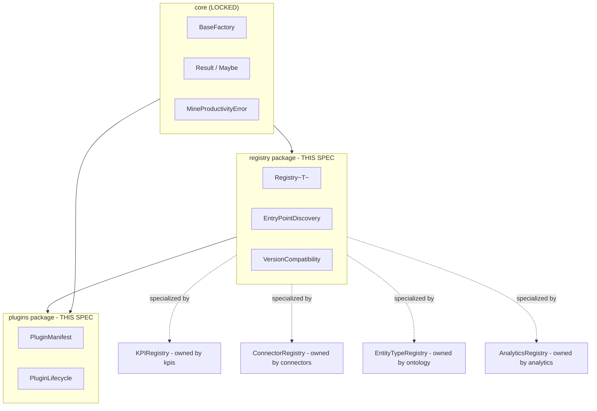
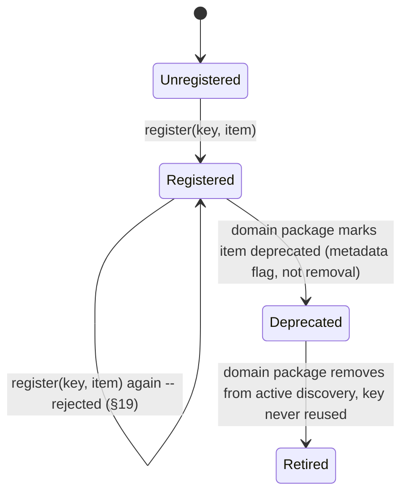
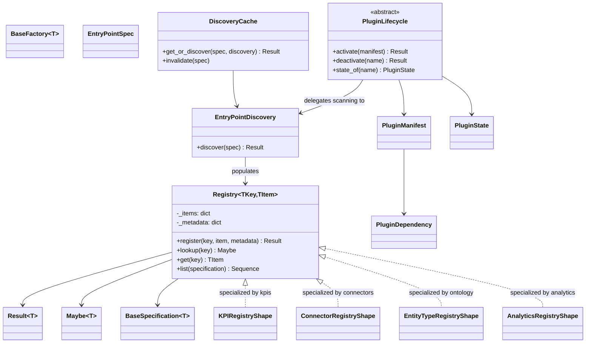

# Registry Framework - Design Specification

| | |
|---|---|
| **Document ID** | AH-DS-03 |
| **Package** | `mineproductivity.registry` (mechanism) + `mineproductivity.plugins` (lifecycle) |
| **Status** | Draft - Design Complete, Pending Implementation |
| **Version** | 1.0.0 |
| **Conforms to** | Master Architecture Handbook v1.0; Reference Implementation Blueprint v1.0; Developer & Cookbook Guide Parts I & III; Learning & Benchmark Suite v1.0 |
| **Builds on** | Repository Skeleton v0.1.0 (LOCKED); Core Foundation Library v0.2.0 (LOCKED) |
| **Author** | Chief Software Architect, MineProductivity |
| **Classification** | Public - Open Source Design Documentation |

## Document Control

Design specification only - no implementation. This document covers **two** already-locked top-level packages together, because the locked skeleton separates the generic mechanism (`registry`) from the plugin lifecycle built on it (`plugins`), and the Developer & Cookbook Guide's "Registry Framework" concept spans both. Domain-specific registries named in the task brief - the KPI Registry, Connector Registry, Ontology Registry, Analytics Registry - are **not** new top-level packages; each is a typed instantiation of the generic mechanism specified here, owned by its respective domain package (`kpis`, `connectors`, `ontology`, `analytics`).

---

## 1. Purpose

The Registry Framework is the plugin-first backbone of MineProductivity: the single, generic discovery-and-lookup mechanism that lets KPIs, connectors, ontology entity types, and analytics models be added to the platform **as separate, installable packages, with zero change to the core.** It is the direct implementation of the root README's plugin-first principle: *"connectors, KPIs, analytics, and agents are discovered and loaded through a registry/plugin system, not hard-wired into the core."*

## 2. Scope

**In scope:**

- The generic `Registry[T]` mechanism: register, lookup, list, unregister.
- The `EntryPointDiscovery` mechanism: scanning Python entry-points and populating registries at process start (Cookbook Part I, Ch. 3 and Ch. 9).
- Auto-registration decorators (`@register`, `@register_equipment`, and the pattern they generalize).
- Metadata-aware registration (every registered item carries its own metadata, per the metadata-first principle).
- Version compatibility checking between a plugin and the core it targets.
- Dynamic loading and lazy loading of plugin modules.
- Caching of discovery results.
- The **shape** of the four named domain registries (KPI, Connector, Ontology, Analytics) as typed specializations - not their contents, which belong to `kpis`, `connectors`, `ontology`, `analytics` respectively.
- The `plugins` package's lifecycle layer: plugin activation/deactivation, dependency declaration between plugins, and the plugin manifest contract.

**Out of scope (see §4).**

## 3. Responsibilities

1. Provide **one** generic, type-safe registration mechanism that every domain package specializes rather than reimplements (DRY, and consistent with `core`'s "no unnecessary inheritance... composition over inheritance" principle applied at the plugin-architecture level).
2. Provide **one** discovery mechanism (Python entry-points) used identically for KPI packs, connectors, ontology extensions, and analytics models (Cookbook Part I, Ch. 9: *"the same mechanism serves KPI packs, solvers, visualisations, and agents - one discovery pattern for the whole ecosystem"*).
3. Guarantee that **registering an item never touches core code** - the acceptance test for "plugin-first" throughout this platform.
4. Own the **lifecycle** concerns plugins need beyond raw registration: version compatibility, activation order, and dependency declarations between plugins (the `plugins` package).

## 4. Out of Scope

- **What gets registered.** A `KPIMetadata` instance, a `FMSConnector` subclass, an `EquipmentType` subclass - their shapes are defined by `kpis`, `connectors`, `ontology` respectively. `registry` only defines the container and lookup mechanism.
- **Building/publishing a plugin package** (`pyproject.toml` authoring, `build`/`twine` - Cookbook Part I, Ch. 9's "Distribution, versioning, and publishing"). That is contributor tooling and documentation, not runtime code.
- **KPI computation, event validation, or connector I/O** - the registered items' own behavior is out of scope; `registry` only stores and retrieves them.

## 5. Architecture

`registry` and `plugins` are **cross-cutting** packages per the root README's dependency rules: *"may be depended upon by any layer, but must never depend on `kpis`, `analytics`, `decision`, `digital_twin`, `agents`, `connectors`, `optimization`, or `simulation`."*



Each domain registry is a thin, typed wrapper: `KPIRegistry = Registry[type[BaseKPI]]`, `ConnectorRegistry = Registry[type[FMSConnector]]`, and so on - this is why the diagram shows them as specializations reached with a dotted line, not additional boxes inside this package.

## 6. Package Structure

```
src/mineproductivity/registry/
├── __init__.py            # public API surface
├── registry.py             # Registry[T] (generic mechanism)
├── entry_point.py           # EntryPointDiscovery, EntryPointSpec
├── decorators.py             # generic @registered_in(registry) decorator factory
├── version_compat.py          # VersionCompatibility, VersionRange
├── caching.py                   # DiscoveryCache
├── exceptions.py
└── README.md

src/mineproductivity/plugins/
├── __init__.py            # public API surface
├── manifest.py              # PluginManifest
├── lifecycle.py               # PluginLifecycle, PluginState
├── loader.py                    # PluginLoader (lazy/dynamic loading)
├── dependency.py                  # PluginDependency, dependency resolution
├── exceptions.py
└── README.md
```

## 7. Dependency Direction

```
core  →  registry  →  plugins
core  →  plugins
```

- **`registry` depends on:** `core` only (`BaseFactory` for item construction, `Result`/`Maybe` for lookups, `MineProductivityError` hierarchy).
- **`plugins` depends on:** `core` and `registry`.
- **Both are depended on by:** `ontology`, `events`, `kpis`, `connectors`, `analytics`, `agents` - every package that exposes an extension point.
- **Forbidden:** neither `registry` nor `plugins` may import any domain package (`ontology`, `events`, `kpis`, `connectors`, `analytics`, `optimization`, `simulation`, `decision`, `digital_twin`, `agents`). This is the mechanical guarantee behind "one discovery pattern for the whole ecosystem" - the mechanism cannot play favorites among the things it discovers, because it cannot even see them.

## 8. Public API

```python
from mineproductivity.registry import (
    Registry, EntryPointDiscovery, EntryPointSpec,
    VersionCompatibility, VersionRange, DiscoveryCache,
    RegistrationError, DuplicateRegistrationError,
    UnregisteredLookupError, VersionIncompatibleError,
)
from mineproductivity.plugins import (
    PluginManifest, PluginLifecycle, PluginState, PluginLoader,
    PluginDependency, PluginActivationError, PluginDependencyError,
)
```

## 9. Internal API

- `registry.entry_point._GROUP_PREFIX = "mineproductivity."` - the entry-point group namespace every domain registry's discovery group name is built from (e.g. `"mineproductivity.kpis"`, `"mineproductivity.connectors"`).
- `registry.caching._process_cache` - the module-level (not global-mutable-state - see §24) memoized discovery result, invalidated only by an explicit `DiscoveryCache.invalidate()` call, never implicitly.

## 10. Object Model

### 10.1 `Registry[T]` - the generic mechanism

```python
TKey = TypeVar("TKey", bound=Hashable)
TItem = TypeVar("TItem")

class Registry(Generic[TKey, TItem]):
    """A generic, type-safe, metadata-aware registration container.

    Every domain-specific registry (KPIRegistry, ConnectorRegistry,
    EntityTypeRegistry, AnalyticsRegistry) is a type alias over this
    class, not a subclass with new behavior -- composition over
    inheritance, and one implementation to trust platform-wide.
    """

    def __init__(self, *, name: str) -> None:
        self._name = name
        self._items: dict[TKey, TItem] = {}
        self._metadata: dict[TKey, BaseMetadata] = {}

    def register(self, key: TKey, item: TItem, *, metadata: BaseMetadata | None = None) -> Result[None]:
        """Register item under key. Returns Result.err(DuplicateRegistrationError)
        if key is already registered -- registration is add-only; see §19
        for the re-registration/versioning rule."""

    def lookup(self, key: TKey) -> Maybe[TItem]:
        """Non-raising lookup."""

    def get(self, key: TKey) -> TItem:
        """Raising lookup. Raises UnregisteredLookupError."""

    def list(self, specification: BaseSpecification[TItem] | None = None) -> Sequence[TItem]:
        """All registered items, optionally filtered -- mirrors
        core.BaseRepository.list()'s shape deliberately."""

    def metadata_for(self, key: TKey) -> Maybe[BaseMetadata]: ...

    def __contains__(self, key: TKey) -> bool: ...
    def __len__(self) -> int: ...
    def __iter__(self) -> Iterator[TKey]: ...
```

This is a deliberate structural echo of `core.BaseRepository`/`core.InMemoryRepository` (§10.8 of the Event Framework spec draws the same parallel for `EventStore`): a registry *is*, conceptually, a repository whose entities are types/classes/callables instead of domain entities. Reusing the shape (not the class - `Registry` does not subclass `BaseRepository`, since its keys are typically strings/codes rather than `BaseEntity` ids) keeps the platform's vocabulary small.

### 10.2 `EntryPointDiscovery`

```python
@dataclass(frozen=True, slots=True)
class EntryPointSpec(BaseValueObject):
    """One discoverable entry-point group, e.g.:
    EntryPointSpec(group="mineproductivity.connectors", target_registry="connectors")
    """
    group: str
    target_registry: str

class EntryPointDiscovery:
    """Scans installed packages' entry-points (via importlib.metadata) and
    populates the named registries. This is the runtime mechanism behind
    Cookbook Part I Ch.3's 'a plugin declares itself in its pyproject.toml,
    and on install it appears in the relevant registry.'
    """

    def discover(self, spec: EntryPointSpec) -> Result[Sequence[TKey]]:
        """Import every entry-point in spec.group; importing a KPI/connector
        module runs its @register decorators, which populate the target
        registry as a side effect of import (Cookbook Part I, Ch. 9:
        'importing it runs the @register decorators')."""
```

### 10.3 Domain Registry Specializations (shape only - owned elsewhere)

```python
# Declared here as type aliases; POPULATED and RE-EXPORTED by their owning
# domain packages, never by this package.
KPIRegistryShape = Registry[str, "type[BaseKPI]"]                 # owned by kpis
ConnectorRegistryShape = Registry[str, "type[FMSConnector]"]      # owned by connectors
EntityTypeRegistryShape = Registry[str, "type[BaseEntityType]"]   # owned by ontology
AnalyticsRegistryShape = Registry[str, "type[BaseAnalyticsModel]"] # owned by analytics
```

The four domain registries named in the task brief (KPI Registry, Connector Registry, Ontology Registry, Analytics Registry) are exactly these four instantiations. Each owning package constructs one `Registry(name=...)` instance, exposes it as `REGISTRY` (matching the Cookbook's `from mineproductivity.kpis import REGISTRY` and `from mineproductivity.connectors import get_connector, CONNECTORS` usage), and provides its own thin `register`/`get_connector`-style convenience wrapper.

### 10.4 `VersionCompatibility`

```python
@dataclass(frozen=True, slots=True)
class VersionRange(BaseValueObject):
    """e.g. mineproductivity>=1.0,<2.0 (Cookbook Part I, Ch. 9)."""
    min_version: str
    max_version_exclusive: str

class VersionCompatibility:
    @staticmethod
    def is_compatible(plugin_range: VersionRange, core_version: str) -> bool: ...

    @staticmethod
    def check_or_raise(plugin_range: VersionRange, core_version: str) -> None:
        """Raises VersionIncompatibleError if the installed core version
        falls outside the plugin's declared range."""
```

### 10.5 `DiscoveryCache`

```python
class DiscoveryCache:
    """Memoizes EntryPointDiscovery.discover() results per EntryPointSpec
    for the lifetime of the process -- entry-point scanning touches the
    filesystem/importlib metadata and is not free to repeat on every
    lookup (§22)."""

    def get_or_discover(
        self, spec: EntryPointSpec, discovery: EntryPointDiscovery
    ) -> Result[Sequence[TKey]]: ...

    def invalidate(self, spec: EntryPointSpec | None = None) -> None:
        """Explicit invalidation only -- e.g. a test harness installing a
        plugin mid-process. Never invalidated implicitly/automatically."""
```

### 10.6 `PluginManifest` and `PluginLifecycle` (the `plugins` package)

```python
@dataclass(frozen=True, slots=True)
class PluginManifest(BaseValueObject):
    """The declared identity of one installed plugin package -- richer
    than a single entry-point, since one plugin package can register
    into multiple registries (e.g. a site pack registering both KPIs and
    equipment types)."""
    plugin_name: str
    plugin_version: str
    core_version_range: VersionRange
    provides: tuple[EntryPointSpec, ...]
    depends_on: tuple["PluginDependency", ...] = field(default=(), kw_only=True)


@dataclass(frozen=True, slots=True)
class PluginDependency(BaseValueObject):
    plugin_name: str
    version_range: VersionRange


class PluginState(Enum):
    DISCOVERED = "discovered"
    VALIDATED = "validated"
    ACTIVE = "active"
    FAILED = "failed"
    DEACTIVATED = "deactivated"


class PluginLifecycle(ABC):
    """Orchestrates a PluginManifest through PluginState, delegating the
    actual entry-point scanning to EntryPointDiscovery (registry package)
    and adding: inter-plugin dependency resolution, activation ordering,
    and graceful failure isolation (one bad plugin must not prevent
    others from loading)."""

    @abstractmethod
    def activate(self, manifest: PluginManifest) -> Result[None]: ...

    @abstractmethod
    def deactivate(self, plugin_name: str) -> Result[None]: ...

    @abstractmethod
    def state_of(self, plugin_name: str) -> PluginState: ...
```

## 11. Lifecycle

```mermaid
stateDiagram-v2
    [*] --> Discovered: EntryPointDiscovery finds the entry-point
    Discovered --> Validated: PluginManifest parsed, VersionCompatibility checked
    Validated --> Failed: version incompatible or dependency unmet
    Validated --> Active: entry-point module imported, @register decorators run
    Active --> Deactivated: explicit unload (rare; mainly for test isolation)
    Failed --> [*]: logged, other plugins unaffected (§26)
    Deactivated --> [*]
```



**Isolation rule (normative):** a single plugin transitioning to `Failed` MUST NOT prevent any other plugin from reaching `Active`. This directly protects the platform-wide guarantee that "the core never changes to accommodate" a plugin (Cookbook Part I, Ch. 9) - the inverse must also hold: one broken plugin never breaks the core's ability to serve every other plugin.

## 12. State Machine

`Registry[T]` itself is intentionally stateless beyond its dict-backed storage - there is no registry-level state machine. The interesting state machine is `PluginState` (§11, shown as a state diagram already) and, secondarily, the registration key's own append-only history:



## 13. Sequence Diagrams

### 13.1 Plugin install and discovery (KPI example, generalized from Cookbook Part I Ch. 9)

```mermaid
sequenceDiagram
    participant Pip as pip install mineproductivity-haulmetrics
    participant Py as Python import machinery
    participant Disc as EntryPointDiscovery
    participant Reg as KPIRegistry (registry package instance)
    participant App as Application code

    Pip->>Py: package installed, entry-point registered in metadata
    App->>Disc: discover(EntryPointSpec("mineproductivity.plugins", "kpis"))
    Disc->>Py: importlib.metadata.entry_points(group=...)
    Py-->>Disc: [EntryPoint("haulmetrics", "mineproductivity_haulmetrics.kpis")]
    Disc->>Py: import_module("mineproductivity_haulmetrics.kpis")
    Py->>Py: module body executes; @register(FuelPerTonne) runs
    Py->>Reg: register("COST.FuelPerTonne", FuelPerTonne, metadata=...)
    Reg-->>Py: Result.ok(None)
    Disc-->>App: Result.ok(["COST.FuelPerTonne"])
    App->>Reg: get("COST.FuelPerTonne")
    Reg-->>App: FuelPerTonne (type)
```

### 13.2 Version-incompatible plugin (failure isolation)

```mermaid
sequenceDiagram
    participant Disc as EntryPointDiscovery
    participant LC as PluginLifecycle
    participant VC as VersionCompatibility
    participant PluginA as Plugin A (incompatible)
    participant PluginB as Plugin B (compatible)

    Disc->>LC: activate(PluginA manifest)
    LC->>VC: check_or_raise(PluginA.core_version_range, installed core)
    VC-->>LC: raises VersionIncompatibleError
    LC->>LC: state_of(PluginA) = Failed; log warning
    Disc->>LC: activate(PluginB manifest)
    LC->>VC: check_or_raise(PluginB.core_version_range, installed core)
    VC-->>LC: ok
    LC->>LC: state_of(PluginB) = Active
    Note over LC: Plugin A's failure never touched Plugin B
```

## 14. Class Diagrams



## 15. Data Flow

```
plugin package installed (pip install mineproductivity-<name>)
   │  entry-point declared in installed package's metadata
   ▼
EntryPointDiscovery.discover(spec)                              (registry package)
   │  importlib.metadata scan -> import_module() per entry-point
   ▼
Plugin module import side-effect: @register(...) decorator runs   (registry package,
   │                                                                 invoked from the
   ▼                                                                 domain package)
Registry.register(key, item, metadata)                            (registry package)
   │
   ▼
DiscoveryCache memoizes the discovery result                      (registry package)
   │
   ▼
Application / domain-package code calls Registry.get(key)         (any consumer)
```

`PluginLifecycle` (the `plugins` package) wraps this flow with manifest validation and dependency ordering when more than raw entry-point scanning is needed (e.g. a plugin that must activate after another plugin it depends on).

## 16. Extension Points

1. **New domain registries.** Any package needing "add an X and register it" instantiates its own `Registry[TKey, TItem]` and re-exports it as `REGISTRY` (or a domain-appropriate name) - no change to `registry` itself is ever required to add a fifth, sixth, or Nth domain registry.
2. **New entry-point groups.** A new `EntryPointSpec(group="mineproductivity.<new-thing>", ...)` is just data; `EntryPointDiscovery` requires no code change to support it.
3. **Custom `PluginLifecycle` implementations.** The ABC in §10.6 permits an alternative lifecycle manager (e.g. one with a UI-driven activation flow) without touching `registry`.

## 17. Plugin Strategy

This *is* the plugin strategy for the whole platform - see §10.2 and §13.1. To summarize the pattern every domain package repeats verbatim:

```python
# In the owning domain package, e.g. mineproductivity/kpis/__init__.py
from mineproductivity.registry import Registry

REGISTRY: Registry[str, type["BaseKPI"]] = Registry(name="kpis")

def register(kpi_cls: type["BaseKPI"]) -> type["BaseKPI"]:
    """The @register decorator Cookbook Part I Ch.6/Ch.9 shows in use."""
    REGISTRY.register(kpi_cls.meta.code, kpi_cls, metadata=kpi_cls.meta)
    return kpi_cls
```

```toml
# In a THIRD-PARTY plugin package's pyproject.toml
[project.entry-points."mineproductivity.kpis"]
haulmetrics = "mineproductivity_haulmetrics.kpis"
```

No two domain packages implement this pattern differently - that consistency is the entire value proposition of having a `registry` package at all.

## 18. Metadata

Every `Registry.register()` call accepts an optional `metadata: BaseMetadata` (§10.1) - consistent with the platform's metadata-first principle applied to the registration mechanism itself, not just to what gets registered. `PluginManifest` (§10.6) is itself effectively a `BaseMetadata`-shaped record for the *plugin package* as a whole (name, version, what it provides, what it depends on) - one level up from the metadata attached to each individual registered item.

## 19. Validation

- **Duplicate-key rejection.** `Registry.register()` returns `Result.err(DuplicateRegistrationError)` if `key` is already present - registration is add-only. Re-registering the same code with a *new* implementation is a versioning event (§20), not a silent overwrite; this directly protects the KPI Standard Library's rule that "a KPI code is a public contract... changing what it means is a breaking change" (Cookbook Part I, Ch. 9).
- **Version compatibility validation.** Every `PluginManifest.core_version_range` is checked before activation (§10.4, §13.2); an incompatible plugin fails to activate but does not raise into the caller's process - it fails in isolation (§11).
- **Dependency validation.** `PluginLifecycle.activate()` MUST verify every `PluginDependency` is itself `Active` (or activatable) before activating the dependent plugin; a missing dependency is a `PluginDependencyError`, not a partial activation.

## 20. Versioning

- **The registry mechanism's own version** follows ordinary SemVer as part of the `core`-adjacent package family.
- **Registered item versioning is the owning domain package's responsibility** - `registry` provides the *container* (`Registry.register`/`.get`) but the *meaning* of "version 2 of KPI X" is governed by `kpis` (see the KPI Engine spec's §20). `registry` deliberately does not bake KPI-specific or connector-specific versioning semantics into the generic mechanism (Single Responsibility).
- **Plugin package versioning** (`PluginManifest.plugin_version`) follows Cookbook Part I Ch. 9's rule: "Version with Semantic Versioning, applied to the meaning of your KPIs" (or connectors, or ontology extensions) - generalized here as "applied to the meaning of what the plugin provides."

## 21. Serialization

`PluginManifest` and `EntryPointSpec` are `core.BaseValueObject`s and serialize via the standard `core.serialization` surface (`DataclassSerializer`/`to_dict`) for the case where a plugin manifest needs to be written to a lockfile-like artifact (e.g. "which plugins were active when this report was generated" - a traceability need directly echoing the Learning & Benchmark Suite's Documentation Governance Rule #006 on artifact versioning).

## 22. Performance Considerations

- **Discovery is scan-once, cache-forever within a process** (`DiscoveryCache`, §10.5) - `importlib.metadata` entry-point scanning touches installed-package metadata on disk and must not be repeated on every `Registry.get()` call.
- **Lookup is O(1)** (dict-backed) regardless of how many plugins are installed; a deployment with hundreds of KPI plugins installed sees no lookup slowdown, only a (one-time, cached) larger discovery scan at startup.
- **Lazy loading (§10.2's `import_module` on discovery, not on every lookup) means an installed-but-unused plugin's import cost is paid once, not per call** - consistent with "the core never changes to accommodate" a plugin also meaning a plugin never taxes the hot path of code that does not use it.

## 23. Memory Considerations

- A `Registry[T]` holds references to *types* (classes), not instances, in the common case (`KPIRegistry` stores `type[BaseKPI]`, not `BaseKPI()` instances) - memory footprint scales with the number of distinct registered *kinds* of things, not with how many times they are used, which stays small (hundreds, not millions) even at platform scale.
- `PluginManifest` instances are small, frozen value objects; retaining one per installed plugin for the life of the process is negligible.

## 24. Thread Safety

- `Registry[T]`'s internal dicts are populated once during the (single-threaded, process-startup) discovery phase (§11, §22); after that point, `Registry` is effectively read-only and safe for concurrent reads from any number of threads.
- If `Registry.register()` is called after startup (e.g. a test harness registering a fixture item), callers are responsible for ensuring this happens before concurrent readers begin - `Registry` does not add internal locking for this uncommon path, consistent with `core`'s "no magic" principle; a future revision may add an explicit `Registry.freeze()` to make this contract enforceable rather than merely documented.
- **No global mutable state** (root README's engineering requirement): every `Registry` instance is owned and exposed by its domain package (`kpis.REGISTRY`, `connectors.CONNECTORS`, etc.), never a bare module-level dict mutated from arbitrary call sites.

## 25. Concurrency

`EntryPointDiscovery.discover()` performs filesystem/metadata I/O and MAY be invoked concurrently for different `EntryPointSpec`s (e.g. discovering `kpis` and `connectors` plugins in parallel at startup) without interference, since each populates a distinct `Registry` instance. `DiscoveryCache.get_or_discover()` MUST be safe to call concurrently for the *same* spec without triggering duplicate discovery work (implementation may use a lock or an atomic "claim" pattern internally; the public contract only guarantees the *result* is consistent, not a specific internal mechanism).

## 26. Error Handling

```python
class RegistrationError(MineProductivityError):
    """Base of registry-specific errors."""

class DuplicateRegistrationError(RegistrationError):
    """register() called with a key that already exists (§19)."""

class UnregisteredLookupError(NotFoundError):
    """get() found no item for the given key."""

class VersionIncompatibleError(RegistrationError):
    """A plugin's declared core_version_range excludes the installed core version."""


class PluginActivationError(MineProductivityError):
    """PluginLifecycle.activate() failed for a reason other than version
    incompatibility (e.g. the entry-point's target module raised on import)."""

class PluginDependencyError(PluginActivationError):
    """A declared PluginDependency could not be satisfied."""
```

**Isolation rule restated as error handling:** an exception raised while importing one plugin's entry-point module MUST be caught by `EntryPointDiscovery`/`PluginLifecycle`, converted into a `Result.err`/logged `Failed` state (§11), and MUST NOT propagate to abort discovery of the remaining plugins.

## 27. Logging

- Every successful plugin activation logs at `INFO`: plugin name, version, and which registries it populated (count of items registered).
- Every failed activation (§13.2, §26) logs at `WARNING` with the plugin name and the specific reason (version incompatibility vs. dependency failure vs. import error) - this is the primary operator-facing diagnostic when "why didn't my plugin load?" is asked.
- `Registry.register()` rejecting a duplicate key logs at `WARNING` with both the existing and attempted registration's source (module path), so a code-conflict between two plugins claiming the same KPI code is immediately diagnosable.

## 28. Configuration

- Which entry-point groups are scanned at startup, and whether discovery happens eagerly (at `import mineproductivity`) or lazily (on first `Registry.get()` for that domain) is a `core.BaseConfiguration`-shaped setting sourced from the future `config` package - mirroring Cookbook Part I Ch. 3's layered defaults → enterprise → region → site configuration model.
- `MINEPROD_EMBEDDINGS=off`-style environment escapes (seen in the Developer Documentation's air-gapped install guidance) are a `config`-package concern; `registry` itself defines no environment-variable reading.

## 29. Testing Strategy

- **Unit tests** - `Registry.register`/`.get`/`.lookup`/`.list` behavior including duplicate rejection and specification-based filtering.
- **Discovery tests** - `EntryPointDiscovery.discover()` against a fixture package installed in the test environment's `site-packages` (a small, dedicated test-fixture plugin, analogous to the Cookbook's `mineproductivity-haulmetrics` example), asserting the target registry is populated.
- **Isolation tests** - a fixture plugin that intentionally raises on import must not prevent a second, well-behaved fixture plugin from activating (§11, §26).
- **Version compatibility tests** - a matrix of plugin `core_version_range` values against simulated installed-core versions, covering inclusive/exclusive boundary cases.
- **Concurrency tests** - concurrent `DiscoveryCache.get_or_discover()` calls for the same spec from multiple threads produce one discovery pass and a consistent result (§25).

## 30. Certification Requirements

| Category | Requirement for `registry`/`plugins` |
|---|---|
| A - Golden datasets | N/A directly (no data-shaped golden fixtures); substituted by a golden *plugin fixture* whose expected registration outcome is version-controlled. |
| B - Integration | A real `pip install`-able fixture plugin (built with `build`, installed into a test venv) is discovered and activated end-to-end, mirroring Cookbook Part I Ch. 9's full publish-and-discover path. |
| C - Edge cases | Zero installed plugins (empty registry, not an error); a plugin providing zero entry-points; a plugin providing the maximum realistic number of KPI registrations in one module. |
| D - Corrupted data | A malformed entry-point target (module does not exist) fails that one plugin's activation without affecting others. |
| G - Multi-mine | N/A - `registry` has no mine-scoping concept; confirmed as an explicit non-requirement so no accidental scope creep occurs. |

## 31. Example Usage

```python
from mineproductivity.registry import Registry, EntryPointDiscovery, EntryPointSpec

# Inside a domain package (e.g. kpis/__init__.py):
REGISTRY: Registry[str, type] = Registry(name="kpis")

def register(cls):
    REGISTRY.register(cls.meta.code, cls, metadata=cls.meta)
    return cls

# At application startup:
discovery = EntryPointDiscovery()
result = discovery.discover(EntryPointSpec(group="mineproductivity.kpis", target_registry="kpis"))
if result.is_err:
    log.warning("KPI plugin discovery incomplete: %s", result.error)

# Anywhere downstream:
kpi_cls = REGISTRY.get("PROD.TPH")
found = REGISTRY.lookup("PROD.NotARealCode")
print(found.is_nothing)   # True
```

## 32. Anti-Patterns

- ❌ **A domain package implementing its own ad hoc `dict`-based registry** instead of instantiating `Registry[T]`. Every domain registry must be a `Registry` instance so tooling, discovery, and version-compatibility checks work uniformly platform-wide.
- ❌ **Silently overwriting a registration on key collision.** Always reject and log (§19, §26); a silent overwrite is exactly the "our numbers don't match" failure mode the whole KPI-as-object design exists to prevent (Cookbook Part I, Ch. 6).
- ❌ **Eagerly importing every possible plugin module at `registry` import time.** Discovery is driven by *installed* entry-points, never by `registry` maintaining a hard-coded list of "known" plugins - that would silently reintroduce the coupling plugins exist to remove.
- ❌ **Letting one plugin's import-time exception crash application startup.** Always isolate (§11, §26) - a mine with 30 installed KPI packs cannot have its whole platform go down because pack #17 has a typo.
- ❌ **A `Registry` instance stored as a bare module-level global mutated from arbitrary call sites outside its owning package.** Violates `core`'s "no global state" rule; every registry has exactly one owner package that constructs and exposes it.

## 33. Future Extensions

- **A registry introspection/discovery API** (e.g. `mineprod plugins list` CLI surface, hinted at throughout the Cookbook's CLI mentions) - built on `Registry.list()`/`PluginManifest`, not requiring changes to this specification.
- **Remote/marketplace plugin discovery** (Cookbook Part I, Ch. 9's "Reference Implementation Blueprint - Plugin marketplace architecture" forward reference) - an additional `EntryPointDiscovery`-like source beyond local `importlib.metadata`, satisfying the same `Registry` contract.
- **Signed/verified plugins** for enterprise deployments - an additional validation step in `PluginLifecycle.activate()`, not a change to `Registry` itself.

## 34. Known Constraints

- This specification assumes Python's standard `importlib.metadata` entry-points mechanism as the v1.0 discovery source; alternative discovery sources (a private plugin marketplace, §33) are future extensions, not v1.0 scope.
- `Registry[T]` provides no built-in persistence - it is rebuilt from entry-point discovery every process start. This is intentional (mirrors `events`' "rebuildable from source" philosophy) but means discovery cost (§22) is paid once per process, not amortized across process restarts without an external cache.
- Dependency resolution in `PluginLifecycle` (§10.6) is specified as an interface obligation; this document does not mandate a specific resolution algorithm (topological sort is the obvious choice but is an implementation-checklist-level decision).

## 35. Architecture Decisions

| ID | Decision | Rationale |
|---|---|---|
| AD-RG-01 | One generic `Registry[TKey, TItem]` class, specialized by type alias per domain, rather than one registry base class subclassed per domain. | Composition over inheritance (explicit `core`/root README requirement); a domain registry needs no *behavior* beyond the generic mechanism, only a *type*, so subclassing would add ceremony without adding capability. |
| AD-RG-02 | `registry` and `plugins` are separate packages, not one. | `registry` is the pure, dependency-free mechanism (register/lookup); `plugins` adds lifecycle concerns (manifests, dependency ordering, activation state) that a consumer wanting only "give me a typed lookup table" should not have to pull in. Mirrors `core`'s module-per-concept discipline at package granularity. |
| AD-RG-03 | Discovery failures are isolated per-plugin (§11, §26), never fail-fast for the whole process. | A plugin ecosystem where one bad actor can take down the platform is not actually plugin-first in practice, regardless of what the architecture diagram says; isolation is what makes the promise real. |
| AD-RG-04 | Registration is add-only; re-registration under an existing key is always rejected, never silently accepted as an update. | Directly enforces the "a KPI code is a public contract" rule (and its analogues for connector names and entity type codes) at the mechanism level, so no domain package can accidentally violate it. |
| AD-RG-05 | `Registry` stores types/classes, not instances, as the default pattern. | Matches every worked example in the Cookbook (`REGISTRY["PROD.TPH"]()` - instantiated at point of use, not at registration time) and keeps registered-item memory footprint independent of how many times an item is used (§23). |

## 36. Definition of Done

- [ ] `Registry[TKey, TItem]`, `EntryPointDiscovery`, `VersionCompatibility`, `DiscoveryCache` implemented exactly per §10.
- [ ] `PluginManifest`, `PluginLifecycle`, `PluginDependency`, `PluginState` implemented exactly per §10.6.
- [ ] `tests/unit/registry/` and `tests/unit/plugins/` mirror their source packages 1:1, ≥95% coverage each.
- [ ] `mypy --strict` and `ruff` clean on both packages.
- [ ] `examples/registry/` demonstrates the full register → discover → lookup cycle using a fixture plugin package built for the purpose.
- [ ] Isolation test (§11, §29) proves one failing plugin cannot block another's activation.
- [ ] Neither `registry` nor `plugins` imports any domain package (§7), mechanically verified.

## 37. Package Acceptance Criteria

1. **Zero-core-change proof:** a fixture "third-party" plugin package (built independently, installed via `pip install`) successfully registers a KPI, a connector, and an entity type without any modification to `mineproductivity.core`, `mineproductivity.registry`, or `mineproductivity.plugins` source.
2. **Isolation proof:** with two fixture plugins installed, one deliberately broken, `pytest` confirms the broken one lands in `PluginState.FAILED` while the healthy one reaches `PluginState.ACTIVE`.
3. **Version-gate proof:** a fixture plugin declaring an incompatible `core_version_range` is rejected at activation with `VersionIncompatibleError`, never silently loaded.
4. **No architectural drift:** `registry`/`plugins` appear in the dependency graph exactly per §7 - depended upon broadly, depending on nothing above `core`.
5. **Cross-reference audit:** the entry-points mechanism, the `@register` decorator pattern, and the "one discovery pattern for the whole ecosystem" principle are traceable to specific Developer & Cookbook Guide passages cited in this document (Ch. 3, Ch. 6, Ch. 9).

---

*End of Registry Framework Design Specification. See [`docs/design/03_Registry_Implementation_Checklist.md`](../design/03_Registry_Implementation_Checklist.md) for the actionable implementation contract.*
