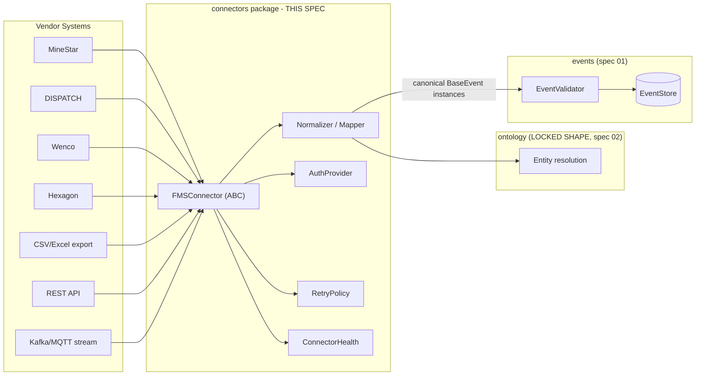
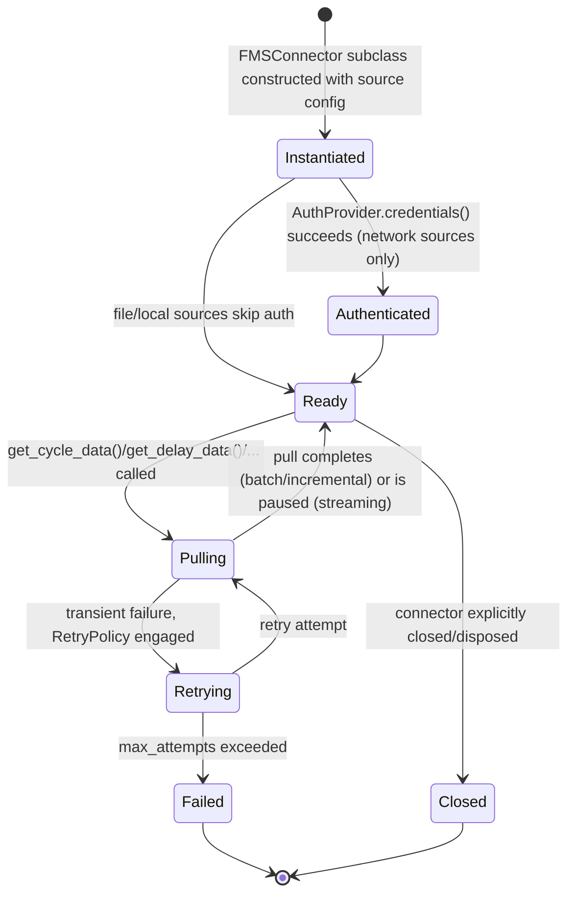
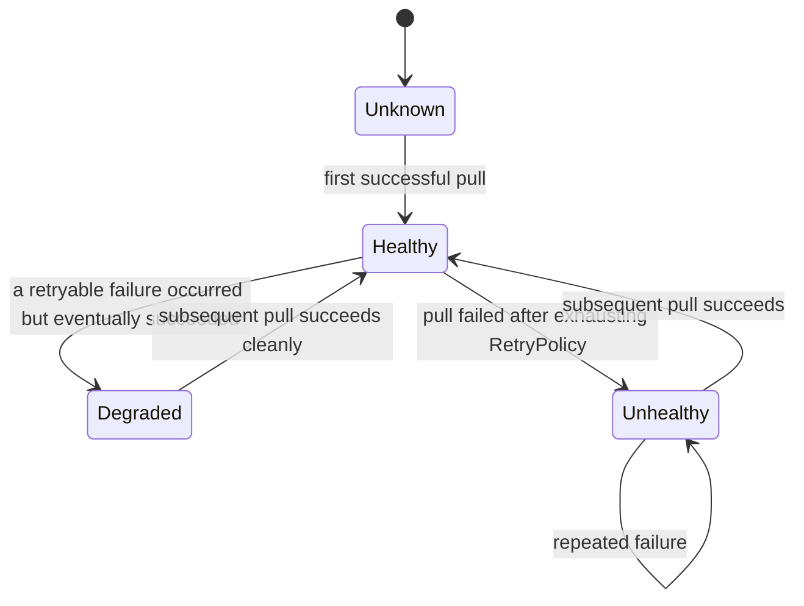
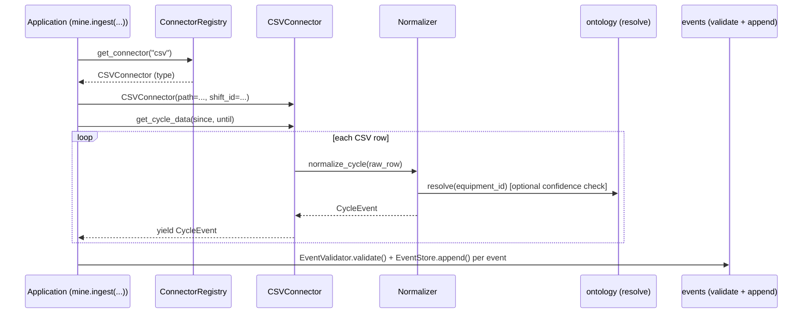
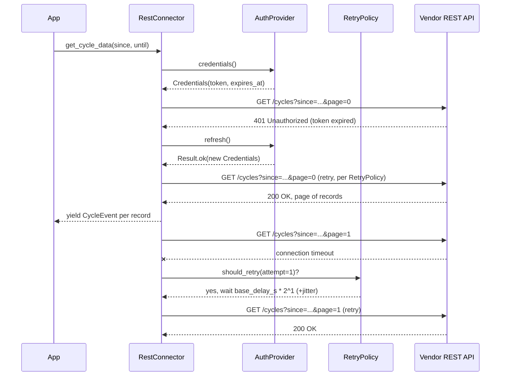
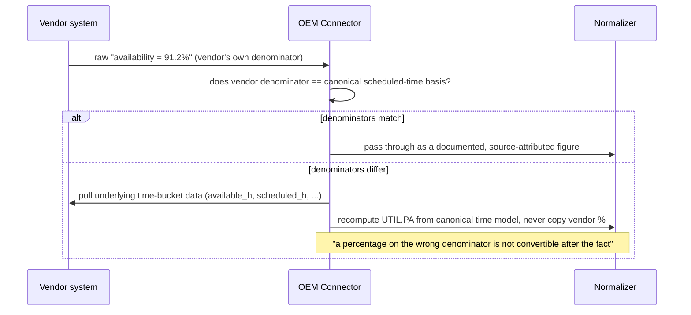
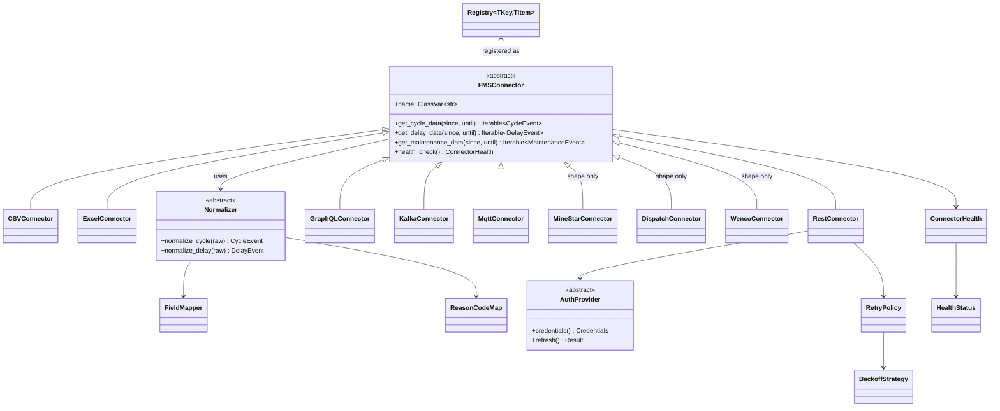

# Connector Framework — Design Specification

| | |
|---|---|
| **Document ID** | AH-DS-04 |
| **Package** | `mineproductivity.connectors` |
| **Status** | Draft — Design Complete, Pending Implementation |
| **Version** | 1.0.0 |
| **Conforms to** | Master Architecture Handbook v1.0; Reference Implementation Blueprint v1.0; Developer & Cookbook Guide Parts I–III; Learning & Benchmark Suite v1.0 |
| **Builds on** | Repository Skeleton v0.1.0 (LOCKED); Core Foundation Library v0.2.0 (LOCKED) |
| **Author** | Chief Software Architect, MineProductivity |
| **Classification** | Public — Open Source Design Documentation |

## Document Control

Design specification only — no implementation. Concrete OEM adapters (MineStar, DISPATCH, Wenco, Modular Mining, Hexagon) are specified here **as connector shapes and mapping responsibilities**, not as working vendor integrations — no vendor SDK code exists in this repository or is implied by this document. Per Cookbook Part I, Ch. 7, real OEM connectors ship as separate, independently-versioned plugin packages (e.g. a hypothetical `mineproductivity-minestar`), never inside `mineproductivity.connectors` itself.

---

## 1. Purpose

The Connector Framework is how MineProductivity meets the real world. It defines the single, small contract every data source — a fleet-management system, a CSV export, a REST API, a Kafka topic — must satisfy to feed the platform, and it is the **only** place in the codebase permitted to know that a specific vendor or file format exists. This is the concrete implementation of the root README's forbidden-imports rule and the Cookbook's Vendor-Neutrality principle: *"Connectors are the only place in the codebase allowed to know about a specific OEM."*

## 2. Scope

**In scope:**

- The `FMSConnector` abstract base contract.
- Reference connector shapes for CSV, Excel, REST, GraphQL, Kafka, MQTT sources.
- The OEM adapter shape for MineStar, DISPATCH, Wenco, Modular Mining, and Hexagon — as a mapping/translation responsibility, not vendor SDK bindings.
- Streaming, batch, and incremental ingestion modes.
- Validation and normalization at the connector boundary (the anti-corruption layer).
- Field/code mapping (vendor dialect → canonical ontology/event model).
- Authentication, retry, and backoff contracts for network-based connectors.
- Connector monitoring/health surface.
- Connector registration and discovery (specialization of the Registry Framework).
- Connector contract testing strategy.

**Out of scope (see §4).**

## 3. Responsibilities

1. Define **one** abstract contract (`FMSConnector`) that every source — file, database, stream, REST API, vendor SDK — implements identically.
2. **Quarantine vendor dialects.** A connector's entire job is "read a source, yield canonical events" (Cookbook Part I, Ch. 7); nothing downstream ever sees a vendor's field names, status codes, or reason codes.
3. Perform **semantic**, not just structural, translation — recomputing from underlying time buckets when a vendor's percentage-based metric uses a different denominator than the platform's canonical time model, rather than copying a number that looks similar but means something different (Developer & Cookbook Guide Part III, "Compatibility with external systems").
4. Own **authentication, retry, and backoff** for network-connected sources, so this concern is solved once, consistently, rather than once per connector.
5. Ship connectors as **discoverable plugins** (Registry Framework specialization), never as core-code special cases.

## 4. Out of Scope

- **Event definitions** (`CycleEvent`, `DelayEvent`, ...) — owned by `events`; connectors *produce* instances of these types, never redefine their shape.
- **Ontology entity definitions** — owned by `ontology`; connectors *resolve against* entities (§15 of the Ontology Framework spec's reference/embedding pattern), never define them.
- **The `EventStore`/`EventBus` implementations** connectors write into — owned by `events`/`io`.
- **KPI computation** — connectors never import `kpis` (§7).
- **Actual vendor SDK code or credentials.** This repository never bundles a proprietary OEM SDK; a real MineStar/DISPATCH/Wenco/Hexagon connector is an independent plugin package with its own dependency on the vendor's SDK, isolated entirely from `mineproductivity.connectors`' own dependency graph.

## 5. Architecture

```
core → ontology → events → connectors → kpis → ...
                     ↑           │
                     └───────────┘
              connectors also depends on io, config
```

`connectors` sits **after** `events` and `ontology` in the dependency stack — it produces events and resolves ontology references, but is itself a plumbing package (Cookbook Part I, Ch. 3's three-band model: "domain heart," "plumbing," "intelligence/interfaces" — `connectors` is plumbing).



## 6. Package Structure

```
src/mineproductivity/connectors/
├── __init__.py               # public API: get_connector, CONNECTORS, register
├── base.py                     # FMSConnector (ABC)
├── normalization.py              # Normalizer, FieldMapper, ReasonCodeMap
├── auth.py                         # AuthProvider (ABC), token/credential shapes
├── retry.py                          # RetryPolicy, BackoffStrategy
├── health.py                           # ConnectorHealth, HealthCheck
├── file/                                # File-based reference connectors
│   ├── __init__.py
│   ├── csv_connector.py                  # CSVConnector
│   └── excel_connector.py                  # ExcelConnector
├── network/                              # Network-based reference connectors
│   ├── __init__.py
│   ├── rest_connector.py                   # RestConnector
│   └── graphql_connector.py                  # GraphQLConnector
├── streaming/                            # Streaming reference connectors
│   ├── __init__.py
│   ├── kafka_connector.py                  # KafkaConnector
│   └── mqtt_connector.py                     # MqttConnector
├── oem/                                  # OEM adapter SHAPES (no vendor SDK code)
│   ├── __init__.py
│   ├── minestar_shape.py                   # MineStarConnector shape/mapping contract
│   ├── dispatch_shape.py                     # DispatchConnector shape/mapping contract
│   ├── wenco_shape.py                          # WencoConnector shape/mapping contract
│   ├── modular_shape.py                          # ModularConnector shape/mapping contract
│   └── hexagon_shape.py                            # HexagonConnector shape/mapping contract
├── contract_tests.py                     # shared FMSConnector contract test suite
├── exceptions.py
└── README.md
```

The `oem/` modules contain only the **mapping contract and reason-code-map shape** each vendor plugin must fulfill (e.g. `MineStarReasonCodeMap`'s expected keys) — never a working `MineStarClient`. A real OEM plugin lives entirely outside this repository, as its own installable package, per Cookbook Part I Ch. 7's `mineproductivity-minestar` example.

## 7. Dependency Direction

```
core → ontology → events → connectors
                              ↑
                    (also) io, config, registry
```

- **`connectors` depends on:** `core`, `ontology`, `events`, and the cross-cutting `io`, `config`, `registry` packages.
- **`connectors` is depended on by:** nothing in the domain-heart or intelligence layers directly — the platform depends on `connectors` only through the `events` it produces, never through a direct import. `digital_twin` and `kpis` never import `connectors`.
- **Forbidden (the single most load-bearing rule in this document):** `connectors` MUST NOT import `kpis`, `analytics`, `optimization`, `simulation`, `decision`, `digital_twin`, or `agents`. This is what the Cookbook calls out explicitly: *"connectors/ may not import kpis/ — the dependency-direction check forbids it — so [vendor-specific] parsing belongs in a connector, which normalises vendor data into canonical events before any KPI sees it."*

## 8. Public API

```python
from mineproductivity.connectors import (
    FMSConnector, get_connector, register_connector, CONNECTORS,
    Normalizer, FieldMapper, ReasonCodeMap,
    AuthProvider, Credentials, RetryPolicy, BackoffStrategy,
    ConnectorHealth, HealthStatus,
    CSVConnector, ExcelConnector, RestConnector, GraphQLConnector,
    KafkaConnector, MqttConnector,
    IngestionMode,
    ConnectorError, MappingError, AuthenticationError,
    SourceUnavailableError, ContractViolationError,
)
```

## 9. Internal API

- `connectors.oem._reason_code_maps` — internal registry of vendor-name → `ReasonCodeMap` shape, used only by contract tests validating a plugin's mapping completeness.
- `connectors.contract_tests.run_fms_contract_suite(connector_factory)` — the shared, parameterizable pytest suite every connector (built-in or plugin) is expected to run against (§29).

## 10. Object Model

### 10.1 `FMSConnector` — the one contract

```python
class FMSConnector(ABC):
    """Adapter from a fleet-management (or any other) source to canonical
    events. This is the entire contract every source-specific adapter
    implements -- deliberately small (Cookbook Part I, Ch. 7: 'Every
    connector implements one small abstract base class')."""

    name: ClassVar[str] = "abstract"

    @abstractmethod
    def get_cycle_data(self, since: datetime, until: datetime) -> Iterable[CycleEvent]:
        """Yield CycleEvents in [since, until). MUST be a generator or
        otherwise lazy Iterable -- never a materialized list (Cookbook
        Part I, Ch. 7's Python Insight: 'the same connector handles a
        200-row test file or a 50-million-row shift export')."""

    @abstractmethod
    def get_delay_data(self, since: datetime, until: datetime) -> Iterable[DelayEvent]:
        """Yield DelayEvents in [since, until)."""

    def get_maintenance_data(self, since: datetime, until: datetime) -> Iterable[MaintenanceEvent]:
        """Optional: default implementation yields nothing. Override for
        sources that carry maintenance telemetry."""
        return iter(())

    def get_production_data(self, since: datetime, until: datetime) -> Iterable[ProductionEvent]:
        return iter(())

    def get_consumption_data(self, since: datetime, until: datetime) -> Iterable[ConsumptionEvent]:
        return iter(())

    def get_safety_data(self, since: datetime, until: datetime) -> Iterable[SafetyEvent]:
        return iter(())

    def health_check(self) -> "ConnectorHealth":
        """Default: assumes healthy. Override for sources with a real
        liveness/auth check (§28)."""
        return ConnectorHealth(status=HealthStatus.UNKNOWN)
```

Only `get_cycle_data` and `get_delay_data` are abstract, matching the Cookbook's minimal contract exactly; the remaining four `get_*_data` methods have sane no-op defaults so a source that only produces cycles (like the reference CSV connector) is not forced to implement methods it has nothing to yield for.

### 10.2 `Normalizer`, `FieldMapper`, `ReasonCodeMap`

```python
class Normalizer(ABC):
    """Applies FieldMapper + ReasonCodeMap to translate one raw source
    record into a canonical BaseEvent. Separated from FMSConnector itself
    so mapping logic is independently unit-testable without a live/fixture
    source connection."""

    @abstractmethod
    def normalize_cycle(self, raw: Mapping[str, Any]) -> CycleEvent: ...

    @abstractmethod
    def normalize_delay(self, raw: Mapping[str, Any]) -> DelayEvent: ...


@dataclass(frozen=True, slots=True)
class FieldMapper(BaseValueObject):
    """Declarative field-name mapping: vendor field name -> canonical field name."""
    mapping: Mapping[str, str]

    def apply(self, raw: Mapping[str, Any]) -> dict[str, Any]:
        return {self.mapping.get(k, k): v for k, v in raw.items()}


@dataclass(frozen=True, slots=True)
class ReasonCodeMap(BaseValueObject):
    """Vendor delay-reason code -> canonical DelayCategory + reason string.

    Cookbook Part I, Ch. 7: 'The hardest part of a real connector is the
    reason-code map... Get this mapping right and every downstream delay
    analysis becomes comparable.'
    """
    vendor_name: str
    mapping: Mapping[str, tuple["DelayCategory", str]]   # DelayCategory from ontology

    def resolve(self, vendor_code: str) -> Maybe[tuple["DelayCategory", str]]:
        return Maybe.some(self.mapping[vendor_code]) if vendor_code in self.mapping else Maybe.nothing()
```

**Semantic-translation rule (normative, from Developer & Cookbook Guide Part III):** when a vendor's own percentage-based availability/utilisation figure uses a denominator that differs from MineProductivity's canonical time model (calendar → scheduled → available → operating, per the KPI Engine spec §19), the connector MUST recompute from the vendor's underlying time buckets, and MUST NOT copy the vendor's pre-computed percentage. *"A percentage on the wrong denominator is not convertible after the fact."*

### 10.3 `AuthProvider`, `RetryPolicy`, `BackoffStrategy`

```python
class AuthProvider(ABC):
    """Isolates credential acquisition/refresh from connector I/O logic."""
    @abstractmethod
    def credentials(self) -> "Credentials": ...
    @abstractmethod
    def refresh(self) -> Result["Credentials"]: ...


@dataclass(frozen=True, slots=True)
class Credentials(BaseValueObject):
    token: str
    expires_at_utc: datetime | None = field(default=None, kw_only=True)


class BackoffStrategy(Enum):
    FIXED = "fixed"
    EXPONENTIAL = "exponential"
    EXPONENTIAL_JITTER = "exponential_jitter"


@dataclass(frozen=True, slots=True)
class RetryPolicy(BaseConfiguration):
    max_attempts: int = field(default=3, kw_only=True)
    backoff: BackoffStrategy = field(default=BackoffStrategy.EXPONENTIAL_JITTER, kw_only=True)
    base_delay_s: float = field(default=1.0, kw_only=True)
    retryable_exceptions: tuple[type[Exception], ...] = field(
        default=(SourceUnavailableError,), kw_only=True
    )
```

### 10.4 `ConnectorHealth`

```python
class HealthStatus(Enum):
    HEALTHY = "healthy"
    DEGRADED = "degraded"
    UNHEALTHY = "unhealthy"
    UNKNOWN = "unknown"

@dataclass(frozen=True, slots=True)
class ConnectorHealth(BaseValueObject):
    status: HealthStatus
    last_successful_pull_utc: datetime | None = field(default=None, kw_only=True)
    detail: str = field(default="", kw_only=True)
```

### 10.5 `IngestionMode`

```python
class IngestionMode(Enum):
    BATCH = "batch"              # one-shot pull over a fixed [since, until) window
    INCREMENTAL = "incremental"  # repeated pulls, each resuming from the prior high-watermark
    STREAMING = "streaming"      # push-based, continuous (Kafka/MQTT)
```

Every `FMSConnector` declares which mode(s) it supports via `name`-adjacent class metadata; the `mine.ingest(connector=..., mode=...)` call site (Cookbook Part I, Ch. 4/Ch. 7) selects among them.

### 10.6 Reference Connector Shapes

```python
class CSVConnector(FMSConnector):
    """Reads a haul-cycle CSV export. The reference implementation of the
    minimal contract -- see Cookbook Part I, Ch. 7 for the full worked
    version this specification's shape is drawn from."""
    name: ClassVar[str] = "csv"

    def __init__(self, path: str, shift_id: str) -> None: ...
    def get_cycle_data(self, since: datetime, until: datetime) -> Iterable[CycleEvent]: ...
    def get_delay_data(self, since: datetime, until: datetime) -> Iterable[DelayEvent]: ...


class RestConnector(FMSConnector):
    """Pages through an HTTP API, yielding one event per record per page."""
    name: ClassVar[str] = "rest"

    def __init__(self, base_url: str, auth: AuthProvider, retry: RetryPolicy) -> None: ...


class KafkaConnector(FMSConnector):
    """Subscribes to a topic; yields one event per message. Naturally
    STREAMING-mode; get_cycle_data/get_delay_data block/iterate over the
    live subscription rather than a bounded [since, until) pull."""
    name: ClassVar[str] = "kafka"
```

`ExcelConnector`, `GraphQLConnector`, and `MqttConnector` follow the identical shape (constructor takes source-specific connection parameters; `get_cycle_data`/`get_delay_data` yield canonical events).

### 10.7 OEM Adapter Shapes

```python
class MineStarConnector(FMSConnector):
    """Shape only -- a real implementation lives in an independent plugin
    package with its own MineStar SDK dependency, per Cookbook Part I,
    Ch. 7's 'conceptual outline.' This class exists in THIS package only
    as documentation of the expected shape and constructor signature a
    conformant MineStar plugin should mirror; it is not registered by
    default and has no working method bodies."""
    name: ClassVar[str] = "minestar"

    def __init__(self, host: str, auth: AuthProvider) -> None: ...
```

`DispatchConnector` (Modular Mining's DISPATCH), `WencoConnector`, `ModularConnector`, and `HexagonConnector` follow the identical documentation-only shape. Each ships, in this specification, with:

| Vendor | Reason-code map source | Notes |
|---|---|---|
| MineStar (Caterpillar) | `MineStarReasonCodeMap` shape | Cookbook's worked "conceptual" example (Ch. 7). |
| DISPATCH (Modular Mining) | `DispatchReasonCodeMap` shape | |
| Wenco | `WencoReasonCodeMap` shape | Named as the Cookbook's entry-point worked example (`wenco = "mineproductivity_wenco.connector:WencoConnector"`). |
| Modular Mining | `ModularReasonCodeMap` shape | |
| Hexagon | `HexagonReasonCodeMap` shape | |

## 11. Lifecycle



## 12. State Machine

`ConnectorHealth.status` (§10.4) is the externally-observable health state machine, updated after every pull attempt:



## 13. Sequence Diagrams

### 13.1 Batch CSV ingestion (Cookbook Part I, Ch. 5 & Ch. 7, generalized)



### 13.2 REST connector with retry/backoff and auth refresh



### 13.3 Vendor semantic mapping (availability denominator mismatch)



## 14. Class Diagrams



## 15. Data Flow

```
Source (file / vendor SDK / REST / Kafka / MQTT)
   │
   ▼
FMSConnector.get_cycle_data() / get_delay_data() / ...   (streamed, one record at a time)
   │
   ▼
Normalizer.normalize_cycle()/.normalize_delay()
   │  FieldMapper: vendor field names -> canonical field names
   │  ReasonCodeMap: vendor reason codes -> canonical DelayCategory (ontology)
   │  semantic recomputation when denominators differ (§13.3)
   ▼
canonical BaseEvent instance (events package's types)
   │
   ▼
EventValidator.validate() -> EventStore.append()          (events package, per spec 01 §15)
```

Everything left of the second arrow may know about a vendor's dialect. Nothing right of it ever does — this single boundary is the entire value of the Connector Framework.

## 16. Extension Points

1. **New connectors for new sources.** Implement `FMSConnector`; ship as a plugin (§17) or, for genuinely generic reference sources, add under `file/`, `network/`, or `streaming/` in this package.
2. **New OEM adapters.** Follow the `oem/` shape (§10.7); a real implementation lives in an independent plugin package, never in `mineproductivity.connectors` itself.
3. **New `Normalizer`/`ReasonCodeMap` per vendor.** Composable independently of the `FMSConnector` that uses them — a vendor's mapping logic can be unit-tested without any live connection (§10.2).
4. **New `AuthProvider` implementations** (OAuth2, API key, mutual TLS, ...) for network connectors, without touching `FMSConnector` itself.

## 17. Plugin Strategy

Identical mechanism to every other extension point (Registry Framework spec §17), specialized for connectors:

```python
from mineproductivity.connectors import FMSConnector, register_connector

@register_connector
class WencoConnector(FMSConnector):
    name = "wenco"
    ...
```

```toml
[project.entry-points."mineproductivity.connectors"]
wenco = "mineproductivity_wenco.connector:WencoConnector"
```

After `pip install mineproductivity-wenco`, `get_connector("wenco")` and `mine.ingest(connector="wenco")` work with zero core change (Cookbook Part I, Ch. 7).

## 18. Metadata

Every connector declares, alongside `name`:

| Field | Purpose |
|---|---|
| `name` | Registry key, e.g. `"csv"`, `"minestar"`. |
| `supported_modes` | Which `IngestionMode`s it implements (§10.5). |
| `provided_event_types` | Which of `get_cycle_data`/`get_delay_data`/etc. it actually overrides (non-default), so discovery/documentation tooling can report what a connector is good for without instantiating it. |
| `vendor_name` (OEM connectors only) | For `ReasonCodeMap` lookup and documentation cross-referencing. |

## 19. Validation

Two boundaries, both mandatory:

1. **Structural validation** happens inside `events` (§19 of the Event Framework spec) once a `BaseEvent` is constructed — `connectors` does not duplicate this logic.
2. **Contract validation** happens via the shared `run_fms_contract_suite` (§9, §29): any connector, built-in or plugin, is expected to pass a fixed suite of structural assertions (yields well-formed events, respects `[since, until)`, is a lazy generator) *before* it is trusted with a live source, mirroring Cookbook Part I Ch. 7's "Every connector is run through a shared contract test suite against recorded fixtures."

## 20. Versioning

- **Connector plugin versioning** follows the identical SemVer discipline as KPI plugins (Registry Framework spec §20): a MAJOR bump for a breaking change to what a connector's `name` produces or requires; MINOR for a new optional capability (e.g. adding `get_maintenance_data` support); PATCH for a mapping-table correction that does not change the connector's contract.
- **`ReasonCodeMap` versioning is independent of the connector's own version** — a vendor's code table can change (a new delay code introduced by the vendor) without the connector's Python interface changing; `ReasonCodeMap` instances carry their own `EventVersion`-style revision so a mapping update is auditable.

## 21. Serialization

Connectors do not define new serialization formats; they *consume* whatever format the source provides (CSV rows, JSON API responses, Avro/Protobuf stream messages) and *produce* `BaseEvent` instances that flow into `events`' serialization contracts (Event Framework spec §21). `RetryPolicy`, `Credentials`, and `ConnectorHealth` are `core.BaseValueObject`/`BaseConfiguration` types and serialize via the standard `core.serialization` surface for logging/diagnostics purposes only — never as the primary data path.

## 22. Performance Considerations

- **Lazy generators, always** (§10.1) — the single most important performance property of this package; a connector's memory footprint is independent of source size.
- **Paging for REST/database sources** (§10.6's `RestConnector` sketch) keeps any one request bounded regardless of total record count.
- **Streaming connectors (Kafka/MQTT) are inherently backpressure-sensitive**; a conformant `KafkaConnector`/`MqttConnector` implementation MUST NOT buffer unbounded messages if the consumer (validation/append path) falls behind — this is an implementation-checklist-level requirement, not merely a nice-to-have.
- **Batch windows should be chosen to bound per-call memory**, not to bound wall-clock time; a caller ingesting a year of history should chunk `[since, until)` into multiple calls rather than expect one connector call to hold a year of events in flight.

## 23. Memory Considerations

- No `FMSConnector` implementation may hold more than a small, bounded working set (a page of REST results, a chunk of CSV rows) in memory at once — enforced by the "always a generator" rule (§10.1, §22).
- `ReasonCodeMap` and `FieldMapper` instances are small, static, frozen value objects loaded once per connector instantiation.

## 24. Thread Safety

- `FMSConnector` instances are **not guaranteed thread-safe** by this specification — a connector wrapping a stateful vendor SDK client may not support concurrent `get_cycle_data()` calls. Implementations MUST document their own thread-safety guarantee explicitly (mirroring the `EventStore` obligation in the Event Framework spec §24); callers requiring concurrent ingestion from the same source should construct one connector instance per worker unless a specific connector documents shared-instance safety.
- `AuthProvider.refresh()` MUST be safe to call concurrently without acquiring duplicate tokens or corrupting the cached `Credentials` — this one guarantee is mandatory (not merely "must be documented") because concurrent 401-triggered refreshes are a realistic, common failure mode for any multi-threaded ingestion pipeline.

## 25. Concurrency

- **Multiple connectors ingesting concurrently** (e.g. `csv` for historical backfill while `minestar` streams live) is a supported, expected pattern — each connector instance is independent and writes into the same `EventStore`, whose own concurrency guarantees (Event Framework spec §25) govern the merge.
- **Streaming connectors** are expected to run on their own thread/task for the life of the subscription, yielding events as they arrive rather than being polled — callers integrate them via `EventBus`-style push (Event Framework spec §10.9) rather than the pull-based `query()` path used for batch sources.

## 26. Error Handling

```python
class ConnectorError(MineProductivityError):
    """Root of connector-specific errors."""

class MappingError(ConnectorError):
    """A raw record could not be normalized -- e.g. an unrecognized
    vendor reason code with no ReasonCodeMap entry (§10.2)."""

class AuthenticationError(ConnectorError):
    """AuthProvider could not obtain or refresh valid credentials."""

class SourceUnavailableError(ConnectorError):
    """The source is unreachable (network, file-not-found, ...) --
    the default retryable exception type (§10.3)."""

class ContractViolationError(ConnectorError):
    """A connector implementation failed the shared contract test suite
    (§9, §29) -- e.g. it returned a list instead of a lazy Iterable, or
    yielded an event outside the requested [since, until) window."""
```

**Rule:** a `MappingError` for one record MUST NOT abort an entire `get_cycle_data()` generator — the connector logs the unmapped record (§27) and continues yielding subsequent records, exactly mirroring the `events` package's "reject one, don't crash the batch" philosophy (§26 of the Event Framework spec).

## 27. Logging

- Every unmapped vendor reason code (`ReasonCodeMap.resolve()` returning `Maybe.nothing()`) logs at `WARNING` with the vendor name and raw code — this is the primary signal an operator uses to notice a vendor introduced a new code the platform's mapping table has not caught up with yet.
- Every retry attempt (`RetryPolicy` engaging) logs at `INFO` with attempt number and computed backoff delay; exhausting `max_attempts` logs at `ERROR`.
- `ConnectorHealth` transitions (§12) log at `WARNING` on any transition into `Degraded`/`Unhealthy`, and at `INFO` on recovery to `Healthy`.

## 28. Configuration

Per-connector configuration (source path/URL, credentials reference, polling interval, `RetryPolicy` overrides) is expressed as `core.BaseConfiguration` subclasses, sourced by the future `config` package's layered defaults → enterprise → region → site model (Cookbook Part I, Ch. 3). `connectors` defines the configuration *shapes* (e.g. `CSVConnectorConfig`, `RestConnectorConfig`); it never reads environment variables or files directly, consistent with the same boundary already established for `events` (§28 of that spec) and `BaseConfiguration` itself (`core/README.md`).

## 29. Testing Strategy

- **Contract tests** (`connectors.contract_tests.run_fms_contract_suite`) — every connector, built-in or plugin, is run against fixture data and asserted to: yield well-formed, schema-valid events; respect the `[since, until)` window; return a lazy `Iterable`; and degrade per §26 on a malformed record rather than crashing.
- **Unit tests** — `Normalizer`/`FieldMapper`/`ReasonCodeMap` logic tested independently of any live or fixture connection (§10.2), including the semantic-recomputation rule (§13.3).
- **Recorded-fixture tests** — a small, anonymised fixture recorded from each reference source type, committed to `tests/fixtures/connectors/`, protecting against a vendor silently renaming a field (Cookbook Part I, Ch. 7's Best Practice).
- **Retry/backoff tests** — simulate transient failures and assert `RetryPolicy` timing and `max_attempts` behavior deterministically (no real sleeping in unit tests — inject a fake clock/backoff function).

## 30. Certification Requirements

| Category | Requirement for `connectors` |
|---|---|
| A — Golden datasets | The Learning & Benchmark Suite's `cycle_events.csv`/`delay_events.csv` fixtures, run through `CSVConnector`, reproduce the golden `CycleEvent`/`DelayEvent` instances exactly. |
| B — Integration | CSV → `CSVConnector` → `EventValidator` → `EventStore` → query reproduces golden outputs with no direct function call bypassing a stage (mirrors Event Framework spec §30's Category B, since it is the same pipeline observed from the connector side). |
| C — Edge cases | An empty CSV (zero rows), a `[since, until)` window with no matching records, and a record with every optional field absent are all handled without error. |
| D — Corrupted data | A malformed CSV row (non-numeric payload, missing required column) produces a `MappingError` for that row only — the rest of the file still ingests (§26). |
| F — Timezone | A CSV with local (non-UTC) timestamps is correctly normalized to `event_time_utc` (Learning & Benchmark Suite's temporal philosophy, applied at the connector boundary since that is where raw timestamps first enter the platform). |

## 31. Example Usage

```python
from mineproductivity.connectors import get_connector, CONNECTORS
from datetime import datetime, timezone

print("csv" in CONNECTORS)                       # True

Conn = get_connector("csv")
conn = Conn(path="bingham_west_shift_A.csv", shift_id="A-2026-06-25")

since = datetime(2026, 6, 25, tzinfo=timezone.utc)
until = datetime(2026, 6, 26, tzinfo=timezone.utc)

events = list(conn.get_cycle_data(since, until))
print(len(events), "events |", "first payload:", events[0].payload_t)

health = conn.health_check()
print(health.status)                             # HealthStatus.HEALTHY
```

## 32. Anti-Patterns

- ❌ **Any code outside `connectors` importing a vendor SDK.** If `kpis` or `events` ever needs to `import minestar_sdk`, the architecture has already failed — the whole point of this package is that this never happens.
- ❌ **A connector returning a `list` instead of yielding.** Fails the contract suite (§9, §29) immediately and defeats the "200-row test file or 50-million-row export, same code" guarantee.
- ❌ **Copying a vendor's pre-computed availability/utilisation percentage** instead of recomputing from time buckets when denominators differ (§13.3). This single mistake is called out as normative-severity in the Developer & Cookbook Guide Part III.
- ❌ **Letting one malformed record abort an entire ingestion run.** Log and skip (§26); a whole shift's data must not be lost because one row has a typo.
- ❌ **Hard-coding a vendor's reason codes as `if/elif` chains inside connector logic** instead of an externally-maintainable `ReasonCodeMap`. The map must be inspectable, testable, and updatable independent of the connector's control flow.
- ❌ **A connector plugin skipping the shared contract test suite** "because our vendor is different." Every connector, however exotic its source, satisfies the same small contract; that is the guarantee the whole framework exists to make.

## 33. Future Extensions

- **Database/historian connectors** (Cookbook Part I, Ch. 7 mentions these conceptually: "Query a historian or SQL table in pages") — same `FMSConnector` shape, a new `network/` or `database/` module.
- **Bidirectional connectors** for future dispatch/optimization write-back (hinted at by `optimization`'s future dispatch solvers) — out of scope for v1.0's read-only ingestion focus, flagged here as a likely v2.0 contract extension, not a v1.0 change.
- **Automatic vendor reason-code discovery/suggestion** (an AI-assisted mapping-table bootstrapper) — consistent with the Cookbook's "AI Contributor Note" that a connector is "the ideal task to delegate to an AI agent."
- **A formal connector certification badge program**, once the Learning & Benchmark Suite's certification thresholds (currently unpublished, per that document's own disclaimer) are finalized.

## 34. Known Constraints

- This specification defines the contract and reference *shapes* for OEM connectors; it explicitly does not and cannot validate against real vendor systems, since no vendor SDK is bundled with or accessible to this repository. Real-world conformance of any OEM plugin is the responsibility of that plugin's own test suite run against `run_fms_contract_suite` (§9).
- Streaming connector backpressure behavior (§22) is specified as a requirement, not a fully worked algorithm — the exact buffering/flow-control strategy is an implementation-checklist-level decision, likely to differ between a Kafka and an MQTT adapter.
- `connectors` targets the same Python 3.12+ baseline as the rest of the platform; a vendor SDK requiring an older or newer Python is a plugin-level constraint outside this specification's control.

## 35. Architecture Decisions

| ID | Decision | Rationale |
|---|---|---|
| AD-CN-01 | `FMSConnector` has only two abstract methods (`get_cycle_data`, `get_delay_data`); the other four `get_*_data` methods have no-op defaults. | Matches the Cookbook's minimal contract exactly and keeps the barrier to writing a first connector as low as possible — a CSV-only source should not be forced to stub out methods it has nothing to yield for. |
| AD-CN-02 | `Normalizer`/`FieldMapper`/`ReasonCodeMap` are separate, independently testable objects, not private methods inside each `FMSConnector` subclass. | Composition over inheritance; a vendor's mapping table can be reviewed, versioned, and unit-tested by a domain expert who never has to read or run the connector's I/O code. |
| AD-CN-03 | OEM adapter classes exist in this package only as documentation-only shapes, never as working implementations. | Keeps `mineproductivity.connectors`' own dependency graph free of any proprietary vendor SDK, preserving pip-installability and open-source distributability of the core package — exactly the boundary the Developer Documentation's "OEM connectors are separate plugins, so the core stays vendor-neutral and lightweight" describes. |
| AD-CN-04 | The semantic-recomputation rule (§13.3) is normative, not a suggestion. | Directly enforces the KPI Standard Library's canonical-semantics ruling at the one boundary where a violation could otherwise creep in silently — the connector is the last point before a vendor's number either becomes trustworthy or corrupts every downstream KPI. |
| AD-CN-05 | `AuthProvider`/`RetryPolicy`/`BackoffStrategy` are shared, generic types used by every network connector, not reimplemented per connector. | One retry/backoff/auth-refresh implementation to test and trust, rather than five OEM-specific ones with subtly different bugs. |

## 36. Definition of Done

- [ ] `FMSConnector` and all reference connector shapes (§10.6) implemented exactly per this specification.
- [ ] `Normalizer`/`FieldMapper`/`ReasonCodeMap`/`AuthProvider`/`RetryPolicy` implemented per §10.2–§10.3.
- [ ] `tests/unit/connectors/` mirrors `src/mineproductivity/connectors/` 1:1, ≥95% coverage.
- [ ] The shared contract test suite (§9, §29) exists and the reference `CSVConnector` passes it.
- [ ] `mypy --strict` and `ruff` clean.
- [ ] `examples/connectors/` demonstrates CSV ingestion end-to-end, plus a REST connector example with mocked retry/auth-refresh.
- [ ] No import from `connectors` reaches `kpis`, `analytics`, `optimization`, `simulation`, `decision`, `digital_twin`, or `agents` — mechanically verified.

## 37. Package Acceptance Criteria

1. **Contract conformance proof:** the reference `CSVConnector` and at least one network-based reference connector (`RestConnector`, exercised against a mocked HTTP server) both pass `run_fms_contract_suite` without modification to the suite itself.
2. **Isolation proof:** a fixture CSV with one malformed row and nine well-formed rows yields exactly nine valid events plus one logged `MappingError`, never a crash and never ten events with a fabricated value.
3. **Semantic-recomputation proof:** a fixture OEM mapping scenario with a deliberately mismatched availability denominator demonstrates recomputation from time buckets, not pass-through, per §13.3.
4. **No architectural drift:** `connectors` appears in the dependency graph exactly per §7; the forbidden-imports check (no `kpis`, no `analytics`, etc.) passes mechanically.
5. **Cross-reference audit:** the OEM vendor list (MineStar, DISPATCH, Wenco, Modular Mining, Hexagon), the reason-code-map pattern, and the semantic-recomputation rule are each traceable to a specific passage in the Developer & Cookbook Guide cited in this document.

---

*End of Connector Framework Design Specification. See [`docs/design/04_Connector_Implementation_Checklist.md`](../design/04_Connector_Implementation_Checklist.md) for the actionable implementation contract.*
