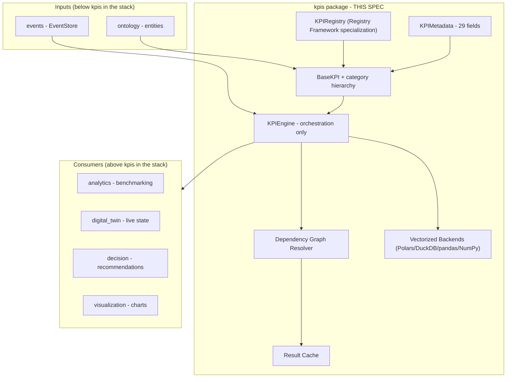
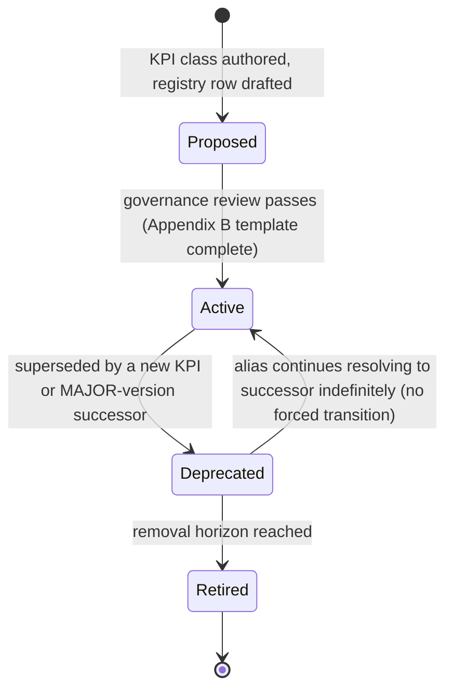
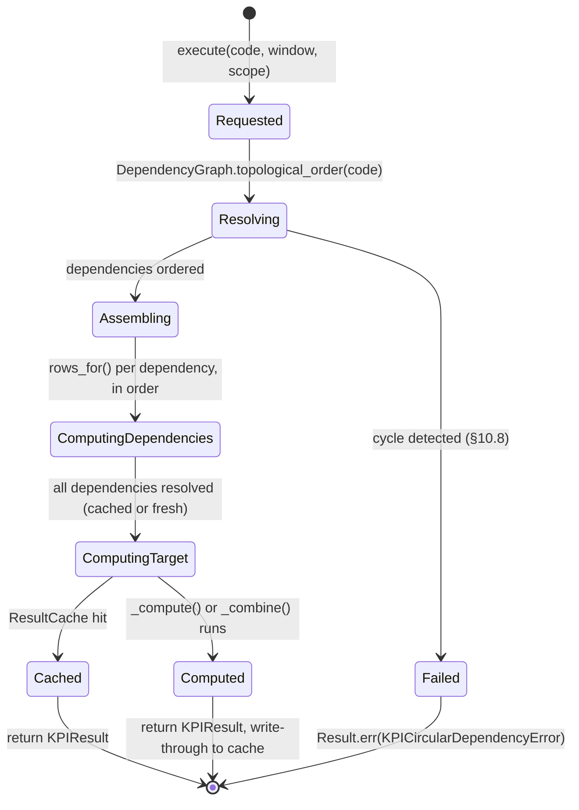
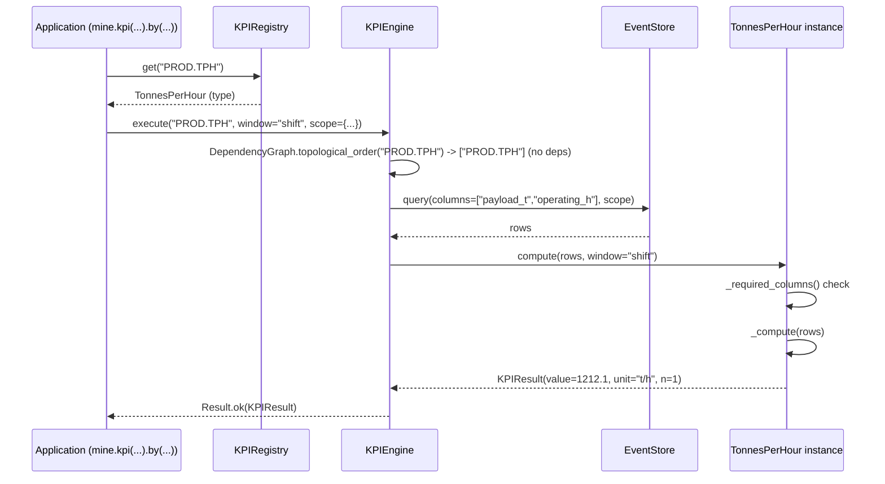
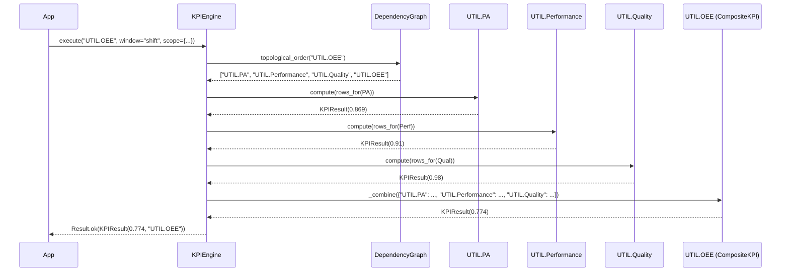
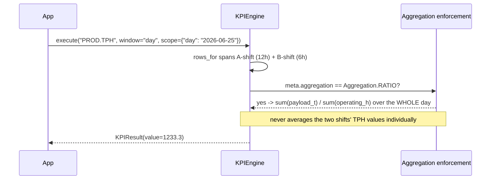
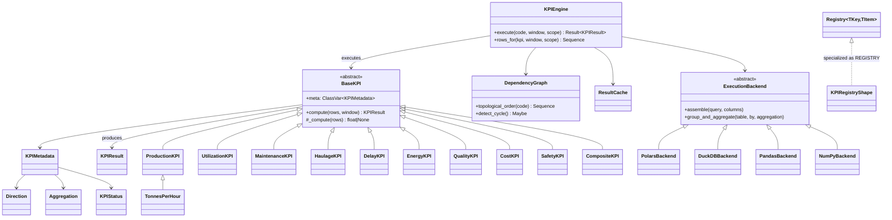

# KPI Engine - Design Specification

| | |
|---|---|
| **Document ID** | AH-DS-05 |
| **Package** | `mineproductivity.kpis` |
| **Status** | Draft - Design Complete, Pending Implementation |
| **Version** | 1.0.0 |
| **Conforms to** | Master Architecture Handbook v1.0; Reference Implementation Blueprint v1.0; Developer & Cookbook Guide Parts I-III (especially Part III, the KPI Standard Library & Cookbook); Learning & Benchmark Suite v1.0 |
| **Builds on** | Repository Skeleton v0.1.0 (LOCKED); Core Foundation Library v0.2.0 (LOCKED); Event Framework spec 01; Ontology Framework spec 02; Registry Framework spec 03 |
| **Author** | Chief Software Architect, MineProductivity |
| **Classification** | Public - Open Source Design Documentation |

## Document Control

Design specification only - no implementation. This is the platform's most important package: every other package exists to feed it inputs (`ontology`, `events`, `connectors`) or consume its outputs (`analytics`, `decision`, `digital_twin`, `visualization`). Its normative content is drawn directly from the Developer & Cookbook Guide Part III's KPI Standard Library - the 29-field mandatory KPI template (§18), the canonical semantics rulings (§19), and the KPI naming standard (§20) are restated here as binding engine-design constraints, not reinterpreted.

---

## 1. Purpose

The KPI Engine is the metric backbone of MineProductivity: it makes every performance indicator a **discoverable, versioned, self-describing object** rather than a formula buried in a script or spreadsheet cell. It exists to guarantee the platform's central promise - *"two engineers, two sites, or two AI agents each compute 'availability' [and] must get the same number from the same events"* (Developer & Cookbook Guide Part III, Introduction) - by encoding a KPI's formula, units, aggregation rule, and applicability directly on the KPI object itself, and by keeping the execution engine free of any metric-specific logic (**KPI-as-object**, root README's engineering philosophy).

## 2. Scope

**In scope:**

- The `BaseKPI` object model and its category hierarchy (`ProductionKPI`, `UtilizationKPI`, `MaintenanceKPI`, `HaulageKPI`, `DelayKPI`, `EnergyKPI`, `QualityKPI`, `CostKPI`, `SafetyKPI`).
- `KPIMetadata` - the complete 29-field mandatory schema from the Standard Library.
- The dependency graph: declared KPI-to-KPI dependencies, resolved and executed as a DAG.
- Lazy evaluation and caching of intermediate/final KPI results.
- The vectorized execution backends: Polars, DuckDB, pandas, and NumPy - as pluggable execution strategies behind one engine interface.
- Aggregation semantics: additive, ratio, average/weighted-average, rolling, cumulative, derived.
- Window functions and temporal KPIs (shift/day/week/month/rolling windows).
- Composite KPIs (e.g. OEE) and recursive/inherited KPIs (e.g. `PROD.TPH.Ore` inheriting `PROD.TPH`).
- KPI validation, certification hooks, and the KPI Registry (a `registry` Framework specialization).
- Units and dimensions handling.
- Benchmark integration points and visualization metadata hooks.

**Out of scope (see §4).**

## 3. Responsibilities

1. Define **one** object shape (`BaseKPI` + `KPIMetadata`) that every metric in the platform - from `PROD.TPH` to a site-specific plugin KPI - implements identically.
2. Hold **zero metric-specific logic** in the engine itself; the engine resolves dependencies, assembles inputs, and calls `_compute` - nothing more (Cookbook Part I, Ch. 4: *"The engine holds no metric logic - it merely executes the KPI object"*).
3. Enforce the **canonical semantics rulings** (time model, availability/utilisation/OEE definitions, delay taxonomy) as engine-level invariants, not per-KPI conventions that could drift.
4. Guarantee **correct-by-construction aggregation** - a `RATIO` KPI can never be silently averaged instead of re-derived from summed numerator/denominator, because the engine reads `Aggregation` from metadata and enforces it (Cookbook Part I, Ch. 6).
5. Make every KPI **discoverable and self-documenting** via the `KPIRegistry` (a Registry Framework specialization) and `describe()`/`to_schema()`-style introspection.

## 4. Out of Scope

- **Event and ontology definitions** - `events`, `ontology`; `kpis` consumes, never defines, these.
- **Connector logic** - `connectors`; `kpis` never imports it (§7).
- **Analytics, forecasting, benchmarking implementations** - a future `analytics` package *consumes* `kpis`' `KPIResult` objects (e.g. the `benchmark()` function shown in Cookbook Part I, Ch. 6) but `kpis` does not implement benchmarking itself, only exposes the metadata (`target`, `direction`) benchmarking needs.
- **Digital Twin live-state, decision recommendations, or AI agent reasoning** - all future packages built *on top of* `kpis`.
- **Visualization rendering** - `kpis` exposes visualization *metadata* (chart type hints, "never a pie chart"-style guidance) via `KPIMetadata`; a future `visualization` package renders actual charts.

## 5. Architecture

```
core → ontology → events → kpis → analytics → decision → digital_twin
```

`kpis` is the fulcrum of the entire platform: everything below it (`core`, `ontology`, `events`, `connectors`) exists to feed it well-formed inputs; everything above it (`analytics`, `optimization`, `simulation`, `decision`, `digital_twin`, `agents`, `visualization`) exists to consume its outputs. This is why the Cookbook opens its whole narrative arc with "KPI-as-object" as one of exactly two ideas (alongside ontology-first) that "explain everything you will see" in the platform.



## 6. Package Structure

```
src/mineproductivity/kpis/
├── __init__.py                # public API: register, REGISTRY, KPIEngine, ...
├── metadata.py                  # KPIMetadata (the 29-field schema), Direction, Aggregation, DigitalMaturity
├── base_kpi.py                    # BaseKPI (abstract)
├── categories/                      # the nine category base classes
│   ├── __init__.py
│   ├── production_kpi.py
│   ├── utilization_kpi.py
│   ├── maintenance_kpi.py
│   ├── haulage_kpi.py
│   ├── delay_kpi.py
│   ├── energy_kpi.py
│   ├── quality_kpi.py
│   ├── cost_kpi.py
│   └── safety_kpi.py
├── result.py                        # KPIResult
├── engine.py                          # KPIEngine (orchestration)
├── dependency_graph.py                  # DependencyGraph, topological resolution
├── aggregation.py                         # Aggregation semantics enforcement
├── windowing.py                             # Window, RollingWindow, CumulativeWindow
├── composite.py                               # CompositeKPI (e.g. OEE)
├── inheritance.py                               # KPI specialization/inheritance support
├── caching.py                                     # ResultCache
├── backends/                                        # vectorized execution strategies
│   ├── __init__.py
│   ├── base_backend.py                                # ExecutionBackend (ABC)
│   ├── polars_backend.py
│   ├── duckdb_backend.py
│   ├── pandas_backend.py
│   └── numpy_backend.py
├── naming.py                                          # NAMESPACE.Name identifier parsing/validation
├── lifecycle.py                                         # KPIStatus (Proposed/Active/Deprecated/Retired)
├── validation.py                                          # KPIValidator
├── certification.py                                         # certification hooks (spec §30)
├── exceptions.py
└── README.md
```

## 7. Dependency Direction

```
core → ontology → events → kpis
```

- **`kpis` depends on:** `core`, `ontology`, `events`, and the cross-cutting `registry`, `validation`, `config` packages. `kpis` MAY depend on optional, declared third-party vectorization libraries (Polars, DuckDB, pandas, NumPy) behind the `backends/` abstraction (§10.9) - these are the one deliberate exception to the platform's "essential packaging requirements only" default, installed as an optional extra (mirroring the Developer Documentation's `pip install "mineproductivity[analytics]"` pattern) rather than a hard core dependency.
- **`kpis` is depended on by:** `analytics`, `optimization`, `simulation`, `decision`, `digital_twin`, `agents`, `visualization`, `benchmark`, `certification`.
- **Forbidden:** `kpis` MUST NOT import `connectors` (Cookbook Part I, Ch. 3: *"kpis/ cannot import a fleet-management SDK, [so] a KPI can never accidentally depend on one vendor's data shape"*), nor `analytics`, `optimization`, `simulation`, `decision`, `digital_twin`, `agents`, or `visualization`.

## 8. Public API

```python
from mineproductivity.kpis import (
    # Object model
    BaseKPI, KPIMetadata, KPIResult,
    ProductionKPI, UtilizationKPI, MaintenanceKPI, HaulageKPI,
    DelayKPI, EnergyKPI, QualityKPI, CostKPI, SafetyKPI,
    CompositeKPI,
    # Metadata enums
    Direction, Aggregation, DigitalMaturity, KPIStatus,
    # Engine
    KPIEngine, DependencyGraph, ResultCache,
    Window, RollingWindow, CumulativeWindow,
    # Registry (Registry Framework specialization)
    register, REGISTRY,
    # Naming
    parse_identifier, KPIIdentifier,
    # Exceptions
    KPIValidationError, KPINotFoundError, KPICircularDependencyError,
    KPIAggregationError, KPIVersionConflictError,
)
```

## 9. Internal API

- `kpis.backends._active_backend` - the process-selected `ExecutionBackend` (default: pandas, per the Developer Documentation's "pandas... will feel immediately familiar" positioning; overridable per §28).
- `kpis.dependency_graph._topo_cache` - memoized topological order per KPI code, invalidated only when the registry changes (mirrors `registry.DiscoveryCache`'s explicit-invalidation-only rule).
- `kpis.certification._reference_fixtures` - the internal binding to the Learning & Benchmark Suite's golden-dataset fixtures used by `tests/certification/` (not part of the public contract).

## 10. Object Model

### 10.1 `KPIMetadata` - the 29-field mandatory schema

Every field below is **mandatory** for a KPI to be accepted into the registry - mirroring the Standard Library's own rule: *"No field is optional. A blank field is a specification gap."* Fields map directly onto Appendix B's 29-field template; several are grouped where they share one dataclass field for structural economy (e.g. field 16-17, "Worked Example"/"Sample Dataset," are documentation-level fields carried in `attributes` rather than typed engine fields, since the engine does not execute documentation).

```python
@dataclass(frozen=True, slots=True)
class KPIMetadata(BaseMetadata):
    """The complete, governed metadata for one KPI -- fields 1-15 and
    18-29 of the Standard Library's mandatory template are typed engine
    fields; fields 16-17 (worked example, sample dataset) are
    documentation artifacts carried in `attributes` since the engine
    does not execute prose."""

    # 1. Identifier
    code: str                                    # "NAMESPACE.Name", e.g. "PROD.TPH"
    # 2. Official Name
    official_name: str = field(kw_only=True)
    # 3. Business Purpose
    business_purpose: str = field(kw_only=True)
    # 4. Operational Question
    operational_question: str = field(kw_only=True)
    # 5. Business Meaning
    business_meaning: str = field(kw_only=True)
    # 6. Formula (plain-text/Unicode, every symbol defined)
    formula: str = field(kw_only=True)
    # 7. Units
    unit: str = field(kw_only=True)
    # 8. Dimensions
    dimensions: tuple[str, ...] = field(kw_only=True)
    # 9. Required Events
    required_events: tuple[str, ...] = field(kw_only=True)     # event_type_code values
    # 10. Required Ontology
    required_ontology: tuple[str, ...] = field(kw_only=True)   # ontology entity type codes
    # 11. Dependencies
    dependencies: tuple[str, ...] = field(default=(), kw_only=True)   # KPI codes
    # 12. Mathematical Properties
    aggregation: "Aggregation" = field(kw_only=True)
    # 13-17 (Calculation Logic / Implementation / Expected Output / Worked
    #         Example / Sample Dataset) are documentation, carried via
    #         BaseMetadata.attributes and the class's own docstring/_compute.
    # 18. Visualization
    visualization_hint: str = field(default="", kw_only=True)
    # 19. Operational Interpretation (benchmark bands)
    benchmark_bands: Mapping[str, str] = field(default_factory=dict, kw_only=True)
    # 20-22 (Common Mistakes / Validation Rules / Unit Tests) are documentation
    #         + the class's own validate()/tests, not engine-executed metadata.
    # 23. Performance Considerations -- documentation, in `attributes`.
    # 24. Edge Cases
    edge_cases: tuple[str, ...] = field(default=(), kw_only=True)
    # 25. AI Contributor Notes
    leading_or_lagging: Literal["leading", "lagging"] = field(kw_only=True)
    operational_or_strategic: Literal["operational", "strategic"] = field(kw_only=True)
    # 26. Digital Twin Mapping -- documentation, in `attributes`.
    # 27. Decision Intelligence Mapping -- documentation, in `attributes`.
    # 28. Related KPIs
    related_kpis: tuple[str, ...] = field(default=(), kw_only=True)
    # 29. References
    references: tuple[str, ...] = field(default=(), kw_only=True)

    # Additional engine-required fields beyond the 29 (naming standard,
    # lifecycle, applicability -- Introduction & Naming Standard chapters):
    direction: "Direction" = field(kw_only=True)
    status: "KPIStatus" = field(default_factory=lambda: KPIStatus.PROPOSED, kw_only=True)
    version: str = field(default="1.0.0", kw_only=True)          # SemVer string, §20
    min_maturity: "DigitalMaturity" = field(kw_only=True)
    method_applicability: tuple[str, ...] = field(default=("open_pit", "underground"), kw_only=True)
    commodity_applicability: tuple[str, ...] = field(default=(), kw_only=True)  # empty = all
    aliases: tuple[str, ...] = field(default=(), kw_only=True)
    deprecated_successor: str | None = field(default=None, kw_only=True)

    def validate(self) -> None:
        parse_identifier(self.code)   # raises if not NAMESPACE.Name (§20)
        if not self.formula.strip():
            raise ValidationError(f"{self.code}: formula must not be empty")
```

### 10.2 Supporting Enums

```python
class Direction(Enum):
    HIGHER_IS_BETTER = "higher_is_better"
    LOWER_IS_BETTER = "lower_is_better"
    TARGET_IS_BEST = "target_is_best"       # e.g. payload near, not above, rated capacity

class Aggregation(Enum):
    """Governs how a KPI MAY be aggregated across periods/groups --
    directly enforces the RATIO-not-averaged rule (Cookbook Part I Ch.6)."""
    ADDITIVE = "additive"
    RATIO = "ratio"                          # re-derive from summed numerator/denominator
    AVERAGE = "average"                      # count-weighted mean
    WEIGHTED_AVERAGE = "weighted_average"
    ROLLING = "rolling"
    CUMULATIVE = "cumulative"
    DERIVED = "derived"                      # composite of other KPIs (§10.7)

class DigitalMaturity(Enum):
    L1_MANUAL = 1
    L2_FMS = 2
    L3_ANALYTICS = 3
    L4_AUTONOMOUS = 4

class KPIStatus(Enum):
    """The KPI lifecycle, Developer & Cookbook Guide Part III Introduction."""
    PROPOSED = "proposed"
    ACTIVE = "active"
    DEPRECATED = "deprecated"
    RETIRED = "retired"
```

### 10.3 `BaseKPI`

```python
class BaseKPI(ABC):
    """The root of every KPI. A concrete leaf declares `meta:
    ClassVar[KPIMetadata]` and implements `_compute` -- everything else
    (validation, dependency declaration, result wrapping) is inherited.

    This mirrors Cookbook Part I, Ch. 6 exactly: 'The category base... and
    the metadata do most of the work; _compute is the only logic you
    write.'
    """
    meta: ClassVar[KPIMetadata]

    @abstractmethod
    def _compute(self, rows: Sequence[Mapping[str, Any]]) -> float | None:
        """Pure function: rows -> a single scalar result, or None if the
        KPI cannot be computed from the given rows (e.g. zero
        denominator). MUST NOT raise for a 'legitimately uncomputable'
        input -- return None and let compute() attach the warning."""

    def compute(self, rows: Sequence[Mapping[str, Any]], window: str | None = None) -> "KPIResult":
        """Validate inputs against meta.required_events'-derived required
        columns, then call _compute, then wrap in a KPIResult. This
        method is NOT overridden by leaf KPIs -- it is the one place the
        'qualify, don't coerce' stance (Cookbook Part I Ch.6) is enforced
        uniformly."""
        missing = [c for c in self._required_columns() if not all(c in r for r in rows)]
        if missing:
            return KPIResult(code=self.meta.code, value=None, unit=self.meta.unit,
                              n=len(rows), warnings=(f"missing required columns: {missing}",))
        value = self._compute(rows)
        return KPIResult(code=self.meta.code, value=value, unit=self.meta.unit, n=len(rows))

    def _required_columns(self) -> tuple[str, ...]:
        """Derived from meta -- see the Standard Library's field 9
        (Required Events) mapped to concrete column names."""
        ...
```

### 10.4 Category Base Classes

```python
class ProductionKPI(BaseKPI, ABC):
    """PROD namespace: throughput, cycle time, payload -- read directly
    from CycleEvent streams (Developer & Cookbook Guide Part III)."""

class UtilizationKPI(BaseKPI, ABC):
    """UTIL namespace: PA, UA, EU, OEE -- built on the canonical time
    model (§19)."""

class MaintenanceKPI(BaseKPI, ABC):
    """MAINT namespace: MTBF, MTTR, Ai."""

class HaulageKPI(BaseKPI, ABC):
    """HAUL namespace: cycle time context, match factor, TonKm."""

class DelayKPI(BaseKPI, ABC):
    """DELAY/DISP namespace: delay hours by category, dispatch metrics."""

class EnergyKPI(BaseKPI, ABC):
    """ENERGY/CARBON/WATER namespace."""

class QualityKPI(BaseKPI, ABC):
    """QUAL/GRADE namespace: recovery, head grade."""

class CostKPI(BaseKPI, ABC):
    """COST namespace: fuel per tonne, cost per tonne."""

class SafetyKPI(BaseKPI, ABC):
    """SAFE/AUTO namespace: exposure-normalized leading indicators."""
```

Each category base contributes no behavior beyond documentation and a namespace convention check in `validate()` (e.g. `ProductionKPI` asserts `meta.code.startswith("PROD.")`) - all real behavior lives in `BaseKPI` and is inherited uniformly, per Cookbook Part I Ch. 6's design.

### 10.5 The reference exemplar: `TonnesPerHour`

Reproduced here (illustratively, not for direct copy) exactly matching the Standard Library's own PROD.TPH worked entry, to pin the shape every concrete KPI follows:

```python
@register
class TonnesPerHour(ProductionKPI):
    """Headline production rate: payload moved per operating hour."""
    meta: ClassVar[KPIMetadata] = KPIMetadata(
        code="PROD.TPH", name="Tonnes Per Hour", official_name="Tonnes Per Hour",
        business_purpose="Throughput rate is the single most-watched production number in mining.",
        operational_question="At what rate is this asset producing material?",
        business_meaning="A higher, stable TPH means efficient conversion of operating time to output.",
        formula="sum(payload_t) / sum(operating_h)", unit="t/h",
        dimensions=("Shift", "Day", "Equipment", "Fleet", "Pit", "Mine"),
        required_events=("CYCLE",), required_ontology=("Equipment", "Shift"),
        aggregation=Aggregation.RATIO, direction=Direction.HIGHER_IS_BETTER,
        min_maturity=DigitalMaturity.L1_MANUAL,
        edge_cases=("operating_h == 0 -> None",),
        leading_or_lagging="lagging", operational_or_strategic="operational",
        related_kpis=("PROD.TruckCycleTime", "PROD.Payload", "HAUL.MatchFactor"),
        references=("Developer & Cookbook Guide Part III, PROD.TPH",),
    )

    def _compute(self, rows: Sequence[Mapping[str, Any]]) -> float | None:
        hours = sum(r["operating_h"] for r in rows)
        return None if hours == 0 else sum(r["payload_t"] for r in rows) / hours
```

### 10.6 `KPIResult`

```python
@dataclass(frozen=True, slots=True)
class KPIResult(BaseValueObject):
    code: str
    value: float | None
    unit: str
    n: int = field(default=0, kw_only=True)           # source record count (traceability)
    warnings: tuple[str, ...] = field(default=(), kw_only=True)
    scope: Mapping[str, str] = field(default_factory=dict, kw_only=True)  # e.g. {"shift": "A-..."}

    def to_frame(self) -> Any:
        """Export to a DataFrame via the active ExecutionBackend (§10.9) --
        'Familiar by design': .kpi(code).by(grouping).to_frame() mirrors
        df.groupby(...).agg(...)."""

    def plot(self) -> Any: ...       # delegates to visualization metadata hooks (§18)
    def pareto(self) -> Any: ...     # delegates to visualization metadata hooks (§18)
```

### 10.7 `CompositeKPI` and Inheritance

```python
class CompositeKPI(BaseKPI, ABC):
    """A KPI whose value is DERIVED from other KPIs' already-computed
    results, not directly from raw event rows -- e.g. UTIL.OEE =
    UTIL.PA x UTIL.Performance x UTIL.Quality (Part III, Canonical
    Semantics)."""

    @abstractmethod
    def _combine(self, component_results: Mapping[str, "KPIResult"]) -> float | None:
        """Pure function over already-computed dependency results."""

    def _compute(self, rows: Sequence[Mapping[str, Any]]) -> float | None:
        # CompositeKPI never reads rows directly; the engine (§10.8)
        # resolves meta.dependencies first and calls _combine.
        raise NotImplementedError("CompositeKPI uses _combine, not _compute")
```

```python
def specialize(parent: type[BaseKPI], *, code: str, material_filter: str) -> type[BaseKPI]:
    """The inheritance mechanism behind PROD.TPH.Ore / PROD.TPH.Waste
    (Part III, Introduction: 'a generic PROD.TPH can be inherited... which
    reuse the parent's calculation with a material filter'). Returns a
    new BaseKPI subclass reusing the parent's _compute, pre-filtering rows
    by material_filter before delegating."""
```

### 10.8 `KPIEngine` and `DependencyGraph`

```python
class KPIEngine:
    """Orchestration ONLY -- holds no metric logic (§3.2). Resolves a
    requested KPI's dependency graph, assembles exactly the columns/rows
    each node needs, executes leaves before composites, and returns the
    final KPIResult."""

    def __init__(self, store: "EventStore", registry: "Registry[str, type[BaseKPI]]",
                 backend: "ExecutionBackend", cache: "ResultCache") -> None: ...

    def execute(self, code: str, *, window: str, scope: Mapping[str, str]) -> Result[KPIResult]:
        """The .by(grouping) execution path (Cookbook Part I, Ch. 4)."""

    def rows_for(self, kpi: BaseKPI, window: str, scope: Mapping[str, str]) -> Sequence[Mapping[str, Any]]:
        """Assembles exactly the columns kpi.meta declares needing --
        never more (Cookbook Part I, Ch. 4's Performance Note)."""


class DependencyGraph:
    """A DAG over KPI codes, built from KPIMetadata.dependencies.
    Topologically sorts so dependencies compute before dependents
    (Part III, Introduction: 'the engine resolves them as a directed
    acyclic graph, computing dependencies before dependents')."""

    def topological_order(self, code: str) -> Sequence[str]: ...
    def detect_cycle(self) -> Maybe[Sequence[str]]:
        """Non-raising cycle detection; KPIEngine converts a Some result
        into KPICircularDependencyError at registration time, not at
        first execution."""
```

### 10.9 `ExecutionBackend` - vectorized computation strategies

```python
class ExecutionBackend(ABC):
    """One pluggable strategy for the bulk, vectorized parts of KPI
    computation (row assembly, grouping, windowing) -- BaseKPI._compute
    itself stays backend-agnostic (plain Python over `rows`), but
    KPIEngine.rows_for and KPIResult.to_frame delegate here for scale.
    """

    @abstractmethod
    def assemble(self, query: "EventQuery", columns: tuple[str, ...]) -> Any:
        """Return a backend-native tabular object (a Polars/DuckDB/pandas
        frame or a NumPy structured array) containing exactly `columns`."""

    @abstractmethod
    def group_and_aggregate(
        self, table: Any, by: tuple[str, ...], aggregation: Aggregation
    ) -> Any: ...

    @abstractmethod
    def to_pandas(self, table: Any) -> Any:
        """Universal escape hatch -- 'Export to a DataFrame for your own
        analysis' (Developer Documentation SDK section)."""


class PolarsBackend(ExecutionBackend): ...
class DuckDBBackend(ExecutionBackend): ...
class PandasBackend(ExecutionBackend): ...
class NumPyBackend(ExecutionBackend):
    """The leanest backend -- no DataFrame dependency at all; suited to
    the platform's lean-core, opt-in-extras philosophy (`pip install
    mineproductivity` with no [analytics] extra)."""
```

Backend selection is a `config`-sourced setting (§28), never hard-coded; `BaseKPI._compute` implementations are written against the plain `Sequence[Mapping[str, Any]]` "rows" shape precisely so they are **backend-independent** - the same `TonnesPerHour._compute` runs correctly whether `KPIEngine.rows_for` assembled its input via Polars, DuckDB, pandas, or NumPy underneath.

### 10.10 `Window`, `RollingWindow`, `CumulativeWindow`

```python
@dataclass(frozen=True, slots=True)
class Window(BaseValueObject):
    """A time-bounded scope for KPI computation -- 'shift', 'day',
    'week', 'month', or a custom [since, until)."""
    kind: Literal["shift", "day", "week", "month", "custom"]
    since_utc: datetime | None = field(default=None, kw_only=True)
    until_utc: datetime | None = field(default=None, kw_only=True)

@dataclass(frozen=True, slots=True)
class RollingWindow(Window):
    """A moving window of fixed span, re-evaluated at each step (e.g. a
    7-day rolling TPH trend)."""
    span: timedelta = field(kw_only=True)
    step: timedelta = field(kw_only=True)

@dataclass(frozen=True, slots=True)
class CumulativeWindow(Window):
    """Accumulates from a fixed start (e.g. month-to-date production)."""
    start_utc: datetime = field(kw_only=True)
```

## 11. Lifecycle

Two independent lifecycles apply, mirroring the Event Framework's envelope-vs-version split (§11/§12 of that spec):

1. **KPI *type* lifecycle** (`KPIStatus`, §10.2): `Proposed → Active → Deprecated → Retired`, exactly per Part III's Introduction. A `Deprecated` KPI remains resolvable via `meta.aliases`/`deprecated_successor`; a `Retired` identifier is never reused (§20).
2. **`KPIResult` instance lifecycle**: computed on demand, optionally cached (§10.8's `ResultCache`), never mutated once produced (it is a `BaseValueObject`).



## 12. State Machine

The `KPIEngine.execute()` call's internal states, from request to result:



## 13. Sequence Diagrams

### 13.1 Simple KPI execution (Cookbook Part I, Ch. 4, "What happens internally")



### 13.2 Composite KPI execution (UTIL.OEE)



### 13.3 Ratio aggregation across periods (Cookbook Part I, Ch. 6 worked example)



## 14. Class Diagrams



## 15. Data Flow

```
EventStore.query(EventQuery derived from KPIMetadata.required_events/dimensions)  (events pkg)
   │
   ▼
ExecutionBackend.assemble(query, columns)          (kpis package, §10.9)
   │  column-pruned: only the columns the requested KPI(+dependencies) declare needing
   ▼
DependencyGraph.topological_order(code)             (kpis package, §10.8)
   │
   ▼
for each KPI in topological order:
   BaseKPI.compute(rows, window) -> KPIResult          (kpis package, §10.3)
   │  structural validation -> _compute()/_combine() -> KPIResult wrapping
   ▼
ResultCache write-through                              (kpis package, §10.8)
   │
   ▼
KPIResult returned to caller                             (analytics / digital_twin /
                                                             decision / visualization)
```

## 16. Extension Points

1. **New leaf KPIs.** Subclass the appropriate category base, complete `KPIMetadata`'s 29 fields, implement `_compute`, decorate with `@register` (§17). No existing KPI class is ever edited to add a new one.
2. **New KPI categories/namespaces.** Add a new category base class (§10.4) for a namespace not yet covered (e.g. a future `GRADE`/`BLEND`/`CRUSH`/`PROC` category per Part III Appendix A's namespace list, §33).
3. **New `ExecutionBackend`s.** Implement the ABC in §10.9 for an additional vectorization engine without touching any `BaseKPI` subclass.
4. **New `Aggregation` semantics.** Adding a new aggregation kind is a closed-enum change requiring governance (mirrors the `DelayCategory` closed-enum rule in the Ontology Framework spec §16) - not something a plugin author does casually.

## 17. Plugin Strategy

Identical mechanism to every other extension point (Registry Framework spec), specialized for KPIs - this is the exact pattern the Cookbook demonstrates in Ch. 6 and Ch. 9:

```python
from mineproductivity.kpis import register, KPIMetadata, CostKPI, Direction, Aggregation, DigitalMaturity

@register
class FuelPerTonne(CostKPI):
    meta: ClassVar[KPIMetadata] = KPIMetadata(
        code="COST.FuelPerTonne", ..., formula="sum(fuel_l) / sum(payload_t)",
        unit="L/t", direction=Direction.LOWER_IS_BETTER, aggregation=Aggregation.RATIO,
        dependencies=("PROD.TPH",), min_maturity=DigitalMaturity.L2_FMS,
    )
    def _compute(self, rows): ...
```

```toml
[project.entry-points."mineproductivity.kpis"]
haulmetrics = "mineproductivity_haulmetrics.kpis"
```

**Governance rule (normative):** *"A KPI code is a public contract. Once [a code] is published, changing what it means is a breaking change requiring a major version bump"* (Cookbook Part I, Ch. 9) - enforced at registration time by `KPIVersionConflictError` (§26) when a plugin attempts to re-register an existing code with materially different metadata under the same MAJOR version.

## 18. Metadata

§10.1 *is* this section's core content - the entire `KPIMetadata` dataclass exists because metadata-first is, per Part III, *"the design decision that makes everything else possible. Separating what a KPI is (metadata) from how it is computed... means the catalogue can be searched, validated, versioned, and governed without executing a single calculation."* Two additional metadata-driven capabilities:

- **`mine.available_kpis()`** (Cookbook Part I, Ch. 4) filters `REGISTRY` by `min_maturity` and `commodity_applicability`/`method_applicability` matching the current site profile - implemented entirely via metadata inspection, no per-KPI branching.
- **`mine.describe(code)`** returns `KPIMetadata` directly, giving callers (including AI agents, per Part III's "AI Contributor Note... a KPI not in the registry does not exist to the system") the full 29-field contract without reading source.

## 19. Validation

Three layers:

1. **Metadata completeness** (`KPIMetadata.validate()`, §10.1) - every mandatory field populated, `code` parses as `NAMESPACE.Name` (§20).
2. **Input validation** (`BaseKPI.compute()`, §10.3) - required columns present; missing columns become a `KPIResult` warning, never an exception (Cookbook Part I, Ch. 6: *"qualify, don't coerce"*).
3. **Canonical semantics validation** - the engine enforces, as invariants no KPI can override:
   - The **time model**: `calendar ⊇ scheduled ⊇ available ⊇ operating`; `UTIL.PA = available/scheduled`, `UTIL.UA = operating/available`, `UTIL.EU = operating/scheduled = PA × UA` (Part III, Canonical Semantics). Any `UtilizationKPI` declaring a denominator outside this ladder fails registration validation.
   - The **six-category delay taxonomy** (owned by `ontology`, consumed here) - a `DelayKPI` reading `delay_category` MUST treat the six values as mutually exclusive and collectively exhaustive; the precedence order (Ontology Framework spec §10.9) is applied once, at the event layer, never re-decided per KPI.
   - The **RATIO-never-averaged rule** (§10.8's Aggregation enforcement, §13.3): the engine, not each `_compute`, decides how multi-period/multi-group results combine, based on `meta.aggregation` - a `_compute` implementation cannot accidentally violate this because it never sees pre-aggregated sub-period results for a `RATIO` KPI, only raw rows.

## 20. Versioning

Exactly the Standard Library's rules (Part III, "Lifecycle, versioning, governance, and deprecation" and "The KPI Naming Standard"), enforced as engine behavior:

- **Identifier format:** `NAMESPACE.Name` - controlled uppercase namespace (`PROD`, `UTIL`, `MAINT`, `HAUL`, `DISP`, `QUAL`, `COST`, `ENERGY`, `CARBON`, `WATER`, `SAFE`, `AUTO`, and the Appendix A extension namespaces `GRADE`, `BLEND`, `CRUSH`, `PROC`, `STOCK`, `RAIL`, `PORT`, `TWIN`, `DI`, `AI`), PascalCase name, optional dotted specialization (`PROD.TPH.Ore`).
- **`parse_identifier(code) -> KPIIdentifier`** validates this format at registration time; an unrecognized namespace is rejected unless governance has extended the controlled list (§33).
- **SemVer on `KPIMetadata.version`:** MAJOR = breaking formula/units/semantics change (new identifier version, old one deprecated, never repointed); MINOR = new non-breaking dimension/capability; PATCH = documentation/defect fix with no result change.
- **Aliases never resolve to a different KPI than their target was defined against**, and a retired identifier is never reused for a new meaning (Part III, Naming Standard's Warning) - enforced by `KPIRegistry` refusing to register a `code` matching any historically-`Retired` identifier.

## 21. Serialization

- `KPIMetadata` and `KPIResult` are `core.BaseValueObject`s and serialize via `core.serialization` (`DataclassSerializer`/`to_dict`) for API/documentation export - this is the mechanism behind the Developer Documentation's *"the schema is generated from the KPI registry, so the API never drifts from the model"* REST API surface (a future `api`-adjacent capability, not implemented here).
- `KPIResult.to_frame()` (§10.6) is the vectorized-interchange path, delegating to the active `ExecutionBackend`, distinct from `core.serialization`'s JSON-oriented path.

## 22. Performance Considerations

- **Column pruning, always** (§10.8, §15): `rows_for()` requests only the columns the target KPI *and its full dependency chain* declare needing - asking for `PROD.TPH` never loads delay or quality columns (Cookbook Part I, Ch. 4's Performance Note).
- **Batched multi-KPI requests** (`mine.summary(...)`) scan the event store once and share the assembled table across multiple KPIs' `_compute` calls, rather than one scan per KPI - the documented difference between "one pass and a dozen" on large shifts.
- **Pre-aggregation at ingest** for O(1)-at-query-time ratio KPIs (Part III's Performance Considerations field, applied uniformly): `ExecutionBackend` implementations are expected to support summing at `(scope, period)` granularity so `PROD.TPH` at query time is a division, not a re-scan of raw cycles, for high-volume fleets.
- **`ResultCache`** (§10.8) memoizes `KPIResult` per `(code, window, scope, event-store-version-fingerprint)` - invalidated automatically when new events land in the relevant scope (never silently stale).

## 23. Memory Considerations

- `BaseKPI._compute` operates over `Sequence[Mapping[str, Any]]` "rows," which for very large fleets should be backed by a columnar `ExecutionBackend` table under the hood (§10.9), not a literal Python list-of-dicts at scale - the `Sequence[Mapping]` shape is the **interface** `_compute` sees, not necessarily the **storage** `KPIEngine` holds internally.
- `KPIResult` instances are small, frozen value objects; `ResultCache` retention policy (size/TTL bounds) is a `config`-sourced setting (§28), not unbounded by default.

## 24. Thread Safety

- `BaseKPI` subclasses are stateless (no instance mutation across `compute()` calls) and therefore safe to share and invoke concurrently from multiple threads.
- `KPIEngine` instances MAY be shared across threads for read-heavy workloads; `ResultCache` writes MUST be safe under concurrent `execute()` calls for the same `(code, window, scope)` key (an implementation may use a per-key lock or an atomic compare-and-swap-style cache write, consistent with the Registry Framework's `DiscoveryCache` concurrency contract, §25 of that spec).
- `KPIRegistry` inherits `Registry[T]`'s thread-safety contract (Registry Framework spec §24): read-only and thread-safe after startup discovery.

## 25. Concurrency

- **Independent KPI executions** (different `code`, `window`, or `scope`) may proceed fully in parallel; `DependencyGraph` resolution is pure and side-effect-free, so concurrent resolution of overlapping dependency chains (e.g. two callers both requesting KPIs that depend on `UTIL.PA`) is safe, with `ResultCache` naturally deduplicating the redundant work when both land on the same cache key.
- **Backend-level parallelism** (e.g. Polars' or DuckDB's own multi-threaded query execution) is transparent to `kpis` - `ExecutionBackend` implementations are free to parallelize internally; the `kpis` package's own concurrency contract only governs its own orchestration layer (`KPIEngine`, `ResultCache`, `DependencyGraph`).

## 26. Error Handling

```python
class KPIValidationError(ValidationError):
    """KPIMetadata failed validation (§10.1, §19) -- e.g. malformed
    identifier, missing mandatory field, aggregation/time-model violation."""

class KPINotFoundError(NotFoundError):
    """REGISTRY.get(code) found no registered, non-Retired KPI."""

class KPICircularDependencyError(MineProductivityError):
    """DependencyGraph.detect_cycle() found a cycle -- raised at
    REGISTRATION time (registering the KPI that completes the cycle),
    never deferred to first execution."""

class KPIAggregationError(MineProductivityError):
    """An attempt was made to aggregate a RATIO/AVERAGE-kind KPI's
    already-computed sub-period results as if they were ADDITIVE (the
    'averaging shift TPHs' mistake, made structurally impossible by the
    engine rather than merely discouraged by documentation)."""

class KPIVersionConflictError(RegistrationError):
    """A plugin attempted to re-register an existing, Active KPI code
    with metadata that changes its formula/units/semantics without a
    MAJOR version bump (§17, §20)."""
```

**Central rule, restated one more time because it is the single most-repeated normative statement across the whole Standard Library:** a KPI that cannot be computed from valid inputs returns `KPIResult(value=None, warnings=(...))`. It never raises for a legitimate "cannot compute" case (zero denominator, empty window), and it never silently returns zero.

## 27. Logging

- Every `KPIResult` with a non-empty `warnings` tuple logs at `WARNING`, including `code`, `scope`, and the warning text - this is the primary signal for "why is this dashboard cell blank."
- Registry rejections (`KPIVersionConflictError`, duplicate registration) log at `WARNING` with both the existing and attempted registration's KPI code and source module, mirroring the Registry Framework spec's §27.
- `DependencyGraph` cycle detection failures log at `ERROR` at registration time, since a circular KPI dependency is a governance failure that should block plugin activation, not merely warn.

## 28. Configuration

- **Backend selection** (`config`-sourced, §10.9): `KPIEngineConfiguration.backend: Literal["polars","duckdb","pandas","numpy"]`, default `"pandas"`.
- **Cache policy**: `ResultCacheConfiguration` (max size, TTL) - a `core.BaseConfiguration` subclass.
- **Time-model conventions** (Cookbook Part I, Ch. 3's Warning: *"Two sites are only comparable when their time-model conventions match... e.g. whether queueing counts as operating time"*) are site-level configuration consumed by `UtilizationKPI` implementations, never hard-coded - this is the direct engine-level implication of that Cookbook warning.

## 29. Testing Strategy

- **Unit tests per KPI** - every registered KPI's `_compute` (or `_combine` for composites) against the Standard Library's own worked examples and canonical values (e.g. `TonnesPerHour` against the 1212.1 t/h worked example) - mirrors Part III's own `test_tph_canonical` pattern exactly.
- **Golden tests** - every flagship KPI from Part III (PROD.TPH, PROD.TruckCycleTime, PROD.Payload, and the flagship entry from each other category) reproduces its published expected value against the Learning & Benchmark Suite's canonical dataset.
- **Aggregation property tests** - for every `RATIO`-aggregation KPI, assert `compute(combined_rows) != mean(compute(rows_a), compute(rows_b))` in the general case, and `== ` the correctly re-derived value, guarding against the "averaging shift TPHs" regression class permanently.
- **Dependency graph tests** - topological ordering correctness, cycle detection, and that composite KPIs receive exactly their declared dependencies' results.
- **Backend parity tests** - the same `BaseKPI._compute` invocation via each of the four `ExecutionBackend`s (§10.9) must produce identical `KPIResult.value` (within floating-point tolerance) for the same input rows - this is the mechanical proof that `_compute` implementations are truly backend-independent.
- **Certification tests** - see §30.

## 30. Certification Requirements

| Category | Requirement for `kpis` |
|---|---|
| A - Golden datasets | Every flagship KPI documented in Part III reproduces its published worked-example value from the Learning & Benchmark Suite's canonical dataset, to the documented tolerance. |
| B - Integration | The full path CSV → Connector → EventStore → KPIEngine → KPIResult (Cookbook Part I, Ch. 10's "Putting Everything Together" pipeline) reproduces golden outputs. |
| C - Edge cases | Zero operating hours, empty windows, and a KPI whose dependency chain includes a `None`-valued upstream result (must propagate as `None` with a warning, never a crash or a fabricated zero). |
| D - Corrupted data | Negative payloads or out-of-range delay categories reaching the engine (should already be rejected upstream by `events`, but the engine's own input validation, §19, is the second line of defense) are rejected, not silently computed over. |
| E - Missing data | A required column entirely absent from the assembled rows produces the documented `"missing required columns: [...]"` warning, never a `KeyError`. |
| G - Multi-mine | KPI results for five concurrently-scoped mine contexts (Learning & Benchmark Suite's five reference mines) never cross-contaminate scope. |
| H - Multi-commodity | `commodity_applicability`-filtered KPIs correctly appear/disappear from `mine.available_kpis()` per site commodity. |

## 31. Example Usage

```python
from mineproductivity.kpis import REGISTRY, KPIEngine

print(len(REGISTRY), "KPIs registered")

engine = KPIEngine(store=event_store, registry=REGISTRY, backend=active_backend, cache=result_cache)

result = engine.execute("PROD.TPH", window="shift", scope={"shift": "A-2026-06-25"})
if result.is_ok:
    tph = result.unwrap()
    print(f"{tph.value:.1f} {tph.unit}  (n={tph.n})")
    print(tph.warnings)          # () when inputs were complete

# Discovery
for kpi_cls in REGISTRY.list():
    print(kpi_cls.meta.code, "-", kpi_cls.meta.official_name)

# Composite
oee = engine.execute("UTIL.OEE", window="shift", scope={"shift": "A-2026-06-25"}).unwrap()
print(f"OEE: {oee.value:.1%}")
```

## 32. Anti-Patterns

- ❌ **Putting any metric-specific logic in `KPIEngine` itself.** The engine resolves, assembles, and calls `_compute` - nothing else, ever. A conditional like `if code == "PROD.TPH": ...` inside the engine is an architecture violation, full stop.
- ❌ **Averaging per-period `RATIO` results** instead of letting the engine re-derive from summed numerator/denominator (§10.8, §19, §29) - the single most-cited mistake across the entire Standard Library.
- ❌ **A `_compute` implementation raising an exception for a legitimately uncomputable input** (zero denominator) instead of returning `None`.
- ❌ **A KPI importing `connectors`** "to read a vendor field directly" - breaks the dependency direction (§7) and reintroduces exactly the vendor coupling the whole platform exists to prevent.
- ❌ **Silently repointing an existing KPI code to a new formula** without a MAJOR version bump and a deprecation record (§17, §20, `KPIVersionConflictError`).
- ❌ **Computing a KPI "quickly" outside the registry** for a one-off report. Part III's Best Practice: *"Unregistered numbers cannot be versioned, validated, or reproduced... If it is worth reporting, it is worth registering."*
- ❌ **Hard-coding a specific `ExecutionBackend`** inside a `_compute` implementation (e.g. calling a Polars-specific method directly). `_compute` operates on the backend-neutral `Sequence[Mapping[str, Any]]` shape only.

## 33. Future Extensions

- **Full write-up of the remaining ~90 registered-but-not-yet-fully-documented KPIs** in Part III's Appendix A (100 KPIs across 25 namespaces cataloged; a flagship subset fully worked in this First Edition) - each follows the identical `BaseKPI`/`KPIMetadata` shape specified here; no engine change is required as the catalogue grows.
- **Additional namespaces** (`GRADE`, `BLEND`, `CRUSH`, `PROC`, `STOCK`, `RAIL`, `PORT`, and the derived `TWIN`/`DI`/`AI` namespaces) as their owning capabilities (`digital_twin`, `decision`, `agents`) mature - each is a new category base class (§16.2), not an engine change.
- **A GPU-accelerated `ExecutionBackend`** for very large multi-site aggregations, behind the same `ExecutionBackend` ABC (§10.9) - the Developer Documentation notes optional GPU use for the `analytics` extra's forecasting/anomaly-detection models; a GPU KPI backend would follow the identical opt-in-extra pattern.
- **A formal KPI certification badge**, once the Learning & Benchmark Suite's certification thresholds are published (currently an open item per that document, §30 of the Event Framework spec's parallel note).

## 34. Known Constraints

- This specification's 29-field `KPIMetadata` schema types the *engine-executed* subset of the Standard Library's template as dataclass fields (§10.1); the remaining documentation-only fields (worked example, sample dataset, calculation-logic prose, performance-considerations prose) are carried in `BaseMetadata.attributes` rather than as first-class typed fields, since the engine has no behavior to attach to prose. A future revision could promote these to typed fields if tooling needs to query them structurally.
- `ExecutionBackend` implementations for Polars, DuckDB, and pandas depend on third-party libraries not part of the platform's minimal core dependency set (`pyproject.toml`'s `dependencies = []`) - they are installed via the `[analytics]` extra, consistent with the Developer Documentation's install guidance; `kpis` itself, at minimum with the `NumPyBackend` or a pure-Python fallback, must remain usable with zero extras installed for the "lean core" promise to hold.
- The canonical semantics rulings (§19) are treated as immutable engine invariants for v1.0; the Developer & Cookbook Guide Part III explicitly reserves changing them to a formal governance process, which this specification cannot itself authorize.

## 35. Architecture Decisions

| ID | Decision | Rationale |
|---|---|---|
| AD-KP-01 | `KPIEngine` is pure orchestration; it is architecturally forbidden from containing metric-specific branches. | This is the entire meaning of "KPI-as-object" - if the engine ever needs to know what a specific KPI *is*, the abstraction has failed. Cookbook Part I, Ch. 4 states this as the reason adding a metric "never touches this path." |
| AD-KP-02 | Aggregation semantics (`Aggregation` enum) live on `KPIMetadata`, and the *engine* - not each `_compute` - decides how to combine sub-period/sub-group results. | Makes the "averaging a ratio" class of bug structurally impossible rather than merely documented against, directly per Cookbook Part I Ch. 6's worked example. |
| AD-KP-03 | `_compute`/`_combine` operate over a backend-neutral `Sequence[Mapping[str, Any]]`/`Mapping[str, KPIResult]` shape; vectorized execution is entirely the `ExecutionBackend`'s concern. | Lets a KPI author write once, backend-agnostic code (matching the "Python Insight" throughout the Cookbook praising simple, pure functions) while still letting the platform scale via Polars/DuckDB under the hood for large fleets. |
| AD-KP-04 | Composite KPIs (`CompositeKPI`) are a distinct base class from leaf KPIs, with `_combine` instead of `_compute`. | Keeps the "reads raw rows" and "reads other KPIs' results" cases from being conflated in one method signature, and lets `DependencyGraph` treat composite-ness as a structural property it can reason about (a composite's dependencies are mandatory, not optional). |
| AD-KP-05 | The 29-field `KPIMetadata` schema is treated as load-bearing engine contract, not optional documentation. | Directly executes Part III's own governance rule: *"A KPI entry with an empty field is incomplete and fails governance."* Making `KPIMetadata.validate()` enforce this at the type-system level (mandatory dataclass fields, no defaults for content fields) turns a documentation policy into a compile-time/construction-time guarantee. |
| AD-KP-06 | KPI plugin registration reuses the exact same mechanism as connector and ontology-type registration (Registry Framework spec), not a bespoke KPI-specific registry implementation. | Consistency and DRY across the whole plugin ecosystem; Part III itself notes "this is the plugin mechanism from Part I, Chapter 9, applied to KPIs... the same pattern with a richer metadata contract." |

## 36. Definition of Done

- [ ] `KPIMetadata`, `BaseKPI`, all nine category base classes, `CompositeKPI`, `KPIEngine`, `DependencyGraph`, `ResultCache`, and all four `ExecutionBackend`s implemented exactly per §10.
- [ ] The `TonnesPerHour` reference exemplar (§10.5) and at least one flagship KPI per category (mirroring Part III's worked flagships) are implemented and pass their golden tests.
- [ ] `tests/unit/kpis/` mirrors `src/mineproductivity/kpis/` 1:1, ≥95% coverage.
- [ ] `mypy --strict` and `ruff` clean.
- [ ] Backend parity tests (§29) pass across all four `ExecutionBackend`s for every implemented KPI.
- [ ] `examples/kpis/` demonstrates simple execution, composite (OEE) execution, and multi-KPI batch execution (`mine.summary`-equivalent).
- [ ] No import from `kpis` reaches `connectors`, `analytics`, `optimization`, `simulation`, `decision`, `digital_twin`, or `agents` - mechanically verified.

## 37. Package Acceptance Criteria

1. **KPI-as-object proof:** a static analysis of `kpis/engine.py` contains zero references to any specific KPI code string - the engine genuinely holds no metric logic.
2. **Ratio-correctness proof:** the exact Cookbook Part I Ch. 6 worked example (A-shift 1,300 t/h over 12h, B-shift 1,100 t/h over 6h → combined 1,233 t/h, not the naive 1,200 average) passes as a regression test.
3. **Composite-correctness proof:** `UTIL.OEE` computed via `_combine` equals `UTIL.PA × UTIL.Performance × UTIL.Quality` computed independently, to floating-point tolerance, for every certification fixture.
4. **Backend parity proof:** every implemented KPI produces identical results across all four `ExecutionBackend`s on the same certification fixtures.
5. **No architectural drift:** `kpis` appears in the dependency graph exactly per §7; the forbidden-imports check (no `connectors`, no `analytics`, etc.) passes mechanically.
6. **Cross-reference audit:** every one of the 29 mandatory metadata fields (§10.1), the canonical time-model ladder (§19), and the six-namespace-plus-extension naming standard (§20) are traceable to specific passages in the Developer & Cookbook Guide Part III cited in this document.

---

*End of KPI Engine Design Specification. See [`docs/design/05_KPI_Implementation_Checklist.md`](../design/05_KPI_Implementation_Checklist.md) for the actionable implementation contract.*
