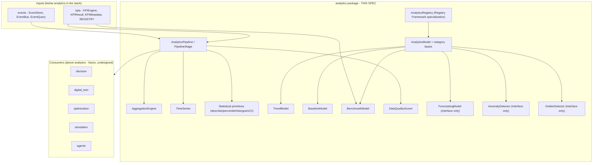
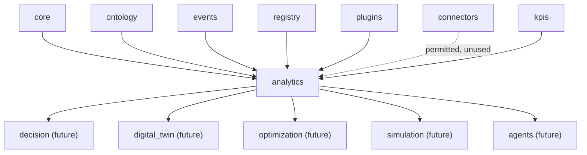
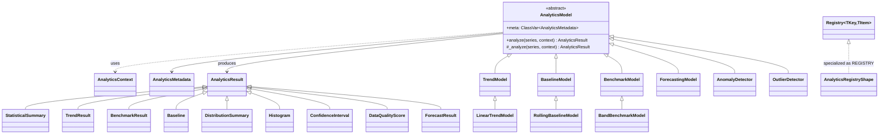
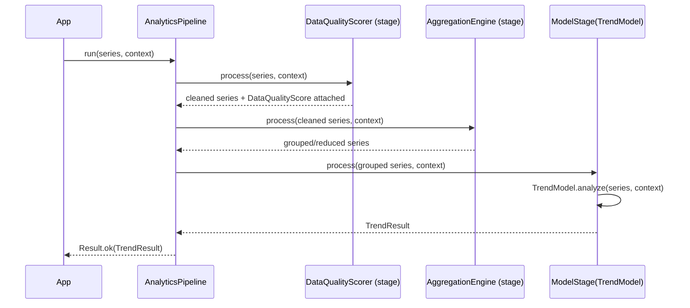
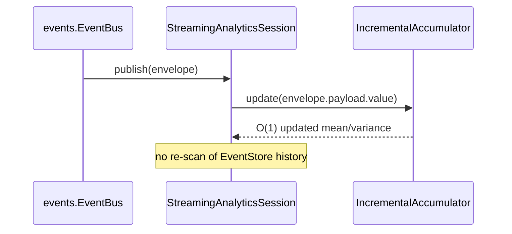
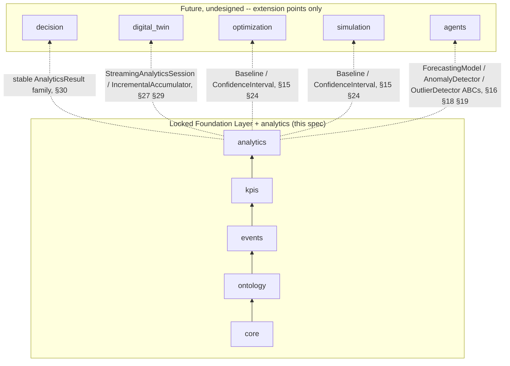

# Analytics Engine - Design Specification

| | |
|---|---|
| **Document ID** | AH-DS-06 |
| **Package** | `mineproductivity.analytics` |
| **Status** | Draft - Design Complete, Pending Implementation |
| **Version** | 1.0.0 |
| **Conforms to** | Master Architecture Handbook v1.0; Reference Implementation Blueprint v1.0; Developer & Cookbook Guide Parts I-III |
| **Builds on** | Core Foundation Library v0.2.0 (LOCKED); Event Framework spec 01 (LOCKED, `events` v0.3.0); Ontology Framework spec 02 (LOCKED, `ontology` v0.4.0); Registry Framework spec 03 (LOCKED, `registry`/`plugins` v0.5.0); Connector Framework spec 04 (LOCKED, `connectors` v0.6.0); KPI Engine spec 05 (LOCKED, `kpis` v0.7.0) |
| **Author** | Chief Software Architect, MineProductivity |
| **Classification** | Public - Open Source Design Documentation |

## Document Control

Design specification only - no implementation. This document designs `mineproductivity.analytics`, the first package built *on top of* the now-locked Foundation Layer (`core`, `events`, `ontology`, `registry`, `plugins`, `connectors`, `kpis`). Nothing in this specification proposes, requires, or hints at a change to any Foundation Layer file, public API, or dependency rule. Every object model, package name, and enum member cited from a Foundation Layer package is taken verbatim from that package's own `__init__.py` public export list or its own governing design specification - this document introduces zero synonyms for concepts those specifications already name. Section numbering (1-37) in this document is a domain-specific table of contents for the Analytics Engine and is deliberately different from the 37-section skeleton used by specifications 01-05, because Analytics' architecturally significant surface (pipelines, windowing, statistical primitives, benchmarking, streaming) does not map cleanly onto that skeleton; the surrounding conventions (header table, `§N` cross-references, Mermaid diagrams, ❌ anti-pattern bullets, a companion implementation checklist) are preserved exactly.

---

## 1. Purpose

The Analytics Engine answers the question the KPI Engine deliberately does not: *given a number (or a series of numbers), what does it mean?* `kpis` (spec 05) makes every metric a discoverable, versioned, self-describing object and guarantees that two engineers computing "availability" from the same events get the same number. `analytics` exists to take that guaranteed-correct number - or a whole series of them, across shifts, sites, or years - and answer the next layer of operational questions a single `KPIResult` cannot answer by itself: *is this trending up or down? Is this normal, or an outlier? How does it compare to the published benchmark bands? What is the 7-day rolling picture? How confident are we, given how much data we have?*

Analytics is the platform's **statistical and analytical computation layer**: it consumes already-correct inputs (raw event rows via `events.EventStore`, and already-computed `kpis.KPIResult` objects) and produces analytical judgments about them - trends, benchmarks, baselines, distributions, confidence intervals, data-quality scores - as new, equally discoverable, equally versioned result objects. It holds no ingestion logic, no event or ontology definitions, no plugin-loading machinery, and no KPI formulas of its own; all of those already exist, one layer down, and are consumed rather than re-implemented (§3, §9).

## 2. Business Objectives

1. **Turn a correct number into an operational judgment.** A `KPIResult` of `1,212.1 t/h` is correct but silent on whether that is good, improving, or expected. Analytics exists to close that gap without asking every dashboard, report, or AI agent to reimplement its own ad hoc statistics.
2. **Make cross-site, cross-fleet, and cross-period comparison a platform capability, not a spreadsheet exercise.** Benchmarking and trend analysis are implemented once, correctly, against the KPI Engine's own metadata (`direction`, `benchmark_bands`), rather than reinvented per report.
3. **Give `decision`, `digital_twin`, `optimization`, and future AI agents (§37) one shared, correct-by-construction statistical vocabulary** - percentile, confidence interval, rolling window, trend slope, anomaly flag - so those future packages consume Analytics' results instead of each defining their own, mutually inconsistent versions of "what is a rolling average."
4. **Make data quality a visible, scored precondition, not a silent assumption.** No trend, benchmark, or confidence interval is reported without an accompanying, inspectable judgment of how much the underlying data can be trusted (§25).
5. **Support both retrospective (batch) and live (streaming) operational use** from one consistent object model, so a monthly report and a live operations-center tile compute the same statistics the same way (§27-§29).

## 3. Architectural Principles

1. **Computation-only, non-generative.** Analytics computes deterministic statistics *from* data that already exists. It never decides what should happen next (that is `decision`), never maintains simulated live state (that is `digital_twin`), never searches a solution space (that is `optimization`), and never trains or infers with a machine-learning model (out of scope entirely - see §4).
2. **Consumption without redefinition.** Analytics never recomputes, reinterprets, or shadows a KPI's formula. Any time a KPI value is needed, Analytics calls `kpis.KPIEngine`/`kpis.REGISTRY` - it never reads raw rows and re-derives a KPI-shaped number itself. This is the single most important boundary in this specification (§9, §34).
3. **Reuse over reinvention.** Wherever a Foundation Layer package already defines a shape - `kpis.Window`/`RollingWindow`/`CumulativeWindow`, `kpis.ExecutionBackend`, `kpis.Aggregation`, `registry.Registry`, `registry.EntryPointDiscovery`, `core.Result`/`core.Maybe`, `core.BaseSpecification` - Analytics composes it rather than defining a parallel concept with a different name (§5, §10, §11).
4. **Interfaces before algorithms, where the algorithm is a modeling choice.** Forecasting, anomaly detection, and outlier detection are each declared as a stable abstract contract now (§16, §18, §19); no specific algorithm is chosen or shipped for any of the three. This keeps the package strictly "computation-only" (no ML, no optimization) while still letting future, independently-versioned plugins implement against a fixed interface.
5. **Zero upward leakage.** No Foundation Layer package (`core` through `kpis`) imports `analytics`, mechanically enforced by the same AST-based `TestNoForbiddenDependencies` pattern every existing package already uses (`tests/unit/<package>/test_public_api.py`) - Analytics' own equivalent test asserts the reverse: nothing in `analytics` is reachable from a Foundation Layer package's import graph.
6. **Metadata-light, not metadata-first.** `kpis.KPIMetadata` is a governance-grade, 29-field mandatory schema because a KPI is an audited business contract. An `AnalyticsModel` is a computational strategy, not an audited business metric - its metadata (§31) is deliberately minimal. Copying the 29-field schema onto Analytics would be ceremony without a governance need behind it.
7. **One extension mechanism, platform-wide.** New trend, benchmark, baseline, forecasting, anomaly, or outlier strategies are added exactly the way a new KPI, connector, or ontology entity type is added: subclass, register, discover via entry points (§32, §33). No bespoke Analytics-specific plugin mechanism is invented.

## 4. Overall Architecture

Analytics occupies exactly one position in the platform's dependency chain - directly above `kpis`, directly below `decision`:

```
core → ontology → events → kpis → analytics → decision → digital_twin
```

Everything below `analytics` exists, from Analytics' point of view, to produce well-formed inputs: `events.EventStore` for raw, queryable event rows; `kpis.KPIEngine`/`kpis.REGISTRY` for already-correct, single-point-in-time metric values. Everything above `analytics` (`decision`, `digital_twin`, `optimization`, `simulation`, `agents`, `visualization` - all future, undesigned packages, §37) exists to consume Analytics' outputs.



Analytics is deliberately **not** a second execution engine competing with `KPIEngine`. It has no dependency-graph resolver of its own, no metric-code namespace, and no formula language - it is a statistical *treatment* layer over values `kpis` already produced, and over raw rows `events` already stores.

## 5. Dependency Graph

**Permitted imports (platform layering rule, verbatim from this package's brief):** `analytics` may import `mineproductivity.core`, `mineproductivity.events`, `mineproductivity.ontology`, `mineproductivity.registry`, `mineproductivity.plugins`, `mineproductivity.connectors`, and `mineproductivity.kpis`, and nothing else.

**Actually exercised by this design:** `core` (value objects, `Result`/`Maybe`, specifications, exceptions), `events` (`EventStore`, `EventQuery`, `EventBus`/`Subscription` for streaming, `AsOf`/`ReplayHandle` for point-in-time baselines), `registry` and `plugins` (the `AnalyticsRegistry` specialization and entry-point discovery, §33), and `kpis` (`KPIEngine`, `KPIResult`, `KPIMetadata`, `Direction`, `Aggregation`, `Window`/`RollingWindow`/`CumulativeWindow`, `ExecutionBackend`, `REGISTRY`). `ontology` is available for type hints where a result needs to be scoped to a typed entity (e.g. `ontology.Fleet`, `ontology.Pit`) but this design introduces no new ontology-derived concept. `connectors` is a permitted import under the platform-wide layering rule but is **not** exercised by any class in this specification - Analytics operates on already-ingested `EventStore` data and already-computed `KPIResult`s, never on a vendor-specific wire format; §34 records this as a standing anti-pattern to guard against, not a gap to fill.



**Depended on by (future, undesigned):** `decision`, `digital_twin`, `optimization`, `simulation`, `agents`, `visualization`.

**Forbidden, mechanically enforced:**
- `analytics` MUST NOT be imported by `core`, `ontology`, `events`, `registry`, `plugins`, `connectors`, or `kpis` - no Foundation Layer file may contain `import mineproductivity.analytics` or `from mineproductivity.analytics import ...`, checked by an AST walk exactly like every existing package's `TestNoForbiddenDependencies` test.
- `analytics` MUST NOT import `decision`, `digital_twin`, `optimization`, `simulation`, `agents`, or `visualization` - those are all strictly above it and, as of this specification, do not yet exist.
- No cycle exists or is introduced: the chain `core → ontology → events → kpis → analytics` is a strict total order for every symbol this package uses.

## 6. Package Structure

```
src/mineproductivity/analytics/
├── __init__.py            # public API surface (§7)
├── abstractions.py          # AnalyticsModel (ABC), AnalyticsContext
├── metadata.py                # AnalyticsMetadata (lightweight registration schema)
├── result.py                    # AnalyticsResult (base) and every concrete result dataclass
├── pipeline.py                    # AnalyticsPipeline, PipelineStage (ABC)
├── aggregation.py                   # AggregationEngine, GroupBySpec
├── windowing.py                       # RollingSpec (composes kpis.Window family)
├── timeseries.py                        # TimeSeries, TimeSeriesPoint
├── statistics.py                          # describe, percentile, histogram, distribution, confidence_interval
├── rolling.py                                # rolling_mean, rolling_std, rolling_apply
├── trend.py                                    # TrendModel (ABC), LinearTrendModel
├── baseline.py                                   # BaselineModel (ABC), RollingBaselineModel
├── benchmarking.py                                 # BenchmarkModel (ABC), BandBenchmarkModel
├── quality.py                                        # DataQualityScorer, MissingDataPolicy
├── forecasting.py                                      # ForecastingModel (ABC) -- interface only, §16
├── anomaly.py                                            # AnomalyDetector (ABC) -- interface only, §18
├── outliers.py                                             # OutlierDetector (ABC) -- interface only, §19
├── batch.py                                                  # BatchAnalyticsRunner
├── streaming.py                                                # StreamingAnalyticsSession
├── incremental.py                                                # IncrementalAccumulator (Welford's algorithm)
├── _registry.py                                                    # REGISTRY, register (Registry Framework specialization)
├── exceptions.py
└── README.md
```

Twenty-one implementation modules plus `__init__.py` and `README.md` - comparable in scale to `kpis` (§6 of spec 05: twenty implementation modules). Every module below is specified against the same seven fields: Purpose, Responsibilities, Public Classes, Public Functions, Public API (what actually reaches `analytics/__init__.py`, as opposed to what merely exists in the module), Dependencies, and Extension Points. A field reading "None" is a deliberate statement, not an omission - e.g. a module with no public functions is not expected to grow one later just to fill the field.

### `abstractions.py`
- **Purpose:** the "Analytics-as-object" root, mirroring `kpis.BaseKPI`'s "KPI-as-object" shape one layer up (§8).
- **Responsibilities:** define the one method every registrable analytics strategy implements (`_analyze`); define the non-overridden orchestration wrapper (`analyze`) that enforces the minimum-observations precondition; bundle the collaborators (`EventStore`, `KPIEngine`, `ExecutionBackend`) a concrete model may need.
- **Public Classes:** `AnalyticsModel` (ABC), `AnalyticsContext`.
- **Public Functions:** None.
- **Public API:** `AnalyticsModel`, `AnalyticsContext` - both re-exported from `analytics/__init__.py` (§7).
- **Dependencies:** `core` (`Result`), `events` (`EventStore`), `kpis` (`KPIEngine`, `ExecutionBackend`).
- **Extension Points:** every category base in `trend.py`/`baseline.py`/`benchmarking.py`/`forecasting.py`/`anomaly.py`/`outliers.py` subclasses `AnalyticsModel`; this module itself never changes to admit a new category (§32).

### `metadata.py`
- **Purpose:** the minimal registration schema for a discoverable `AnalyticsModel` (§31).
- **Responsibilities:** carry just enough structured information for registry introspection and entry-point discovery; enforce the closed `AnalyticsCategory` namespace; validate a non-empty `code`.
- **Public Classes:** `AnalyticsMetadata`, `AnalyticsCategory` (enum).
- **Public Functions:** None.
- **Public API:** `AnalyticsMetadata`, `AnalyticsCategory`.
- **Dependencies:** `core` (`BaseMetadata`, `ValidationError`).
- **Extension Points:** a new `AnalyticsCategory` member is a closed-enum, governance-reviewed change (mirrors the `kpis.Aggregation` closed-enum rule, spec 05 §16.4) - never added casually alongside an unrelated model PR.

### `result.py`
- **Purpose:** every concrete analytical output type (§30).
- **Responsibilities:** define one shared envelope (`AnalyticsResult`) and the full family of concrete results built on it; keep every result type a frozen, serializable value object.
- **Public Classes:** `AnalyticsResult`, `StatisticalSummary`, `TrendResult`, `BenchmarkResult`, `Baseline`, `DistributionSummary`, `Histogram`, `ConfidenceInterval`, `DataQualityScore`, `ForecastResult`, `AnomalyFlag`, `OutlierFlag`.
- **Public Functions:** None.
- **Public API:** every class listed above.
- **Dependencies:** `core` (`BaseValueObject`), `kpis` (`Direction`, referenced by `BenchmarkResult`).
- **Extension Points:** a new concrete result type is added only alongside a new category of `AnalyticsModel` (§32) - this module does not accumulate speculative result shapes ahead of a model that produces them.

### `pipeline.py`
- **Purpose:** compose ordered analytical steps over a `TimeSeries` (§9).
- **Responsibilities:** run stages in order; enforce that the final stage yields an `AnalyticsResult`; hold no model-specific branching, mirroring `KPIEngine`'s own "holds no metric logic" invariant one layer up (spec 05 AD-KP-01).
- **Public Classes:** `PipelineStage` (ABC), `AnalyticsPipeline`, `ModelStage`.
- **Public Functions:** None.
- **Public API:** `AnalyticsPipeline`, `PipelineStage`. (`ModelStage` is a concrete, always-available terminal stage rather than an extension point of its own; it is exported alongside the two abstractions it connects - see §7 for the exact list.)
- **Dependencies:** `core` (`Result`), this package's own `result.py`/`timeseries.py`.
- **Extension Points:** a new pipeline stage is any `PipelineStage` implementation; no change to `AnalyticsPipeline` itself is ever required (§9, §32).

### `aggregation.py`
- **Purpose:** group-and-reduce over series of raw values or `KPIResult`s, delegating to `kpis.KPIEngine` when KPI aggregation semantics apply (§10).
- **Responsibilities:** pure statistical reduction for non-KPI series; correctness-preserving delegation back to `KPIEngine.execute()` for `RATIO`/`AVERAGE`/`WEIGHTED_AVERAGE`-aggregation KPI series, never a naive combine of already-computed values.
- **Public Classes:** `AggregationEngine`, `GroupBySpec`.
- **Public Functions:** None.
- **Public API:** `AggregationEngine`, `GroupBySpec`.
- **Dependencies:** `kpis` (`Aggregation`, `KPIEngine`, `ExecutionBackend`, `KPIResult`), `core` (`Result`).
- **Extension Points:** a new reduction kind (beyond `sum`/`mean`/`median`) is an additive change to `AggregationEngine.reduce`'s `reduction` literal, reviewed the same way a new `kpis.Aggregation` member would be (§32.4).

### `windowing.py`
- **Purpose:** the one new windowing idea Analytics needs beyond what `kpis.Window`/`RollingWindow`/`CumulativeWindow` already express (§11).
- **Responsibilities:** represent either a time-based rolling window (by wrapping `kpis.RollingWindow` directly) or a count-based window over the last **N** observations, for irregularly-sampled series; validate that exactly one of the two is supplied.
- **Public Classes:** `RollingSpec`.
- **Public Functions:** None.
- **Public API:** `RollingSpec`.
- **Dependencies:** `kpis` (`RollingWindow`), `core` (`BaseValueObject`, `ValidationError`).
- **Extension Points:** none - this module is deliberately closed; a genuinely new windowing concept belongs in `kpis` (the platform's one owner of the `Window` family), not as a third parallel definition here.

### `timeseries.py`
- **Purpose:** the ordered-observations shape every rolling/trend/distribution/benchmark computation in this package operates over (§12).
- **Responsibilities:** hold an ordered tuple of `TimeSeriesPoint`s; construct a `TimeSeries` from a `Sequence[KPIResult]` or directly from an `EventStore` query.
- **Public Classes:** `TimeSeries`, `TimeSeriesPoint`.
- **Public Functions:** None (`from_kpi_results`/`from_event_query` are classmethods on `TimeSeries`, not module-level functions).
- **Public API:** `TimeSeries`, `TimeSeriesPoint`.
- **Dependencies:** `core` (`BaseValueObject`), `kpis` (`KPIResult`), `events` (`EventStore`, `EventQuery`).
- **Extension Points:** a third construction path (beyond `from_kpi_results`/`from_event_query`) is added as a new classmethod without changing the `TimeSeries`/`TimeSeriesPoint` shape itself.

### `statistics.py`
- **Purpose:** stateless, deterministic statistical primitives - the "verbs" every concrete `AnalyticsModel` calls internally (§17, §21-§24).
- **Responsibilities:** compute descriptive statistics, percentiles, histograms, distribution shape, and closed-form confidence intervals over plain numeric sequences.
- **Public Classes:** None (result types live in `result.py`).
- **Public Functions:** `describe`, `percentile`, `histogram`, `distribution`, `confidence_interval`.
- **Public API:** all five functions listed above.
- **Dependencies:** `core` only (no third-party numerical dependency required for the reference implementation; §36).
- **Extension Points:** a new closed-form statistical primitive (e.g. a skew-adjusted interval) is a new function here; a resampling-based method is explicitly deferred (§24, §37), not added ad hoc.

### `rolling.py`
- **Purpose:** rolling-window statistical functions over a `TimeSeries` (§20).
- **Responsibilities:** apply a reduction over a sliding `RollingSpec` window, representing "not yet enough data" as an absent point rather than a sentinel value.
- **Public Classes:** None.
- **Public Functions:** `rolling_mean`, `rolling_std`, `rolling_apply`.
- **Public API:** all three functions listed above.
- **Dependencies:** `windowing.py` (`RollingSpec`), `timeseries.py` (`TimeSeries`).
- **Extension Points:** any further named rolling reduction is expected to go through `rolling_apply` rather than growing the list of named functions (§20).

### `trend.py`
- **Purpose:** deterministic trend fitting (§14).
- **Responsibilities:** characterize an observed `TimeSeries`' direction and fit quality; never extrapolate beyond the observed window (that is forecasting, §16, a separate concern).
- **Public Classes:** `TrendModel` (ABC), `LinearTrendModel` (concrete, ships by default and is registered into `REGISTRY` at import time, mirroring how `kpis.standard_library` self-registers, spec 05 `__init__.py`).
- **Public Functions:** None.
- **Public API:** `TrendModel`, `LinearTrendModel`.
- **Dependencies:** `abstractions.py` (`AnalyticsModel`), `statistics.py`, `timeseries.py`.
- **Extension Points:** a new concrete `TrendModel` subclass (§32.1) - e.g. a future `ExponentialTrendModel` (§33's worked example).

### `baseline.py`
- **Purpose:** self-referential historical-norm computation (§15).
- **Responsibilities:** compute a trailing-window mean/standard-deviation band distinct from an externally-published benchmark band (§13).
- **Public Classes:** `BaselineModel` (ABC), `RollingBaselineModel` (concrete, ships by default).
- **Public Functions:** None.
- **Public API:** `BaselineModel`, `RollingBaselineModel`.
- **Dependencies:** `abstractions.py`, `rolling.py`, `statistics.py`, `windowing.py` (`RollingSpec`).
- **Extension Points:** a new concrete `BaselineModel` subclass (e.g. a seasonally-adjusted baseline) - §32.1.

### `benchmarking.py`
- **Purpose:** classify a `KPIResult` against its own `KPIMetadata.benchmark_bands`/`direction` (§13).
- **Responsibilities:** read benchmark metadata via `Registry.metadata_for`, never define a parallel band schema; correctly invert the comparison for `LOWER_IS_BETTER` and handle `TARGET_IS_BEST` as distance-from-target.
- **Public Classes:** `BenchmarkModel` (ABC), `BandBenchmarkModel` (concrete, ships by default).
- **Public Functions:** None.
- **Public API:** `BenchmarkModel`, `BandBenchmarkModel`.
- **Dependencies:** `kpis` (`KPIMetadata`, `Direction`, `REGISTRY`), `registry` (`Registry`, for the `metadata_for` type signature), `abstractions.py`.
- **Extension Points:** a new concrete `BenchmarkModel` subclass (e.g. a peer-group-relative benchmark rather than a fixed-band one) - §32.1.

### `quality.py`
- **Purpose:** data-quality scoring and missing-data policy (§25, §26).
- **Responsibilities:** score completeness/validity over a set of rows against required columns; define the closed, deterministic set of missing-data policies a pipeline stage may apply; provide the `PipelineStage` wrapper (`DataQualityStage`) that lets `DataQualityScorer` compose directly into an `AnalyticsPipeline` (§9).
- **Public Classes:** `DataQualityScorer`, `MissingDataPolicy` (enum), `DataQualityStage`.
- **Public Functions:** None.
- **Public API:** `DataQualityScorer`, `MissingDataPolicy`, `DataQualityStage`.
- **Dependencies:** `core` (`BaseSpecification`, for filtering rows during scoring, the same reusable primitive `events.EventFilter` already builds on), `pipeline.py` (`PipelineStage`, which `DataQualityStage` implements).
- **Extension Points:** a new `MissingDataPolicy` member is a closed-enum, governance-reviewed change (§26) - never a silent default change.

### `forecasting.py` / `anomaly.py` / `outliers.py`
- **Purpose:** interface-only extension points (§16, §18, §19) - no concrete implementation in any of the three modules.
- **Responsibilities:** define a stable abstract contract (`_forecast`/`_detect`) a future plugin implements against; define nothing else.
- **Public Classes:** `ForecastingModel` (ABC, `forecasting.py`), `AnomalyDetector` (ABC, `anomaly.py`), `OutlierDetector` (ABC, `outliers.py`). Their result types (`ForecastResult`, `AnomalyFlag`, `OutlierFlag`) live in `result.py`, not in these modules.
- **Public Functions:** None.
- **Public API:** `ForecastingModel`, `AnomalyDetector`, `OutlierDetector`.
- **Dependencies:** `abstractions.py`, `timeseries.py`, `result.py` (for the return-type annotations only).
- **Extension Points:** the entire purpose of these three modules - a concrete subclass of any one of the three ABCs is a first-class extension (§32.2), but is never added inside these modules themselves (§34).

### `batch.py` / `streaming.py` / `incremental.py`
- **Purpose:** the three execution modes (§27-§29).
- **Responsibilities:** `batch.py` runs one pipeline once over a bounded input; `streaming.py` maintains a long-lived `EventBus` subscription; `incremental.py` provides the O(1)-update numerical primitive both other modules use for unbounded input.
- **Public Classes:** `BatchAnalyticsRunner` (`batch.py`), `StreamingAnalyticsSession` (`streaming.py`), `IncrementalAccumulator` (`incremental.py`).
- **Public Functions:** None.
- **Public API:** all three classes listed above.
- **Dependencies:** `events` (`EventStore`, `EventBus`, `Subscription`), `pipeline.py`, `statistics.py` (`StatisticalSummary`, the shape `IncrementalAccumulator.snapshot()` returns).
- **Extension Points:** a new execution mode (e.g. a scheduled/batch-of-batches runner) is a new class in a new module, composing `AnalyticsPipeline` the same way `BatchAnalyticsRunner` does, rather than a change to either existing class.

### `_registry.py`
- **Purpose:** the `AnalyticsModel` registry, following the exact pattern `kpis._registry` established (spec 05 AD-KP-06) rather than reimplementing registration (§33).
- **Responsibilities:** hold the process-wide `Registry[str, type[AnalyticsModel]]` instance; validate a non-empty `code` at registration time; reject a duplicate, non-identical re-registration.
- **Public Classes:** None (this module exposes a module-level constant and a function, not a class).
- **Public Functions:** `register`.
- **Public API:** `REGISTRY` (module-level `Registry[str, type[AnalyticsModel]]` instance), `register`.
- **Dependencies:** `registry` (`Registry`), `metadata.py` (`AnalyticsMetadata`), `exceptions.py`.
- **Extension Points:** none within this module itself - it is the extension mechanism (§33) other modules and third-party plugins use, not a surface that grows independently.

### `exceptions.py`
- **Purpose:** the package's exception hierarchy, used throughout §8-§33 but introduced here as one module rather than scattered per-module definitions, mirroring `kpis.exceptions`' single-module convention (spec 05 §6).
- **Responsibilities:** define every raised error type this package's public API can produce.
- **Public Classes:** `AnalyticsValidationError` (raised for malformed `AnalyticsMetadata`, e.g. an empty `code`), `InsufficientDataError` (raised only where a caller explicitly requests raising behavior instead of `AnalyticsModel.analyze`'s default warning-carrying result, §8), `AnalyticsModelNotFoundError` (raised by `REGISTRY.get` for an unregistered code, via `registry.UnregisteredLookupError`'s same mechanism), `AnalyticsVersionConflictError` (raised by `register` when a plugin attempts to re-register an existing `code` with materially different metadata, mirroring `kpis.KPIVersionConflictError`, spec 05 §26).
- **Public Functions:** None.
- **Public API:** all four exception classes listed above.
- **Dependencies:** `core` (`ValidationError`, `NotFoundError`, `RegistrationError` - each Analytics exception subclasses the matching `core` exception exactly as every other domain package's exceptions do, e.g. `kpis.KPIValidationError(ValidationError)`, spec 05 §26).
- **Extension Points:** a new exception type is added only alongside the specific failure mode it represents - this module does not pre-declare exceptions for capabilities that do not yet exist (e.g. no `AnalyticsForecastError` exists yet, since `ForecastingModel` ships no concrete implementation to fail, §16).

## 7. Public API

```python
from mineproductivity.analytics import (
    # Abstractions
    AnalyticsModel, AnalyticsContext,
    # Metadata
    AnalyticsMetadata, AnalyticsCategory,
    # Result models
    AnalyticsResult, StatisticalSummary, TrendResult, BenchmarkResult, Baseline,
    DistributionSummary, Histogram, ConfidenceInterval, DataQualityScore,
    AnomalyFlag, OutlierFlag,
    # Time series
    TimeSeries, TimeSeriesPoint,
    # Pipelines
    AnalyticsPipeline, PipelineStage, ModelStage,
    # Aggregation and windowing
    AggregationEngine, GroupBySpec, RollingSpec,
    # Statistical primitives
    describe, percentile, histogram, distribution, confidence_interval,
    rolling_mean, rolling_std, rolling_apply,
    # Category bases and default concrete models
    TrendModel, LinearTrendModel,
    BaselineModel, RollingBaselineModel,
    BenchmarkModel, BandBenchmarkModel,
    # Interfaces only -- no concrete implementation (§16, §18, §19)
    ForecastingModel, AnomalyDetector, OutlierDetector,
    # Data quality
    DataQualityScorer, MissingDataPolicy, DataQualityStage,
    # Execution modes
    BatchAnalyticsRunner, StreamingAnalyticsSession, IncrementalAccumulator,
    # Registry (Registry Framework specialization)
    register, REGISTRY,
    # Exceptions
    AnalyticsValidationError, InsufficientDataError,
    AnalyticsModelNotFoundError, AnalyticsVersionConflictError,
)
```

Every name above is intended to be **stable once implementation begins** (per this task's brief: "every proposed public API should be considered stable"). This list is deliberately smaller than it could be - no speculative "maybe useful" symbol is included; each name maps directly to one of the sections below.

## 8. Analytics Abstractions

```python
class AnalyticsContext:
    """Bundles the collaborators an AnalyticsModel may need -- the
    analytics-layer counterpart to KPIEngine's own constructor bundle
    (kpis spec §10.8). Every field is optional except `event_store`
    because some models (e.g. a pure statistical summary over an
    already-fetched TimeSeries) need nothing else."""

    def __init__(
        self,
        *,
        event_store: "EventStore",
        kpi_engine: "KPIEngine | None" = None,
        backend: "ExecutionBackend | None" = None,
    ) -> None: ...


class AnalyticsModel(ABC):
    """The root of every registrable analytics strategy -- 'Analytics-
    as-object,' the direct one-layer-up counterpart of kpis.BaseKPI. A
    concrete leaf declares `meta: ClassVar[AnalyticsMetadata]` and
    implements `_analyze`; everything else (input validation, result
    envelope wrapping) is inherited, mirroring BaseKPI/`_compute`
    exactly (kpis spec §10.3)."""

    meta: ClassVar[AnalyticsMetadata]

    @abstractmethod
    def _analyze(
        self, series: "TimeSeries", *, context: AnalyticsContext
    ) -> AnalyticsResult:
        """Pure function: a TimeSeries (of raw values or KPIResults) plus
        context in, one AnalyticsResult out. MUST NOT raise for a
        legitimately un-analyzable input (e.g. fewer observations than
        the model requires) -- return an AnalyticsResult carrying a
        warning, exactly the 'qualify, don't coerce' rule kpis.BaseKPI
        already established (kpis spec §10.3, §26)."""

    def analyze(self, series: "TimeSeries", *, context: AnalyticsContext) -> AnalyticsResult:
        """Non-overridden orchestration: checks `series` has the minimum
        number of observations this model declares needing
        (`meta.min_observations`), then calls `_analyze`."""
        if len(series) < self.meta.min_observations:
            return AnalyticsResult(
                model_code=self.meta.code, warnings=(
                    f"insufficient data: {len(series)} observations, "
                    f"{self.meta.min_observations} required",
                ),
            )
        return self._analyze(series, context=context)
```

`AnalyticsModel` is the single abstraction every pluggable Analytics capability shares. It is deliberately not split into nine category families the way `kpis.BaseKPI` is (spec 05 §10.4) - Analytics has a small number of genuinely distinct category bases (`TrendModel`, `BaselineModel`, `BenchmarkModel`, `ForecastingModel`, `AnomalyDetector`, `OutlierDetector`, §14-§19), not nine namespace-shaped ones, because Analytics organizes by *analytical function*, not by mining domain namespace (that organizing axis belongs to `kpis`, and is not re-derived here).



**Thread safety and statelessness.** Exactly like `kpis.BaseKPI` (spec 05 §24), every `AnalyticsModel` subclass MUST be stateless across `analyze()` calls - no instance attribute is mutated by `_analyze`, so a single `LinearTrendModel`/`RollingBaselineModel`/`BandBenchmarkModel` instance is safe to share and invoke concurrently from multiple threads. `analytics.REGISTRY` inherits `Registry`'s own thread-safety contract (spec 03 §24: read-only and thread-safe after startup discovery). This statelessness guarantee explicitly does **not** extend to `IncrementalAccumulator` (§29), which is deliberately, visibly mutable - its own thread-safety contract is specified separately in §29, not assumed from this section.

## 9. Metric Pipelines

An `AnalyticsPipeline` is an ordered sequence of `PipelineStage`s applied to one `TimeSeries` (or a `Sequence[kpis.KPIResult]` wrapped into one via `TimeSeries.from_kpi_results`, §12). This is the composition mechanism binding together data-quality handling, aggregation, and one or more `AnalyticsModel` invocations into one auditable, reusable unit - the Analytics-layer equivalent of the Cookbook's "Putting Everything Together" pipeline (KPI spec 05 §29), one level up.

```python
class PipelineStage(ABC):
    """One step in an AnalyticsPipeline. Stateless and composable --
    a new stage never requires changing AnalyticsPipeline itself
    (§32)."""

    @abstractmethod
    def process(self, series: "TimeSeries", *, context: AnalyticsContext) -> "TimeSeries":
        """Transform one TimeSeries into another (e.g. missing-data
        handling, aggregation) -- OR, for a terminal stage, wrap the
        series into an AnalyticsResult (see `ModelStage` below)."""


class ModelStage(PipelineStage):
    """A terminal stage that hands the (by now cleaned/aggregated)
    series to one AnalyticsModel and yields its AnalyticsResult."""

    def __init__(self, model: AnalyticsModel) -> None: ...


class AnalyticsPipeline:
    """An ordered Sequence[PipelineStage], run in order over one input
    TimeSeries. Mirrors the shape of Cookbook Part I Ch. 10's "Putting
    Everything Together" narrative -- fetch, clean, aggregate, analyze --
    but generalized to any analytical question, not only the
    CSV -> Connector -> EventStore -> KPIEngine path that spec 05
    already owns."""

    def __init__(self, stages: "Sequence[PipelineStage]") -> None: ...

    def run(self, series: "TimeSeries", *, context: AnalyticsContext) -> Result[AnalyticsResult]:
        """Runs every stage in order; a non-terminal stage's output
        feeds the next stage's input. The last stage MUST be a
        ModelStage (or otherwise yield an AnalyticsResult) or `run`
        returns Result.err(AnalyticsValidationError(...))."""
```



A pipeline never contains model-specific branching (mirroring `KPIEngine`'s own "holds no metric logic" invariant, spec 05 AD-KP-01, one layer up): `AnalyticsPipeline.run` calls each stage's `process` uniformly and has no knowledge of which concrete `AnalyticsModel` a `ModelStage` wraps.

**Worked example.** The following is illustrative of the intended end-to-end shape once implemented - a 90-day trailing trend over `PROD.TPH`, fed by `kpis.KPIEngine`, gated by a data-quality check, exactly the composition §9's sequence diagram depicts:

```python
from mineproductivity.kpis import KPIEngine, REGISTRY as KPI_REGISTRY
from mineproductivity.analytics import (
    AnalyticsContext, AnalyticsPipeline, ModelStage, TimeSeries,
    DataQualityStage,  # a PipelineStage wrapping DataQualityScorer (§25)
    LinearTrendModel,
)

engine = KPIEngine(store=event_store, registry=KPI_REGISTRY, backend=active_backend, cache=result_cache)

daily_results = [
    engine.execute("PROD.TPH", window="day", scope={"day": day, "pit": "north"}).unwrap()
    for day in last_90_days
]
series = TimeSeries.from_kpi_results(daily_results)  # timestamps supplied alongside daily_results

context = AnalyticsContext(event_store=event_store, kpi_engine=engine, backend=active_backend)
pipeline = AnalyticsPipeline(stages=(
    DataQualityStage(required_columns=("payload_t", "operating_h")),
    ModelStage(LinearTrendModel()),
))

result = pipeline.run(series, context=context)
if result.is_ok:
    trend = result.unwrap()
    print(f"{trend.direction} at {trend.slope:.2f} t/h per day (R^2={trend.r_squared:.2f})")
```

This example deliberately reuses `kpis.KPIEngine.execute()` for every single-day value (§3.2) - nothing in `analytics` recomputes `PROD.TPH` from raw rows; the pipeline's only job is to characterize the *series* of ninety already-correct daily values `kpis` produced.

## 10. Aggregation Engine

```python
class GroupBySpec:
    """Which field(s) to group a TimeSeries by before reduction, e.g.
    ("equipment_id",) or ("pit", "shift")."""

    def __init__(self, by: "tuple[str, ...]") -> None: ...


class AggregationEngine:
    """Group-and-reduce over raw numeric series or over KPIResult
    series, delegating correctly to kpis.KPIEngine whenever the
    underlying KPI's Aggregation semantics require it."""

    def __init__(self, *, backend: "ExecutionBackend | None" = None) -> None: ...

    def reduce(
        self, series: "TimeSeries", by: GroupBySpec, *, reduction: "Literal['sum','mean','median']"
    ) -> "Mapping[tuple[str, ...], AnalyticsResult]":
        """Pure statistical reduction over a series of plain numeric
        observations -- no KPI semantics involved. Safe for any input
        that is not itself a KPIResult series."""

    def reduce_kpi_results(
        self,
        results: "Sequence[KPIResult]",
        *,
        engine: "KPIEngine",
        combined_scope: "Mapping[str, str]",
    ) -> Result[KPIResult]:
        """Group-and-reduce over KPIResult observations, respecting
        KPIMetadata.aggregation (kpis spec §10.2, §19's 'RATIO-never-
        averaged' rule) one layer up from where kpis itself enforces it.

        For ADDITIVE/CUMULATIVE-aggregation KPIs, this is a direct sum.
        For RATIO/AVERAGE/WEIGHTED_AVERAGE-aggregation KPIs, this method
        does NOT average `results`' already-computed `.value`s -- it
        re-invokes `engine.execute(code, window=..., scope=combined_scope)`
        over the union scope, exactly reusing kpis' own engine-level
        ratio-correctness guarantee instead of re-deriving (and risking
        getting wrong) the same rule a second time (§34)."""
```

This is the one place in this specification where an architectural decision made in the (locked) KPI Engine spec is deliberately *reused one level up* rather than merely respected: cross-group aggregation of a `RATIO`-aggregation KPI has exactly the same correctness hazard as cross-period aggregation (KPI spec 05 §13.3's worked example - averaging two shifts' TPH values is wrong; the correct answer re-derives from summed numerator/denominator over the combined scope). `AggregationEngine.reduce_kpi_results` resolves this by calling back into `KPIEngine.execute` with a wider scope rather than attempting to combine `KPIResult.value` fields directly - the engine that already enforces this rule correctly (spec 05 AD-KP-02) is asked to enforce it again over a different scope, not reimplemented.

## 11. Windowing

Analytics does not define a new time-window concept where `kpis.Window`/`RollingWindow`/`CumulativeWindow` (spec 05 §10.10) already suffices - those three types are imported and used directly wherever a *time-bounded* scope is needed (e.g. "this shift," "this rolling 7 days," "month-to-date"). The one genuinely new idea this package introduces is a **count-based** rolling window - the last **N** observations of a `TimeSeries`, regardless of how much wall-clock time they span - which matters for irregularly-sampled series (e.g. shift-level `KPIResult`s, which do not arrive at a fixed cadence) where "last 7 days" and "last 14 shifts" are not interchangeable.

```python
@dataclass(frozen=True, slots=True)
class RollingSpec(BaseValueObject):
    """Either a time-based rolling window (delegates to kpis.RollingWindow
    directly) or a count-based window over the last `periods`
    observations. Exactly one of `time_window`/`periods` is set."""

    time_window: "RollingWindow | None" = field(default=None, kw_only=True)
    periods: int | None = field(default=None, kw_only=True)
    min_periods: int = field(default=1, kw_only=True)

    def validate(self) -> None:
        if (self.time_window is None) == (self.periods is None):
            raise ValidationError("RollingSpec requires exactly one of time_window or periods")
```

`RollingSpec` is consumed by `rolling.py`'s functions (§20) and by `BaselineModel` (§15); it is never redefined per-caller.

## 12. Time-Series Analytics

```python
@dataclass(frozen=True, slots=True)
class TimeSeriesPoint(BaseValueObject):
    """One observation: a timestamp and a value, plus the originating
    scope (mirrors KPIResult.scope, kpis spec §10.6)."""

    timestamp: datetime
    value: float
    scope: "Mapping[str, str]" = field(default_factory=dict, kw_only=True)


@dataclass(frozen=True, slots=True)
class TimeSeries(BaseValueObject):
    """An ordered (by timestamp) sequence of TimeSeriesPoints -- the one
    shape every rolling/trend/distribution/benchmark computation in this
    package operates over."""

    points: "tuple[TimeSeriesPoint, ...]"

    def __len__(self) -> int: ...
    def values(self) -> "tuple[float, ...]": ...

    @classmethod
    def from_kpi_results(cls, results: "Sequence[KPIResult]") -> "TimeSeries":
        """Wrap a Sequence[KPIResult] into a TimeSeries, deriving each
        point's timestamp from the scope the caller supplies at
        KPIEngine.execute() time -- KPIResult itself carries no
        timestamp field (kpis spec §10.6), so callers assembling a
        TimeSeries from KPI results must supply timestamps alongside
        the results being wrapped."""

    @classmethod
    def from_event_query(cls, store: "EventStore", query: "EventQuery", *, value_field: str) -> "TimeSeries":
        """Wrap the result of EventStore.query(query) into a TimeSeries,
        reading `value_field` off each envelope's payload -- for direct
        statistical description of raw event data without going through
        a KPI at all (e.g. distribution analysis of raw cycle payloads,
        §23)."""
```

`TimeSeries` is intentionally the *only* series shape in this package. Every statistical primitive, every rolling function, every category model operates on `TimeSeries` - there is no second, parallel "just a list of floats" convention anywhere in the public API, even though several functions (`percentile`, `histogram`, `distribution`) only need the values, not the timestamps (they call `.values()`).

## 13. Benchmarking

Benchmarking answers "how does this value compare to the published bands" - and per the KPI Engine spec's own scope boundary (spec 05 §4: *"a future analytics package consumes kpis' KPIResult objects... but kpis does not implement benchmarking itself, only exposes the metadata (target, direction) benchmarking needs"*), Analytics implements the comparison logic against metadata `kpis` already carries, rather than defining a second, parallel benchmark schema.

```python
class BenchmarkModel(AnalyticsModel, ABC):
    """Category base for benchmarking strategies."""


class BandBenchmarkModel(BenchmarkModel):
    """The default, concrete benchmarking strategy: classify a
    KPIResult's value against its own KPIMetadata.benchmark_bands,
    respecting KPIMetadata.direction (kpis spec §10.1, §10.2) --
    HIGHER_IS_BETTER and LOWER_IS_BETTER invert the comparison;
    TARGET_IS_BEST compares distance-from-target rather than raw
    magnitude."""

    def benchmark(self, result: "KPIResult", *, registry: "Registry[str, type]") -> BenchmarkResult:
        metadata = registry.metadata_for(result.code)  # Maybe[KPIMetadata], kpis spec §10.1
        ...
```

```python
@dataclass(frozen=True, slots=True)
class BenchmarkResult(AnalyticsResult):
    kpi_code: str
    value: float
    band: str                    # e.g. "top_quartile", "industry_average", "below_average"
    direction: "Direction"       # kpis.Direction, reused verbatim (§34)
```

`BandBenchmarkModel` reads `KPIMetadata.benchmark_bands` (a `Mapping[str, str]`, spec 05 §10.1 field 19) via `Registry.metadata_for` (spec 03's generic `Registry` method, already used identically by `kpis._registry.register`, §33) - no new metadata field is added anywhere in `kpis`, and no parallel band schema is introduced in `analytics`.

## 14. Trend Analysis

```python
class TrendModel(AnalyticsModel, ABC):
    """Category base for trend-fitting strategies."""


class LinearTrendModel(TrendModel):
    """The default, concrete trend strategy: ordinary-least-squares
    linear fit over a TimeSeries' (timestamp, value) pairs. Fully
    deterministic and closed-form -- no forecasting, no extrapolation
    beyond the observed window (that is §16's job, and out of scope for
    this model)."""

    def _analyze(self, series: TimeSeries, *, context: AnalyticsContext) -> "TrendResult": ...
```

```python
@dataclass(frozen=True, slots=True)
class TrendResult(AnalyticsResult):
    slope: float
    intercept: float
    r_squared: float
    direction: "Literal['increasing', 'decreasing', 'flat']"
    window: "Window | RollingSpec"
```

`LinearTrendModel` never extrapolates a future value - it characterizes the observed series only (slope, fit quality). Producing a *predicted future value* is forecasting (§16), a deliberately separate, interface-only capability, so that "what has been happening" (trend, always available) and "what might happen next" (forecast, a modeling choice deferred to a future plugin) are never confused as the same computation.

## 15. Baseline Computation

```python
class BaselineModel(AnalyticsModel, ABC):
    """Category base for self-referential historical-norm computation --
    distinct from BenchmarkModel (§13), which compares against an
    externally published target/band. A Baseline answers 'is this
    normal for *this* asset/site, historically,' not 'how does this
    compare to the industry.'"""


class RollingBaselineModel(BaselineModel):
    """The default, concrete baseline strategy: trailing-window mean and
    standard deviation, forming a [mean - k*std, mean + k*std] band."""

    def __init__(self, *, spec: RollingSpec, k: float = 2.0) -> None: ...
```

```python
@dataclass(frozen=True, slots=True)
class Baseline(AnalyticsResult):
    mean: float
    std: float
    lower: float
    upper: float
    spec: RollingSpec
```

A `Baseline` is the reference band `AnomalyDetector`/`OutlierDetector` implementations (§18, §19) are expected to compare fresh observations against, once such a plugin exists - this package computes and exposes the baseline; it does not itself decide whether a new point violates it (that classification is the detector interface's job, kept deliberately separate per §3.4).

## 16. Forecasting Interfaces (interface only)

```python
class ForecastingModel(AnalyticsModel, ABC):
    """The contract a future forecasting plugin implements. THIS MODULE
    SHIPS NO CONCRETE SUBCLASS -- choosing a forecasting algorithm
    (exponential smoothing, ARIMA, or anything else) is a modeling
    decision this package deliberately does not make (§3.4). Defining
    the contract now lets a future, independently-versioned plugin
    register against a stable interface without waiting for a future
    revision of this specification."""

    @abstractmethod
    def _forecast(
        self, series: TimeSeries, *, horizon: int, context: AnalyticsContext
    ) -> "ForecastResult":
        """`horizon` future points, each with a point estimate and an
        uncertainty band (ConfidenceInterval, §24)."""
```

```python
@dataclass(frozen=True, slots=True)
class ForecastResult(AnalyticsResult):
    horizon: int
    predicted: "tuple[float, ...]"
    intervals: "tuple[ConfidenceInterval, ...]"
```

No `AnalyticsPipeline`, `AnalyticsRegistry` entry, or example in this specification instantiates `ForecastingModel` - it exists purely as a type contract future work implements against (§37).

## 17. Statistical Summaries

```python
def describe(series: TimeSeries) -> StatisticalSummary: ...
```

```python
@dataclass(frozen=True, slots=True)
class StatisticalSummary(AnalyticsResult):
    n: int
    mean: float
    std: float
    minimum: float
    maximum: float
    percentiles: "Mapping[int, float]"     # e.g. {50: ..., 90: ..., 99: ...}
```

`describe` is the Analytics-layer equivalent of a spreadsheet's "Descriptive Statistics" tool, over any `TimeSeries` - raw event values or `KPIResult` series alike - and is the primitive most other concrete models (`RollingBaselineModel`, `BandBenchmarkModel`'s input validation) call internally rather than recomputing mean/std themselves.

## 18. Anomaly Detection Interfaces

```python
class AnomalyDetector(AnalyticsModel, ABC):
    """Contract for a future anomaly-detection plugin. THIS MODULE SHIPS
    NO CONCRETE SUBCLASS, for the same reason as ForecastingModel
    (§16): 'is this point anomalous' is a modeling choice (z-score
    threshold? seasonal decomposition? isolation-forest-style
    ensembling?) this package does not make on the implementer's
    behalf. A future detector is expected to be built on top of the
    primitives this package DOES ship (`describe`, `Baseline`,
    `rolling_std`), not on a new statistical foundation."""

    @abstractmethod
    def _detect(
        self, series: TimeSeries, *, baseline: Baseline | None, context: AnalyticsContext
    ) -> "Sequence[AnomalyFlag]": ...
```

```python
@dataclass(frozen=True, slots=True)
class AnomalyFlag(BaseValueObject):
    timestamp: datetime
    observed_value: float
    expected_value: float | None
    severity: "Literal['low', 'medium', 'high']"
```

## 19. Outlier Detection Interfaces

```python
class OutlierDetector(AnalyticsModel, ABC):
    """Contract for a future outlier-detection plugin -- distinct from
    AnomalyDetector (§18) in scope: an outlier is a single observation
    unusual relative to a static distribution (e.g. via IQR or z-score
    against `DistributionSummary`, §23); an anomaly is a point unusual
    relative to a *temporal* baseline (§15). The two interfaces are
    kept separate because the reference data they compare against
    differs structurally (a distribution vs. a rolling baseline), even
    though a future implementation could satisfy both. THIS MODULE
    SHIPS NO CONCRETE SUBCLASS, for the same reason as §16/§18."""

    @abstractmethod
    def _detect(
        self, series: TimeSeries, *, distribution: "DistributionSummary", context: AnalyticsContext
    ) -> "Sequence[OutlierFlag]": ...
```

```python
@dataclass(frozen=True, slots=True)
class OutlierFlag(BaseValueObject):
    index: int
    value: float
    method_hint: str
```

## 20. Rolling Statistics

```python
def rolling_mean(series: TimeSeries, spec: RollingSpec) -> TimeSeries: ...
def rolling_std(series: TimeSeries, spec: RollingSpec) -> TimeSeries: ...
def rolling_apply(series: TimeSeries, spec: RollingSpec, fn: "Callable[[Sequence[float]], float]") -> TimeSeries: ...
```

`rolling_mean`/`rolling_std` are the two named, ready-made reductions; `rolling_apply` is the escape hatch for any other reduction a caller needs (e.g. a rolling percentile) without this package growing an unbounded number of named `rolling_*` functions - directly following "prefer fewer, carefully designed interfaces." Each returns a new `TimeSeries` of the same length as the input (points before `spec.min_periods` observations are available carry `NaN`-equivalent - represented as absent points rather than a sentinel float, so a caller cannot mistake "not yet enough data" for a computed zero, mirroring `kpis.KPIResult`'s "never silently returns zero" rule, spec 05 §26).

## 21. Percentiles

```python
def percentile(values: "Sequence[float]", q: float) -> float:
    """Linear-interpolation percentile (the same convention NumPy's
    default `numpy.percentile` and pandas' default `.quantile` use),
    named explicitly rather than left to a caller to discover which
    interpolation convention a third-party library defaults to."""
```

`percentile` underlies `StatisticalSummary.percentiles` (§17) and `Histogram`'s optional percentile-based bin edges (§22); it operates on plain `Sequence[float]`, not `TimeSeries`, since a percentile calculation has no meaningful use for the timestamp dimension.

## 22. Histograms

```python
@dataclass(frozen=True, slots=True)
class Histogram(AnalyticsResult):
    bin_edges: "tuple[float, ...]"
    counts: "tuple[int, ...]"

def histogram(values: "Sequence[float]", *, bins: "int | Sequence[float]" = 10) -> Histogram:
    """`bins` as an int requests that many equal-width bins spanning
    [min(values), max(values)]; `bins` as a Sequence[float] requests
    caller-supplied edges (e.g. the site's own published benchmark
    bands, §13, when a histogram is being drawn against them)."""
```

## 23. Distribution Analysis

```python
@dataclass(frozen=True, slots=True)
class DistributionSummary(AnalyticsResult):
    mean: float
    std: float
    skewness: float
    kurtosis: float
    percentiles: "Mapping[int, float]"

def distribution(values: "Sequence[float]") -> DistributionSummary: ...
```

`DistributionSummary` is a superset of `StatisticalSummary` (§17) - it adds shape descriptors (`skewness`, `kurtosis`) that `describe()` deliberately omits, keeping `describe()` cheap and `distribution()` the more complete, slightly more expensive call for callers who explicitly need distribution shape (e.g. a future `OutlierDetector` implementation, §19).

## 24. Confidence Intervals

```python
@dataclass(frozen=True, slots=True)
class ConfidenceInterval(AnalyticsResult):
    lower: float
    upper: float
    confidence: float          # e.g. 0.95
    method: "Literal['normal', 't']"

def confidence_interval(
    values: "Sequence[float]", *, confidence: float = 0.95, method: "Literal['normal', 't']" = "t"
) -> ConfidenceInterval:
    """Closed-form only: normal-approximation or Student's t-interval
    around the sample mean. Resampling-based methods (e.g. bootstrap)
    are a documented future extension (§37), not shipped now, to keep
    the reference implementation's dependency footprint and
    determinism guarantees simple (a bootstrap interval is stochastic
    unless a seed is pinned, which conflicts with this package's
    'deterministic, no randomness' default posture, §36)."""
```

## 25. Data Quality Scoring

```python
class DataQualityScorer:
    """Produces a DataQualityScore for a set of rows against a set of
    required columns -- the Analytics-layer counterpart of
    BaseKPI._required_columns()'s missing-column check (kpis spec
    §10.3), generalized into a graded score rather than a binary
    present/absent warning."""

    def score(
        self, rows: "Sequence[Mapping[str, Any]]", *, required_columns: "tuple[str, ...]"
    ) -> DataQualityScore: ...
```

```python
@dataclass(frozen=True, slots=True)
class DataQualityScore(AnalyticsResult):
    completeness: float     # fraction of required_columns present across rows
    validity: float         # fraction of present values passing basic type/range checks
    overall_score: float    # completeness * validity, the single number a pipeline gates on
    reasons: "tuple[str, ...]"
```

`completeness` is a pure presence check (is the required column there at all, per row); `validity` is deliberately a *basic* check only - non-null, correct primitive type, and, where the caller supplies one, within a declared numeric range (e.g. `operating_h >= 0`) - never a domain-semantic check (that already happened upstream, in `events.EventValidator`, events spec 01 §19, and `ontology.OntologyValidator`, ontology spec 02). `DataQualityScorer` does not re-validate what `events`/`ontology` already validated; it scores what survived that validation for *this specific analytical question's* required fields, which may be a narrower or differently-shaped set than what the event schema itself mandates. `overall_score` is the single number `DataQualityStage` (§6) gates a pipeline on - a caller-configurable minimum threshold below which the stage attaches a warning to every downstream result rather than silently proceeding as if the data were fully trustworthy.

No trend, benchmark, baseline, or confidence interval in this package's worked example (§9) is ever presented without an accompanying `DataQualityScore` computed over the same input rows - this is a deliberate, repeated convention, not a one-off feature, directly serving Business Objective 4 (§2).

## 26. Missing Data Handling

```python
class MissingDataPolicy(Enum):
    """Closed enum, mirroring the closed-enum-change-requires-governance
    rule already established for kpis.Aggregation (spec 05 §16.4)."""

    EXCLUDE = "exclude"              # drop rows missing any required field
    FLAG_ONLY = "flag_only"          # keep rows, record in DataQualityScore.reasons
    FORWARD_FILL = "forward_fill"    # carry the last observed value forward
    MEAN_FILL = "mean_fill"          # substitute the series' own mean
```

All four policies are deterministic, closed-form operations - none of them predicts, models, or infers a missing value from other fields (that would cross into modeling territory this package deliberately avoids, §3.1). `MissingDataPolicy` is consumed by a dedicated `PipelineStage` (§9) that runs before any statistical or model stage, so every downstream computation in a pipeline sees data that has already been handled according to one explicit, inspectable policy rather than an implicit default.

## 27. Streaming Analytics

```python
class StreamingAnalyticsSession:
    """A long-lived session that subscribes to an events.EventBus and
    incrementally updates one or more IncrementalAccumulators as new
    envelopes arrive, without ever re-scanning the full historical
    EventStore. The live-operations-center counterpart of
    BatchAnalyticsRunner (§28)."""

    def __init__(self, *, bus: "EventBus", accumulators: "Mapping[str, IncrementalAccumulator]") -> None: ...

    def start(self) -> "Subscription":
        """Subscribes to `bus`; each published EventEnvelope updates the
        relevant accumulator(s) (events.EventBus.publish/Subscription,
        events spec 01 §8)."""

    def snapshot(self, key: str) -> StatisticalSummary:
        """The current, up-to-the-last-event StatisticalSummary for
        `key`, read from its IncrementalAccumulator without touching
        the EventStore at all."""
```



`StreamingAnalyticsSession.start()` returns the same `events.Subscription` handle `EventBus.subscribe()` already returns (events spec 01 §8) rather than a new, Analytics-specific subscription concept - unsubscribing (ending the session) is exactly `subscription.cancel()` (or whichever cancellation shape `Subscription` already defines), not a second lifecycle mechanism this package introduces. A session is expected to be **long-lived but restartable-from-cold**: if a session's process restarts, its `IncrementalAccumulator`s start from zero rather than attempting to replay history through the bus - a caller that needs a warm-started session (e.g. "resume today's rolling average after a restart") is expected to seed the accumulator from a `BatchAnalyticsRunner` pass over the relevant `EventQuery` window first (§28), then call `start()` to continue incrementally from that point; `StreamingAnalyticsSession` itself performs no such seeding automatically, since deciding *how far back* to seed is a policy choice this package does not make on the caller's behalf.

The Event Framework spec's own concurrency contract (events spec 01 §25) guarantees `EventBus.publish()` is only ever called after the corresponding `append()` has confirmed durability, but makes no guarantee about which thread a given subscriber's handler runs on, nor that a single subscriber never receives two concurrent calls. `StreamingAnalyticsSession` therefore does not assume single-threaded delivery: it is responsible for serializing concurrent `update()` calls per accumulator key exactly as §29 describes, rather than assuming the bus provides that serialization on its behalf.

## 28. Batch Analytics

```python
class BatchAnalyticsRunner:
    """Runs one AnalyticsPipeline once over a bounded EventQuery or a
    bounded Sequence[KPIResult] and returns a single AnalyticsResult --
    the 'normal,' retrospective-report mode, in contrast to
    StreamingAnalyticsSession's live, unbounded mode (§27)."""

    def __init__(self, *, pipeline: AnalyticsPipeline, context: AnalyticsContext) -> None: ...

    def run(self, series: TimeSeries) -> Result[AnalyticsResult]: ...
```

`BatchAnalyticsRunner` is a thin, named wrapper over `AnalyticsPipeline.run` (§9) - it exists as its own class (rather than callers invoking `AnalyticsPipeline.run` directly) so that "batch" and "streaming" are two clearly-named, symmetrical entry points in the public API (§7), matching how a reader of this specification's table of contents (§27-§29) expects to find them.

## 29. Incremental Computation

```python
class IncrementalAccumulator:
    """Welford's online algorithm for numerically-stable, streaming mean
    and variance: O(1) update per new observation, O(1) memory,
    regardless of how many observations have been seen. This is the
    algorithmic primitive both StreamingAnalyticsSession (§27) and,
    optionally, BatchAnalyticsRunner (§28, for very large row counts
    that should not be held in memory at once) use to avoid an O(n)
    re-scan on every update. A well-known, deterministic, closed-form
    numerical method -- not a statistical model and not machine
    learning."""

    def update(self, value: float) -> None: ...
    def snapshot(self) -> StatisticalSummary: ...
```

**Thread safety.** Unlike every `AnalyticsModel` subclass (§8, which MUST be stateless), `IncrementalAccumulator` is deliberately, visibly mutable - `update()` changes internal running-mean/running-variance state. It is therefore **not** safe to share a single instance across threads without external synchronization. `StreamingAnalyticsSession` (§27) owns exactly one `IncrementalAccumulator` per tracked key and is expected to serialize calls to `update()` for a given key (e.g. via a per-key lock, mirroring `kpis.ResultCache`'s own per-key-write concurrency contract, spec 05 §24) rather than exposing concurrent, unsynchronized writers to the same accumulator. Independent accumulators (different keys) have no shared state and may update fully in parallel. `snapshot()` is read-only and may be called at any time without blocking a concurrent `update()` beyond whatever the chosen synchronization strategy requires; it never mutates the accumulator.

## 30. Result Models

```python
@dataclass(frozen=True, slots=True)
class AnalyticsResult(BaseValueObject):
    """The shared envelope every concrete Analytics result composes.
    Mirrors KPIResult's role (kpis spec §10.6) as the one result shape
    -- except Analytics genuinely has more than one *kind* of output, so
    this is a shared base rather than kpis' single concrete type."""

    model_code: str = field(default="", kw_only=True)
    computed_at: datetime = field(default_factory=lambda: datetime.now(timezone.utc), kw_only=True)
    warnings: "tuple[str, ...]" = field(default=(), kw_only=True)
```

Every result type this specification defines - `StatisticalSummary` (§17), `TrendResult` (§14), `BenchmarkResult` (§13), `Baseline` (§15), `DistributionSummary` (§23), `Histogram` (§22), `ConfidenceInterval` (§24), `DataQualityScore` (§25), `ForecastResult` (§16) - subclasses `AnalyticsResult`. `AnomalyFlag` (§18) and `OutlierFlag` (§19) are deliberately plain `BaseValueObject`s, not `AnalyticsResult` subclasses, since they represent one flagged *observation within* a series, not a summary result *about* a series - the same distinction `kpis` draws between `KPIResult` (a computed value) and a raw input row (not a value object at all).

**Serialization.** Every `AnalyticsResult` subclass is, like `kpis.KPIResult`/`KPIMetadata` (spec 05 §21), a `core.BaseValueObject` and therefore serializes via `core.serialization` (`DataclassSerializer`/`to_dict`) with no bespoke per-type serializer - this is what lets a future `decision`/`digital_twin`/`agents` consumer (§37) treat any Analytics result as plain, schema-stable structured data (JSON-compatible via `to_dict`) without depending on `analytics` internals beyond the dataclass shapes already declared here. There is no `AnalyticsResult.to_frame()` equivalent to `KPIResult.to_frame()` (spec 05 §10.6) in this design - a `TimeSeries` (§12), not an individual `AnalyticsResult`, is the natural unit for tabular export, and `TimeSeries` gains a `to_frame()`-equivalent only if a future revision finds a concrete need; this specification does not speculate one in now.

## 31. Metadata

```python
class AnalyticsCategory(Enum):
    """Closed enum -- adding a member is a governance-reviewed change,
    mirroring kpis.Aggregation's closed-enum rule (spec 05 §16.4)."""

    TREND = "trend"
    BASELINE = "baseline"
    BENCHMARK = "benchmark"
    FORECASTING = "forecasting"
    ANOMALY = "anomaly"
    OUTLIER = "outlier"


@dataclass(frozen=True, slots=True)
class AnalyticsMetadata(BaseMetadata):
    """The minimal registration schema for a discoverable AnalyticsModel
    -- deliberately not a copy of kpis.KPIMetadata's 29-field governance
    schema (§3.6): an AnalyticsModel is a computational strategy, not an
    audited business metric."""

    code: str                                          # e.g. "TREND.Linear"
    category: AnalyticsCategory = field(kw_only=True)
    description: str = field(kw_only=True)
    min_observations: int = field(default=2, kw_only=True)
    version: str = field(default="1.0.0", kw_only=True)

    def validate(self) -> None:
        if not self.code.strip():
            raise ValidationError("AnalyticsMetadata.code must not be empty")
```

`AnalyticsMetadata.code` follows the same `NAMESPACE.Name` shape `kpis.parse_identifier` already validates (spec 05 §20) for consistency of convention, but Analytics does not reuse `kpis.parse_identifier` itself (that function is scoped to `kpis`' own controlled namespace list - `PROD`, `UTIL`, `MAINT`, etc. - which does not include an Analytics namespace); `analytics` defines its own, much smaller closed namespace list matching `AnalyticsCategory`'s members (`TREND`, `BASELINE`, `BENCHMARK`, `FORECASTING`, `ANOMALY`, `OUTLIER`).

## 32. Extension Points

1. **New concrete strategy within an existing category.** Subclass `TrendModel`, `BaselineModel`, or `BenchmarkModel`, complete `AnalyticsMetadata`, implement `_analyze`, decorate with `@register` (§33). No existing model class is ever edited to add a new one - identical rule to `kpis` (spec 05 §16.1).
2. **A concrete forecasting/anomaly/outlier implementation.** Subclass `ForecastingModel`/`AnomalyDetector`/`OutlierDetector` (§16, §18, §19) - the first such subclass to exist in the ecosystem, whether shipped by this project in a later release or by a third party, is exactly as "first-class" as any built-in model; the ABC makes no distinction.
3. **A new `PipelineStage`.** Any class implementing `PipelineStage.process` composes into an `AnalyticsPipeline` (§9) without any change to `AnalyticsPipeline` itself.
4. **A new `AnalyticsCategory`.** A closed-enum change requiring governance (§31), mirroring the `kpis.Aggregation`/ontology `DelayCategory` closed-enum precedent (spec 02 §10.9, §32; spec 05 §16.4).

## 33. Plugin Integration

Identical mechanism to every other extension point in the platform (Registry Framework spec 03), specialized for Analytics exactly as `kpis._registry` specializes it (spec 05 AD-KP-06):

```python
# analytics/_registry.py
from mineproductivity.registry import Registry

REGISTRY: "Registry[str, type[AnalyticsModel]]" = Registry(name="analytics")

def register(cls: "type[AnalyticsModel]") -> "type[AnalyticsModel]":
    """Register cls into REGISTRY, keyed by cls.meta.code -- same shape
    as kpis.register (spec 05), raising AnalyticsValidationError for an
    empty code and AnalyticsVersionConflictError for a duplicate,
    non-identical re-registration."""
```

```python
from mineproductivity.analytics import register, AnalyticsMetadata, AnalyticsCategory, TrendModel

@register
class ExponentialTrendModel(TrendModel):
    meta: ClassVar[AnalyticsMetadata] = AnalyticsMetadata(
        code="TREND.Exponential", category=AnalyticsCategory.TREND,
        description="Exponentially-weighted trend fit, more responsive to recent points.",
        min_observations=5,
    )
    def _analyze(self, series, *, context): ...
```

```toml
[project.entry-points."mineproductivity.analytics"]
sitepack = "mineproductivity_sitepack.analytics"
```

Discovery uses `registry.EntryPointDiscovery`/`registry.EntryPointSpec` (spec 03) exactly as `kpis` and `connectors` already do - `EntryPointSpec(group="mineproductivity.analytics", target_registry="analytics")` - with the identical per-entry-point isolation guarantee (spec 03 §11: one broken plugin entry point is logged and skipped, never brings down discovery of the rest).

**Versioning and re-registration.** `AnalyticsMetadata.version` (§31) is a SemVer string with the same MAJOR/MINOR/PATCH meaning `kpis.KPIMetadata.version` already establishes (spec 05 §20): MAJOR for a breaking change to `_analyze`'s output shape or semantics, MINOR for a non-breaking new capability (e.g. a new optional constructor parameter), PATCH for a defect fix with no output change. `register` raises `AnalyticsVersionConflictError` when a plugin attempts to re-register an existing `code` with metadata that differs from what is already registered - an `AnalyticsModel` code, like a KPI code, is a public contract once published (spec 05 §17's governance rule, applied identically here); it is never silently repointed to new behavior under the same code and version. A plugin retiring a strategy simply stops registering it; there is no `AnalyticsCategory`-level deprecation lifecycle equivalent to `kpis.KPIStatus` (spec 05 §10.2) in this initial design, since an unregistered `AnalyticsModel` carries no downstream dashboard/report dependency analogous to a published KPI code - this is recorded as a deliberately deferred question, not an oversight (§37).

## 34. Anti-Patterns

- ❌ **Recomputing or reinterpreting a KPI's formula inside `analytics`** instead of calling `kpis.KPIEngine.execute()`. If a number is KPI-shaped, it comes from `kpis`, full stop (§3.2).
- ❌ **Averaging already-computed `KPIResult.value`s across groups for a `RATIO`/`AVERAGE`-aggregation KPI** instead of delegating back to `KPIEngine.execute()` over the combined scope (§10) - the exact "averaging a ratio" mistake spec 05 §32 already forbids at the period level, reintroduced one level up at the group level if this rule is not followed.
- ❌ **Defining a second time-window concept** parallel to `kpis.Window`/`RollingWindow`/`CumulativeWindow` instead of importing and composing them (§11).
- ❌ **Defining a second benchmark-band schema** parallel to `KPIMetadata.benchmark_bands`/`direction` instead of reading them via `Registry.metadata_for` (§13).
- ❌ **Shipping a concrete `ForecastingModel`/`AnomalyDetector`/`OutlierDetector` implementation** in this package. All three are interfaces only, by explicit design (§16, §18, §19); adding a concrete subclass here - even a "simple" one - is a scope violation of the "computation-only, no ML" boundary, not a convenience.
- ❌ **Importing `mineproductivity.connectors` for anything beyond the permitted-but-unexercised layering rule** (§5) - if an `AnalyticsModel` implementation ever needs a vendor-specific field, that is a sign the computation belongs in (or should be normalized by) `connectors`/`events`, not `analytics`.
- ❌ **A `_analyze` implementation raising an exception for a legitimately un-analyzable input** (too few observations) instead of returning an `AnalyticsResult` carrying a warning (§8) - identical rule to `kpis.BaseKPI.compute()` (spec 05 §26).
- ❌ **Silently imputing missing values with anything beyond the four closed, deterministic `MissingDataPolicy` members** (§26) - no policy member may call out to a predictive/statistical model to "guess" a missing value; that crosses into modeling this package does not do.

## 35. Testing Philosophy

Analytics' testing strategy follows the same layered structure `kpis` established (spec 05 §29), adapted to this package's shape:

- **Unit tests per concrete model** - `LinearTrendModel`, `RollingBaselineModel`, `BandBenchmarkModel` each tested against hand-computed reference values (a known slope for a synthetic linearly-increasing series; a known mean/std band for a synthetic series; a known band classification for a `KPIResult` with hand-authored `benchmark_bands`).
- **Statistical primitive tests** - `percentile`, `histogram`, `distribution`, `confidence_interval` each tested against values independently verified by hand or against a reference statistical table, not merely re-asserting whatever the implementation itself computes.
- **Aggregation correctness tests** - `AggregationEngine.reduce_kpi_results` tested against the exact spec 05 §13.3 worked example (A-shift/B-shift TPH), proving the combined-scope re-invocation path produces the correctly re-derived ratio, never the naive average, one layer above where `kpis` itself already proves this.
- **Registry/discovery tests** - mirror `tests/integration/test_registry_plugin_discovery.py`'s pattern exactly (a healthy and a broken fixture `AnalyticsModel` plugin package, proving isolation), reusing the Registry Framework's own established fixture-plugin pattern rather than inventing a new one.
- **Interface-only module tests** - `ForecastingModel`, `AnomalyDetector`, `OutlierDetector` are tested only for their ABC contract (attempting to instantiate the bare ABC raises `TypeError`; a minimal test-only concrete subclass satisfies the abstract method signature) - there is no "correctness" test for an algorithm this package does not ship.
- **Streaming/incremental parity tests** - `IncrementalAccumulator`'s streaming mean/variance compared against `statistics.describe()`'s batch computation over the same full dataset, within floating-point tolerance, proving the O(1) incremental path and the batch path agree.
- **Data-quality scoring tests** - `DataQualityScorer.score` tested against rows with known, hand-counted missing/invalid fields, asserting the exact `completeness`/`validity` fractions expected.

**Package acceptance proofs**, mirroring the shape of spec 05 §37's package-level acceptance criteria one layer up:

1. **No KPI-recomputation proof:** a static analysis of every module in `src/mineproductivity/analytics/` contains zero direct reads of raw event rows for the purpose of deriving a KPI-shaped number - every KPI-shaped value entering this package's tests arrives via `kpis.KPIEngine.execute()` or a fixture standing in for it.
2. **Ratio-correctness-at-the-group-level proof:** the `AggregationEngine.reduce_kpi_results` regression test (§10) produces the correctly re-derived combined-scope ratio for a synthetic multi-site `RATIO`-aggregation KPI, never the naive cross-site average.
3. **Interface-purity proof:** `ForecastingModel`, `AnomalyDetector`, and `OutlierDetector` (§16, §18, §19) each have zero concrete, non-test subclasses anywhere in `src/mineproductivity/analytics/` - mechanically verified the same way spec 05 §37.1 verifies `KPIEngine` holds no metric-specific branches.
4. **No architectural drift:** `analytics` appears in the platform's dependency graph exactly per §5; the forbidden-imports check (no Foundation Layer file imports `analytics`; `analytics` imports nothing above itself) passes mechanically, identically in spirit to spec 05 §37.5.
5. **Streaming/batch parity proof:** `IncrementalAccumulator`'s streaming result and `statistics.describe()`'s batch result agree within floating-point tolerance for every certification fixture (§29).

## 36. Performance Considerations

- **`IncrementalAccumulator` (§29) is the default posture for anything unbounded**, not an optimization applied later - `StreamingAnalyticsSession` never buffers full history, and `BatchAnalyticsRunner` is expected to prefer it over a materialized in-memory list whenever the underlying `EventQuery`/`KPIResult` sequence is large (mirrors `kpis`' `Sequence[Mapping]` "interface, not storage" distinction, spec 05 §23).
- **Delegation to `kpis.ExecutionBackend`** (spec 05 §10.9) for any vectorized, large-scale reduction inside `AggregationEngine` - Analytics does not introduce a second vectorization abstraction; `AggregationEngine` accepts an optional `ExecutionBackend` and falls back to a plain-Python reference path only when none is supplied.
- **No resampling-based statistics by default** (§24) - a bootstrap confidence interval is O(resamples × n); the closed-form `normal`/`t` methods are O(n) and are the default for exactly this reason, with resampling methods deferred to a documented future extension (§37) rather than silently made the default.
- **Column/field pruning mirrors `kpis`' own performance rule** (spec 05 §22): `TimeSeries.from_event_query` requests only `value_field` (plus the fields needed for scope/grouping), never the full envelope payload, when constructing a series destined only for statistical description.

## 37. Future Roadmap

This section describes **extension points only** for packages that do not yet exist and are explicitly out of scope for design in this document. No object model, API, or dependency for any of the following packages is proposed here.



- **`decision`** will consume `AnalyticsResult` objects (particularly `TrendResult`, `BenchmarkResult`, and `Baseline`) as evidence inputs to recommendation logic - the extension point this package exposes is simply that every result type is a stable, importable `core.BaseValueObject`, serializable via `core.serialization` exactly as `kpis.KPIResult`/`KPIMetadata` already are (spec 05 §21).
- **`digital_twin`** will likely use `StreamingAnalyticsSession`/`IncrementalAccumulator` (§27, §29) as the statistical layer behind live simulated-state dashboards - the extension point is that both classes are usable standalone, without requiring a full `AnalyticsPipeline`, for exactly this kind of lightweight embedding.
- **`optimization`** and **`simulation`** will likely consume `Baseline`/`ConfidenceInterval` outputs as inputs to constraint or scenario definitions - the extension point is that these result types carry no `analytics`-internal state (they are frozen value objects), so they can be freely passed across a future package boundary without importing `analytics` internals.
- **AI Agents** (a future `agents` package) will likely call `AnalyticsPipeline.run` or individual `AnalyticsModel.analyze` calls the same way a human-authored report would - the extension point is that every public entry point in this specification (§7) already returns a `Result`-wrapped, structured, machine-readable object rather than a human-formatted string, exactly matching the KPI Engine spec's own rationale for why `mine.describe(code)` returns `KPIMetadata` directly rather than prose (spec 05 §18) - "a KPI not in the registry does not exist to the system" applies equally to an `AnalyticsModel` not in `analytics.REGISTRY`.
- **Forecasting, anomaly detection, and outlier detection algorithms** (§16, §18, §19) are the most immediate, already-designed-for extension points: their ABCs exist now specifically so that a future package (whether a first-party `optimization`-adjacent effort or a third-party plugin) can implement against a fixed, stable contract without this specification needing revision.

None of the five items above constitutes a design for `decision`, `digital_twin`, `optimization`, `simulation`, or `agents` - each is restricted to naming which of *this* package's already-specified public types that future package is expected to consume.

---

*End of Analytics Engine Design Specification. See [`docs/design/06_Analytics_Engine_Implementation_Checklist.md`](../design/06_Analytics_Engine_Implementation_Checklist.md) for the actionable implementation contract, and [`docs/adr/ADR-0006-Analytics-Engine.md`](../adr/ADR-0006-Analytics-Engine.md) for the architecture decision record governing this package's existence as a separate layer.*
