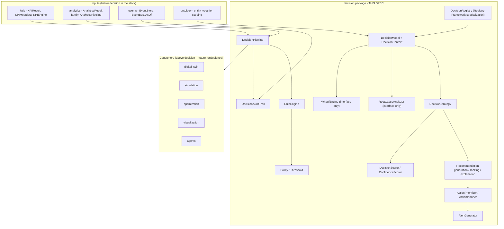
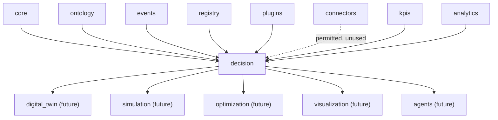
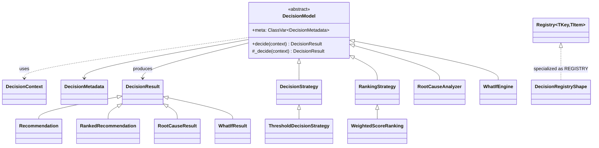
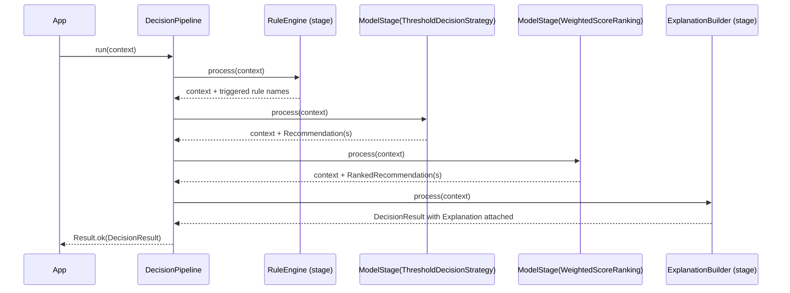
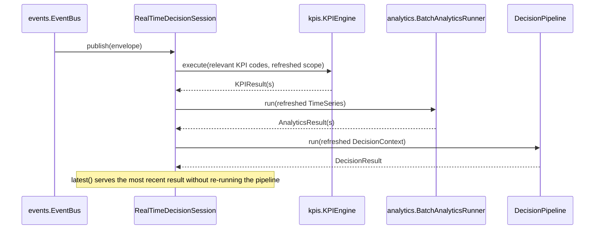

# Decision Intelligence — Design Specification

| | |
|---|---|
| **Document ID** | AH-DS-07 |
| **Package** | `mineproductivity.decision` |
| **Status** | Draft — Design Complete, Pending Implementation |
| **Version** | 1.0.0 |
| **Conforms to** | Master Architecture Handbook v1.0; Reference Implementation Blueprint v1.0; Developer & Cookbook Guide Parts I–III |
| **Builds on** | Core Foundation Library v0.2.0 (LOCKED); Event Framework spec 01 (LOCKED, `events` v0.3.0); Ontology Framework spec 02 (LOCKED, `ontology` v0.4.0); Registry Framework spec 03 (LOCKED, `registry`/`plugins` v0.5.0); Connector Framework spec 04 (LOCKED, `connectors` v0.6.0); KPI Engine spec 05 (LOCKED, `kpis` v0.7.0); Analytics Engine spec 06 (LOCKED, `analytics` v0.8.0) |
| **Author** | Chief Software Architect, MineProductivity |
| **Classification** | Public — Open Source Design Documentation |

## Document Control

Design specification only — no implementation. This document designs `mineproductivity.decision`, the second package built on top of the Foundation Layer, sitting directly above the now-locked `analytics` (spec 06). Nothing in this specification proposes, requires, or hints at a change to any file, public API, or dependency rule in `core`, `events`, `ontology`, `registry`, `plugins`, `connectors`, `kpis`, or `analytics`. Every object model, class name, and enum member cited from a lower package is taken verbatim from that package's own `__init__.py` public export list or its own governing design specification. Section numbering (1–36) mirrors the shape established by spec 06 (`analytics`): the same seven front-matter sections (Purpose through Public API), the same six closing sections (Extension Points through Future Roadmap), and, in between, twenty-three sections domain-specific to this package's own named responsibilities — the identical *documentation structure*, *validation requirements*, *terminology-consistency discipline*, *cross-reference-validation rigor*, and *per-module seven-field package-structure treatment* as spec 06, substituted only for this package's own package name, responsibilities, dependencies, and future-roadmap targets, per this task's explicit instruction to reuse that structure unchanged.

---

## 1. Purpose

Decision Intelligence answers the question `analytics` (spec 06) deliberately does not: *given a trend, a benchmark classification, a baseline, or a confidence interval, what should the business actually do about it?* `analytics` turns a correct KPI value into a statistical judgment (is it trending, is it normal, how does it compare). `decision` exists to take that judgment — or several judgments together, across metrics, sites, and time — and produce a recommended, ranked, explained, actionable decision: which situation warrants attention, what response is recommended, how urgently, and why. It is the platform's **prescriptive** layer, sitting directly above `analytics`' **descriptive** layer, and it holds no ingestion logic, no ontology or KPI definitions, no statistical computation, no optimization search, no simulation, and no machine learning — all of those already exist, one or more layers down, and are consumed rather than re-implemented (§3).

## 2. Business Objectives

1. **Turn a statistical judgment into a business action.** A `TrendResult` showing a declining OEE trend, or a `BenchmarkResult` showing a below-average fuel-per-tonne figure, is informative but silent on what to do next. Decision Intelligence exists to close that gap once, correctly, rather than asking every dashboard, report, or on-call engineer to invent their own escalation logic.
2. **Make business policy an explicit, versioned, auditable artifact**, not tribal knowledge encoded inconsistently across spreadsheets and shift-handover notes — the same "metadata/policy-as-object" discipline the platform already applies to KPIs (spec 05) and reuses here for business rules and thresholds (§12, §29).
3. **Make every recommendation explainable and traceable**, so an operator, a manager, or a future AI agent (§36) can ask "why was I told to do this" and get a structured, evidence-linked answer (§17) rather than an opaque score.
4. **Separate "what is the best recommendation" from "what should be done first"** — ranking and prioritization are related but distinct questions (§16, §20, §21), and conflating them has historically led to systems that surface the statistically most interesting finding rather than the operationally most urgent one.
5. **Support both scheduled (batch) and live (real-time) decision evaluation** from one consistent object model, so a nightly site-review report and a live control-room alert are produced by the same rule engine, the same policies, and the same confidence scoring (§25, §26).

## 3. Architectural Principles

1. **Prescriptive, not descriptive or generative.** Decision Intelligence decides what *should* happen given already-computed facts; it never computes the facts themselves (that is `analytics`/`kpis`), never searches a solution space for an optimal plan (that is `optimization`), never maintains simulated live state (that is `digital_twin`), and never trains or infers with a machine-learning model (out of scope entirely, §4).
2. **Consumption without redefinition.** Decision Intelligence never recomputes a KPI value, a trend, a benchmark classification, or a data-quality score. Any time such a value is needed, it is read from `kpis.KPIResult`/`kpis.KPIMetadata` or `analytics.AnalyticsResult` (and its subclasses) directly — never re-derived. This is the single most important boundary in this specification (§9, §33).
3. **Reuse over reinvention.** Wherever a Foundation Layer package already defines a shape — `core.BaseSpecification` (for rule composition, §10, §11), `registry.Registry`/`registry.EntryPointDiscovery` (for plugin discovery, §32), `core.Result`/`core.Maybe`, `events.AsOf` (already reserving a `scenario` field for future what-if/scenario forking, §19) — Decision Intelligence composes it rather than inventing a parallel concept. Where an existing class's *shape* fits but its *coupling* does not (e.g. `kpis.DependencyGraph` is tightly coupled to `Registry[str, type[BaseKPI]]` and `KPIMetadata.dependencies`, not to arbitrary action dependencies), this package implements its own narrow equivalent rather than forcing an ill-fitting reuse (§21, §33).
4. **Interfaces before algorithms, where the algorithm is a modeling or causal-inference choice.** Root-cause analysis and what-if simulation are each declared as a stable abstract contract now (§18, §19); no specific algorithm is chosen or shipped for either. This keeps the package strictly "business decision logic," not causal inference or simulation.
5. **Zero upward leakage.** No lower package (`core` through `analytics`) imports `decision`, mechanically enforced by the same AST-based `TestNoForbiddenDependencies` pattern every existing package already uses.
6. **Governance-weight where it belongs, not uniformly.** `Policy`/`Threshold` (§12, §13) are versioned, governed business artifacts — closer in spirit to `kpis.KPIMetadata`'s governance weight than to `analytics.AnalyticsMetadata`'s lighter touch — because a business policy, once published, is exactly the kind of "public contract" spec 05 §17 already established for KPI codes. `DecisionMetadata` (§30) for a pluggable strategy, by contrast, stays as light as `analytics.AnalyticsMetadata`, because a strategy implementation is a computational choice, not a business commitment. This package deliberately applies two different governance weights to two different kinds of artifact, rather than picking one weight for everything.
7. **One extension mechanism, platform-wide.** New rules, policies, decision strategies, ranking strategies, root-cause analyzers, or what-if engines are added exactly the way a new KPI, connector, ontology entity type, or Analytics model is added: subclass, register, discover via entry points (§31, §32). No bespoke Decision-Intelligence-specific plugin mechanism is invented.

## 4. Overall Architecture

Decision Intelligence occupies exactly one position in the platform's dependency chain — directly above `analytics`, and (as of this specification) at the top of the currently-implemented stack:

```
core → ontology → events → kpis → analytics → decision
```

Everything below `decision` exists, from its point of view, to produce well-formed inputs: `kpis.KPIEngine`/`kpis.KPIResult` for already-correct metric values, `analytics.AnalyticsResult` (and subclasses) for already-correct statistical judgments over those values, `events.EventStore`/`EventBus` for the raw event trail a decision's audit record (§27) links back to, and `ontology` entity types for scoping a decision to a specific piece of equipment, pit, or shift. Everything above `decision` (`digital_twin`, `simulation`, `optimization`, `visualization`, `agents` — all future, undesigned packages, §36) exists to consume `decision`'s outputs.



Decision Intelligence is deliberately **not** a second statistics engine competing with `analytics`, nor a second metric engine competing with `kpis`. It has no formula language, no percentile/histogram/trend-fitting logic of its own, and no KPI-code namespace — it is a business-rule and recommendation layer over facts `kpis` and `analytics` already produced.

## 5. Dependency Graph

**Permitted imports (platform layering rule, verbatim from this package's brief):** `decision` may import `mineproductivity.core`, `mineproductivity.events`, `mineproductivity.ontology`, `mineproductivity.registry`, `mineproductivity.plugins`, `mineproductivity.connectors`, `mineproductivity.kpis`, and `mineproductivity.analytics`, and nothing else.

**Actually exercised by this design:** `core` (value objects, `Result`/`Maybe`, `BaseSpecification` for rule composition, exceptions), `events` (`EventStore`/`EventBus` for audit-trail linkage and real-time evaluation, `AsOf` for what-if context framing), `ontology` (entity types for scoping a `DecisionContext`), `registry`/`plugins` (the `DecisionRegistry` specialization and entry-point discovery, §32), `kpis` (`KPIResult`, `KPIMetadata`, `Direction`), and `analytics` (`AnalyticsResult` and every subclass, `AnalyticsPipeline`, `TimeSeries`, `DataQualityScore` in particular, consumed directly by confidence scoring, §24). `connectors` is a permitted import under the platform-wide layering rule but, exactly as in `analytics` (spec 06 §5), is **not** exercised by any class in this specification — Decision Intelligence operates on already-computed `KPIResult`/`AnalyticsResult` objects, never on a vendor-specific wire format (§33).



**Depended on by (future, undesigned):** `digital_twin`, `simulation`, `optimization`, `visualization`, `agents`.

**Forbidden, mechanically enforced:**
- `decision` MUST NOT be imported by `core`, `ontology`, `events`, `registry`, `plugins`, `connectors`, `kpis`, or `analytics` — checked by an AST walk exactly like every existing package's `TestNoForbiddenDependencies` test.
- `decision` MUST NOT import `digital_twin`, `simulation`, `optimization`, `visualization`, or `agents` — those are all strictly above it and, as of this specification, do not yet exist.
- No cycle exists or is introduced: `core → ontology → events → kpis → analytics → decision` is a strict total order for every symbol this package uses.

## 6. Package Structure

```
src/mineproductivity/decision/
├── __init__.py            # public API surface (§7)
├── abstractions.py          # DecisionModel (ABC), DecisionContext
├── metadata.py                # DecisionMetadata, DecisionCategory
├── result.py                    # DecisionResult (base) and every concrete result dataclass
├── pipeline.py                    # DecisionPipeline, PipelineStage (ABC)
├── rules.py                         # Rule (type alias over core.BaseSpecification), RuleEngine, RuleEngineStage
├── policy.py                          # Policy, DecisionStatus (policy lifecycle)
├── thresholds.py                        # Threshold, ThresholdBreach
├── strategy.py                            # DecisionStrategy (ABC), ThresholdDecisionStrategy
├── recommendation.py                        # Recommendation, recommendation-producing helpers
├── ranking.py                                 # RankingStrategy (ABC), WeightedScoreRanking
├── explanation.py                               # ExplanationBuilder, ExplanationStage, Explanation
├── root_cause.py                                  # RootCauseAnalyzer (ABC) -- interface only, §18
├── what_if.py                                       # WhatIfEngine (ABC) -- interface only, §19
├── prioritization.py                                  # ActionPrioritizer, ActionPriority
├── planning.py                                          # ActionPlanner, ActionPlan
├── alerting.py                                            # AlertGenerator, Alert
├── scoring.py                                              # DecisionScorer, DecisionScore, ConfidenceScorer, ConfidenceScore
├── realtime.py                                               # RealTimeDecisionSession
├── batch.py                                                    # BatchDecisionRunner
├── audit.py                                                      # DecisionAuditTrail, DecisionAuditEntry
├── _registry.py                                                    # REGISTRY, register (Registry Framework specialization)
├── exceptions.py
└── README.md
```

Twenty-two implementation modules plus `__init__.py` and `README.md` — comparable in scale to `analytics` (spec 06 §6: twenty-one implementation modules). Every module below is specified against the same seven fields spec 06 used: Purpose, Responsibilities, Public Classes, Public Functions, Public API, Dependencies, and Extension Points.

### `abstractions.py`
- **Purpose:** the "Decision-as-object" root, mirroring `analytics.AnalyticsModel`'s shape two layers up from `kpis.BaseKPI`.
- **Responsibilities:** define the one method every registrable decision strategy implements (`_decide`); define the non-overridden orchestration wrapper (`decide`); bundle the collaborators (`EventStore`, entity scope, `AsOf`) a concrete strategy may need.
- **Public Classes:** `DecisionModel` (ABC), `DecisionContext`.
- **Public Functions:** None.
- **Public API:** `DecisionModel`, `DecisionContext`.
- **Dependencies:** `core` (`Result`), `events` (`EventStore`, `AsOf`), `kpis` (`KPIResult`), `analytics` (`AnalyticsResult`).
- **Extension Points:** every category base in `strategy.py`/`ranking.py`/`root_cause.py`/`what_if.py` subclasses `DecisionModel`.

### `metadata.py`
- **Purpose:** the minimal registration schema for a discoverable `DecisionModel` (§30).
- **Responsibilities:** carry just enough structured information for registry introspection and entry-point discovery; enforce the closed `DecisionCategory` namespace.
- **Public Classes:** `DecisionMetadata`, `DecisionCategory` (enum).
- **Public Functions:** None.
- **Public API:** `DecisionMetadata`, `DecisionCategory`.
- **Dependencies:** `core` (`BaseMetadata`, `ValidationError`).
- **Extension Points:** a new `DecisionCategory` member is a closed-enum, governance-reviewed change, mirroring `analytics.AnalyticsCategory`'s closed-enum rule (spec 06 §31).

### `result.py`
- **Purpose:** every concrete decision output type (§28).
- **Responsibilities:** define one shared envelope (`DecisionResult`) and the full family of concrete results built on it.
- **Public Classes:** `DecisionResult`, `Recommendation`, `RankedRecommendation`, `Explanation`, `Alert`, `ActionPlan`, `ActionPriority`, `DecisionScore`, `ConfidenceScore`, `RootCauseResult`, `WhatIfResult`, `ThresholdBreach`.
- **Public Functions:** None.
- **Public API:** every class listed above.
- **Dependencies:** `core` (`BaseValueObject`), `analytics` (`DataQualityScore`, referenced by `ConfidenceScore`).
- **Extension Points:** a new concrete result type is added only alongside a new category of `DecisionModel` (§31).

### `pipeline.py`
- **Purpose:** compose ordered decision-evaluation steps over one `DecisionContext` (§9).
- **Responsibilities:** run stages in order (context assembly → rule evaluation → recommendation generation → ranking → explanation); enforce that the final stage yields a `DecisionResult`; hold no strategy-specific branching, mirroring `analytics.AnalyticsPipeline`'s "holds no model logic" invariant one layer up (spec 06 §9).
- **Public Classes:** `PipelineStage` (ABC), `DecisionPipeline`, `ModelStage`.
- **Public Functions:** None.
- **Public API:** `DecisionPipeline`, `PipelineStage`, `ModelStage`.
- **Dependencies:** `core` (`Result`), this package's own `result.py`/`abstractions.py`.
- **Extension Points:** a new pipeline stage is any `PipelineStage` implementation; no change to `DecisionPipeline` itself is ever required (§9, §31).

### `rules.py`
- **Purpose:** rule evaluation (§10) via composition, not a bespoke rule language.
- **Responsibilities:** define `Rule` as a type alias over `core.BaseSpecification[DecisionContext]` (exactly the pattern `events.EventFilter = BaseSpecification[EventEnvelope[Any]]` already established); evaluate a named mapping of rules against one `DecisionContext`, isolating one rule's evaluation failure from the rest; provide the `PipelineStage` wrapper (`RuleEngineStage`) that lets `RuleEngine` compose directly into a `DecisionPipeline` (§9), mirroring `analytics.quality.DataQualityStage`'s relationship to `DataQualityScorer` (spec 06 §6).
- **Public Classes:** `RuleEngine`, `RuleEngineStage`.
- **Public Functions:** None (`Rule` is a `type` alias, not a class).
- **Public API:** `Rule`, `RuleEngine`, `RuleEngineStage`.
- **Dependencies:** `core` (`BaseSpecification`, `AndSpecification`, `OrSpecification`, `NotSpecification`, `PredicateSpecification` — all reused directly for rule composition, never re-implemented), `pipeline.py` (`PipelineStage`, which `RuleEngineStage` implements).
- **Extension Points:** a new rule is authored by composing `PredicateSpecification`/`AndSpecification`/`OrSpecification`/`NotSpecification` over `DecisionContext` fields — no change to `RuleEngine` itself is ever required.

### `policy.py`
- **Purpose:** business policies as versioned, governed artifacts (§12).
- **Responsibilities:** bundle a named set of `Rule`s, the `Threshold`s they reference, and which `DecisionStrategy`/category they activate; carry a lifecycle status.
- **Public Classes:** `Policy`, `DecisionStatus` (enum: `Proposed`/`Active`/`Superseded`/`Retired`, mirroring `kpis.KPIStatus`, spec 05 §10.2).
- **Public Functions:** None.
- **Public API:** `Policy`, `DecisionStatus`.
- **Dependencies:** `core` (`BaseValueObject`, `ValidationError`), `rules.py` (`Rule`), `thresholds.py` (`Threshold`).
- **Extension Points:** a new `Policy` is authored and registered exactly like a new KPI or Analytics model (§31, §32); an existing `Policy` is never edited in place — a changed policy is a new version with the old one moved to `Superseded` (§13, §29).

### `thresholds.py`
- **Purpose:** the declarative limit values a `Policy`'s rules reference (§13).
- **Responsibilities:** represent one comparator/limit pair (e.g. `OEE < 0.65`) and the breach event it produces when a `DecisionContext`'s relevant field crosses it.
- **Public Classes:** `Threshold`.
- **Public Functions:** None (`ThresholdBreach` is a result type, defined in `result.py`).
- **Public API:** `Threshold`.
- **Dependencies:** `core` (`BaseValueObject`, `ValidationError`).
- **Extension Points:** a new comparator kind (beyond `<`/`<=`/`>`/`>=`/`==`/`!=`) is an additive, reviewed change to `Threshold`'s comparator literal.

### `strategy.py`
- **Purpose:** the pluggable "how do we decide" abstraction (§14).
- **Responsibilities:** category base for decision-making strategies; the default, concrete, rule/threshold-driven strategy.
- **Public Classes:** `DecisionStrategy` (ABC), `ThresholdDecisionStrategy` (concrete, ships by default).
- **Public Functions:** None.
- **Public API:** `DecisionStrategy`, `ThresholdDecisionStrategy`.
- **Dependencies:** `abstractions.py` (`DecisionModel`), `rules.py`, `policy.py`, `thresholds.py`, `recommendation.py`.
- **Extension Points:** a new concrete `DecisionStrategy` subclass (§31.1) — e.g. a future strategy that weighs multiple policies against each other.

### `recommendation.py`
- **Purpose:** recommendation generation (§15).
- **Responsibilities:** produce one or more `Recommendation` result objects from a `DecisionStrategy`'s evaluation of a `DecisionContext` against an active `Policy`.
- **Public Classes:** None (the `Recommendation` type lives in `result.py`; this module holds the generation logic as methods on `ThresholdDecisionStrategy`, not a separate public class).
- **Public Functions:** None.
- **Public API:** None directly (see `strategy.py`/`result.py`).
- **Dependencies:** `result.py`, `policy.py`.
- **Extension Points:** none beyond a new `DecisionStrategy` (§31.1) — this module is not itself a registry-pluggable extension point.

### `ranking.py`
- **Purpose:** recommendation ranking (§16) — a distinct question from prioritization (§20).
- **Responsibilities:** order a `Sequence[Recommendation]` into a `Sequence[RankedRecommendation]` using `DecisionScore`.
- **Public Classes:** `RankingStrategy` (ABC), `WeightedScoreRanking` (concrete, ships by default).
- **Public Functions:** None.
- **Public API:** `RankingStrategy`, `WeightedScoreRanking`.
- **Dependencies:** `abstractions.py`, `scoring.py` (`DecisionScore`), `result.py`.
- **Extension Points:** a new concrete `RankingStrategy` subclass (§31.1).

### `explanation.py`
- **Purpose:** recommendation explanations (§17).
- **Responsibilities:** walk a `Recommendation`'s provenance (which `Rule`s fired, which `AnalyticsResult`/`KPIResult` fed it) and produce a structured `Explanation`; provide the `PipelineStage` wrapper (`ExplanationStage`) that attaches an `Explanation` to every `Recommendation`/`RankedRecommendation` already present in a `DecisionContext` by the time it runs as the pipeline's terminal stage.
- **Public Classes:** `ExplanationBuilder`, `ExplanationStage`.
- **Public Functions:** None.
- **Public API:** `ExplanationBuilder`, `ExplanationStage`.
- **Dependencies:** `result.py` (`Explanation`, `Recommendation`), `pipeline.py` (`PipelineStage`, which `ExplanationStage` implements).
- **Extension Points:** none for `ExplanationBuilder` itself — it is a concrete, non-pluggable utility; a new *kind* of evidence to cite is added to its traversal logic without changing its public signature.

### `root_cause.py`
- **Purpose:** interface-only extension point (§18) — no concrete implementation.
- **Responsibilities:** define a stable abstract contract a future plugin implements against.
- **Public Classes:** `RootCauseAnalyzer` (ABC).
- **Public Functions:** None.
- **Public API:** `RootCauseAnalyzer`.
- **Dependencies:** `abstractions.py`, `result.py` (`RootCauseResult`, for the return-type annotation only).
- **Extension Points:** the entire purpose of this module — a concrete subclass is a first-class extension (§31.2), never added inside this module itself (§33).

### `what_if.py`
- **Purpose:** interface-only extension point (§19) — no concrete implementation.
- **Responsibilities:** define a stable abstract contract for hypothetical-scenario evaluation, deliberately reusing `events.AsOf`'s already-reserved `scenario` field rather than inventing a second scenario concept.
- **Public Classes:** `WhatIfEngine` (ABC).
- **Public Functions:** None.
- **Public API:** `WhatIfEngine`.
- **Dependencies:** `abstractions.py`, `events` (`AsOf`), `result.py` (`WhatIfResult`).
- **Extension Points:** same as `root_cause.py` — interface only (§31.2, §33).

### `prioritization.py`
- **Purpose:** action prioritization (§20) — distinct from ranking (§16).
- **Responsibilities:** given a `Sequence[RankedRecommendation]`, assign each an `ActionPriority` reflecting urgency/impact/effort under limited execution capacity.
- **Public Classes:** `ActionPrioritizer`.
- **Public Functions:** None.
- **Public API:** `ActionPrioritizer`.
- **Dependencies:** `result.py` (`RankedRecommendation`, `ActionPriority`).
- **Extension Points:** a new prioritization factor (beyond urgency/impact/effort) is an additive field, reviewed the same way a new `Threshold` comparator would be.

### `planning.py`
- **Purpose:** action planning (§21) — sequencing prioritized actions respecting dependencies.
- **Responsibilities:** topologically order a set of actions with declared dependencies into an `ActionPlan`, using a narrow, self-contained ordering implementation rather than reusing `kpis.DependencyGraph` (which is coupled to `Registry[str, type[BaseKPI]]`/`KPIMetadata.dependencies`, not to arbitrary actions, §3.3, §33).
- **Public Classes:** `ActionPlanner`.
- **Public Functions:** None.
- **Public API:** `ActionPlanner`.
- **Dependencies:** `result.py` (`ActionPlan`, `ActionPriority`), `core` (`Result`).
- **Extension Points:** none — this module is deliberately closed and narrow; a genuinely more general DAG-ordering utility, if ever needed platform-wide, belongs in `core`, not duplicated here.

### `alerting.py`
- **Purpose:** alert generation (§22).
- **Responsibilities:** produce an `Alert` from a `ThresholdBreach` or a high-severity `Recommendation`.
- **Public Classes:** `AlertGenerator`.
- **Public Functions:** None.
- **Public API:** `AlertGenerator`.
- **Dependencies:** `result.py` (`Alert`, `ThresholdBreach`), `thresholds.py`.
- **Extension Points:** a new alert severity/channel classification is an additive, reviewed change.

### `scoring.py`
- **Purpose:** decision scoring and confidence scoring (§23, §24).
- **Responsibilities:** compute the numeric weight (`DecisionScore`) backing ranking; compute the trust weight (`ConfidenceScore`) backing how strongly a recommendation should be acted on, derived from `analytics.DataQualityScore` plus rule-evidence strength — never recomputed as a duplicate of Analytics' own data-quality scoring (§3.2, §24, §33).
- **Public Classes:** `DecisionScorer`, `ConfidenceScorer`.
- **Public Functions:** None.
- **Public API:** `DecisionScorer`, `ConfidenceScorer`.
- **Dependencies:** `analytics` (`DataQualityScore`), `result.py` (`DecisionScore`, `ConfidenceScore`).
- **Extension Points:** a new scoring factor is an additive, reviewed change to either scorer's inputs, not a new parallel scorer class.

### `realtime.py` / `batch.py`
- **Purpose:** the two execution modes (§25, §26).
- **Responsibilities:** `realtime.py` maintains a long-lived `events.EventBus` subscription, refreshing the relevant `KPIEngine`/`AnalyticsPipeline` outputs and re-evaluating `RuleEngine` on each new relevant event; `batch.py` runs one `DecisionPipeline` once over a bounded `DecisionContext`, for scheduled, report-style evaluation.
- **Public Classes:** `RealTimeDecisionSession` (`realtime.py`), `BatchDecisionRunner` (`batch.py`).
- **Public Functions:** None.
- **Public API:** both classes listed above.
- **Dependencies:** `events` (`EventBus`, `Subscription`), `kpis` (`KPIEngine`), `analytics` (`BatchAnalyticsRunner`, `AnalyticsPipeline`), `pipeline.py`.
- **Extension Points:** a new execution mode (e.g. a scheduled batch-of-batches runner) is a new class composing `DecisionPipeline` the same way `BatchDecisionRunner` does.

### `audit.py`
- **Purpose:** the decision audit trail (§28).
- **Responsibilities:** record every `Recommendation`/`Alert` ever generated, with full provenance back to the `Rule`s that fired, the `AnalyticsResult`/`KPIResult`s that fed it, and (where available) the originating `EventID`s.
- **Public Classes:** `DecisionAuditTrail`, `DecisionAuditEntry`.
- **Public Functions:** None.
- **Public API:** both classes listed above.
- **Dependencies:** `core` (`BaseValueObject`, `serialization`), `events` (`EventID`).
- **Extension Points:** a new audit-entry field is an additive, reviewed change; the audit trail itself is never bypassed by any pipeline stage (§33).

### `_registry.py`
- **Purpose:** the `DecisionModel` registry, following the exact pattern `analytics._registry`/`kpis._registry` established (spec 06 §33, spec 05 AD-KP-06) rather than reimplementing registration.
- **Responsibilities:** hold the process-wide `Registry[str, type[DecisionModel]]` instance; validate a non-empty `code`; reject a duplicate, non-identical re-registration.
- **Public Classes:** None.
- **Public Functions:** `register`.
- **Public API:** `REGISTRY`, `register`.
- **Dependencies:** `registry` (`Registry`), `metadata.py`, `exceptions.py`.
- **Extension Points:** none within this module itself — it is the extension mechanism (§32) other modules and third-party plugins use.

### `exceptions.py`
- **Purpose:** the package's exception hierarchy, used throughout §8–§33, mirroring `analytics.exceptions`'/`kpis.exceptions`' single-module convention (spec 06 §6, spec 05 §6).
- **Responsibilities:** define every raised error type this package's public API can produce.
- **Public Classes:**
  ```python
  class DecisionValidationError(ValidationError):
      """A DecisionMetadata, Policy, or Threshold failed validation
      (§30, §12, §13) -- e.g. an empty code, a Policy with zero rules,
      or an empty Threshold.field."""

  class NoApplicablePolicyError(NotFoundError):
      """Raised only where a caller explicitly requests raising
      behavior instead of DecisionModel.decide()'s default empty-
      recommendation result (§8) -- e.g. a BatchDecisionRunner
      configured to treat 'no policy matched' as a hard failure for a
      specific report."""

  class DecisionModelNotFoundError(NotFoundError):
      """REGISTRY.get(code) found no registered DecisionModel for
      `code` (§32)."""

  class DecisionVersionConflictError(RegistrationError):
      """A plugin attempted to re-register an existing DecisionModel
      code with materially different metadata without a version bump
      (§32), mirroring kpis.KPIVersionConflictError (spec 05 §26) and
      analytics.AnalyticsVersionConflictError (spec 06 §6)."""

  class PolicyConflictError(RegistrationError):
      """A plugin or governance action attempted to re-register an
      existing, Active Policy code with different rules/thresholds
      without a version bump and a Superseded transition for the prior
      version (§12, §29) -- the Policy-layer analogue of
      DecisionVersionConflictError, since a Policy is a separate
      governed artifact from a DecisionModel implementation (§3.6)."""
  ```
- **Public Functions:** None.
- **Public API:** all five exception classes listed above.
- **Dependencies:** `core` (`ValidationError`, `NotFoundError`), `registry` (`RegistrationError`) — each exception here subclasses the matching `core` or `registry` exception.
- **Extension Points:** a new exception type is added only alongside the specific failure mode it represents — this module does not pre-declare exceptions for capabilities that do not yet exist (e.g. no `DecisionSimulationError` exists yet, since `WhatIfEngine` ships no concrete implementation to fail, §19).

## 7. Public API

```python
from mineproductivity.decision import (
    # Abstractions
    DecisionModel, DecisionContext,
    # Metadata
    DecisionMetadata, DecisionCategory,
    # Result models
    DecisionResult, Recommendation, RankedRecommendation, Explanation, Alert,
    ActionPlan, ActionPriority, DecisionScore, ConfidenceScore,
    RootCauseResult, WhatIfResult, ThresholdBreach,
    # Pipelines
    DecisionPipeline, PipelineStage, ModelStage,
    # Rules, policies, thresholds
    Rule, RuleEngine, RuleEngineStage, Policy, DecisionStatus, Threshold,
    # Strategies
    DecisionStrategy, ThresholdDecisionStrategy,
    RankingStrategy, WeightedScoreRanking,
    # Explanation
    ExplanationBuilder, ExplanationStage,
    # Interfaces only -- no concrete implementation (§18, §19)
    RootCauseAnalyzer, WhatIfEngine,
    # Action prioritization and planning
    ActionPrioritizer, ActionPlanner,
    # Alerting and scoring
    AlertGenerator, DecisionScorer, ConfidenceScorer,
    # Execution modes
    RealTimeDecisionSession, BatchDecisionRunner,
    # Audit
    DecisionAuditTrail, DecisionAuditEntry,
    # Registry (Registry Framework specialization)
    register, REGISTRY,
    # Exceptions
    DecisionValidationError, NoApplicablePolicyError,
    DecisionModelNotFoundError, DecisionVersionConflictError, PolicyConflictError,
)
```

Every name above is intended to be **stable once implementation begins**, per the same "prefer fewer, carefully designed interfaces" discipline spec 06 §7 already applied — no speculative "maybe useful" symbol is included; each name maps directly to one of the sections below.

## 8. Decision Abstractions

```python
class DecisionContext:
    """Bundles the collaborators and scope a DecisionModel needs -- the
    decision-layer counterpart to analytics.AnalyticsContext (spec 06
    §8), one layer up. Carries the KPIResult/AnalyticsResult evidence
    already gathered, the ontology-scoped entity the decision concerns
    (e.g. a specific RigidHaulTruck or Pit), and optionally an AsOf
    (events spec 01) framing a point-in-time or hypothetical-scenario
    view for root-cause/what-if use (§18, §19)."""

    def __init__(
        self,
        *,
        kpi_results: "Sequence[KPIResult]",
        analytics_results: "Sequence[AnalyticsResult]",
        scope: "Mapping[str, str]",
        event_store: "EventStore | None" = None,
        as_of: "AsOf | None" = None,
    ) -> None: ...


class DecisionModel(ABC):
    """The root of every registrable decision strategy -- 'Decision-as-
    object,' the direct counterpart of kpis.BaseKPI and
    analytics.AnalyticsModel, one and two layers down respectively. A
    concrete leaf declares `meta: ClassVar[DecisionMetadata]` and
    implements `_decide`; everything else (input validation, result
    envelope wrapping) is inherited."""

    meta: ClassVar[DecisionMetadata]

    @abstractmethod
    def _decide(self, context: DecisionContext) -> DecisionResult:
        """Pure function: a DecisionContext in, one DecisionResult out.
        MUST NOT raise for a legitimately no-recommendation input (no
        policy applies, no threshold breached) -- return a
        DecisionResult carrying zero recommendations and, optionally, a
        warning, exactly the 'qualify, don't coerce' rule kpis.BaseKPI
        and analytics.AnalyticsModel already established."""

    def decide(self, context: DecisionContext) -> DecisionResult:
        """Non-overridden orchestration: validates `context` carries at
        least one KPIResult or AnalyticsResult to reason over, then
        calls `_decide`."""
        if not context.kpi_results and not context.analytics_results:
            return DecisionResult(
                model_code=self.meta.code,
                warnings=("no evidence in context: at least one KPIResult or AnalyticsResult required",),
            )
        return self._decide(context)
```



**Thread safety and statelessness.** Exactly like `kpis.BaseKPI` and `analytics.AnalyticsModel` (spec 05 §24, spec 06 §8), every `DecisionModel` subclass MUST be stateless across `decide()` calls, so a single instance is safe to share and invoke concurrently. `decision.REGISTRY` inherits `Registry`'s own thread-safety contract (spec 03 §24). `DecisionAuditTrail` (§27), like `analytics.IncrementalAccumulator` (spec 06 §29), is the one deliberately mutable component in this package and carries its own, separately-specified thread-safety contract (§27), not assumed from this section.

**Who assembles a `DecisionContext`.** This specification deliberately supports two distinct assembly patterns rather than picking one: for `BatchDecisionRunner` (§26) and for direct `DecisionPipeline` usage (§9's worked example), the *caller* assembles a `DecisionContext` explicitly — calling `kpis.KPIEngine.execute()` and `analytics.BatchAnalyticsRunner.run()` itself, then constructing the `DecisionContext` from the results, before ever invoking the pipeline. For `RealTimeDecisionSession` (§25), the *session itself* performs that assembly internally, on every relevant new event, because no caller is present at each triggering moment to do it by hand. Both patterns call exactly the same `kpis`/`analytics` public entry points to gather evidence (§3.2) — the only difference is who holds the reference to `KPIEngine`/`BatchAnalyticsRunner` and when the assembly call happens, not what gets called or how the resulting `DecisionContext` is shaped. A future `agents` consumer (§36) is expected to use the caller-assembles pattern, since an agent already has its own control loop deciding when to gather fresh evidence.

## 9. Decision Pipelines

A `DecisionPipeline` is an ordered sequence of `PipelineStage`s applied to one `DecisionContext` — the decision-layer equivalent of `analytics.AnalyticsPipeline` (spec 06 §9), one layer up. A typical pipeline: gather evidence (KPI/Analytics results already computed elsewhere) → evaluate rules (§10) against the active `Policy` (§12) → generate recommendations (§15) → rank them (§16) → explain them (§17).

```python
class PipelineStage(ABC):
    """One step in a DecisionPipeline. Stateless and composable -- a new
    stage never requires changing DecisionPipeline itself (§31)."""

    @abstractmethod
    def process(self, context: DecisionContext) -> DecisionContext:
        """Transform one DecisionContext into another (e.g. attaching
        rule-evaluation results) -- OR, for a terminal stage, wrap the
        context into a DecisionResult (see `ModelStage` below)."""


class ModelStage(PipelineStage):
    """A terminal stage that hands the (by now rule-evaluated) context
    to one DecisionModel and yields its DecisionResult."""

    def __init__(self, model: DecisionModel) -> None: ...


class DecisionPipeline:
    """An ordered Sequence[PipelineStage], run in order over one input
    DecisionContext."""

    def __init__(self, stages: "Sequence[PipelineStage]") -> None: ...

    def run(self, context: DecisionContext) -> Result[DecisionResult]:
        """Runs every stage in order; the last stage MUST yield a
        DecisionResult or `run` returns
        Result.err(DecisionValidationError(...))."""
```



**Worked example.** Illustrative of the intended end-to-end shape once implemented — evaluating a fleet-availability policy against a fresh `AnalyticsResult`:

```python
from mineproductivity.kpis import KPIEngine, REGISTRY as KPI_REGISTRY
from mineproductivity.analytics import BatchAnalyticsRunner, AnalyticsPipeline, ModelStage as AnModelStage, LinearTrendModel
from mineproductivity.decision import (
    DecisionContext, DecisionPipeline, ModelStage, RuleEngineStage,
    ThresholdDecisionStrategy, WeightedScoreRanking, ExplanationStage,
)

kpi_engine = KPIEngine(store=event_store, registry=KPI_REGISTRY, backend=active_backend, cache=result_cache)
oee_result = kpi_engine.execute("UTIL.OEE", window="day", scope={"day": today, "pit": "north"}).unwrap()

trend_runner = BatchAnalyticsRunner(
    pipeline=AnalyticsPipeline(stages=(AnModelStage(LinearTrendModel()),)),
    context=analytics_context,
)
trend_result = trend_runner.run(oee_series).unwrap()

context = DecisionContext(
    kpi_results=(oee_result,), analytics_results=(trend_result,),
    scope={"pit": "north", "day": today}, event_store=event_store,
)
pipeline = DecisionPipeline(stages=(
    RuleEngineStage(policy=fleet_availability_policy),
    ModelStage(ThresholdDecisionStrategy()),
    ModelStage(WeightedScoreRanking()),
    ExplanationStage(),
))

result = pipeline.run(context)
if result.is_ok:
    decision = result.unwrap()
    for ranked in decision.ranked_recommendations:
        print(ranked.recommendation.summary, ranked.score.value, ranked.recommendation.explanation.premises)
```

This example deliberately reuses `kpis.KPIEngine.execute()` and `analytics.BatchAnalyticsRunner` for every fact the pipeline reasons over (§3.2) — nothing in `decision` recomputes `UTIL.OEE` or its trend; the pipeline's only job is to decide what to do about already-correct facts.

## 10. Rule Engine

```python
type Rule = BaseSpecification["DecisionContext"]
"""Reuses core.BaseSpecification (&/|/~ composable) exactly as
events.EventFilter already does (events spec 01) -- rule evaluation is
never a bespoke DSL in this platform."""


class RuleEngine:
    """Evaluates a named mapping of Rules against one DecisionContext,
    isolating one rule's evaluation failure from the rest -- the
    decision-layer analogue of registry.EntryPointDiscovery's per-entry-
    point isolation guarantee (spec 03 §11), applied to rule
    predicates instead of plugin imports."""

    def evaluate(self, rules: "Mapping[str, Rule]", context: DecisionContext) -> "Sequence[str]":
        """Returns the names of every rule satisfied by `context`, in a
        stable (sorted) order. A single rule raising during
        `is_satisfied_by` is caught, logged, and excluded from the
        result -- never allowed to prevent evaluation of the remaining
        rules."""
```

A `Rule` is composed the same way any `core.BaseSpecification` is composed — `PredicateSpecification(lambda ctx: ctx.kpi_results[0].value < 0.65) & PredicateSpecification(lambda ctx: "north" in ctx.scope.get("pit", ""))` — using `AndSpecification`/`OrSpecification`/`NotSpecification` for combination. No new boolean-expression language is introduced anywhere in this package. A `Threshold` (§13) is not itself a `Rule` — it is the declarative data a `Policy` author uses to *construct* a `PredicateSpecification`-based `Rule` (e.g. `Threshold(field="value", comparator="<", limit=0.65)` compiles to the predicate shown above); this keeps the versioned, governed part of a `Policy` (its `Threshold` limit values) separable from the `Rule` predicate wiring, which changes only when the underlying `DecisionContext` shape itself changes.

```python
class RuleEngineStage(PipelineStage):
    """The PipelineStage wrapper composing RuleEngine into a
    DecisionPipeline -- attaches the triggered rule names to the
    DecisionContext passed downstream, so ModelStage(ThresholdDecisionStrategy())
    (§14) never has to re-run rule evaluation itself."""

    def __init__(self, *, policy: "Policy") -> None: ...

    def process(self, context: DecisionContext) -> DecisionContext: ...
```

## 11. Rule Composition

Composability is inherited entirely from `core.specification` (`AndSpecification`, `OrSpecification`, `NotSpecification`, `PredicateSpecification`) — this section exists to record, normatively, that Decision Intelligence adds **zero** new composition operators. A rule authored for one `Policy` is a plain `Rule` value and can be reused, negated, or combined into a different `Policy`'s rule set with the same `&`/`|`/`~` operators any `core.BaseSpecification` already supports, without this package defining a second composition mechanism.

## 12. Business Policies

```python
class DecisionStatus(Enum):
    """The Policy lifecycle -- mirrors kpis.KPIStatus (spec 05 §10.2)
    exactly, applied here to governed business artifacts rather than
    to individual computed results."""

    PROPOSED = "proposed"
    ACTIVE = "active"
    SUPERSEDED = "superseded"
    RETIRED = "retired"


@dataclass(frozen=True, slots=True)
class Policy(BaseValueObject):
    """A named, versioned bundle of Rules, the Thresholds they
    reference, and which DecisionStrategy/category they activate --
    the business-policy equivalent of KPIMetadata's governance weight
    (§3.6)."""

    code: str                                       # e.g. "AVAIL.LowFleetAvailability"
    version: str = field(default="1.0.0", kw_only=True)
    status: DecisionStatus = field(default_factory=lambda: DecisionStatus.PROPOSED, kw_only=True)
    rules: "Mapping[str, Rule]" = field(kw_only=True)
    thresholds: "Mapping[str, Threshold]" = field(default_factory=dict, kw_only=True)
    strategy_code: str = field(kw_only=True)         # DecisionMetadata.code of the DecisionStrategy to invoke

    def validate(self) -> None:
        if not self.code.strip():
            raise ValidationError("Policy.code must not be empty")
        if not self.rules:
            raise ValidationError(f"{self.code}: a Policy must declare at least one rule")
```

A `Policy`, once `Active`, is a public contract exactly as a KPI code is (spec 05 §17's governance rule, reapplied at this layer, §29): it is never edited in place. A changed policy is published as a new version; the prior version transitions to `Superseded`, never silently repointed — enforced by `PolicyConflictError` (§6 `exceptions.py`) raised when a plugin or governance action attempts to re-register an existing, `Active` policy code with materially different rules/thresholds without a version bump.

`Policy.strategy_code` names the `DecisionMetadata.code` of the `DecisionStrategy` (§14) that should evaluate this policy — a `Policy` is data describing *which rules matter and what to do when they fire*, while the `DecisionStrategy` it names is the code implementing *how* to turn a rule match into a `Recommendation`. This separation means a site can author and publish new policies (new rule/threshold combinations against the existing `ThresholdDecisionStrategy`) through ordinary governance review alone, without any code change or redeployment — the same "policy-as-data, strategy-as-code" split `kpis` already relies on between `KPIMetadata` (data) and `BaseKPI._compute` (code, spec 05 §10.1, §10.3). A `Policy` referencing a `strategy_code` for which no `DecisionModel` is currently registered fails validation at activation time (`DecisionModelNotFoundError`, §6), not silently at first evaluation.

## 13. Operational Thresholds

```python
@dataclass(frozen=True, slots=True)
class Threshold(BaseValueObject):
    """One declarative limit a Rule references, e.g. Threshold(
    field="value", comparator="<", limit=0.65) checked against the
    relevant KPIResult/AnalyticsResult field named by `field`."""

    field: str
    comparator: "Literal['<', '<=', '>', '>=', '==', '!=']"
    limit: float

    def validate(self) -> None:
        if not self.field.strip():
            raise ValidationError("Threshold.field must not be empty")
```

A `Threshold` is deliberately data, not code — a `Policy` can be updated to reference a new limit value through ordinary version governance (§12) without touching any `Rule`'s predicate logic, and a `ThresholdBreach` (§28) records exactly which threshold, at what observed value, was crossed, for the audit trail (§27).

`Threshold.field` is resolved against the specific `KPIResult`/`AnalyticsResult` a `Policy`'s author designates when authoring the `Threshold` (e.g. `"value"` for a bare `KPIResult.value`, or a dotted path such as `"trend.slope"` for an `analytics.TrendResult` nested inside the evidence a `DecisionContext` carries) — this package does not invent a general-purpose expression/path language for that resolution; a `Threshold`'s `field` is looked up the same straightforward way `analytics.DataQualityScorer` looks up `required_columns` against row mappings (spec 06 §25), not through a bespoke query DSL. An operational threshold is therefore always traceable to exactly one governed `Policy` version, one `KPIResult.code` or `AnalyticsResult.model_code`, and one comparator — three facts an auditor or a future AI agent (§36) can verify independently without re-deriving the decision logic that consumed them.

## 14. Decision Strategies

```python
class DecisionStrategy(DecisionModel, ABC):
    """Category base for decision-making strategies -- the pluggable
    'how do we decide' abstraction, analogous to analytics.TrendModel/
    BenchmarkModel (spec 06 §14, §13) one layer down."""


class ThresholdDecisionStrategy(DecisionStrategy):
    """The default, concrete strategy: evaluate the active Policy's
    Rules (via RuleEngine, §10) against the DecisionContext, and for
    every triggered rule whose threshold is breached, produce one
    Recommendation (§15)."""

    def __init__(self, *, policy: Policy, rule_engine: "RuleEngine | None" = None) -> None: ...

    def _decide(self, context: DecisionContext) -> "DecisionResult": ...
```

## 15. Recommendation Generation

```python
@dataclass(frozen=True, slots=True)
class Recommendation(DecisionResult):
    """One recommended action, produced by a DecisionStrategy."""

    policy_code: str
    triggered_rules: "tuple[str, ...]"
    summary: str
    severity: "Literal['low', 'medium', 'high', 'critical']"
    evidence: "tuple[str, ...]"          # KPIResult.code / AnalyticsResult.model_code references
    explanation: "Explanation | None" = field(default=None, kw_only=True)
```

`ThresholdDecisionStrategy` (§14) is the sole producer of `Recommendation` objects in this initial release — a `Recommendation` is always traceable to the specific `Policy` and `Rule` names that produced it (`policy_code`, `triggered_rules`), and to the specific `KPIResult`/`AnalyticsResult` evidence it was computed from (`evidence`), so the explanation stage (§17) never has to guess provenance after the fact.

## 16. Recommendation Ranking

```python
class RankingStrategy(DecisionModel, ABC):
    """Category base for ranking strategies -- orders candidate
    Recommendations by DecisionScore (§23). Distinct from
    ActionPrioritizer (§20): ranking answers 'which recommendation is
    best,' prioritization answers 'given limited capacity, which
    action happens first' -- conflating the two is a recorded anti-
    pattern (§33)."""


class WeightedScoreRanking(RankingStrategy):
    """The default, concrete ranking strategy: orders Recommendations
    by DecisionScore.value, descending."""

    def __init__(self, *, scorer: "DecisionScorer | None" = None) -> None: ...
```

```python
@dataclass(frozen=True, slots=True)
class RankedRecommendation(DecisionResult):
    recommendation: Recommendation
    score: "DecisionScore"
    rank: int
```

## 17. Recommendation Explanations

```python
@dataclass(frozen=True, slots=True)
class Explanation(BaseValueObject):
    """A structured, evidence-linked justification -- never opaque
    prose only. `premises` are human-readable statements; `evidence_refs`
    are the exact KPIResult.code/AnalyticsResult.model_code values a
    consuming system (including a future AI agent, §36) can re-fetch to
    verify the claim independently, exactly the same "structured
    contract over prose" rationale kpis §18 and analytics §37 already
    established for their own describe()/result types."""

    premises: "tuple[str, ...]"
    evidence_refs: "tuple[str, ...]"


class ExplanationBuilder:
    """Walks a Recommendation's triggered_rules/evidence and produces
    its Explanation. A concrete, non-pluggable utility -- not a
    DecisionModel subclass, since explanation construction is not a
    decision in itself."""

    def build(self, recommendation: Recommendation, *, context: DecisionContext) -> Explanation: ...


class ExplanationStage(PipelineStage):
    """The PipelineStage wrapper composing ExplanationBuilder into a
    DecisionPipeline as its terminal stage -- attaches an Explanation to
    every Recommendation/RankedRecommendation already produced by the
    upstream ModelStage(s), then wraps the fully-explained set into the
    final DecisionResult the pipeline returns."""

    def process(self, context: DecisionContext) -> DecisionContext: ...
```

## 18. Root-Cause Interfaces (interface only)

```python
class RootCauseAnalyzer(DecisionModel, ABC):
    """The contract a future root-cause-analysis plugin implements.
    THIS MODULE SHIPS NO CONCRETE SUBCLASS -- identifying *why* a
    threshold was breached (which upstream signal, equipment, or
    process step is the likely cause) is a causal-inference problem,
    exactly the kind of modeling decision this package's charter
    (§3.4) excludes. Defining the contract now lets a future,
    independently-versioned plugin (or a future `agents`/`digital_twin`
    capability, §36) register against a stable interface."""

    @abstractmethod
    def _analyze(self, symptom: "Recommendation | Alert", *, context: DecisionContext) -> "RootCauseResult": ...
```

```python
@dataclass(frozen=True, slots=True)
class RootCauseResult(DecisionResult):
    candidate_causes: "tuple[str, ...]"
    confidence: "ConfidenceScore"
```

## 19. What-If Interfaces (interface only)

```python
class WhatIfEngine(DecisionModel, ABC):
    """The contract a future what-if/scenario-simulation plugin
    implements. THIS MODULE SHIPS NO CONCRETE SUBCLASS -- predicting
    the outcome of a hypothetical change is a simulation/forecasting
    problem (out of scope, §3.4, §4). This interface deliberately
    reuses `events.AsOf`'s `scenario` field, which the Event Framework
    spec already reserved 'so a future scenario/what-if-forking
    capability (Digital Twin) can extend this type's usage without a
    breaking change' (events spec 01) -- WhatIfEngine is exactly that
    anticipated capability's decision-layer contract, not a new
    scenario concept."""

    @abstractmethod
    def _simulate(
        self, context: DecisionContext, hypothesis: "Mapping[str, Any]", *, as_of: "AsOf"
    ) -> "WhatIfResult": ...
```

```python
@dataclass(frozen=True, slots=True)
class WhatIfResult(DecisionResult):
    hypothesis: "Mapping[str, Any]"
    predicted_outcome: str
    confidence: "ConfidenceScore"
```

## 20. Action Prioritization

```python
@dataclass(frozen=True, slots=True)
class ActionPriority(BaseValueObject):
    urgency: float
    impact: float
    effort: float

    @property
    def priority_score(self) -> float:
        return (self.urgency * self.impact) / max(self.effort, 1e-9)


class ActionPrioritizer:
    """Given a Sequence[RankedRecommendation], assigns each an
    ActionPriority reflecting urgency/impact/effort under limited
    execution capacity -- a distinct question from ranking (§16):
    the single best recommendation is not always the one with the
    most execution capacity available to act on it right now."""

    def prioritize(self, ranked: "Sequence[RankedRecommendation]") -> "Sequence[tuple[RankedRecommendation, ActionPriority]]": ...
```

`urgency`, `impact`, and `effort` are supplied by the `Policy`/`Recommendation` that produced the candidate action (e.g. a `Policy` author declares a base `urgency` per severity level, §22; `impact` derives from the `DecisionScore` the recommendation already carries, §23; `effort` is a site-specific estimate a `Policy` or a caller supplies, since this package has no basis of its own for estimating how long an intervention takes). `ActionPrioritizer` combines these into one `priority_score`, but retains all three components on `ActionPriority` rather than collapsing them into the score alone — an operator reviewing a prioritized list can see *why* a low-impact-but-trivial-effort action outranked a high-impact-but-expensive one, the same "components carried alongside the aggregate" discipline `DecisionScore` (§23) already applies.

## 21. Action Planning

```python
class ActionPlanner:
    """Sequences a set of prioritized actions, respecting declared
    dependencies, into an ActionPlan. Implements its own narrow
    topological ordering rather than reusing kpis.DependencyGraph,
    which is tightly coupled to Registry[str, type[BaseKPI]] and
    KPIMetadata.dependencies -- a shape that does not fit arbitrary
    action-to-action dependencies (§3.3, §34)."""

    def plan(
        self, prioritized: "Sequence[tuple[RankedRecommendation, ActionPriority]]",
        *, dependencies: "Mapping[str, tuple[str, ...]]" = MappingProxyType({}),
    ) -> Result["ActionPlan"]: ...
```

```python
@dataclass(frozen=True, slots=True)
class ActionPlan(DecisionResult):
    ordered_actions: "tuple[Recommendation, ...]"
    priorities: "Mapping[str, ActionPriority]"
```

`dependencies` is an optional, caller-supplied mapping from an action's identifying key to the keys it depends on (e.g. "replace conveyor belt" before "resume full-rate crushing") — when empty (the default), `ActionPlanner.plan` degrades to simply ordering actions by `priority_score`, so a caller with no dependency information to supply pays no complexity cost. `plan` returns `Result.err` on a detected cycle rather than silently dropping or arbitrarily breaking it — the same "fail loudly on a cycle" posture `kpis.DependencyGraph.detect_cycle` already established for KPI dependencies (spec 05 §10.8), applied here to `decision`'s own, structurally different dependency shape (§3.3).

## 22. Alert Generation

```python
@dataclass(frozen=True, slots=True)
class Alert(DecisionResult):
    message: str
    severity: "Literal['low', 'medium', 'high', 'critical']"
    scope: "Mapping[str, str]"
    triggered_by: "ThresholdBreach | None" = field(default=None, kw_only=True)


class AlertGenerator:
    """Produces an Alert from a ThresholdBreach (§13) or a high-severity
    Recommendation (§15). A concrete, non-pluggable utility -- alert
    *channel* delivery (email, SMS, dashboard push) is explicitly out
    of scope for this package (§4); AlertGenerator produces the Alert
    value object only, never sends it anywhere."""

    def from_breach(self, breach: "ThresholdBreach") -> Alert: ...
    def from_recommendation(self, recommendation: Recommendation) -> "Alert | None": ...
```

## 23. Decision Scoring

```python
@dataclass(frozen=True, slots=True)
class DecisionScore(BaseValueObject):
    value: float
    components: "Mapping[str, float]"        # named contributing factors, for auditability


class DecisionScorer:
    """Computes the numeric weight (DecisionScore) backing ranking
    (§16) -- a function of severity, policy weight, and (optionally)
    ConfidenceScore (§24), never of raw KPI/Analytics values directly
    re-interpreted."""

    def score(self, recommendation: Recommendation, *, confidence: "ConfidenceScore | None" = None) -> DecisionScore: ...
```

## 24. Confidence Scoring

```python
@dataclass(frozen=True, slots=True)
class ConfidenceScore(BaseValueObject):
    value: float                              # 0.0-1.0
    basis: "Literal['data_quality', 'rule_strength', 'combined']"


class ConfidenceScorer:
    """Computes ConfidenceScore, deriving from
    analytics.DataQualityScore (spec 06 §25) plus how many/which rules
    corroborated a Recommendation -- never recomputing data quality
    itself (§3.2). If no DataQualityScore is available in the
    DecisionContext's evidence, ConfidenceScorer falls back to
    'rule_strength' basis only, and the resulting ConfidenceScore
    records which basis was used so a consumer can distinguish 'we
    checked data quality and it was good' from 'we had no data-quality
    signal to check.'"""

    def score(self, recommendation: Recommendation, *, context: DecisionContext) -> ConfidenceScore: ...
```

## 25. Real-Time Decision Evaluation

```python
class RealTimeDecisionSession:
    """A long-lived session that subscribes to an events.EventBus and,
    on each new relevant envelope, refreshes the necessary
    kpis.KPIEngine/analytics.BatchAnalyticsRunner outputs and re-runs a
    DecisionPipeline over the refreshed DecisionContext -- the live-
    operations-center counterpart of BatchDecisionRunner (§26), mirroring
    analytics.StreamingAnalyticsSession's role one layer down (spec 06
    §27). RealTimeDecisionSession composes KPIEngine/BatchAnalyticsRunner
    rather than recomputing anything itself (§3.2)."""

    def __init__(
        self, *, bus: "EventBus", pipeline: DecisionPipeline,
        kpi_engine: "KPIEngine", analytics_runner: "BatchAnalyticsRunner",
    ) -> None: ...

    def start(self) -> "Subscription": ...
    def latest(self, scope: "Mapping[str, str]") -> "DecisionResult | None": ...
```



## 26. Batch Decision Evaluation

```python
class BatchDecisionRunner:
    """Runs one DecisionPipeline once over a bounded, already-assembled
    DecisionContext -- the 'normal,' scheduled-report mode, in contrast
    to RealTimeDecisionSession's live, event-driven mode (§25). A thin,
    named wrapper over DecisionPipeline.run (§9), exactly mirroring
    analytics.BatchAnalyticsRunner's relationship to AnalyticsPipeline
    (spec 06 §28)."""

    def __init__(self, *, pipeline: DecisionPipeline) -> None: ...

    def run(self, context: DecisionContext) -> Result[DecisionResult]: ...
```

## 27. Decision Audit Trail

```python
@dataclass(frozen=True, slots=True)
class DecisionAuditEntry(BaseValueObject):
    recorded_at: datetime
    result: DecisionResult
    context_scope: "Mapping[str, str]"
    source_event_ids: "tuple[str, ...]"        # events.EventID.value, where traceable


class DecisionAuditTrail:
    """Append-only record of every DecisionResult ever produced by any
    DecisionPipeline run in this process -- the accountability
    mechanism a business-decision system requires that a purely
    statistical one (analytics) does not as urgently. Serializes via
    core.serialization exactly as every other value object in this
    platform does."""

    def record(self, entry: DecisionAuditEntry) -> None: ...
    def query(self, *, scope: "Mapping[str, str] | None" = None) -> "Sequence[DecisionAuditEntry]": ...
```

**Thread safety.** Like `analytics.IncrementalAccumulator` (spec 06 §29), `DecisionAuditTrail` is deliberately mutable (`record()` appends). It is expected to serialize concurrent `record()` calls internally (e.g. an append-only lock), so that `RealTimeDecisionSession` (§25) and `BatchDecisionRunner` (§26) can share one trail instance safely; `query()` is read-only and never blocks on a concurrent `record()` beyond whatever the chosen synchronization strategy requires.

**What "traceable" means in practice.** `DecisionAuditEntry.source_event_ids` is populated on a best-effort basis: it is straightforward to populate when a `DecisionContext`'s `event_store` field (§8) was used to construct the `KPIResult`/`AnalyticsResult` evidence in the same call chain (the relevant `EventID`s are already known to whichever `EventQuery` produced those results), but is legitimately empty when a `DecisionContext` was assembled from evidence gathered elsewhere (e.g. a `KPIResult` a caller computed hours earlier and passed in directly). An empty `source_event_ids` tuple is not an error — `DecisionAuditEntry.result`, `context_scope`, and `recorded_at` alone already satisfy this package's accountability objective (§2.2) by recording *what* was decided, *for what scope*, *when*, and (via `Recommendation.evidence`/`Explanation.evidence_refs`, §15, §17) *from which KPI/Analytics facts* — event-level traceability is an additional, not a required, layer of provenance.

## 28. Result Models

```python
@dataclass(frozen=True, slots=True)
class DecisionResult(BaseValueObject):
    """The shared envelope every concrete decision output composes --
    mirrors analytics.AnalyticsResult's role (spec 06 §30), one layer
    up."""

    model_code: str = field(default="", kw_only=True)
    computed_at: datetime = field(default_factory=lambda: datetime.now(timezone.utc), kw_only=True)
    warnings: "tuple[str, ...]" = field(default=(), kw_only=True)
```

Every result type this specification defines — `Recommendation` (§15), `RankedRecommendation` (§16), `ActionPlan` (§21), `Alert` (§22), `RootCauseResult` (§18), `WhatIfResult` (§19) — subclasses `DecisionResult`. `Explanation` (§17), `DecisionScore` (§23), `ConfidenceScore` (§24), `ActionPriority` (§20), `Threshold` (§13), and `ThresholdBreach` are deliberately plain `BaseValueObject`s, not `DecisionResult` subclasses, since each represents a supporting value *attached to* a decision output rather than a decision output itself — the same distinction spec 06 §30 already drew between `AnalyticsResult` and `AnomalyFlag`/`OutlierFlag`.

```python
@dataclass(frozen=True, slots=True)
class ThresholdBreach(BaseValueObject):
    threshold: Threshold
    observed_value: float
    breached_at: datetime
```

**Serialization.** Every `DecisionResult` subclass, like every `AnalyticsResult`/`KPIResult` subclass before it, serializes via `core.serialization` (`DataclassSerializer`/`to_dict`) with no bespoke per-type serializer, which is what lets `DecisionAuditTrail` (§27) persist entries uniformly and what lets a future `digital_twin`/`agents` consumer (§36) treat any decision output as plain, schema-stable structured data.

## 29. Decision Lifecycle and Versioning

Two independent lifecycles apply, mirroring the split spec 05 §11 already drew between a KPI's *type* lifecycle and a `KPIResult` *instance*'s lifecycle:

1. **`Policy` lifecycle** (`DecisionStatus`, §12): `Proposed → Active → Superseded → Retired`. An `Active` policy is a public contract; changing its rules/thresholds without a version bump and a `Superseded` transition for the prior version raises `PolicyConflictError` at registration time, never silently.
2. **`DecisionResult` instance lifecycle**: computed on demand by a `DecisionPipeline` run, recorded to `DecisionAuditTrail` (§27), never mutated once produced (it is a `BaseValueObject`).

`DecisionMetadata.version` (§30) governs a registered `DecisionModel` implementation's own SemVer, independently of any `Policy`'s version — a `DecisionStrategy` implementation and the `Policy` data it evaluates are versioned separately, exactly as `kpis.ExecutionBackend` implementations version independently of `KPIMetadata.version` (spec 05 §10.9, §20).

## 30. Decision Metadata

```python
class DecisionCategory(Enum):
    """Closed enum -- adding a member is a governance-reviewed change,
    mirroring analytics.AnalyticsCategory's closed-enum rule (spec 06
    §31)."""

    STRATEGY = "strategy"
    RANKING = "ranking"
    ROOT_CAUSE = "root_cause"
    WHAT_IF = "what_if"


@dataclass(frozen=True, slots=True)
class DecisionMetadata(BaseMetadata):
    """The minimal registration schema for a discoverable DecisionModel
    -- as light as analytics.AnalyticsMetadata (spec 06 §31), not as
    heavy as kpis.KPIMetadata, because a DecisionModel implementation is
    a computational strategy, not itself the governed business artifact
    (that weight belongs to Policy, §12, §3.6)."""

    code: str
    category: DecisionCategory = field(kw_only=True)
    description: str = field(kw_only=True)
    version: str = field(default="1.0.0", kw_only=True)

    def validate(self) -> None:
        if not self.code.strip():
            raise ValidationError("DecisionMetadata.code must not be empty")
```

## 31. Extension Points

1. **New concrete strategy within an existing category.** Subclass `DecisionStrategy` or `RankingStrategy`, complete `DecisionMetadata`, implement `_decide`, decorate with `@register` (§32). No existing model class is ever edited to add a new one.
2. **A concrete root-cause or what-if implementation.** Subclass `RootCauseAnalyzer`/`WhatIfEngine` (§18, §19) — the first such subclass to exist, whether first-party or third-party, is exactly as "first-class" as any built-in model; the ABC makes no distinction.
3. **A new `PipelineStage`.** Any class implementing `PipelineStage.process` composes into a `DecisionPipeline` (§9) without any change to `DecisionPipeline` itself.
4. **A new `Policy`.** Authored and registered like any other governed artifact (§12) — no code change required to add a new business policy.
5. **A new `DecisionCategory`.** A closed-enum change requiring governance (§30), mirroring `analytics.AnalyticsCategory`'s precedent (spec 06 §31) and `kpis.Aggregation`'s (spec 05 §16.4).

## 32. Plugin Integration

Identical mechanism to every other extension point in the platform, specialized for Decision Intelligence exactly as `analytics._registry`/`kpis._registry` specialize it (spec 06 §33, spec 05 AD-KP-06):

```python
# decision/_registry.py
from mineproductivity.registry import Registry

REGISTRY: "Registry[str, type[DecisionModel]]" = Registry(name="decision")

def register(cls: "type[DecisionModel]") -> "type[DecisionModel]":
    """Register cls into REGISTRY, keyed by cls.meta.code -- same shape
    as analytics.register/kpis.register, raising DecisionValidationError
    for an empty code and DecisionVersionConflictError for a duplicate,
    non-identical re-registration."""
```

```toml
[project.entry-points."mineproductivity.decision"]
sitepack = "mineproductivity_sitepack.decision"
```

Discovery uses `registry.EntryPointDiscovery`/`registry.EntryPointSpec` (spec 03) exactly as `kpis`, `connectors`, and `analytics` already do — `EntryPointSpec(group="mineproductivity.decision", target_registry="decision")` — with the identical per-entry-point isolation guarantee (spec 03 §11).

## 33. Anti-Patterns

- ❌ **Recomputing or reinterpreting a KPI value or an Analytics result inside `decision`** instead of reading `kpis.KPIResult`/`analytics.AnalyticsResult` directly. If a fact is KPI- or Analytics-shaped, it comes from that layer, full stop (§3.2).
- ❌ **Writing ad hoc `if`/`else` business logic scattered across `DecisionStrategy` subclasses** instead of composing `Rule`s via `core.BaseSpecification` (§10, §11) — rule logic belongs in composable, inspectable `Rule` values, not in imperative branches buried in a strategy's `_decide`.
- ❌ **Shipping a concrete `RootCauseAnalyzer`/`WhatIfEngine` implementation** in this package. Both are interfaces only, by explicit design (§18, §19); adding a concrete subclass here is a scope violation of the causal-inference/simulation boundary, not a convenience.
- ❌ **Forcing `ActionPlanner` to reuse `kpis.DependencyGraph`** by encoding actions as fake KPI codes merely to reuse its topological-sort code. `kpis.DependencyGraph` is coupled to `Registry[str, type[BaseKPI]]`/`KPIMetadata.dependencies`; `ActionPlanner` implements its own narrow ordering instead (§3.3, §21).
- ❌ **Conflating ranking (§16) with prioritization (§20).** "The statistically best recommendation" and "what should be done first given limited capacity" are different questions with different inputs; a single combined score collapsing both loses the ability to reason about either independently.
- ❌ **Editing an `Active` `Policy` in place** instead of publishing a new version and moving the prior one to `Superseded` (§12, §29) — identical rule to never silently repointing a KPI code (spec 05 §17).
- ❌ **Importing `mineproductivity.connectors` for anything beyond the permitted-but-unexercised layering rule** (§5) — `decision` operates on already-computed `KPIResult`/`AnalyticsResult` objects, never on a vendor-specific wire format.
- ❌ **A `_decide` implementation raising an exception for a legitimately no-recommendation input** (no policy applies) instead of returning a `DecisionResult` with zero recommendations (§8) — identical rule to `kpis.BaseKPI.compute()`/`analytics.AnalyticsModel.analyze()`.
- ❌ **Bypassing `DecisionAuditTrail`** for any `DecisionPipeline` run whose output could plausibly inform a real operational action — an unaudited recommendation is, per this package's accountability objective (§2.2), not meaningfully different from an unregistered KPI code (spec 05 §32: "if it is worth reporting, it is worth registering," reapplied here as "if it is worth acting on, it is worth auditing").
- ❌ **Producing a `Recommendation` with no `evidence` and no `Explanation`.** Every `Recommendation` traces to at least one `KPIResult.code`/`AnalyticsResult.model_code` and, by the time a `DecisionPipeline` finishes, has a populated `Explanation` (§15, §17) — a recommendation a `DecisionStrategy` cannot justify with a specific piece of evidence is a sign the triggering `Rule` was too loosely written, not a reason to ship the recommendation unexplained.
- ❌ **Treating `ActionPriority`'s `priority_score` as the only number that matters** and discarding `urgency`/`impact`/`effort` once computed (§20) — the components are part of the public contract precisely so a human reviewing a prioritized list can audit the arithmetic, not merely trust it.
- ❌ **Sending an `Alert` to an external channel from inside `AlertGenerator`.** `AlertGenerator` produces the `Alert` value object only (§22); channel delivery (email, SMS, a dashboard push) is a caller's or a future package's responsibility, kept out of this package precisely so `AlertGenerator` remains a pure, easily-tested function with no I/O side effects.

## 34. Testing Philosophy

Decision Intelligence's testing strategy follows the same layered structure `kpis` and `analytics` established (spec 05 §29, spec 06 §35), adapted to this package's shape:

- **Unit tests per concrete strategy** — `ThresholdDecisionStrategy`, `WeightedScoreRanking` each tested against hand-authored `Policy`/`Threshold` fixtures with known expected `Recommendation`/`RankedRecommendation` outputs.
- **Rule composition tests** — `Rule` values composed via `&`/`|`/`~` tested for correct boolean semantics over synthetic `DecisionContext`s, reusing `core.specification`'s own test patterns rather than inventing new ones.
- **Policy governance tests** — `PolicyConflictError` raised for a re-registration attempt that changes an `Active` policy's rules/thresholds without a version bump and a `Superseded` transition.
- **Confidence-scoring correctness tests** — `ConfidenceScorer.score` tested against a `DecisionContext` with and without a `DataQualityScore` present in its evidence, asserting the correct `basis` ("data_quality" vs. "rule_strength") is recorded in each case.
- **Registry/discovery isolation tests** — mirror `tests/integration/test_registry_plugin_discovery.py`'s healthy/broken fixture-plugin pattern, specialized for `DecisionModel`.
- **Interface-only module tests** — `RootCauseAnalyzer`/`WhatIfEngine` tested only for their ABC contract (bare-ABC instantiation raises `TypeError`); no algorithmic-correctness test exists for either.
- **Action-planning ordering tests** — `ActionPlanner.plan` tested against a synthetic action-dependency graph, proving correct topological ordering and correct rejection of a cyclic dependency set.
- **Real-time/batch parity tests** — `RealTimeDecisionSession.latest()` and a `BatchDecisionRunner` run over the same assembled context produce the same `DecisionResult`, within the same tolerance `analytics`' own streaming/batch parity tests already establish (spec 06 §35).

**Package acceptance proofs**, mirroring spec 06 §35's shape one layer up:

1. **No fact-recomputation proof:** a static analysis of every module in `src/mineproductivity/decision/` contains zero direct reads of raw event rows or independent KPI/statistical computation — every KPI-shaped or Analytics-shaped value entering this package's tests arrives via `kpis.KPIEngine`/`analytics.BatchAnalyticsRunner` or a fixture standing in for them.
2. **Rule-isolation proof:** a single malformed `Rule` (one whose predicate raises) never prevents `RuleEngine.evaluate` from correctly evaluating the remaining rules in the same `Policy`.
3. **Interface-purity proof:** `RootCauseAnalyzer` and `WhatIfEngine` each have zero concrete, non-test subclasses anywhere in `src/mineproductivity/decision/`.
4. **No architectural drift:** `decision` appears in the platform's dependency graph exactly per §5; the forbidden-imports check (no lower package imports `decision`; `decision` imports nothing above itself) passes mechanically.
5. **Audit completeness proof:** every `DecisionResult` produced by a `DecisionPipeline` run in a certification fixture has a corresponding `DecisionAuditEntry`.

## 35. Performance Considerations

- **No independent large-scale computation** — `decision` never scans raw events or recomputes statistics; its performance profile is dominated by rule evaluation over already-small `DecisionContext` objects (a handful of `KPIResult`/`AnalyticsResult` values per decision), not by the volume `kpis`/`analytics` themselves must handle.
- **`RealTimeDecisionSession` reuses, never duplicates, `kpis`/`analytics`' own performance postures** (§25) — it delegates to `KPIEngine.execute()` (column-pruned, cached per spec 05 §22) and `BatchAnalyticsRunner` (delegating to `ExecutionBackend`/`IncrementalAccumulator` per spec 06 §36) rather than re-fetching or re-aggregating raw data itself.
- **`DecisionAuditTrail` append cost is O(1) per entry**; `query()` is expected to support scope-based filtering without a full linear scan at production audit-trail sizes, the same "do not assume small-N forever" posture spec 06 §36 already establishes for its own accumulators.
- **`ActionPlanner`'s topological sort is O(V+E)** over the declared action-dependency graph, the standard complexity bound for topological ordering, with no hidden re-computation across repeated `plan()` calls for the same input.
- **`RuleEngine.evaluate` is O(R)** in the number of rules in the active `Policy`, each a single `is_satisfied_by` call over one already-assembled `DecisionContext` — there is no scan over historical decisions or historical events in the rule-evaluation path itself; history, where relevant, arrives pre-summarized as an `AnalyticsResult` (a `Baseline` or `TrendResult`, spec 06 §14–§15) rather than being re-scanned by a `Rule`.
- **`Policy` lookup is registry-speed, not file-speed** — an `Active` `Policy` is held in memory (via `decision.REGISTRY` or an equivalent policy store keyed the same way), so evaluating a `DecisionContext` against it never involves a disk or network round-trip on the hot path; publishing a new `Policy` version (§12, §29) is an infrequent, out-of-band operation, not something `RuleEngineStage.process` pays for on every pipeline run.

## 36. Future Roadmap

This section describes **extension points only** for packages that do not yet exist and are explicitly out of scope for design in this document. No object model, API, or dependency for any of the following packages is proposed here.

```mermaid
flowchart BT
    subgraph locked["Locked Foundation Layer + analytics + decision (this spec)"]
        CORE[core] --> ONT[ontology] --> EVT[events] --> KPI[kpis] --> AN[analytics] --> DEC[decision]
    end
    subgraph future["Future, undesigned -- extension points only"]
        TWIN[digital_twin]
        SIM[simulation]
        OPT[optimization]
        VIZ[visualization]
        AGENTS[agents]
    end
    DEC -.WhatIfEngine ABC + events.AsOf.scenario hook, §19.-> TWIN
    DEC -.ActionPlan / RealTimeDecisionSession, §21 §25.-> SIM
    DEC -.ActionPriority / DecisionScore, §20 §23.-> OPT
    DEC -.stable DecisionResult family, §28.-> VIZ
    DEC -.Explanation / RootCauseAnalyzer ABC, §17 §18.-> AGENTS
```

- **`digital_twin`** is the most direct consumer of the `WhatIfEngine` interface (§19): a live simulated-state twin is exactly the kind of capability positioned to implement `_simulate` against `events.AsOf`'s already-reserved `scenario` field — the extension point this package exposes is that the interface and the `AsOf` hook both already exist, waiting for that implementation.
- **`simulation`** will likely consume `ActionPlan` (§21) as a candidate sequence of interventions to simulate forward, and may drive `RealTimeDecisionSession` (§25) with simulated rather than real events — the extension point is that neither type carries any `decision`-internal state that would prevent this.
- **`optimization`** will likely consume `ActionPriority`/`DecisionScore` (§20, §23) as objective-function inputs when searching for an optimal action sequence across many competing `Recommendation`s — the extension point is that both are plain, serializable value objects.
- **`visualization`** will likely render the `DecisionResult` family (§28) directly — the extension point is that every result type already serializes via `core.serialization` with no bespoke per-type contract to learn.
- **AI Agents** (a future `agents` package) will likely consume `Explanation` (§17) as the structured, evidence-linked justification an agent needs to act autonomously or to explain its own action to a human, and may eventually be the first implementer of `RootCauseAnalyzer` (§18) — the extension point is that both already return structured, machine-readable objects rather than prose, exactly the rationale `kpis` §18 and `analytics` §37 already established one and two layers down.

None of the five items above constitutes a design for `digital_twin`, `simulation`, `optimization`, `visualization`, or `agents` — each is restricted to naming which of *this* package's already-specified public types that future package is expected to consume.

Notably, `optimization` and `simulation` are positioned to consume this package's outputs (`ActionPlan`, `ActionPriority`) rather than the reverse — this specification does not anticipate `decision` ever needing to call into a future `optimization`/`simulation` package, since doing so would violate the same "decision reasons over already-produced facts, never generates them" principle (§3.1) this package already applies to `analytics`/`kpis`. If a future need arises for `decision` to consume an optimizer's or a simulator's output as an *input* to a recommendation (e.g. "the optimizer found a better shift schedule; recommend it"), that input would arrive the same way `kpis.KPIResult`/`analytics.AnalyticsResult` already do today — as a well-formed value object `DecisionContext` carries — and would not require `decision` to import a package above it in the stack.

---

*End of Decision Intelligence Design Specification. See [`docs/design/07_Decision_Intelligence_Implementation_Checklist.md`](../design/07_Decision_Intelligence_Implementation_Checklist.md) for the actionable implementation contract, and [`docs/adr/ADR-0007-Decision-Intelligence.md`](../adr/ADR-0007-Decision-Intelligence.md) for the architecture decision record governing this package's existence as a separate layer.*
