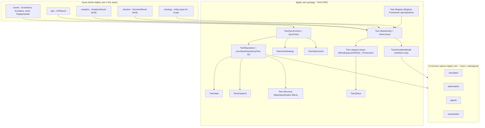
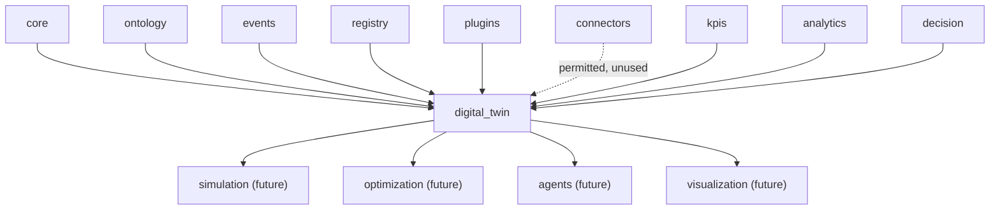
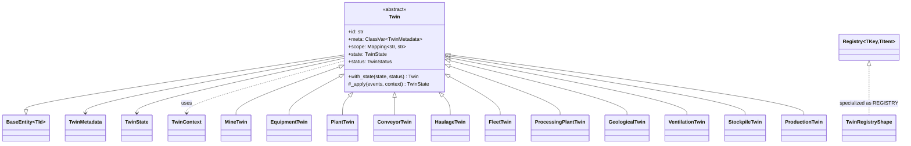
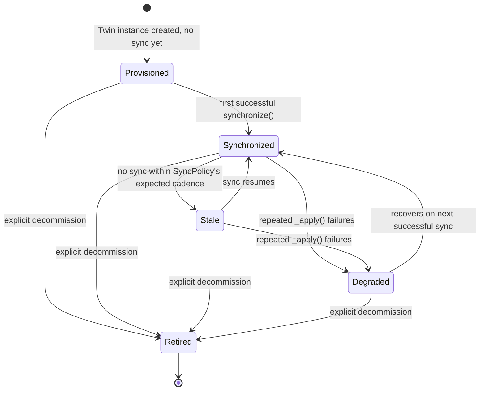
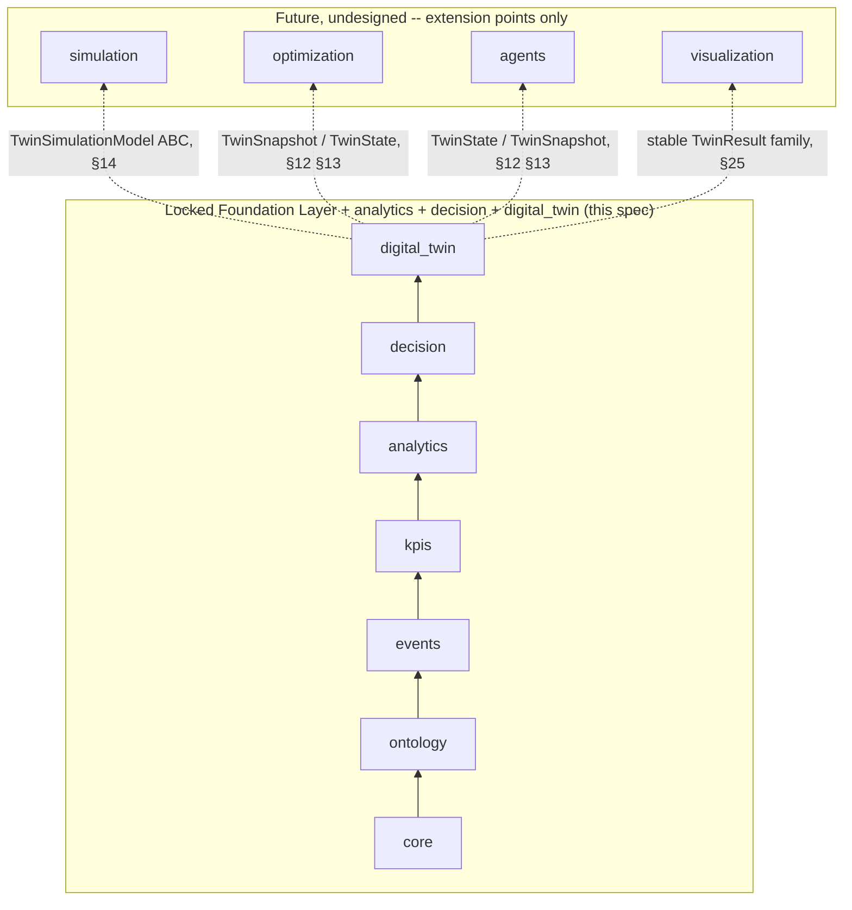

# Digital Twin - Design Specification

| | |
|---|---|
| **Document ID** | AH-DS-08 |
| **Package** | `mineproductivity.digital_twin` |
| **Status** | Draft - Design Complete, Pending Implementation |
| **Version** | 1.0.0 |
| **Conforms to** | Master Architecture Handbook v1.0; Reference Implementation Blueprint v1.0; Developer & Cookbook Guide Parts I-III |
| **Builds on** | Core Foundation Library v0.2.0 (LOCKED); Event Framework spec 01 (LOCKED, `events` v0.3.0); Ontology Framework spec 02 (LOCKED, `ontology` v0.4.0); Registry Framework spec 03 (LOCKED, `registry`/`plugins` v0.5.0); Connector Framework spec 04 (LOCKED, `connectors` v0.6.0); KPI Engine spec 05 (LOCKED, `kpis` v0.7.0); Analytics Engine spec 06 (LOCKED, `analytics` v0.8.0); Decision Intelligence spec 07 (LOCKED, `decision` v0.9.0) |
| **Author** | Chief Software Architect, MineProductivity |
| **Classification** | Public - Open Source Design Documentation |

## Document Control

Design specification only - no implementation. This document designs `mineproductivity.digital_twin`, the third package built on top of the Foundation Layer, sitting directly above the now-locked `decision`. Nothing in this specification proposes, requires, or hints at a change to any file, public API, or dependency rule in `core`, `events`, `ontology`, `registry`, `plugins`, `connectors`, `kpis`, `analytics`, or `decision`. Every object model, class name, and enum member cited from a lower package is taken verbatim from that package's own `__init__.py` public export list or its own governing design specification. Section numbering below (1-34) is locked before drafting and does not change during it: seven front-matter sections (Purpose through Public API), nineteen sections domain-specific to this package's own required topics (Twin Abstractions through Metadata), and eight closing sections (Extension Points through Future Roadmap) - the same *documentation structure*, *validation requirements*, *terminology-consistency discipline*, and *per-module seven-field package-structure treatment* as specs 06 and 07, substituted for this package's own package name, responsibilities, dependencies, and future-roadmap targets.

Cross-references to spec 06 (`analytics`) in this document are given as plain-text citations (`spec 06 §N`), never as Markdown links: `06_Analytics_Engine_Design_Specification.md` exists only on the as-yet-unmerged `feature/analytics-engine` branch, not on `main`, and a Markdown link to a file absent from the current branch is a broken link (this exact failure mode was found and fixed in `ADR-0007-Decision-Intelligence.md`'s header table earlier in this series). Cross-references to spec 07 (`decision`), which **is** present on `main`, are given as ordinary Markdown links where appropriate.

---

## 1. Purpose

Digital Twin answers a question none of the six packages below it were ever meant to answer: *what is the current, holistic condition of this physical asset, operation, or process, and how do we keep that understanding synchronized with reality over time?* `kpis` computes a single metric's value; `analytics` characterizes a series of such values statistically; `decision` turns a statistical judgment into a recommended action - all three are point-in-time or series-oriented computations over already-recorded facts. Digital Twin is different in kind: it is the platform's **stateful representation layer**, holding a continuously-updated virtual counterpart of a mine, a piece of equipment, a plant, a conveyor, a fleet, or another real-world system, synchronized from the immutable event stream `events` already owns, and exposing that representation - plus an interface for simulating hypothetical futures over it - to whatever consumes it next. It holds no KPI formulas, no statistical computation, no business-decision logic, no optimization search, and no AI-agent reasoning - all of those already exist, one or more layers down, and are consumed rather than re-implemented (§3).

"Digital twin," in this specification, names a specific, narrow contract, not the broader industry buzzword: a `Twin` is a versioned, registered, identity-bearing object whose state is a provable projection of the event log, discoverable through the same registry mechanism every other domain concept in this platform already uses, and persisted through the same repository contract `core` already defines. Where a vendor's "digital twin" product might bundle simulation, optimization, and visualization into one monolithic offering, this package deliberately narrows the term to its representational core (§4) and defines stable interfaces at every point a broader capability would otherwise need to be bolted on directly.

## 2. Business Objectives

1. **Give every mining asset and process a single, authoritative virtual counterpart** - one `Twin` per real-world thing, not a different ad hoc in-memory representation per dashboard or report that each drifts independently from the others.
2. **Keep that counterpart synchronized from the event stream, never from a side channel.** A twin's state is always a projection of `events.EventStore`'s immutable log (§11, §15) - the same "any number the platform ever produces can be recomputed from the events that produced it" guarantee `events` spec 01 §1 already makes, extended to stateful representations rather than only to point-in-time computations.
3. **Make "what does this asset currently look like" and "what did this asset look like at time T" equally first-class questions** - `TwinState` (current, §12) and `TwinSnapshot` (historical, §13) are deliberately distinct, so neither need be approximated by the other.
4. **Provide one shared extension point for hypothetical-future reasoning about a twin** (`TwinSimulationModel`, §14), so a future `simulation`/`optimization`/`agents` package does not each invent its own notion of "what if we changed this."
5. **Support both cold-start reconstruction from history and live, incremental synchronization** from one consistent object model (§11, §15), so a newly-provisioned twin and a twin that has been running for months are governed by the same rules.
6. **Make it structurally impossible to lose track of which twin a piece of state belongs to.** Reusing `core.BaseEntity`'s identity discipline (§3.3, §8) means a `Twin`'s `id` is load-bearing and permanent for as long as the twin exists - no code path in this package can accidentally merge, split, or silently reassign a twin's identity, a class of bug that has historically plagued ad hoc "digital twin" implementations built on plain mutable objects with loosely-enforced keys.

## 3. Architectural Principles

1. **Representation, not computation.** Digital Twin represents facts already computed or decided elsewhere; it never computes a KPI, never performs statistical analysis, never decides a business action, never optimizes, never simulates with a real solver, and never reasons as an AI agent (out of scope entirely, §4). Where a capability is deliberately deferred to a future package, this design defines an interface for it (`TwinSimulationModel`, §14) rather than a placeholder implementation.
2. **Consumption without redefinition.** Digital Twin never recomputes a KPI value, a statistical judgment, or a recommendation. `TwinContext` (§8) carries `kpi_results`, `analytics_results`, and `decision_results` exactly as `kpis.KPIResult`, `analytics.AnalyticsResult`, and `decision.DecisionResult` already define them - read, never re-derived. This is the single most important boundary in this specification (§8, §31).
3. **State as a projection, never a mutable record.** Every value this package produces - `Twin` itself, `TwinState`, `TwinSnapshot` - is immutable. Representing a state change means producing a new `Twin` instance (`with_state()`, §8), never mutating fields in place - exactly the contract `core.BaseEntity`'s own docstring already documents ("representing a state change means producing a new instance... consistent with the platform's event-first architecture") and exactly the discipline every value object in `core` through `decision` already follows. Digital Twin is the first package whose central abstraction is entity-shaped (continuous identity across time) rather than purely value-shaped, but it is not the first to require immutability - it inherits that requirement directly from `core.BaseEntity`.
4. **Reuse over reinvention, including literal inheritance where the shape genuinely fits.** Where a Foundation Layer package already defines a shape that fits both the *interface* and the *coupling* a concept in this design needs, this package reuses it directly rather than merely echoing its shape - `Twin` subclasses `core.BaseEntity[str]` directly (§8), and `TwinRepository` **is** `core.BaseRepository[Twin, str]`, not a structurally-similar-but-separate type (§20) - because, unlike `registry.Registry` (whose items are types, not entities, per that package's own documented reasoning, spec 03), a `Twin` genuinely is a `core.BaseEntity`. Where the coupling does not fit even though the interface looks similar, this package documents a deliberate non-reuse instead of forcing it (`TwinStateCache` vs. `kpis.ResultCache`, §22).
5. **Interfaces before algorithms, where the algorithm is a modeling, optimization, or solver choice.** Twin-forward simulation is declared as a stable abstract contract now (`TwinSimulationModel`, §14); no specific solver, forecasting model, or optimization/reinforcement-learning algorithm is chosen or shipped. This keeps the package strictly an orchestration/representation layer, not a computation engine.
6. **Zero upward leakage.** No lower package (`core` through `decision`) imports `digital_twin`, mechanically enforced by the same AST-based `TestNoForbiddenDependencies` pattern every existing package already uses.
7. **One extension mechanism, platform-wide.** New twin categories, synchronization policies, simulation models, and persistence backends are added exactly the way a new KPI, connector, ontology entity type, Analytics model, or Decision strategy is added: subclass, register, discover via entry points (§27, §28). No bespoke Digital-Twin-specific plugin mechanism is invented.

## 4. Overall Architecture

Digital Twin occupies exactly one position in the platform's dependency chain - directly above `decision`, and (as of this specification) at the top of the currently-implemented stack:

```
core → ontology → events → kpis → analytics → decision → digital_twin
```

Everything below `digital_twin` exists, from its point of view, to produce well-formed inputs: `events.EventStore`/`EventBus` for the immutable log a twin's state is projected from; `kpis.KPIResult`, `analytics.AnalyticsResult`, and `decision.DecisionResult` for already-correct evidence a twin's state (or a hypothetical simulation over it) may incorporate; `ontology` entity types for the real-world vocabulary (equipment, location, production) a twin's `scope` is expressed in. Everything above `digital_twin` (`simulation`, `optimization`, `agents`, `visualization` - all future, undesigned packages, §34) exists to consume `digital_twin`'s outputs.



Digital Twin is deliberately **not** a fourth computation engine competing with `kpis`/`analytics`/`decision`. It has no formula language, no statistical primitives, no rule engine of its own - it is a stateful representation and synchronization layer over facts those three packages already produce, plus the raw event log `events` already owns.

Every package below `digital_twin` in this series shares one structural trait this package deliberately breaks from: `BaseKPI`, `AnalyticsModel`, and `DecisionModel` are each stateless (spec 05 §24, spec 06 §8, spec 07 §8) - an instance computes a fresh output from whatever input it is given, and holds no memory of previous calls. `Twin` cannot work that way, because the question it answers - *"what is this asset's condition right now"* - is inherently about accumulated history, not a single fresh computation. This is why `digital_twin` is the first package in the series to reach for `core.BaseEntity` (§3.3, §8) rather than building its central abstraction from scratch the way every prior "as-object" root did: the platform already had the right primitive for "same identity, evolving state" waiting in `core`, and this package is the first to actually need it.

## 5. Dependency Graph

**Permitted imports (platform layering rule, verbatim from this package's brief):** `digital_twin` may import `mineproductivity.core`, `mineproductivity.ontology`, `mineproductivity.events`, `mineproductivity.registry`, `mineproductivity.plugins`, `mineproductivity.connectors`, `mineproductivity.kpis`, `mineproductivity.analytics`, and `mineproductivity.decision`, and nothing else.

**Actually exercised by this design:** `core` (`BaseEntity`, `BaseRepository`/`InMemoryRepository`, `BaseSpecification`, `Result`/`Maybe`, `BaseValueObject`, `serialization`, exceptions), `events` (`EventStore`, `EventBus`, `AsOf`, `ReplayHandle`, `EventFilter`, `BaseEvent`), `ontology` (entity types providing the vocabulary a twin's `scope` fields are expressed in - e.g. `Conveyor`, `Mine`, `Pit`, `Fleet` - genuinely exercised, not merely permitted, since a twin's category and scope are meaningless without the real-world vocabulary `ontology` already owns), `registry`/`plugins` (the Twin Registry specialization and entry-point discovery, §28), `kpis`/`analytics`/`decision` (`KPIResult`, `AnalyticsResult` and subclasses, `DecisionResult` and subclasses, all read directly into `TwinContext`, §8). `connectors` is a permitted import under the platform-wide layering rule but, exactly as in `analytics` and `decision` before it, is **not** exercised by any class in this specification - by the time data reaches `digital_twin`, it has already been normalized into `events.BaseEvent` subtypes by the `connectors` → `events` ingestion pipeline; telemetry integration (§16) composes over that already-event-sourced data, never over a vendor-specific wire format directly (§31).



**Depended on by (future, undesigned):** `simulation`, `optimization`, `agents`, `visualization`.

**Forbidden, mechanically enforced:**
- `digital_twin` MUST NOT be imported by `core`, `ontology`, `events`, `registry`, `plugins`, `connectors`, `kpis`, `analytics`, or `decision` - checked by an AST walk exactly like every existing package's `TestNoForbiddenDependencies` test.
- `digital_twin` MUST NOT import `simulation`, `optimization`, `agents`, or `visualization` - those are all strictly above it and, as of this specification, do not yet exist.
- No cycle exists or is introduced: `core → ontology → events → kpis → analytics → decision → digital_twin` is a strict total order for every symbol this package uses.

## 6. Package Structure

```
src/mineproductivity/digital_twin/
├── __init__.py            # public API surface (§7)
├── abstractions.py          # Twin (BaseEntity[str], ABC), TwinContext
├── metadata.py                # TwinMetadata, TwinCategory
├── categories.py                 # eleven twin category base classes
├── lifecycle.py                    # TwinStatus
├── state.py                          # TwinState
├── snapshot.py                          # TwinSnapshot
├── synchronization.py                     # TwinSynchronizer, SyncPolicy
├── telemetry.py                              # TelemetryReading
├── simulation.py                                # TwinSimulationModel (ABC) -- interface only, §14
├── discovery.py                                    # by_category(), by_scope() specification factories
├── persistence.py                                    # TwinRepository (type alias over core.BaseRepository)
├── caching.py                                          # TwinStateCache
├── result.py                                             # TwinResult (base), SyncResult, TwinSimulationResult
├── _registry.py                                            # REGISTRY, register (Registry Framework specialization)
├── exceptions.py
└── README.md
```

Fifteen implementation modules plus `__init__.py` and `README.md` - a leaner module count than `analytics` (21) or `decision` (22), reflecting that this package is explicitly an orchestration/representation layer (§3.1) rather than a computation engine: several modules other packages needed (a rule DSL, a statistics library, an aggregation engine) have no counterpart here by design. Every module below is specified against the same seven fields specs 06/07 used: Purpose, Responsibilities, Public Classes, Public Functions, Public API, Dependencies, and Extension Points.

### `abstractions.py`
- **Purpose:** the "Twin-as-object" root, and the collaborator bundle a concrete twin needs.
- **Responsibilities:** define `Twin` as a `core.BaseEntity[str]` subclass carrying its own `state`/`status`; define the one abstract transition method (`_apply`) and the non-mutating "produce a new instance" update helper (`with_state`); bundle `TwinContext`'s evidence fields.
- **Public Classes:** `Twin` (ABC, `BaseEntity[str]`), `TwinContext`.
- **Public Functions:** None.
- **Public API:** `Twin`, `TwinContext`.
- **Dependencies:** `core` (`BaseEntity`), `events` (`EventStore`, `AsOf`, `BaseEvent`), `kpis` (`KPIResult`), `analytics` (`AnalyticsResult`), `decision` (`DecisionResult`).
- **Extension Points:** every category base in `categories.py` subclasses `Twin`.

### `metadata.py`
- **Purpose:** the minimal registration schema for a discoverable `Twin` type (§26).
- **Responsibilities:** carry just enough structured information for registry introspection and entry-point discovery; enforce the closed `TwinCategory` namespace.
- **Public Classes:** `TwinMetadata`, `TwinCategory` (enum).
- **Public Functions:** None.
- **Public API:** `TwinMetadata`, `TwinCategory`.
- **Dependencies:** `core` (`BaseMetadata`, `ValidationError`).
- **Extension Points:** a new `TwinCategory` member is a closed-enum, governance-reviewed change, mirroring `decision.DecisionCategory`'s/`analytics.AnalyticsCategory`'s closed-enum rule (spec 07 §30, spec 06 §31).

### `categories.py`
- **Purpose:** the domain model (§9) - the eleven twin category base classes named in this package's brief.
- **Responsibilities:** contribute a namespace/category-check convention over `Twin`, no behavior beyond it - identical in spirit to `kpis`' nine category base classes (spec 05 §10.4).
- **Public Classes:** `MineTwin`, `EquipmentTwin`, `PlantTwin`, `ConveyorTwin`, `HaulageTwin`, `FleetTwin`, `ProcessingPlantTwin`, `GeologicalTwin`, `VentilationTwin`, `StockpileTwin`, `ProductionTwin`.
- **Public Functions:** None.
- **Public API:** all eleven classes listed above.
- **Dependencies:** `abstractions.py` (`Twin`).
- **Extension Points:** a new twin category is a new `TwinCategory` member (§26) plus a new category base class here - never a modification of an existing one.

### `lifecycle.py`
- **Purpose:** the twin instance's own operational lifecycle (§10) - distinct from `TwinMetadata.version`'s type-level SemVer (§21).
- **Responsibilities:** define the closed set of operational states a `Twin` instance passes through.
- **Public Classes:** `TwinStatus` (enum).
- **Public Functions:** None.
- **Public API:** `TwinStatus`.
- **Dependencies:** None beyond the standard library `Enum`.
- **Extension Points:** a new `TwinStatus` member is a closed-enum, governance-reviewed change (§26's precedent, applied here).

### `state.py`
- **Purpose:** the twin's current condition (§12).
- **Responsibilities:** represent one twin's attributes at the moment they were last synchronized.
- **Public Classes:** `TwinState`.
- **Public Functions:** None.
- **Public API:** `TwinState`.
- **Dependencies:** `core` (`BaseValueObject`, `ValidationError`).
- **Extension Points:** a new twin-type-specific attribute is carried in `TwinState.attributes` (a `Mapping[str, Any]`), never as a new typed field on the shared `TwinState` shape itself - mirrors `kpis.KPIMetadata`'s own `attributes` escape hatch for fields that do not warrant a first-class typed slot (spec 05 §10.1).

### `snapshot.py`
- **Purpose:** historical, point-in-time captures of a twin (§13) - distinct from `state.py`'s "current" representation.
- **Responsibilities:** pair a `Twin`'s state with the `AsOf` it was captured at, for audit, replay, and simulation-forking use.
- **Public Classes:** `TwinSnapshot`.
- **Public Functions:** None.
- **Public API:** `TwinSnapshot`.
- **Dependencies:** `core` (`BaseValueObject`), `events` (`AsOf`), `state.py` (`TwinState`).
- **Extension Points:** none - this module is deliberately closed; a new *kind* of historical query is a new method on whatever repository/store produces `TwinSnapshot`s (§20), not a new field here.

### `synchronization.py`
- **Purpose:** the general synchronization mechanism (§11) and its event-integration elaboration (§15).
- **Responsibilities:** fetch a twin's current instance, fold new events through `_apply`, persist the resulting new instance, report the outcome; declare the policy governing when/how a twin refreshes.
- **Public Classes:** `TwinSynchronizer`, `SyncPolicy`.
- **Public Functions:** None.
- **Public API:** `TwinSynchronizer`, `SyncPolicy`.
- **Dependencies:** `events` (`EventStore`, `EventBus`, `EventFilter`, `AsOf`, `ReplayHandle`), `persistence.py` (`TwinRepository`), `caching.py` (`TwinStateCache`), `result.py` (`SyncResult`).
- **Extension Points:** a new `SyncPolicy` mode (beyond `"realtime"`/`"scheduled"`) is an additive, reviewed change to its mode literal (§27).

### `telemetry.py`
- **Purpose:** the twin-local shape continuous sensor-style readings are adapted into (§16).
- **Responsibilities:** represent one observed reading; explicitly not a second ingestion-transport abstraction competing with `connectors.FMSConnector` - spec 04's own vendor-neutrality principle, restated here at this layer (§3.4).
- **Public Classes:** `TelemetryReading`.
- **Public Functions:** None.
- **Public API:** `TelemetryReading`.
- **Dependencies:** `core` (`BaseValueObject`).
- **Extension Points:** none - a new telemetry source is a `connectors`-level concern (a new `FMSConnector` implementation, spec 04); this module only defines the shape a reading takes once it reaches `digital_twin` as an already-ingested, already-event-sourced fact.

### `simulation.py`
- **Purpose:** interface-only extension point (§14) - no concrete implementation.
- **Responsibilities:** define a stable abstract contract a future plugin implements against.
- **Public Classes:** `TwinSimulationModel` (ABC).
- **Public Functions:** None.
- **Public API:** `TwinSimulationModel`.
- **Dependencies:** `abstractions.py` (`Twin`), `events` (`AsOf`), `result.py` (`TwinSimulationResult`, for the return-type annotation only).
- **Extension Points:** the entire purpose of this module - a concrete subclass is a first-class extension (§27.2), never added inside this module itself (§31).

### `discovery.py`
- **Purpose:** twin discovery (§18) - category/scope-based lookup over currently-known twins.
- **Responsibilities:** provide named `core.BaseSpecification` factory functions for the two most common lookup predicates, so callers compose `TwinRepository.list(specification)` (§20) rather than writing ad hoc filter lambdas repeatedly.
- **Public Classes:** None.
- **Public Functions:** `by_category`, `by_scope`.
- **Public API:** `by_category`, `by_scope`.
- **Dependencies:** `core` (`BaseSpecification`, `PredicateSpecification`), `abstractions.py` (`Twin`).
- **Extension Points:** a new named lookup predicate is a new function here, composing `core.PredicateSpecification`, never a new query mechanism.

### `persistence.py`
- **Purpose:** where twins are stored (§20) - the persistence-backend contract, as distinct from the wire/text format concern §19 discusses.
- **Responsibilities:** define the storage contract for twin instances, keyed by their own identity.
- **Public Classes:** None (`TwinRepository` is a `type` alias, not a new class).
- **Public Functions:** None.
- **Public API:** `TwinRepository`.
- **Dependencies:** `core` (`BaseRepository`, `InMemoryRepository`), `abstractions.py` (`Twin`).
- **Extension Points:** a production-grade backend (SQL, document store) implements `core.BaseRepository[Twin, str]` directly - no `digital_twin`-specific ABC exists to implement instead, since `core.BaseRepository` already is that contract (§3.4, §20).

### `caching.py`
- **Purpose:** avoid redundant re-assembly of a twin's evidence inputs across closely-spaced synchronization cycles (§22).
- **Responsibilities:** cache the `TwinContext` evidence gathered for one `(twin_id, as_of)` key; confirmed **not** a reuse of `kpis.ResultCache`, whose cache key shape is coupled to `(code, window, scope, event-store-version-fingerprint)` specifically for KPI results, not twin evidence bundles (spec 05 §10.8, §22 of this document).
- **Public Classes:** `TwinStateCache`.
- **Public Functions:** None.
- **Public API:** `TwinStateCache`.
- **Dependencies:** `abstractions.py` (`TwinContext`).
- **Extension Points:** a new cache-key dimension is an additive, reviewed change to the `(twin_id, as_of)` key shape, not a new parallel cache class.

### `result.py`
- **Purpose:** every concrete outcome type this package produces (§25).
- **Responsibilities:** define one shared envelope (`TwinResult`) and the two concrete results built on it.
- **Public Classes:** `TwinResult`, `SyncResult`, `TwinSimulationResult`.
- **Public Functions:** None.
- **Public API:** all three classes listed above.
- **Dependencies:** `core` (`BaseValueObject`).
- **Extension Points:** a new concrete result type is added only alongside a new capability that produces it (e.g. a future concrete `TwinSimulationModel` producing a richer result would extend `TwinSimulationResult`, not add a fourth sibling type speculatively).

### `_registry.py`
- **Purpose:** the Twin Registry (§17), following the exact pattern `decision._registry`/`analytics._registry`/`kpis._registry` established (spec 07 §32, spec 06 §33, spec 05 AD-KP-06) rather than reimplementing registration.
- **Responsibilities:** hold the process-wide `Registry[str, type[Twin]]` instance; validate a non-empty `code`; reject a duplicate, non-identical re-registration.
- **Public Classes:** None.
- **Public Functions:** `register`.
- **Public API:** `REGISTRY`, `register`.
- **Dependencies:** `registry` (`Registry`), `metadata.py`, `exceptions.py`.
- **Extension Points:** none within this module itself - it is the extension mechanism (§28) other modules and third-party plugins use.

### `exceptions.py`
- **Purpose:** the package's exception hierarchy, used throughout §8-§28.
- **Responsibilities:** define every raised error type this package's public API can produce.
- **Public Classes:**
  ```python
  class TwinValidationError(ValidationError):
      """A TwinMetadata, TwinState, or TwinSnapshot failed validation
      (§26, §12, §13) -- e.g. an empty code, or a TwinState with an
      empty attributes mapping where the twin category requires at
      least one attribute."""

  class TwinNotFoundError(NotFoundError):
      """TwinRepository.get(twin_id) found no twin for that id, or
      REGISTRY.get(code) found no registered Twin type for that
      code."""

  class TwinSyncError(MineProductivityError):
      """TwinSynchronizer._apply() raised for a batch of events that
      should have been structurally valid -- distinct from a
      legitimately-empty-input case (§8's 'qualify, don't coerce'
      rule), which returns a SyncResult carrying a warning instead of
      raising."""

  class TwinVersionConflictError(RegistrationError):
      """A plugin attempted to re-register an existing Twin type code
      with materially different metadata without a version bump,
      mirroring decision.DecisionVersionConflictError (spec 07 §6) and
      analytics.AnalyticsVersionConflictError (spec 06 §6)."""

  class TwinStateConflictError(MineProductivityError):
      """Two concurrent synchronize() calls for the same twin_id
      raced past this package's per-id write serialization (§29) --
      raised only if that serialization contract itself is violated
      by a non-conforming TwinRepository implementation, never under
      normal operation with the reference in-memory repository."""
  ```
- **Public Functions:** None.
- **Public API:** all five exception classes listed above.
- **Dependencies:** `core` (`ValidationError`, `NotFoundError`, `MineProductivityError`), `registry` (`RegistrationError`).
- **Extension Points:** a new exception type is added only alongside the specific failure mode it represents.

## 7. Public API

```python
from mineproductivity.digital_twin import (
    # Abstractions
    Twin, TwinContext,
    # Metadata
    TwinMetadata, TwinCategory,
    # Domain model (category bases)
    MineTwin, EquipmentTwin, PlantTwin, ConveyorTwin, HaulageTwin, FleetTwin,
    ProcessingPlantTwin, GeologicalTwin, VentilationTwin, StockpileTwin, ProductionTwin,
    # Lifecycle
    TwinStatus,
    # State and snapshots
    TwinState, TwinSnapshot,
    # Synchronization
    TwinSynchronizer, SyncPolicy,
    # Telemetry
    TelemetryReading,
    # Simulation -- interface only (§14)
    TwinSimulationModel,
    # Discovery
    by_category, by_scope,
    # Persistence
    TwinRepository,
    # Caching
    TwinStateCache,
    # Result models
    TwinResult, SyncResult, TwinSimulationResult,
    # Registry (Registry Framework specialization)
    register, REGISTRY,
    # Exceptions
    TwinValidationError, TwinNotFoundError, TwinSyncError,
    TwinVersionConflictError, TwinStateConflictError,
)
```

Every name above is intended to be **stable once implementation begins**, per the same "prefer fewer, carefully designed interfaces" discipline specs 06/07 already applied - no speculative "maybe useful" symbol is included; each name maps directly to one of the sections below.

## 8. Twin Abstractions

```python
@dataclasses.dataclass(frozen=True, slots=True, eq=False)
class Twin(BaseEntity[str], ABC):
    """The root of every registrable twin type -- 'Twin-as-object,' the
    direct counterpart of kpis.BaseKPI/analytics.AnalyticsModel/
    decision.DecisionModel, one/two/three layers down respectively.
    Unlike those three (deliberately stateless, spec 06 §8, spec 07 §8),
    Twin subclasses core.BaseEntity[str] directly: `id` (inherited) is
    the twin's identity, and -- per BaseEntity's own documented contract
    -- representing a state change means producing a NEW Twin instance
    via `with_state()`, never mutating fields in place. This mirrors
    the platform's event-first philosophy exactly: a twin's state is a
    projection of the event stream, not a mutable record (§3.3)."""

    meta: ClassVar[TwinMetadata]
    scope: "Mapping[str, str]"
    state: "TwinState"
    status: "TwinStatus" = dataclasses.field(default=TwinStatus.PROVISIONED)

    @abstractmethod
    def _apply(self, events: "Sequence[BaseEvent]", *, context: "TwinContext") -> "TwinState":
        """Pure function: current state + new events (+ whatever
        evidence `context` carries) -> next TwinState. MUST NOT raise
        for a legitimately empty `events` batch -- return `self.state`
        unchanged, exactly the 'qualify, don't coerce' rule kpis.BaseKPI,
        analytics.AnalyticsModel, and decision.DecisionModel already
        established."""

    def with_state(self, state: "TwinState", *, status: "TwinStatus | None" = None) -> "Twin":
        """Returns a NEW Twin instance with `state` (and optionally
        `status`) replacing the current ones -- the
        dataclasses.replace-style helper core.BaseEntity's own
        docstring anticipates for representing a state change."""
        return dataclasses.replace(self, state=state, status=status or self.status)


class TwinContext:
    """Bundles the collaborators and evidence a Twin's `_apply` may
    need -- the digital-twin-layer counterpart to decision.DecisionContext
    (spec 07 §8), one layer up, extended with `decision_results` since
    digital_twin is the first package to consume Decision's own outputs
    directly (this package's Scope: 'consumes outputs from Analytics and
    Decision Intelligence')."""

    def __init__(
        self,
        *,
        event_store: "EventStore",
        kpi_results: "Sequence[KPIResult]" = (),
        analytics_results: "Sequence[AnalyticsResult]" = (),
        decision_results: "Sequence[DecisionResult]" = (),
        as_of: "AsOf | None" = None,
    ) -> None: ...
```



`Twin.__eq__`/`__hash__` are inherited unchanged from `BaseEntity` (identity-based: two `Twin` instances with the same `id` are equal regardless of `state`/`status`) - this is semantically correct for a twin (`"the twin for Conveyor-7"` is the same twin whether its state currently says `"running"` or `"stopped"`) and requires no override anywhere in this package.

## 9. Domain Model

The eleven category base classes named in this package's Scope each contribute a namespace/category-check convention over `Twin` and no behavior beyond it - identical in spirit to `kpis`' nine category base classes (spec 05 §10.4: *"each category base contributes no behavior beyond documentation and a namespace convention check... all real behavior lives in `BaseKPI`"*):

```python
class MineTwin(Twin, ABC):
    """A whole-mine virtual counterpart -- aggregates state across every
    other twin category scoped to the same mine."""

class EquipmentTwin(Twin, ABC):
    """A single piece of equipment -- scope typically names one
    ontology.RigidHaulTruck/HydraulicShovel/etc. instance."""

class PlantTwin(Twin, ABC):
    """A processing/beneficiation plant as a whole, distinct from
    ProcessingPlantTwin's narrower processing-circuit framing below."""

class ConveyorTwin(Twin, ABC):
    """A conveyor system -- scope names an ontology.Conveyor instance."""

class HaulageTwin(Twin, ABC):
    """The haulage system (routes, cycle state) distinct from any one
    EquipmentTwin -- an aggregate view over a haul fleet's operation."""

class FleetTwin(Twin, ABC):
    """A fleet as a whole -- scope names an ontology.Fleet instance."""

class ProcessingPlantTwin(Twin, ABC):
    """A specific processing circuit's live state (throughput, recovery
    inputs) -- narrower than PlantTwin's whole-plant framing."""

class GeologicalTwin(Twin, ABC):
    """The geological/orebody model's currently-understood state."""

class VentilationTwin(Twin, ABC):
    """A ventilation system's live state (airflow, gas readings)."""

class StockpileTwin(Twin, ABC):
    """A stockpile's current volume/grade/quality state."""

class ProductionTwin(Twin, ABC):
    """A production system's aggregate live state, distinct from any
    one EquipmentTwin/ConveyorTwin feeding it."""
```

A twin's `scope` (§8's `Twin.scope: Mapping[str, str]` field, mirroring `KPIResult.scope`/`DecisionContext.scope`'s identical shape) is expressed in the vocabulary `ontology` already owns (`Mine`, `Pit`, `Conveyor`, `Fleet`, equipment leaf types, and so on) - e.g. a `ConveyorTwin`'s `scope` typically carries `{"equipment_id": "CONV-7", "pit": "north"}`. `digital_twin` never redefines what a "Conveyor" or a "Fleet" is; it only represents one specific instance's live condition (§3.4, §5). `scope` is set once at provisioning time and is immutable thereafter - a twin that starts representing a different real-world instance is a new `Twin` (a new `id`), never the same twin re-scoped in place, the identical "identity is permanent, only state changes" discipline `BaseEntity` already establishes (§3.3).

## 10. Twin Lifecycle

```python
class TwinStatus(Enum):
    """The twin INSTANCE's own operational lifecycle -- distinct from
    TwinMetadata.version's type-level SemVer (§21) and from Policy-style
    governance lifecycles (decision.DecisionStatus, spec 07 §12) that do
    not apply here at all, since a Twin instance is not a governed
    business artifact."""

    PROVISIONED = "provisioned"
    SYNCHRONIZED = "synchronized"
    STALE = "stale"
    DEGRADED = "degraded"
    RETIRED = "retired"
```



`Retired` is terminal - a retired twin's `id` is never reused for a different real-world thing, mirroring the "a retired identifier is never reused for a new meaning" rule `kpis` already established for KPI codes (spec 05 §20).

## 11. Synchronization Model

```python
class SyncPolicy:
    """Declares how a Twin should be kept current: real-time (subscribe
    to EventBus) vs. scheduled-pull (periodic EventStore.query), and the
    EventFilter selecting which events matter to this twin. Deliberately
    NOT a decision.Policy (spec 07 §12) -- a SyncPolicy governs *when and
    how a twin's state is refreshed*, an operational/deployment-config
    concern, not a versioned business rule/threshold artifact; conflating
    the two would misapply Decision's governance-grade Policy machinery
    to a concern that changes at deployment cadence, not business-
    governance cadence (§3.4, §31)."""

    def __init__(
        self, *, mode: "Literal['realtime', 'scheduled']",
        event_filter: "EventFilter", poll_interval: "timedelta | None" = None,
    ) -> None: ...


class TwinSynchronizer:
    """Orchestrates one Twin's update: fetches the current instance from
    a TwinRepository, folds new events through `Twin._apply`, writes the
    resulting new instance back (serialized per-id, §29), and returns a
    SyncResult -- the digital-twin-layer counterpart of
    decision.RealTimeDecisionSession/analytics.StreamingAnalyticsSession's
    orchestration role (spec 07 §25, spec 06 §27), one layer up."""

    def __init__(self, *, repository: "TwinRepository", cache: "TwinStateCache | None" = None) -> None: ...

    def synchronize(
        self, twin_id: str, events: "Sequence[BaseEvent]", *, context: "TwinContext"
    ) -> "SyncResult": ...
```

`TwinSynchronizer.synchronize` never mutates the `Twin` instance it reads - it computes a replacement via `with_state()` and hands that replacement to the repository, which is where the actual "current pointer for this id" swap (and its concurrency contract, §29) lives, exactly mirroring how `registry.Registry.register()`, `analytics.IncrementalAccumulator`, and `decision.DecisionAuditTrail` each concentrate their one mutable operation in a single, narrow, already-audited place rather than scattering mutation across the object model.

## 12. State Management

```python
@dataclasses.dataclass(frozen=True, slots=True)
class TwinState(BaseValueObject):
    """One twin's condition as of the moment it was last synchronized.
    A frozen value object, not an entity -- the entity (continuous
    identity over time) is `Twin` itself (§8); `TwinState` is what a
    `Twin` currently points to, exactly the identity/value distinction
    `core.entity`/`core.value_object` already draw platform-wide."""

    attributes: "Mapping[str, Any]"
    captured_at: datetime
    schema_version: str = "1.0.0"

    def validate(self) -> None:
        if not self.attributes:
            raise ValidationError("TwinState.attributes must not be empty")
```

`TwinState.attributes` is deliberately an open `Mapping[str, Any]` rather than a large, category-spanning set of typed fields (a `ConveyorTwin`'s attributes - belt speed, load - share nothing structurally with a `StockpileTwin`'s - volume, grade) - each concrete `Twin` subclass documents which keys its own `_apply` populates, the same "documented shape within an open mapping" convention `kpis.KPIMetadata.attributes` already establishes for fields that do not warrant a first-class typed slot platform-wide (spec 05 §10.1, §34 of that spec's own numbering).

## 13. Snapshot Model

```python
@dataclasses.dataclass(frozen=True, slots=True)
class TwinSnapshot(BaseValueObject):
    """A point-in-time capture of one Twin, for audit, historical query,
    and simulation-forking use -- distinct from TwinState (§12), which
    represents only the *current* condition. Reuses events.AsOf directly
    for the point-in-time reference rather than defining a second
    'moment in time' concept (§3.4)."""

    twin_id: str
    state: "TwinState"
    status: "TwinStatus"
    as_of: "AsOf"
```

`TwinSnapshot` is not a duplicate of `events.EventSnapshot` (spec 01): an `EventSnapshot` materializes the *event store's* state (raw envelopes) as of a point in time, to accelerate future replay; a `TwinSnapshot` materializes one *twin's derived state* (already the product of folding events through `_apply`) as of a point in time. A `TwinSnapshot` MAY be produced by first obtaining a `ReplayHandle` via `EventStore.replay(as_of)` and folding a fresh `Twin` instance through it from genesis, but the two types serve different layers of the stack and are not interchangeable.

## 14. Simulation Interface (interface only)

```python
class TwinSimulationModel(ABC):
    """The contract a future simulation/optimization/agents plugin
    implements to answer 'what would this twin look like under a
    hypothetical change.' THIS MODULE SHIPS NO CONCRETE SUBCLASS --
    choosing a simulation solver, a forecasting model, or a
    reinforcement-learning policy is exactly the kind of algorithmic
    decision this package's charter (§3.1, §3.5, §4) excludes. Defining
    the contract now lets a future, independently-versioned plugin
    register against a stable interface without waiting for a future
    revision of this specification.

    This interface is the digital-twin-layer counterpart of
    decision.WhatIfEngine (spec 07 §19), which was itself already
    designed with `digital_twin` named as its most direct anticipated
    implementer, and which deliberately reuses `events.AsOf`'s
    already-reserved `scenario` field for exactly this purpose (spec 07
    §19, events spec 01). A future concrete `decision.WhatIfEngine`
    implementation is expected to be provided BY a `digital_twin`-aware
    plugin that internally calls a concrete `TwinSimulationModel` and
    translates its `TwinSimulationResult` into a `decision.WhatIfResult`
    -- this package defines the twin-state-level half of that bridge;
    spec 07 already defined the business-decision-level half."""

    @abstractmethod
    def _simulate(
        self, twin: "Twin", hypothesis: "Mapping[str, Any]", *, as_of: "AsOf"
    ) -> "TwinSimulationResult": ...
```

`TwinSimulationModel` operates on `Twin`/`TwinState` directly (a physical/operational-state question), while `decision.WhatIfEngine` operates on `DecisionContext` (a business-evidence question) - the same deliberate separation-of-abstraction-level Decision's own spec already drew between `RankingStrategy` and `ActionPrioritizer` (spec 07 §16, §20): related, potentially composed together, but not the same concept collapsed into one interface.

## 15. Event Integration

`TwinSynchronizer` (§11) integrates with `events` through exactly the mechanisms that package already exposes, introducing nothing new:

- **Live synchronization:** `events.EventBus.subscribe(filter, handler)`, where `filter` is `SyncPolicy.event_filter` - a plain `events.EventFilter` (`= core.BaseSpecification[EventEnvelope[Any]]`, events spec 01), composed with `&`/`|`/`~` exactly as `decision.RuleEngine` already composes rules the same way (spec 07 §10). No second composition mechanism is introduced.
- **Cold-start / catch-up reconstruction:** `events.EventStore.replay(as_of)` returns a `ReplayHandle` (events spec 01); a newly-provisioned `Twin`'s state is reconstructed by folding every envelope in that handle through `_apply()` in order - the standard event-sourcing "rebuild a projection from the log" pattern, and the exact mechanism that makes `events` spec 01 §1's own promise ("any number the platform ever produces can be recomputed, byte-for-byte, from the events that produced it") apply to stateful representations, not only to point-in-time computations.
- **Bounded historical queries:** `events.EventStore.query(EventQuery)` for scheduled-pull `SyncPolicy` mode, or for producing a bounded batch of events to fold through `_apply` without a full replay from genesis.

```mermaid
sequenceDiagram
    participant Bus as events.EventBus
    participant Sync as TwinSynchronizer
    participant Repo as TwinRepository
    participant T as Twin instance

    Bus->>Sync: publish(envelope) matching SyncPolicy.event_filter
    Sync->>Repo: get(twin_id)
    Repo-->>Sync: current Twin
    Sync->>T: _apply([envelope.payload], context)
    T-->>Sync: next TwinState
    Sync->>Repo: add/replace(twin.with_state(next_state))
    Note over Repo: per-id write serialization, §29
    Sync-->>Bus: (no return value; SyncResult available via synchronize()'s caller)
```

**Worked example.** Illustrative of the intended end-to-end shape once implemented - provisioning a `ConveyorTwin`, cold-starting it from history, then keeping it live:

```python
from mineproductivity.core import PredicateSpecification
from mineproductivity.events import EventFilter
from mineproductivity.digital_twin import (
    TwinRepository, TwinSynchronizer, SyncPolicy, TwinContext, TwinStatus,
)
from mineproductivity_sitepack.digital_twin import Conveyor7Twin  # a registered ConveyorTwin subclass

repository: TwinRepository = InMemoryRepository()
sync_policy = SyncPolicy(
    mode="realtime",
    event_filter=PredicateSpecification(lambda env: env.payload.equipment_id == "CONV-7"),
)
synchronizer = TwinSynchronizer(repository=repository)

# Cold start: reconstruct from genesis via replay.
handle = event_store.replay(AsOf(utc=datetime.now(timezone.utc)))
twin = Conveyor7Twin(id="CONV-7", scope={"equipment_id": "CONV-7", "pit": "north"}, state=Conveyor7Twin.genesis_state())
for envelope in handle.envelopes:
    if sync_policy.event_filter.is_satisfied_by(envelope):
        twin = twin.with_state(twin._apply([envelope.payload], context=TwinContext(event_store=event_store)))
repository.add(dataclasses.replace(twin, status=TwinStatus.SYNCHRONIZED))

# Live: subscribe and let TwinSynchronizer take over from here.
def on_event(envelope):
    synchronizer.synchronize(
        "CONV-7", [envelope.payload],
        context=TwinContext(event_store=event_store, kpi_results=(), analytics_results=(), decision_results=()),
    )

subscription = event_bus.subscribe(sync_policy.event_filter, on_event)
```

This example deliberately reuses `events.EventStore.replay`/`EventBus.subscribe` and `core.PredicateSpecification` for every mechanism it needs (§3.2, §3.4) - nothing in `digital_twin` reimplements event querying, filtering, or subscription; the twin's own job is only to fold already-delivered events into its next `TwinState`.

## 16. Telemetry Integration

Telemetry - continuous, often high-frequency sensor-style readings (belt speed, gas concentration, stockpile level) - is deliberately **not** a second ingestion boundary parallel to `connectors.FMSConnector`. Per the Connector Framework spec's own vendor-neutrality principle (*"the only place in the codebase permitted to know that a specific vendor or file format exists,"* spec 04), any telemetry source is ingested exactly the way every other data source is: through a `connectors.FMSConnector` implementation, normalized into `events.BaseEvent` subtypes, and appended to `events.EventStore`. `digital_twin` consumes that already-event-sourced data through the same `TwinSynchronizer`/`events.EventFilter` mechanism §15 already describes.

```python
@dataclasses.dataclass(frozen=True, slots=True)
class TelemetryReading(BaseValueObject):
    """The twin-local shape one already-ingested, already-event-sourced
    telemetry observation takes once `_apply` reads it out of an
    event's payload -- not a new ingestion contract."""

    sensor_id: str
    value: float
    unit: str
    observed_at: datetime
```

`TelemetryReading` exists purely as a convenience shape a concrete `Twin._apply` implementation can construct from an event payload's fields before folding it into `TwinState.attributes` - it is never constructed directly from a vendor SDK or wire protocol inside this package (§31).

## 17. Twin Registry

Identical mechanism to every other domain package's plugin registry - a direct specialization of `registry.Registry`, keyed by `TwinMetadata.code`:

```python
# digital_twin/_registry.py
from mineproductivity.registry import Registry

REGISTRY: "Registry[str, type[Twin]]" = Registry(name="digital_twin")

def register(cls: "type[Twin]") -> "type[Twin]":
    """Register cls into REGISTRY, keyed by cls.meta.code -- same shape
    as decision.register/analytics.register/kpis.register, raising
    TwinValidationError for an empty code and TwinVersionConflictError
    for a duplicate, non-identical re-registration."""
```

This registry answers *"which twin **types** does this installation know about"* - a type-level question, entirely distinct from `TwinRepository` (§20, an instance-level question: *"which twin **instances** currently exist"*) and from `discovery.py` (§18, a query-facade over that instance-level store). The three are related but never conflated.

## 18. Twin Discovery

```python
def by_category(category: "TwinCategory") -> "BaseSpecification[Twin]": ...
def by_scope(scope: "Mapping[str, str]") -> "BaseSpecification[Twin]": ...
```

Both are plain `core.PredicateSpecification` factories, composed with `TwinRepository.list(specification)` (§20) - `core.BaseRepository.list` already accepts an optional `BaseSpecification[TEntity]` filter natively, so "which twins match this category/scope" requires no new query mechanism, only two small, named, reusable predicates:

```python
active_conveyors = repository.list(by_category(TwinCategory.CONVEYOR) & by_scope({"pit": "north"}))
```

This is the same composable-specification discovery pattern `decision.RuleEngine` (spec 07 §10) and `analytics.DataQualityScorer`'s internal filtering (spec 06 §25) already established - no third variant is introduced.

Neither function raises for an empty result - `repository.list(by_category(...))` over a category with no currently-provisioned twins simply returns an empty sequence, exactly as `core.BaseRepository.list` already behaves for any specification matching nothing. There is no `TwinNotFoundError` path through discovery at all; that exception (§6) is reserved for `TwinRepository.get(twin_id)`'s raising lookup by a specific, expected identity, a fundamentally different question from "which twins (if any) match this filter."

## 19. Serialization

Every value type this package defines - `TwinState`, `TwinSnapshot`, `TwinResult` and its subclasses - is a `core.BaseValueObject` and serializes via `core.serialization` (`DataclassSerializer`/`to_dict`) with no bespoke per-type serializer, exactly as `kpis.KPIResult`/`analytics.AnalyticsResult`/`decision.DecisionResult` already do (spec 05 §21, spec 06 §30, spec 07 §28). `Twin` itself, as a `core.BaseEntity` subclass, serializes the same way - `core.serialization`'s `to_dict` operates on any dataclass, entity or value object alike, since the distinction between the two is about *equality semantics*, not about *serializability* (§3.3).

`TwinState.attributes` (§12), being an open `Mapping[str, Any]`, serializes as a plain nested mapping - `to_dict` does not need to know a `ConveyorTwin`'s attribute keys differ from a `StockpileTwin`'s, exactly as `core.serialization` already does not need to know what any other package's `BaseMetadata.attributes` escape hatch contains (spec 05 §21's own precedent for open-mapping fields). Serializing a `Twin` therefore produces a schema-stable envelope (`id`, `meta.code`, `status`, `state.schema_version`, `state.attributes`, `state.captured_at`) regardless of which concrete twin category produced it - a future `visualization`/`agents` consumer (§34) can deserialize any twin type generically, inspecting `state.schema_version` (§21) before interpreting `state.attributes`' contents, without needing a per-category deserializer registered in advance.

## 20. Persistence Interfaces

```python
type TwinRepository = BaseRepository[Twin, str]
```

This is the strongest reuse in this specification: `TwinRepository` is not a new ABC, not a structural echo, and not a subclass - it **is** `core.BaseRepository[Twin, str]`, used directly, because `Twin` genuinely satisfies `BaseRepository`'s `TEntity: BaseEntity[Any]` bound (§3.4, §8). The reference implementation is `core.InMemoryRepository[Twin, str]()`, reused as-is with zero new code, exactly as `core.InMemoryRepository` is documented to be usable ("suitable for unit tests, examples, and prototypes -- not for production use"). A production-grade backend (SQL, document store) implements `core.BaseRepository[Twin, str]` directly; `digital_twin` never gains its own parallel repository ABC for this purpose, unlike `registry.Registry`, whose non-entity-shaped items (types, not `BaseEntity`s) genuinely required a separate, purpose-built container (spec 03's own documented reasoning).

## 21. Versioning

Three independent versioning axes apply, mirroring the multi-axis discipline `decision` spec 07 §29 already established one layer down:

1. **`TwinMetadata.version`** (§26) - a registered `Twin` *type*'s own SemVer, independent of any twin *instance*'s state.
2. **`TwinStatus`** (§10) - the twin *instance*'s operational lifecycle (`Provisioned`/`Synchronized`/`Stale`/`Degraded`/`Retired`), not a version at all.
3. **`TwinState.schema_version`** (§12) - the shape-version of `TwinState.attributes`' contents, carried so a future `_apply` revision that changes which keys it populates can detect and migrate an older `TwinState` it reads back from a `TwinRepository`/`TwinSnapshot`, rather than silently misinterpreting stale keys.

`TwinVersionConflictError` (§6) governs axis 1 only, raised at registration time for a materially-different re-registration under an existing `TwinMetadata.code` - identical governance rule to `kpis`/`analytics`/`decision`'s own version-conflict errors (spec 05 §17, spec 06 §6, spec 07 §6).

These three axes are independent by design, not merely by coincidence: a `Twin` *type*'s implementation can be upgraded (axis 1, a new `TwinMetadata.version`) without any currently-running instance's `TwinStatus` (axis 2) changing, and a running instance can cycle through every `TwinStatus` value many times over its operational life without its type's version ever changing. `TwinState.schema_version` (axis 3) is the one axis that varies *per stored value* rather than per type or per instance - two `TwinState`s produced by the same `Twin` type at different times may carry different `schema_version`s if that type's `_apply` was upgraded in between, which is precisely why `schema_version` travels with the `TwinState` value itself (§12) rather than being inferred from `TwinMetadata.version` at read time.

## 22. Caching

```python
class TwinStateCache:
    """Caches the TwinContext evidence gathered for one (twin_id, as_of)
    key, avoiding redundant KPIEngine/AnalyticsPipeline/DecisionPipeline
    re-fetches across closely-spaced synchronize() calls for the same
    twin. Deliberately NOT a reuse of kpis.ResultCache (spec 05 §10.8),
    whose cache key -- (code, window, scope, event-store-version-
    fingerprint) -- is coupled to KPI-result semantics specifically, not
    to the twin-evidence-bundle shape this cache holds (§3.4) -- the
    same 'shape fits, coupling doesn't' reasoning decision.ActionPlanner
    already applied when it declined to reuse kpis.DependencyGraph
    (spec 07 §21, ADR-0007's own recorded trade-off)."""

    def get(self, twin_id: str, as_of: "AsOf") -> "TwinContext | None": ...
    def put(self, twin_id: str, as_of: "AsOf", context: "TwinContext") -> None: ...
```

`TwinStateCache` caches *inputs* to a synchronization cycle (the assembled `TwinContext` evidence), never the *output* (`TwinState`/`Twin` itself) - the current `Twin` always lives in `TwinRepository` (§20), never in this cache, so there is exactly one authoritative place to look for "what is the twin's current state right now" (§31's own recorded anti-pattern makes this explicit). A cache miss is never an error condition: `TwinSynchronizer` falls back to re-assembling the evidence from `kpis.KPIEngine`/`analytics.BatchAnalyticsRunner`/`decision.BatchDecisionRunner` directly whenever `get()` returns `None`, exactly as any cache in this platform is expected to behave - a performance optimization, never a correctness dependency.

## 23. Validation

- **`TwinMetadata.validate()`** (§26) - non-empty `code`, matching the closed `TwinCategory` namespace.
- **`TwinState.validate()`** (§12) - non-empty `attributes`.
- **Category namespace checks** (§9) - each concrete category base's own convention check (e.g. a `ConveyorTwin` subclass asserting its `meta.code` falls in the conveyor namespace), identical in spirit to `kpis`' per-category namespace assertions (spec 05 §10.4).
- **`Twin._apply`'s own input validation** - never raises for a legitimately empty `events` batch (§8); returns `self.state` unchanged instead, the same "qualify, don't coerce" rule every prior "as-object" abstraction in this platform already follows.

## 24. Error Handling

Full hierarchy defined in §6 (`exceptions.py`): `TwinValidationError`, `TwinNotFoundError`, `TwinSyncError`, `TwinVersionConflictError`, `TwinStateConflictError` - each subclassing the matching `core` exception, exactly as every other domain package's exceptions do. **Central rule:** `Twin._apply` and `TwinSynchronizer.synchronize` never raise for a legitimately-empty or legitimately-unchanged input; they return, respectively, an unchanged `TwinState` or a `SyncResult` carrying a warning - raising is reserved for genuinely exceptional conditions (a malformed event that should have been rejected upstream by `events`' own validation, spec 01 §19, reaching this layer anyway; a repository-level write-serialization violation).

`SyncResult.warnings` (inherited from `TwinResult`, §25) is the primary signal for "why didn't this twin's state change the way I expected" - mirroring the same "a non-empty `warnings` tuple, not an exception, is the answer to a legitimately unsatisfiable request" convention `kpis.KPIResult` (spec 05 §26), `analytics.AnalyticsResult` (spec 06 §8), and `decision.DecisionResult` (spec 07 §8) already established, one, two, and three layers down respectively. A caller that needs synchronization failures surfaced as raised exceptions rather than warnings is expected to inspect `SyncResult.warnings` itself and raise `TwinSyncError` at the call site - this package never makes that escalation decision on the caller's behalf.

## 25. Result Models

```python
@dataclasses.dataclass(frozen=True, slots=True)
class TwinResult(BaseValueObject):
    """The shared envelope every concrete digital-twin outcome composes
    -- mirrors decision.DecisionResult's role (spec 07 §28), one layer
    up."""

    twin_id: str = dataclasses.field(default="")
    computed_at: datetime = dataclasses.field(
        default_factory=lambda: datetime.now(timezone.utc)
    )
    warnings: "tuple[str, ...]" = dataclasses.field(default=())


@dataclasses.dataclass(frozen=True, slots=True)
class SyncResult(TwinResult):
    """The outcome of one TwinSynchronizer.synchronize() call."""

    previous_status: "TwinStatus"
    new_status: "TwinStatus"
    events_applied: int


@dataclasses.dataclass(frozen=True, slots=True)
class TwinSimulationResult(TwinResult):
    """The outcome of one TwinSimulationModel._simulate() call -- a
    stub-shaped result type defined now even though no producer of it
    ships in this release (§14), exactly as decision.WhatIfResult/
    analytics.ForecastResult were defined ahead of any concrete
    implementation (spec 07 §19, spec 06 §16)."""

    hypothesis: "Mapping[str, Any]"
    predicted_state: "TwinState"
```

`TwinState` (§12) and `TwinSnapshot` (§13) are deliberately **not** `TwinResult` subclasses: each represents the twin's condition itself, not the outcome of one orchestration call *about* the twin - the same distinction `decision` spec 07 §28 already drew between `DecisionResult` and the plain `BaseValueObject`s (`Explanation`, `DecisionScore`) attached to but not themselves results of a decision.

## 26. Metadata

```python
class TwinCategory(Enum):
    """Closed enum -- adding a member is a governance-reviewed change,
    mirroring decision.DecisionCategory's/analytics.AnalyticsCategory's
    closed-enum rule (spec 07 §30, spec 06 §31)."""

    MINE = "mine"
    EQUIPMENT = "equipment"
    PLANT = "plant"
    CONVEYOR = "conveyor"
    HAULAGE = "haulage"
    FLEET = "fleet"
    PROCESSING_PLANT = "processing_plant"
    GEOLOGICAL = "geological"
    VENTILATION = "ventilation"
    STOCKPILE = "stockpile"
    PRODUCTION = "production"


@dataclasses.dataclass(frozen=True, slots=True)
class TwinMetadata(BaseMetadata):
    """The minimal registration schema for a discoverable Twin type --
    as light as decision.DecisionMetadata/analytics.AnalyticsMetadata
    (spec 07 §30, spec 06 §31), not as heavy as kpis.KPIMetadata,
    because a Twin *type* is a representational strategy, not itself a
    governed business artifact."""

    code: str
    category: "TwinCategory" = dataclasses.field(kw_only=True)
    description: str = dataclasses.field(kw_only=True)
    version: str = dataclasses.field(default="1.0.0", kw_only=True)

    def validate(self) -> None:
        if not self.code.strip():
            raise ValidationError("TwinMetadata.code must not be empty")
```

`TwinMetadata.code` names a **type** (e.g. `"CONVEYOR.Standard"`), never an **instance** - this is the same distinction spec 05's KPI naming standard draws between a KPI *code* (a published, versioned formula) and any particular `KPIResult` it produces (spec 05 §20): `TwinMetadata.code` identifies "what kind of conveyor twin is this," while `Twin.id` (§8, inherited from `core.BaseEntity`) identifies "which specific conveyor." Two `EquipmentTwin` instances scoped to different pieces of equipment share the same `TwinMetadata.code` (both are, say, `"EQUIPMENT.RigidHaulTruck"`) but never the same `id`.

## 27. Extension Points

1. **New concrete `Twin` category or type.** Subclass the appropriate category base (§9) or add a new category base plus a new `TwinCategory` member, complete `TwinMetadata`, implement `_apply`, decorate with `@register` (§28). No existing twin class is ever edited to add a new one.
2. **A concrete `TwinSimulationModel` implementation.** Subclass `TwinSimulationModel` (§14) - the first such subclass to exist, whether first-party or third-party, is exactly as "first-class" as any built-in twin type; the ABC makes no distinction.
3. **A new `SyncPolicy` mode.** An additive, reviewed change to its mode literal (§11).
4. **A new persistence backend.** Implements `core.BaseRepository[Twin, str]` directly (§20) - no code change to this package required.

## 28. Plugin Integration

Identical mechanism to every other extension point in the platform, specialized for Digital Twin exactly as `decision._registry`/`analytics._registry`/`kpis._registry` specialize it (spec 07 §32, spec 06 §33, spec 05 AD-KP-06):

```toml
[project.entry-points."mineproductivity.digital_twin"]
sitepack = "mineproductivity_sitepack.digital_twin"
```

Discovery uses `registry.EntryPointDiscovery`/`registry.EntryPointSpec` (spec 03) exactly as `kpis`, `connectors`, `analytics`, and `decision` already do - `EntryPointSpec(group="mineproductivity.digital_twin", target_registry="digital_twin")` - with the identical per-entry-point isolation guarantee (spec 03 §11).

## 29. Thread Safety

- **`Twin` instances are immutable** (§3.3, §8) - trivially safe to read and share across threads; no locking is ever needed to *read* a `Twin`'s `state`/`status`.
- **The one mutable operation in this package is `TwinRepository`'s "replace the current instance for this id" write**, invoked by `TwinSynchronizer.synchronize` (§11). A conforming `TwinRepository` implementation MUST serialize concurrent writes for the same `id`, mirroring `registry.Registry`'s own "read-only and thread-safe after startup; writes are the caller's responsibility to serialize" contract (spec 03 §24) and `decision.DecisionAuditTrail`'s per-key write discipline (spec 07 §27). `TwinStateConflictError` (§6) is reserved for a `TwinRepository` implementation that violates this contract, not for normal concurrent operation against the reference in-memory repository.
- **`digital_twin.REGISTRY`** inherits `Registry`'s own thread-safety contract unchanged (spec 03 §24: read-only and thread-safe after startup discovery).
- **`core.InMemoryRepository` itself provides no locking** - it is a plain `dict`-backed implementation (`core` spec's own repository module), reused as-is for `TwinRepository`'s reference implementation (§20) precisely because it is documented as suitable for tests and examples, not production use. The per-id write-serialization contract this section describes is therefore a requirement this specification places on any *production-grade* `TwinRepository` implementation, not a guarantee the reference implementation already provides - a caller running concurrent `synchronize()` calls for the same `twin_id` against the bare reference implementation in a genuinely multi-threaded test is expected to add its own external lock, exactly as a caller of any other `core.InMemoryRepository`-backed store would.

## 30. Concurrency

- **Independent twins (different `id`s) synchronize fully in parallel** - `TwinSynchronizer.synchronize` calls for different `twin_id`s never contend with each other, since each targets a different repository key.
- **`events.EventBus.publish` provides no single-threaded-delivery guarantee** (events spec 01 §25's durability-ordering guarantee is orthogonal to threading) - `TwinSynchronizer` therefore does not assume single-threaded event delivery, and relies on `TwinRepository`'s per-id write serialization (§29) rather than on any assumption about which thread a given event arrives on, the identical posture `decision.RealTimeDecisionSession` already takes toward the same `EventBus` contract (spec 07 §25).
- **`TwinStateCache` (§22) reads/writes are keyed by `(twin_id, as_of)`** - independent keys never contend; a conforming implementation serializes writes to the same key exactly as `TwinRepository` does.
- **A single `Twin` category's `_apply` implementation MUST itself be safe to call concurrently for *different* `id`s** on shared, process-wide collaborators it might close over (e.g. a shared `ExecutionBackend` reference passed through `TwinContext`) - this is not a new obligation `digital_twin` invents; it is the same "independent executions may proceed fully in parallel" contract `kpis.KPIEngine` (spec 05 §25) and `analytics.AggregationEngine` (spec 06's own concurrency posture) already place on their own collaborators, inherited here rather than re-derived.

## 31. Anti-Patterns

- ❌ **Recomputing a KPI value, an Analytics result, or a Decision recommendation inside `digital_twin`** instead of reading `kpis.KPIResult`/`analytics.AnalyticsResult`/`decision.DecisionResult` directly. If a fact is KPI-, Analytics-, or Decision-shaped, it comes from that layer, full stop (§3.2).
- ❌ **Mutating a `Twin` instance's `state`/`status` fields in place** instead of producing a new instance via `with_state()` (§8) - this platform's frozen-value discipline applies to entities as much as to value objects (§3.3, `core.BaseEntity`'s own documented contract).
- ❌ **Shipping a concrete `TwinSimulationModel` implementation** in this package. Interface only, by explicit design (§14); adding a concrete subclass here is a scope violation of the "orchestration layer, not a computation engine" boundary (§3.1, §4), not a convenience.
- ❌ **Defining a second telemetry-ingestion abstraction** parallel to `connectors.FMSConnector` (§16) - any new telemetry source is a `connectors`-level concern; `digital_twin` only shapes already-ingested, already-event-sourced readings.
- ❌ **Inventing a `digital_twin`-specific repository ABC** instead of implementing `core.BaseRepository[Twin, str]` directly (§20) - `Twin` genuinely is a `BaseEntity`; there is no coupling mismatch here to justify a parallel contract, unlike the `TwinStateCache`/`kpis.ResultCache` case (§22).
- ❌ **Confusing `TwinSnapshot` with `events.EventSnapshot`** (§13) - one materializes the event store's state; the other materializes one twin's already-derived state. Neither substitutes for the other.
- ❌ **Importing `mineproductivity.connectors` for anything beyond the permitted-but-unexercised layering rule** (§5) - `digital_twin` operates on already-computed, already-event-sourced facts, never on a vendor-specific wire format.
- ❌ **A `_apply` implementation raising an exception for a legitimately empty or no-op event batch** instead of returning the unchanged `TwinState` (§8, §24) - identical rule to every prior "as-object" abstraction in this platform.
- ❌ **Applying `decision.DecisionStatus`-style governance versioning to a `Twin` instance's `TwinStatus`** (§10, §21) - an instance's operational lifecycle and a governed artifact's publication lifecycle are different concepts; conflating them misapplies Decision's governance weight to an operational-monitoring concern.
- ❌ **Re-assigning a `Twin`'s `scope` in place**, or constructing a second `Twin` instance with the same `id` but a different `scope`, to represent "the same twin now watches a different asset" (§9) - a change of scope is a change of identity; the correct move is retiring the old `id` (`TwinStatus.RETIRED`, §10) and provisioning a genuinely new one.
- ❌ **Having `TwinSynchronizer` read from `TwinStateCache` (§22) as if it were the authoritative current state** instead of `TwinRepository` (§20) - the cache exists solely to avoid redundant evidence re-fetching; the repository, not the cache, is always the source of truth for "what is the current `Twin`."

## 32. Testing Strategy

- **Unit tests per concrete twin category** - at least one flagship twin type per category (§9), each tested against a scripted event sequence with a known expected `TwinState` after folding, mirroring the platform's "hand-computed reference value" testing discipline (spec 05 §29, spec 06 §35, spec 07 §34).
- **Identity/equality tests** - two `Twin` instances with the same `id` but different `state` compare equal; two with different `id`s never compare equal regardless of `state`, proving `BaseEntity`'s inherited `__eq__`/`__hash__` behave correctly for this subclass (§8).
- **Synchronization correctness tests** - `TwinSynchronizer.synchronize` produces the correct next `TwinState` for a scripted event batch, and confirmed to never mutate the `Twin` instance passed in (only the repository's stored reference changes).
- **Cold-start reconstruction tests** - a twin rebuilt via `EventStore.replay(as_of)` from genesis produces the identical `TwinState` a sequence of incremental `synchronize()` calls would have produced (§15) - the platform's "recomputed byte-for-byte from events" guarantee (events spec 01 §1), proven specifically for stateful twin projections.
- **Snapshot round-trip tests** - `TwinSnapshot` serialized via `core.serialization` and deserialized reproduces the original `TwinState`/`status`/`as_of` exactly (§13, §19).
- **Registry/discovery isolation tests** - mirror `tests/integration/test_registry_plugin_discovery.py`'s healthy/broken fixture-plugin pattern, specialized for `Twin` (§28).
- **Interface-only ABC contract tests** - `TwinSimulationModel` tested only for its ABC contract (bare-ABC instantiation raises `TypeError`); no algorithmic-correctness test exists for it (§14).
- **Concurrency stress tests** - concurrent `synchronize()` calls for the *same* `twin_id` proven to serialize correctly (no lost update); concurrent calls for *different* `twin_id`s proven non-interfering (§29, §30).

**Package acceptance proofs**, mirroring specs 06/07's shape one layer up:

1. **No fact-recomputation proof:** a static analysis of every module in `src/mineproductivity/digital_twin/` contains zero direct KPI/statistical/decision computation - every KPI-, Analytics-, or Decision-shaped value entering this package's tests arrives via `kpis.KPIEngine`/`analytics.BatchAnalyticsRunner`/`decision.BatchDecisionRunner` or a fixture standing in for them.
2. **Immutability proof:** no method on `Twin` or any of its category subclasses mutates `self`'s fields; every state change is proven to occur via a new instance.
3. **Interface-purity proof:** `TwinSimulationModel` has zero concrete, non-test subclasses anywhere in `src/mineproductivity/digital_twin/`.
4. **No architectural drift:** `digital_twin` appears in the platform's dependency graph exactly per §5; the forbidden-imports check (no lower package imports `digital_twin`; `digital_twin` imports nothing above itself) passes mechanically.
5. **Replay-consistency proof:** cold-start reconstruction and incremental synchronization are proven to converge on the identical `TwinState` for the same event history.
6. **Scope-immutability proof:** no test constructs a `Twin` whose `scope` differs from another `Twin` instance sharing the same `id` - proving `scope` is genuinely fixed at provisioning time, never re-assigned in place (§9).
7. **Repository-substitutability proof:** every test exercising `TwinRepository` behavior is written against the `core.BaseRepository[Twin, str]` contract alone (never against `InMemoryRepository`-specific internals), so the same test suite passes unmodified against any future production-grade implementation (§20).

## 33. Performance Considerations

- **`TwinRepository` lookups are O(1)** per twin id via the reference in-memory implementation; a production backend is expected to preserve this bound for the hot "get current twin" path.
- **Column/event pruning mirrors the platform's established rule** (spec 05 §22, spec 06 §36): `TwinSynchronizer`'s `EventFilter` (§11, §15) is expected to narrow `EventBus`/`EventStore` delivery to only the event types a given `Twin` category's `_apply` actually reads, never a blanket "every event" subscription.
- **`TwinStateCache` (§22) avoids redundant `KPIEngine`/`AnalyticsPipeline`/`DecisionPipeline` re-fetches** across closely-spaced synchronization cycles for the same twin, the same "cache read-heavy, expensive upstream calls" posture `kpis.ResultCache` already established one layer down, applied here to a differently-shaped key.
- **Cold-start replay cost is proportional to event history length**, bounded by `events.EventSnapshot`-accelerated replay where the underlying `EventStore` implementation supports it (events spec 01 §17) - `digital_twin` does not need its own acceleration mechanism; it inherits whatever replay-acceleration the `EventStore` implementation already provides.
- **`Twin.with_state()`'s per-call allocation cost is a deliberate, accepted trade-off** (§3.3, ADR-0008's own recorded trade-off): producing a new frozen instance on every synchronization is more expensive than mutating one long-lived object in place, but the cost is a single small dataclass allocation per sync call - negligible next to the `EventStore`/`KPIEngine`/`AnalyticsPipeline` calls that typically dominate a synchronization cycle's actual latency, and a deliberate exchange for platform-wide consistency (§3.3) rather than an oversight.
- **`TwinSynchronizer` batches events per synchronize() call rather than folding one event at a time** where a `SyncPolicy`'s cadence permits it, the same "batch where possible, one scan not a dozen" posture `kpis`' own multi-KPI batch path already established (spec 05 §22) - a twin subscribed to a high-frequency telemetry-derived event type benefits from this the most.

## 34. Future Roadmap

This section describes **extension points only** for packages that do not yet exist and are explicitly out of scope for design in this document. No object model, API, or dependency for any of the following packages is proposed here.



- **`simulation`** is the most direct consumer of `TwinSimulationModel` (§14): a concrete simulation solver is exactly the kind of capability positioned to implement `_simulate` against `Twin`/`TwinState`, and - per §14's own bridge note - is also positioned to become the first concrete implementer of `decision.WhatIfEngine` (spec 07 §19) by composing the two.
- **`optimization`** will likely consume `TwinSnapshot`/`TwinState` (§12, §13) as scenario inputs when searching an optimal action sequence over a twin's represented condition - the extension point is that both are plain, serializable value objects (§19) carrying no `digital_twin`-internal state.
- **`agents`** will likely consume `TwinState`/`TwinSnapshot` for autonomous monitoring and, like `simulation`, may implement `TwinSimulationModel` for agent-driven what-if reasoning - the extension point is that every type here is already a stable, structured contract rather than prose (the same rationale `kpis` §18 and `analytics` §37 already established one and two layers down).
- **`visualization`** will likely render the `TwinResult`/`TwinState`/`TwinSnapshot` family directly - the extension point is that every result and state type already serializes via `core.serialization` with no bespoke per-type contract to learn.

None of the four items above constitutes a design for `simulation`, `optimization`, `agents`, or `visualization` - each is restricted to naming which of *this* package's already-specified public types that future package is expected to consume.

As with every future-roadmap section in this series, the absence of a concrete `simulation`/`optimization`/`agents`/`visualization` design here is deliberate, not an oversight: this specification's job is to leave those packages a stable, already-locked contract (`TwinSimulationModel`, `TwinResult`/`TwinState`/`TwinSnapshot`) to build against, exactly as spec 06 and spec 07 each left `decision` and `digital_twin`, respectively, a contract to build against before either of those packages existed.

---

*End of Digital Twin Design Specification. See [`docs/design/08_Digital_Twin_Implementation_Checklist.md`](../design/08_Digital_Twin_Implementation_Checklist.md) for the actionable implementation contract, and [`docs/adr/ADR-0008-Digital-Twin.md`](../adr/ADR-0008-Digital-Twin.md) for the architecture decision record governing this package's existence as a separate layer.*
