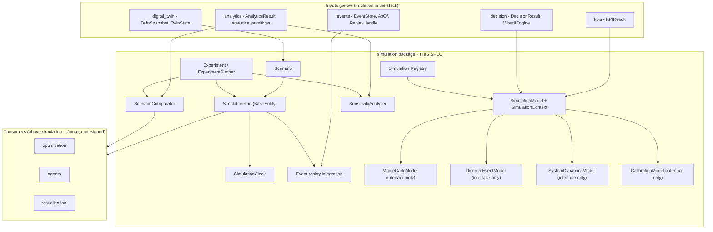
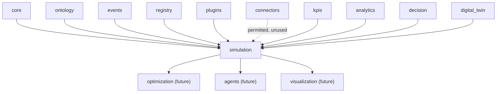
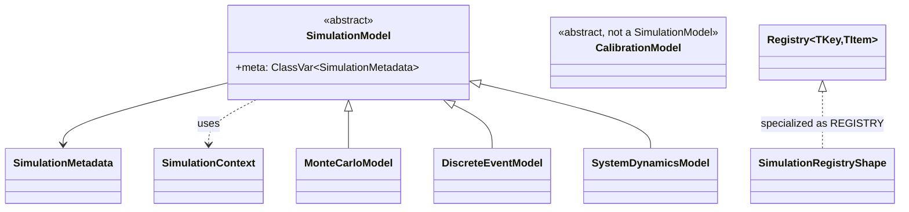
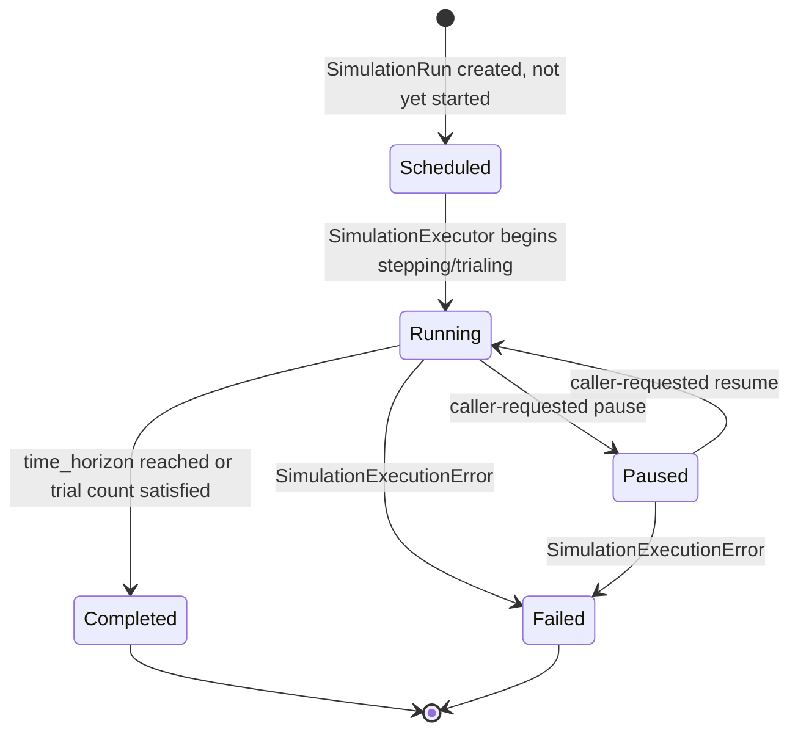
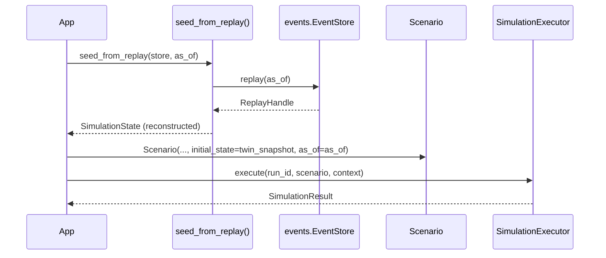
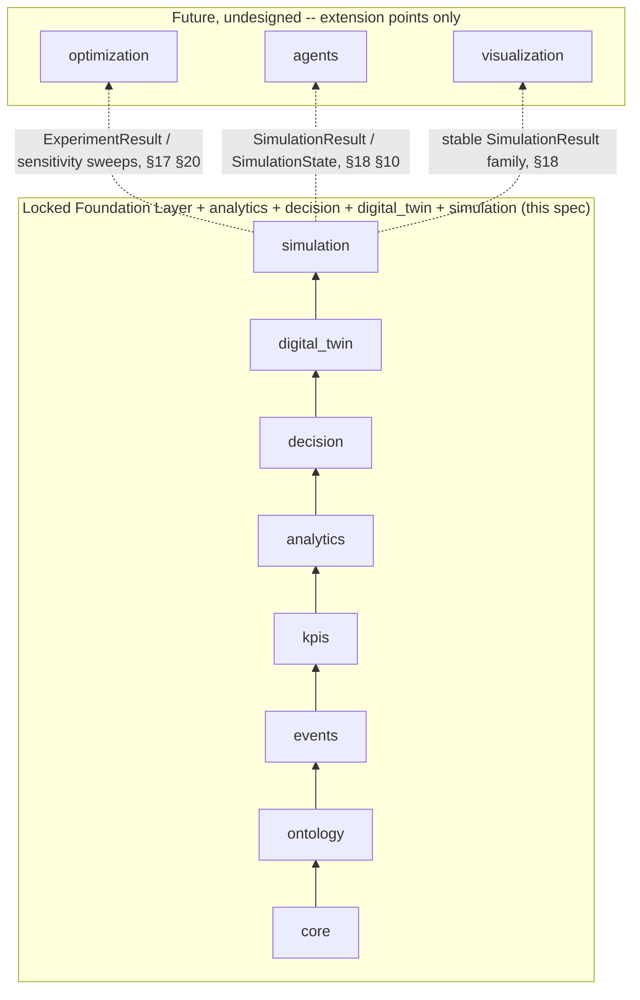

# Simulation - Design Specification

| | |
|---|---|
| **Document ID** | AH-DS-09 |
| **Package** | `mineproductivity.simulation` |
| **Status** | Draft - Design Complete, Pending Implementation |
| **Version** | 1.0.0 |
| **Conforms to** | Master Architecture Handbook v1.0; Reference Implementation Blueprint v1.0; Developer & Cookbook Guide Parts I-III |
| **Builds on** | Core Foundation Library v0.2.0 (LOCKED); Event Framework spec 01 (LOCKED, `events` v0.3.0); Ontology Framework spec 02 (LOCKED, `ontology` v0.4.0); Registry Framework spec 03 (LOCKED, `registry`/`plugins` v0.5.0); Connector Framework spec 04 (LOCKED, `connectors` v0.6.0); KPI Engine spec 05 (LOCKED, `kpis` v0.7.0); Analytics Engine spec 06 (LOCKED, `analytics` v0.8.0); Decision Intelligence spec 07 (LOCKED, `decision` v0.9.0); Digital Twin spec 08 (LOCKED, `digital_twin` v1.0.0) |
| **Author** | Chief Software Architect, MineProductivity |
| **Classification** | Public - Open Source Design Documentation |

## Document Control

Design specification only - no implementation. This document designs `mineproductivity.simulation`, the fourth package built on top of the Foundation Layer, sitting directly above the now-locked `digital_twin`. Nothing in this specification proposes, requires, or hints at a change to any file, public API, or dependency rule in `core`, `events`, `ontology`, `registry`, `plugins`, `connectors`, `kpis`, `analytics`, `decision`, or `digital_twin`. Every object model, class name, and enum member cited from a lower package is taken verbatim from that package's own `__init__.py` public export list or its own governing design specification. Section numbering below (1-37) is locked before drafting and does not change during it: seven front-matter sections (Purpose through Public API), twenty-two sections domain-specific to this package's own required topics (Simulation Abstractions through Metadata), and eight closing sections (Extension Points through Future Roadmap) - the same *documentation structure*, *validation requirements*, *terminology-consistency discipline*, and *per-module seven-field package-structure treatment* as specs 06, 07, and 08.

Cross-references to spec 06 (`analytics`) in this document are given as plain-text citations (`spec 06 §N`), never as Markdown links: `06_Analytics_Engine_Design_Specification.md` exists only on the as-yet-unmerged `feature/analytics-engine` branch, not on `main`, and a Markdown link to a file absent from the current branch is a broken link (this exact failure mode was found and fixed in `ADR-0007-Decision-Intelligence.md`'s header table earlier in this series). Cross-references to specs 07 and 08 (`decision`, `digital_twin`), which **are** present on `main`, are given as ordinary Markdown links where appropriate.

---

## 1. Purpose

Simulation answers a question none of the seven packages below it were ever meant to answer: *given a scenario - a hypothetical or historical starting condition and a set of parameters - how does this mining system evolve over time, and how confident should we be in that projection?* `digital_twin` represents what a system currently looks like and integrates a stable interface (`TwinSimulationModel`) for projecting it forward; `decision` defines a stable interface (`WhatIfEngine`) for reasoning about hypothetical business outcomes; neither package implements an actual forward-projection algorithm, by design (spec 08 §14, spec 07 §19). Simulation is the package that supplies that missing algorithmic layer - scenario management, time-stepped or event-stepped execution, experiment orchestration, and calibration against history - while still declining to choose *which* Monte Carlo, discrete-event, or system-dynamics algorithm is correct for any given site, leaving that choice to pluggable, independently-versioned models (§13-§16). It holds no KPI formulas, no statistical computation of its own, no business-decision logic, no optimization search, no AI-agent reasoning, no rendering, and no telemetry ingestion - all of those already exist, one or more layers down, or are explicitly out of scope, and are consumed rather than re-implemented (§3).

Simulation is, concretely, the first package positioned to fulfill two promises made by name in earlier, locked specifications: it is the package `digital_twin` spec 08 §14 named as `TwinSimulationModel`'s most direct anticipated implementer, and - by composing that implementation - it is positioned to become the first concrete provider of `decision.WhatIfEngine` (spec 07 §19), which was itself designed around `events.AsOf`'s `scenario` field specifically so that this day would not require a breaking change anywhere below it.

## 2. Business Objectives

1. **Answer "what happens next" without guessing at "what should we do about it."** A simulated projection is evidence, not a recommendation - `decision` still owns turning evidence into action (spec 07 §3); Simulation's job ends at producing a `SimulationResult`.
2. **Make every simulated run traceable to the scenario, model, and starting conditions that produced it**, so a projection can be reproduced, audited, and compared exactly as rigorously as a computed KPI or a synchronized twin.
3. **Let a mine start a simulation from real history, not only from a hand-authored hypothesis.** `Scenario.initial_state` (§9) is expressed in terms of `digital_twin.TwinSnapshot`/`events.AsOf` (spec 08 §13, events spec 01) so "simulate forward from last Tuesday's actual conditions" and "simulate forward from a purely hypothetical configuration" are the same code path, differing only in which snapshot is supplied.
4. **Provide one shared extension point for each major simulation methodology** (Monte Carlo, discrete-event, system dynamics, calibration, §13-§16), so a future site-specific or research plugin does not have to invent its own notion of "how does a simulation model plug into this platform."
5. **Delegate statistical treatment of simulated outputs to `analytics`, never re-derive it.** Scenario comparison and sensitivity analysis (§19-§20) produce raw `SimulationResult` collections and hand them to `analytics`' existing statistical primitives - Simulation does not own Analytics (per this package's own charter, §3.2) and does not grow a second, competing statistics surface.

## 3. Architectural Principles

1. **Projection, not computation, decision, or optimization.** Simulation projects a system's state forward under a scenario; it never computes a KPI, never performs the statistical characterization `analytics` owns, never decides a business action, never searches for an optimal plan, and never reasons as an AI agent (out of scope entirely, §4). Where a capability is deliberately deferred to a pluggable model, this design defines an interface for it (§13-§16) rather than a placeholder implementation.
2. **Consumption without redefinition.** Simulation never recomputes a KPI value, a statistical judgment, a recommendation, or a twin's current state. `SimulationContext` (§8) carries `kpi_results`, `analytics_results`, and `decision_results` exactly as `kpis.KPIResult`, `analytics.AnalyticsResult`, and `decision.DecisionResult` already define them, and a `Scenario`'s initial conditions are expressed as `digital_twin.TwinSnapshot` (§9) - read, never re-derived. This is the single most important boundary in this specification (§8, §34).
3. **State as a projection, never a mutable record.** `SimulationRun` (§10) follows `digital_twin.Twin`'s own precedent (spec 08 §3.3, §8) exactly: it subclasses `core.BaseEntity[str]`, and every time-step or trial produces a new instance via a `with_state()`-style helper, never an in-place mutation. Simulation is the second package in this series to reach for this idiom, not the first to invent it.
4. **Reuse over reinvention, including literal inheritance where the shape genuinely fits.** `SimulationRunRepository` **is** `core.BaseRepository[SimulationRun, str]` (§24), exactly mirroring `digital_twin.TwinRepository`'s own literal reuse (spec 08 §20); event replay composes `events.EventStore.replay(AsOf)`/`ReplayHandle` directly (§12) rather than a second replay mechanism; scenario comparison and sensitivity analysis compose `analytics`' existing statistical primitives (§19-§20) rather than reimplementing them. Where the coupling does not fit even though the interface looks similar, this package documents a deliberate non-reuse instead of forcing it (`SimulationStateCache` vs. `kpis.ResultCache`/`digital_twin.TwinStateCache`, §26).
5. **Interfaces before algorithms, where the algorithm is a modeling, statistical, or optimization choice.** Monte Carlo trial logic, discrete-event scheduling logic, system-dynamics integration logic, and calibration logic are each declared as stable abstract contracts now (§13-§16); no specific algorithm is chosen or shipped for any of the four. This is the fourth package in the series to apply this discipline (after `analytics`' forecasting/anomaly/outlier interfaces, `decision`'s root-cause/what-if interfaces, and `digital_twin`'s simulation interface) - the pattern is now a platform-wide convention, not a one-off.
6. **Zero upward leakage.** No lower package (`core` through `digital_twin`) imports `simulation`, mechanically enforced by the same AST-based `TestNoForbiddenDependencies` pattern every existing package already uses.
7. **One extension mechanism, platform-wide.** New simulation categories, models, and calibration strategies are added exactly the way a new KPI, connector, ontology entity type, Analytics model, Decision strategy, or twin type is added: subclass, register, discover via entry points (§30, §31). No bespoke Simulation-specific plugin mechanism is invented.

## 4. Overall Architecture

Simulation occupies exactly one position in the platform's dependency chain - directly above `digital_twin`, and (as of this specification) at the top of the currently-implemented stack:

```
core → ontology → events → kpis → analytics → decision → digital_twin → simulation
```

Everything below `simulation` exists, from its point of view, to produce well-formed inputs: `events.EventStore`/`AsOf`/`ReplayHandle` for seeding a scenario from real history; `digital_twin.TwinSnapshot`/`TwinState` for a twin-derived starting condition; `kpis.KPIResult`, `analytics.AnalyticsResult`, and `decision.DecisionResult` for evidence a scenario or a calibration routine may incorporate. Everything above `simulation` (`optimization`, `agents`, `visualization` - all future, undesigned packages, §37) exists to consume `simulation`'s outputs.



Simulation is deliberately **not** a fifth computation engine competing with `kpis`/`analytics`/`decision`, nor a second stateful-representation layer competing with `digital_twin`. It has no formula language, no statistics library, no rule engine, and no independent notion of "current asset condition" - it borrows the latter from `digital_twin` and hands its own statistical questions to `analytics`.

Every package below `simulation` in this series that defines a central "as-object" abstraction (`kpis.BaseKPI`, `analytics.AnalyticsModel`, `decision.DecisionModel`) makes that abstraction stateless; `digital_twin.Twin` broke from that pattern because representing a persisting asset is inherently about accumulated history. `simulation.SimulationRun` inherits that same statefulness for the identical reason - a running or completed simulation is itself a piece of history, not a fresh computation - and this specification treats that as an established, two-package-deep precedent rather than a novel decision requiring fresh justification.

**Runtime request flow**, walking the diagram above for the single most common entry point (`SimulationExecutor.execute`, §10): a caller supplies a `run_id`, a `Scenario`, and a `SimulationContext` already carrying whatever `kpis.KPIResult`/`analytics.AnalyticsResult`/`decision.DecisionResult` evidence the scenario's authoring process considered relevant. The executor never reaches back into `kpis`, `analytics`, or `decision` on its own initiative to gather more - every fact from a lower package arrives pre-fetched, in `SimulationContext`, exactly once per call. Where the `Scenario` requests a real-history starting point, `digital_twin.TwinSnapshot`/`events.EventStore.replay` supply it before execution begins (§9, §12); where it requests a purely hypothetical one, no lower-package call happens on that path at all. Execution itself touches only this package's own object model (`SimulationRun`, `SimulationState`, `SimulationClock`, and whichever `SimulationModel` category the `Scenario.model_code` names) until it produces a `SimulationResult` - the one output type every future consumer above `simulation` (§37) is expected to read. This "gather evidence once, at the boundary; compute forward using only this package's own types; hand back one structured result" shape is the same shape every package below it in this series already follows at its own layer, applied here one layer further up the stack.

## 5. Dependency Graph

**Permitted imports (platform layering rule, verbatim from this package's brief):** `simulation` may import `mineproductivity.core`, `mineproductivity.ontology`, `mineproductivity.events`, `mineproductivity.registry`, `mineproductivity.plugins`, `mineproductivity.connectors`, `mineproductivity.kpis`, `mineproductivity.analytics`, `mineproductivity.decision`, and `mineproductivity.digital_twin`, and nothing else.

**Actually exercised by this design:** `core` (`BaseEntity`, `BaseRepository`/`InMemoryRepository`, `BaseSpecification`, `Result`/`Maybe`, `BaseValueObject`, `serialization`, exceptions), `events` (`EventStore`, `AsOf`, `ReplayHandle`, `BaseEvent` - for seeding scenarios from real history, §12), `digital_twin` (`TwinSnapshot`, `TwinState`, `TwinSimulationModel` - the interface this package's models are positioned to implement, §13-§16), `kpis`/`decision` (`KPIResult`, `DecisionResult` - read directly into `SimulationContext`, §8), and `analytics` (`AnalyticsResult`, plus its statistical primitives - `describe`, `confidence_interval`, `StatisticalSummary`, `DistributionSummary` - consumed directly by scenario comparison and sensitivity analysis, §19-§20). `ontology` is available for the vocabulary a `Scenario`'s scope is expressed in (mirroring `digital_twin.Twin.scope`, spec 08 §9) but introduces no new ontology-derived concept. `connectors` is a permitted import under the platform-wide layering rule but, exactly as in `analytics`, `decision`, and `digital_twin` before it, is **not** exercised - Simulation operates on already-computed, already-event-sourced, already-synchronized facts, never on a vendor-specific wire format (§34).



**Depended on by (future, undesigned):** `optimization`, `agents`, `visualization`.

**Forbidden, mechanically enforced:**
- `simulation` MUST NOT be imported by `core`, `ontology`, `events`, `registry`, `plugins`, `connectors`, `kpis`, `analytics`, `decision`, or `digital_twin` - checked by an AST walk exactly like every existing package's `TestNoForbiddenDependencies` test.
- `simulation` MUST NOT import `optimization`, `agents`, or `visualization` - those are all strictly above it and, as of this specification, do not yet exist.
- No cycle exists or is introduced: `core → ontology → events → kpis → analytics → decision → digital_twin → simulation` is a strict total order for every symbol this package uses.

## 6. Package Structure

```
src/mineproductivity/simulation/
├── __init__.py            # public API surface (§7)
├── abstractions.py          # SimulationModel (ABC), SimulationContext
├── metadata.py                # SimulationMetadata, SimulationCategory
├── scenario.py                   # Scenario, ScenarioStatus
├── run.py                           # SimulationRun (BaseEntity[str], concrete), RunStatus
├── state.py                           # SimulationState
├── clock.py                              # SimulationClock, TimeProgressionMode
├── replay.py                                # seed_from_replay(), event-replay integration
├── montecarlo.py                               # MonteCarloModel (ABC) -- interface only, §13
├── discrete_event.py                              # DiscreteEventModel (ABC) -- interface only, §14
├── system_dynamics.py                                # SystemDynamicsModel (ABC) -- interface only, §15
├── calibration.py                                       # CalibrationModel (ABC) -- interface only, §16
├── executor.py                                             # SimulationExecutor
├── experiment.py                                              # Experiment, ExperimentRunner
├── comparison.py                                                 # ScenarioComparator
├── sensitivity.py                                                   # SensitivityAnalyzer
├── discovery.py                                                       # by_category(), by_scope()
├── persistence.py                                                        # SimulationRunRepository
├── caching.py                                                               # SimulationStateCache
├── result.py                                                                   # SimulationResult, ExperimentResult
├── _registry.py                                                                   # REGISTRY, register
├── exceptions.py
└── README.md
```

Twenty-one implementation modules plus `__init__.py` and `README.md` - the largest module count in the series so far, reflecting that Simulation's brief names more distinct owned responsibilities (fourteen) than any prior package. Every module below is specified against the same seven fields specs 06-08 used: Purpose, Responsibilities, Public Classes, Public Functions, Public API, Dependencies, and Extension Points.

### `abstractions.py`
- **Purpose:** the "Simulation-as-object" root, and the collaborator bundle a concrete model needs.
- **Responsibilities:** define the common metadata slot every simulation model carries; bundle `SimulationContext`'s evidence fields. Deliberately does **not** define a single shared abstract execution method (see §8) - Monte Carlo, discrete-event, and system-dynamics execution are structurally different enough that forcing one shared signature would either lose information or need an escape-hatch `Any`-typed payload.
- **Public Classes:** `SimulationModel` (ABC), `SimulationContext`.
- **Public Functions:** None.
- **Public API:** `SimulationModel`, `SimulationContext`.
- **Dependencies:** `core` (`Result`), `events` (`EventStore`, `AsOf`), `kpis` (`KPIResult`), `analytics` (`AnalyticsResult`), `decision` (`DecisionResult`), `digital_twin` (`TwinSnapshot`).
- **Extension Points:** every category base in `montecarlo.py`/`discrete_event.py`/`system_dynamics.py` subclasses `SimulationModel`; `calibration.py`'s `CalibrationModel` does not (§16).

### `metadata.py`
- **Purpose:** the minimal registration schema for a discoverable `SimulationModel` type (§29).
- **Responsibilities:** carry just enough structured information for registry introspection and entry-point discovery; enforce the closed `SimulationCategory` namespace.
- **Public Classes:** `SimulationMetadata`, `SimulationCategory` (enum).
- **Public Functions:** None.
- **Public API:** `SimulationMetadata`, `SimulationCategory`.
- **Dependencies:** `core` (`BaseMetadata`, `ValidationError`).
- **Extension Points:** a new `SimulationCategory` member is a closed-enum, governance-reviewed change, mirroring `digital_twin.TwinCategory`'s/`decision.DecisionCategory`'s closed-enum rule (spec 08 §26, spec 07 §30).

### `scenario.py`
- **Purpose:** scenarios as versioned, governed artifacts (§9) - the scenario-management responsibility.
- **Responsibilities:** bundle a named, versioned configuration (parameters, time horizon, initial conditions, which model to run); carry a governance lifecycle.
- **Public Classes:** `Scenario`, `ScenarioStatus` (enum).
- **Public Functions:** None.
- **Public API:** `Scenario`, `ScenarioStatus`.
- **Dependencies:** `core` (`BaseValueObject`, `ValidationError`), `digital_twin` (`TwinSnapshot`), `events` (`AsOf`).
- **Extension Points:** a new `Scenario` is authored and registered exactly like a new `decision.Policy` (§30, §31); an existing `Scenario` is never edited in place - a changed scenario is a new version with the old one moved to `Superseded` (§9, §25).

### `run.py`
- **Purpose:** simulation execution's stateful core (§10).
- **Responsibilities:** subclass `core.BaseEntity[str]` directly; carry the current `SimulationState`; expose the non-mutating `with_state()` update helper.
- **Public Classes:** `SimulationRun`, `RunStatus` (enum).
- **Public Functions:** None.
- **Public API:** `SimulationRun`, `RunStatus`.
- **Dependencies:** `core` (`BaseEntity`), `state.py` (`SimulationState`).
- **Extension Points:** none - `SimulationRun`'s shape is closed; a new simulation methodology is a new `SimulationModel` category (§13-§16), never a change to `SimulationRun` itself.

### `state.py`
- **Purpose:** a simulation run's current condition (§10).
- **Responsibilities:** represent one run's simulated attributes and simulated time as of the last executed step or trial.
- **Public Classes:** `SimulationState`.
- **Public Functions:** None.
- **Public API:** `SimulationState`.
- **Dependencies:** `core` (`BaseValueObject`, `ValidationError`).
- **Extension Points:** a new model-specific attribute is carried in `SimulationState.attributes` (an open `Mapping[str, Any]`), never as a new typed field on the shared shape - mirrors `digital_twin.TwinState.attributes`'s identical escape hatch (spec 08 §12).

### `clock.py`
- **Purpose:** time progression (§11).
- **Responsibilities:** represent how simulated time advances for a given execution mode.
- **Public Classes:** `SimulationClock`, `TimeProgressionMode` (enum).
- **Public Functions:** None.
- **Public API:** `SimulationClock`, `TimeProgressionMode`.
- **Dependencies:** standard library `datetime`/`timedelta` only.
- **Extension Points:** a new `TimeProgressionMode` member is a closed-enum, governance-reviewed change, paired with the corresponding new `SimulationModel` category it serves.

### `replay.py`
- **Purpose:** event replay integration (§12).
- **Responsibilities:** reconstruct a `SimulationState` from real event history, reusing `events.EventStore.replay(AsOf)` directly.
- **Public Classes:** None.
- **Public Functions:** `seed_from_replay`.
- **Public API:** `seed_from_replay`.
- **Dependencies:** `events` (`EventStore`, `AsOf`, `ReplayHandle`), `state.py`.
- **Extension Points:** none - a new replay-derived seeding strategy is a new function here, not a new mechanism; `events.EventStore` remains the sole owner of replay itself.

### `montecarlo.py` / `discrete_event.py` / `system_dynamics.py`
- **Purpose:** interface-only extension points (§13-§15) - no concrete implementation in any of the three modules.
- **Responsibilities:** define a stable abstract contract a future plugin implements against, one per methodology.
- **Public Classes:** `MonteCarloModel` (ABC, `montecarlo.py`), `DiscreteEventModel` (ABC, `discrete_event.py`), `SystemDynamicsModel` (ABC, `system_dynamics.py`).
- **Public Functions:** None.
- **Public API:** all three classes listed above.
- **Dependencies:** `abstractions.py`, `scenario.py`, `state.py`, `result.py` (for return-type annotations only).
- **Extension Points:** the entire purpose of these three modules - a concrete subclass of any one is a first-class extension (§30.2), never added inside these modules themselves (§34).

### `calibration.py`
- **Purpose:** interface-only extension point (§16) - no concrete implementation.
- **Responsibilities:** define a stable abstract contract for fitting a `SimulationModel`'s parameters against historical ground truth.
- **Public Classes:** `CalibrationModel` (ABC).
- **Public Functions:** None.
- **Public API:** `CalibrationModel`.
- **Dependencies:** `digital_twin` (`TwinSnapshot`, the ground-truth input shape), `abstractions.py`.
- **Extension Points:** same as the three modules above - interface only (§30.2, §34).

### `executor.py`
- **Purpose:** orchestrates one `SimulationRun` (§10).
- **Responsibilities:** dispatch to the registered `SimulationModel`'s category-specific method, advance the `SimulationClock`, persist the resulting state.
- **Public Classes:** `SimulationExecutor`.
- **Public Functions:** None.
- **Public API:** `SimulationExecutor`.
- **Dependencies:** `persistence.py` (`SimulationRunRepository`), `caching.py` (`SimulationStateCache`), `clock.py`, `result.py` (`SimulationResult`).
- **Extension Points:** none - a new execution mode is a new `SimulationModel` category, not a change to the executor's own dispatch logic (§30).

### `experiment.py`
- **Purpose:** experiment management (§17).
- **Responsibilities:** run a `Scenario` across many trials or many parameter values, collecting the resulting `SimulationRun`s into one named `Experiment`.
- **Public Classes:** `Experiment`, `ExperimentRunner`.
- **Public Functions:** None.
- **Public API:** `Experiment`, `ExperimentRunner`.
- **Dependencies:** `scenario.py`, `executor.py`, `result.py`.
- **Extension Points:** a new experiment shape (e.g. a scheduled batch-of-experiments runner) is a new class composing `ExperimentRunner` the same way `ExperimentRunner` composes `SimulationExecutor`.

### `comparison.py`
- **Purpose:** scenario comparison (§19).
- **Responsibilities:** compare `SimulationResult` collections across two or more scenarios by delegating statistical treatment to `analytics`.
- **Public Classes:** `ScenarioComparator`.
- **Public Functions:** None.
- **Public API:** `ScenarioComparator`.
- **Dependencies:** `analytics` (`describe`, `StatisticalSummary`), `result.py`.
- **Extension Points:** a new comparison dimension is an additive change to `ScenarioComparator.compare`'s inputs, never a new statistics implementation here.

### `sensitivity.py`
- **Purpose:** sensitivity analysis (§20).
- **Responsibilities:** sweep one or more `Scenario` parameters across an `Experiment`, handing the resulting `SimulationResult`s to `analytics` for distributional/statistical treatment.
- **Public Classes:** `SensitivityAnalyzer`.
- **Public Functions:** None.
- **Public API:** `SensitivityAnalyzer`.
- **Dependencies:** `analytics` (`DistributionSummary`, `confidence_interval`), `experiment.py`, `scenario.py`.
- **Extension Points:** a new sweep strategy (e.g. Latin hypercube sampling of the parameter space) is an additive method here, never a new statistics implementation.

### `discovery.py`
- **Purpose:** simulation discovery (§23) - category/scope-based lookup over currently-known runs.
- **Responsibilities:** provide named `core.BaseSpecification` factory functions for the two most common lookup predicates, mirroring `digital_twin.discovery`'s identical pattern (spec 08 §18).
- **Public Classes:** None.
- **Public Functions:** `by_category`, `by_scope`.
- **Public API:** `by_category`, `by_scope`.
- **Dependencies:** `core` (`BaseSpecification`, `PredicateSpecification`), `run.py` (`SimulationRun`).
- **Extension Points:** a new named lookup predicate is a new function here, composing `core.PredicateSpecification`, never a new query mechanism.

### `persistence.py`
- **Purpose:** where simulation runs are stored (§24).
- **Responsibilities:** define the storage contract for run instances, keyed by their own identity.
- **Public Classes:** None (`SimulationRunRepository` is a `type` alias, not a new class).
- **Public Functions:** None.
- **Public API:** `SimulationRunRepository`.
- **Dependencies:** `core` (`BaseRepository`, `InMemoryRepository`), `run.py` (`SimulationRun`).
- **Extension Points:** a production-grade backend (SQL, document store) implements `core.BaseRepository[SimulationRun, str]` directly - no `simulation`-specific ABC exists to implement instead (§3.4, §24).

### `caching.py`
- **Purpose:** avoid redundant re-derivation of a scenario's replay-seeded initial conditions across repeated trials (§26).
- **Responsibilities:** cache the `SimulationState` seeded for one `(scenario_code, as_of)` key; confirmed **not** a reuse of `kpis.ResultCache` or `digital_twin.TwinStateCache`, whose cache-key shapes are coupled to KPI-result and twin-evidence semantics respectively, not to replay-seeded simulation state (spec 05 §10.8, spec 08 §22).
- **Public Classes:** `SimulationStateCache`.
- **Public Functions:** None.
- **Public API:** `SimulationStateCache`.
- **Dependencies:** `state.py` (`SimulationState`), `events` (`AsOf`).
- **Extension Points:** a new cache-key dimension is an additive, reviewed change to the `(scenario_code, as_of)` key shape, not a new parallel cache class.

### `result.py`
- **Purpose:** every concrete outcome type this package produces (§18).
- **Responsibilities:** define one shared envelope (`SimulationResult`) and the concrete results built on it.
- **Public Classes:** `SimulationResult`, `ExperimentResult`.
- **Public Functions:** None.
- **Public API:** both classes listed above.
- **Dependencies:** `core` (`BaseValueObject`), `state.py` (`SimulationState`).
- **Extension Points:** a new concrete result type is added only alongside a new capability that produces it.

### `_registry.py`
- **Purpose:** the Simulation Registry (§21), following the exact pattern `digital_twin._registry`/`decision._registry`/`analytics._registry`/`kpis._registry` established (spec 08 §17, spec 07 §32, spec 06 §33, spec 05 AD-KP-06) rather than reimplementing registration.
- **Responsibilities:** hold the process-wide `Registry[str, type[SimulationModel]]` instance; validate a non-empty `code`; reject a duplicate, non-identical re-registration.
- **Public Classes:** None.
- **Public Functions:** `register`.
- **Public API:** `REGISTRY`, `register`.
- **Dependencies:** `registry` (`Registry`), `metadata.py`, `exceptions.py`.
- **Extension Points:** none within this module itself - it is the extension mechanism (§31) other modules and third-party plugins use.

### `exceptions.py`
- **Purpose:** the package's exception hierarchy, used throughout §8-§31.
- **Responsibilities:** define every raised error type this package's public API can produce.
- **Public Classes:**
  ```python
  class SimulationValidationError(ValidationError):
      """A SimulationMetadata, Scenario, or SimulationState failed
      validation (§29, §9, §10) -- e.g. an empty code, a Scenario with
      no model_code, or a SimulationState with empty attributes."""

  class SimulationRunNotFoundError(NotFoundError):
      """SimulationRunRepository.get(run_id) found no run for that id,
      or REGISTRY.get(code) found no registered SimulationModel for
      that code."""

  class SimulationExecutionError(MineProductivityError):
      """SimulationExecutor raised for a batch of steps/trials that
      should have been structurally valid -- distinct from a
      legitimately-incomplete-input case (§8's 'qualify, don't coerce'
      rule), which returns a SimulationResult carrying a warning
      instead of raising."""

  class SimulationVersionConflictError(RegistrationError):
      """A plugin attempted to re-register an existing SimulationModel
      type code with materially different metadata without a version
      bump, mirroring digital_twin.TwinVersionConflictError (spec 08
      §6) and decision.DecisionVersionConflictError (spec 07 §6)."""

  class ScenarioConflictError(RegistrationError):
      """A governance action attempted to re-register an existing,
      Active Scenario code with different parameters/initial conditions
      without a version bump and a Superseded transition for the prior
      version -- the Scenario-layer analogue of
      SimulationVersionConflictError, since a Scenario is a separate
      governed artifact from a SimulationModel implementation (§3.6 of
      decision spec 07, applied here)."""
  ```
- **Public Functions:** None.
- **Public API:** all five exception classes listed above.
- **Dependencies:** `core` (`ValidationError`, `NotFoundError`, `MineProductivityError`), `registry` (`RegistrationError`).
- **Extension Points:** a new exception type is added only alongside the specific failure mode it represents.

## 7. Public API

```python
from mineproductivity.simulation import (
    # Abstractions
    SimulationModel, SimulationContext,
    # Metadata
    SimulationMetadata, SimulationCategory,
    # Scenario management
    Scenario, ScenarioStatus,
    # Execution
    SimulationRun, RunStatus, SimulationExecutor,
    # State and time
    SimulationState, SimulationClock, TimeProgressionMode,
    # Event replay
    seed_from_replay,
    # Interfaces only -- no concrete implementation (§13-§16)
    MonteCarloModel, DiscreteEventModel, SystemDynamicsModel, CalibrationModel,
    # Experiment management
    Experiment, ExperimentRunner,
    # Comparison and sensitivity (delegate to analytics)
    ScenarioComparator, SensitivityAnalyzer,
    # Discovery
    by_category, by_scope,
    # Persistence and caching
    SimulationRunRepository, SimulationStateCache,
    # Result models
    SimulationResult, ExperimentResult,
    # Registry (Registry Framework specialization)
    register, REGISTRY,
    # Exceptions
    SimulationValidationError, SimulationRunNotFoundError,
    SimulationExecutionError, SimulationVersionConflictError, ScenarioConflictError,
)
```

Every name above is intended to be **stable once implementation begins**, per the same "prefer fewer, carefully designed interfaces" discipline specs 06-08 already applied - no speculative "maybe useful" symbol is included; each name maps directly to one of the sections below.

## 8. Simulation Abstractions

```python
class SimulationContext:
    """Bundles the collaborators and evidence a SimulationModel may need
    -- the simulation-layer counterpart to digital_twin.TwinContext
    (spec 08 §8), one layer up. Carries the KPIResult/AnalyticsResult/
    DecisionResult evidence already gathered, plus optional access to
    events.EventStore for replay-based seeding (§12)."""

    def __init__(
        self,
        *,
        event_store: "EventStore",
        kpi_results: "Sequence[KPIResult]" = (),
        analytics_results: "Sequence[AnalyticsResult]" = (),
        decision_results: "Sequence[DecisionResult]" = (),
    ) -> None: ...


class SimulationModel(ABC):
    """The root of every registrable simulation model type -- 'Simulation-
    as-object,' the direct counterpart of kpis.BaseKPI/analytics.AnalyticsModel/
    decision.DecisionModel/digital_twin.Twin, four/three/two/one layers
    down respectively. Deliberately carries no shared abstract execution
    method: Monte Carlo trials, discrete-event scheduling, and system-
    dynamics integration are structurally different enough (§13-§15)
    that a single shared signature would either lose information or
    need an escape-hatch Any-typed payload -- the identical reasoning
    decision.RootCauseAnalyzer/WhatIfEngine already applied when each
    defined its own abstract method distinct from DecisionModel's
    shared _decide (spec 07 §18, §19)."""

    meta: ClassVar[SimulationMetadata]
```



`CalibrationModel` (§16) is deliberately **not** a `SimulationModel` subclass - calibration (fitting a model's parameters against historical ground truth) is a conceptually distinct operation from running a model forward, and forcing it under the same root would blur that distinction the same way conflating `decision.RankingStrategy` with `decision.ActionPrioritizer` would have (spec 07 §16, §20). `SimulationModel` subclasses are stateless (§29) - statefulness in this package lives entirely in `SimulationRun` (§10), never in a model implementation.

## 9. Scenario Management

```python
class ScenarioStatus(Enum):
    """The Scenario lifecycle -- mirrors decision.DecisionStatus (spec
    07 §12) exactly, applied here to governed simulation-configuration
    artifacts rather than to business policies."""

    PROPOSED = "proposed"
    ACTIVE = "active"
    SUPERSEDED = "superseded"
    RETIRED = "retired"


@dataclasses.dataclass(frozen=True, slots=True)
class Scenario(BaseValueObject):
    """A named, versioned simulation configuration -- the business-
    policy-grade governed artifact this package owns, analogous to
    decision.Policy (spec 07 §12) one layer down."""

    code: str                                          # e.g. "FLEET.NightShiftSurge"
    version: str = dataclasses.field(default="1.0.0", kw_only=True)
    status: ScenarioStatus = dataclasses.field(
        default_factory=lambda: ScenarioStatus.PROPOSED, kw_only=True
    )
    model_code: str = dataclasses.field(kw_only=True)   # SimulationMetadata.code to run
    parameters: "Mapping[str, Any]" = dataclasses.field(default_factory=dict, kw_only=True)
    time_horizon: "timedelta" = dataclasses.field(kw_only=True)
    initial_state: "TwinSnapshot | None" = dataclasses.field(default=None, kw_only=True)
    as_of: "AsOf | None" = dataclasses.field(default=None, kw_only=True)

    def validate(self) -> None:
        if not self.code.strip():
            raise ValidationError("Scenario.code must not be empty")
        if not self.model_code.strip():
            raise ValidationError("Scenario.model_code must not be empty")
```

`Scenario.initial_state` reuses `digital_twin.TwinSnapshot` directly (spec 08 §13) rather than defining a second "starting condition" concept - "simulate forward from last Tuesday's actual fleet condition" and "simulate forward from a purely hypothetical configuration" are the same `Scenario` shape, differing only in whether `initial_state` references a snapshot captured from real synchronization or one hand-authored for the hypothesis. `Scenario.as_of` is a plain `events.AsOf` (events spec 01) - when its `scenario` field (not to be confused with this class's own name, which predates and is unrelated to that field's introduction) is populated, it is exactly the hook `decision.WhatIfEngine` (spec 07 §19) and `digital_twin.TwinSimulationModel` (spec 08 §14) were each designed around.

An `Active` `Scenario`, like an `Active` `decision.Policy`, is a public contract: it is never edited in place. A changed scenario is published as a new version; the prior version transitions to `Superseded`, never silently repointed - enforced by `ScenarioConflictError` (§6) raised when a governance action attempts to re-register an existing, `Active` scenario code with materially different parameters or initial conditions without a version bump.

## 10. Simulation Execution

```python
class RunStatus(Enum):
    """A SimulationRun's own operational lifecycle -- distinct in shape
    from digital_twin.TwinStatus (spec 08 §10), which tracks a twin
    INSTANCE's synchronization freshness (Provisioned/Synchronized/
    Stale/Degraded/Retired), not execution progress. RunStatus instead
    tracks whether a run has started, is actively stepping/trialing, is
    paused, or has reached a terminal outcome -- the same category of
    instance-level operational lifecycle TwinStatus represents one
    layer down, but with values shaped by what this package's own
    SimulationExecutor (§10) actually does, not copied from TwinStatus."""

    SCHEDULED = "scheduled"
    RUNNING = "running"
    PAUSED = "paused"
    COMPLETED = "completed"
    FAILED = "failed"


@dataclasses.dataclass(frozen=True, slots=True, eq=False)
class SimulationRun(BaseEntity[str]):
    """The root of one executing or completed simulation -- 'Run-as-
    entity,' following digital_twin.Twin's own precedent (spec 08 §3.3,
    §8) exactly: id (inherited) is the run's identity, and representing
    a state change means producing a NEW SimulationRun instance via
    with_state(), never mutating fields in place."""

    scenario_code: str
    state: "SimulationState"
    status: RunStatus = dataclasses.field(default=RunStatus.SCHEDULED)

    def with_state(self, state: "SimulationState", *, status: "RunStatus | None" = None) -> "SimulationRun":
        """Returns a NEW SimulationRun instance with `state` (and
        optionally `status`) replacing the current ones -- the
        dataclasses.replace-style helper core.BaseEntity's own
        docstring anticipates, identical to Twin.with_state() (spec 08
        §8)."""
        return dataclasses.replace(self, state=state, status=status or self.status)
```



`SimulationRun` carries no `_apply`/`_decide`/`_analyze`-style abstract method of its own - unlike `Twin`, which advances via a single category-independent `_apply`, a `SimulationRun`'s next `SimulationState` is produced by whichever `SimulationModel` category method (§13-§15) `SimulationExecutor` (§6) dispatches to on the run's behalf. This is a deliberate difference from `Twin`, recorded because a reader familiar with spec 08 might otherwise expect an identical method shape here; `SimulationRun` is the *record* of an execution, not the executor itself.

```mermaid
sequenceDiagram
    participant Caller
    participant Exec as SimulationExecutor
    participant Repo as SimulationRunRepository
    participant Cache as SimulationStateCache
    participant Model as SimulationModel (category subclass)
    participant Clock as SimulationClock

    Caller->>Exec: execute(run_id, scenario, context)
    Exec->>Repo: get(run_id)
    Repo-->>Exec: SimulationRun (status=Scheduled)
    Exec->>Cache: get(scenario.code, scenario.as_of)
    alt cache hit
        Cache-->>Exec: SimulationState
    else cache miss
        Exec->>Exec: seed_from_replay(context.event_store, scenario.as_of)
        Exec->>Cache: put(scenario.code, scenario.as_of, state)
    end
    Exec->>Repo: remove(run_id); add(run.with_state(state, status=Running))
    loop until Clock reports time_horizon reached / trial satisfied
        Exec->>Model: dispatch to _trial / _advance / _step (§13-§15)
        Model-->>Exec: next SimulationState (+ delta, for _advance)
        Exec->>Clock: advance(current, delta)
        Exec->>Repo: remove(run_id); add(run.with_state(next_state))
    end
    Exec->>Repo: remove(run_id); add(run.with_state(final_state, status=Completed))
    Exec-->>Caller: SimulationResult
```

`SimulationExecutor.execute` is the one place in this package where the dispatch decision - which of `_trial`/`_advance`/`_step` to call - is made, and it makes that decision exactly once per run, by reading the registered `SimulationModel`'s `SimulationCategory` (§29) off `Scenario.model_code`, never by branching on the model's concrete Python type. Every `remove`-then-`add` pair against `SimulationRunRepository` in the loop above is this package's own instance of the same single, narrow, already-audited mutable operation `registry.Registry.register()`, `analytics.IncrementalAccumulator`, and `decision.DecisionAuditTrail` each already concentrate their own one point of mutation into (§32) - `core.BaseRepository` exposes no dedicated "replace" method, so a conforming `SimulationRunRepository` implementation is expected to make that `remove`/`add` pair atomic per `run_id`, exactly as `digital_twin.TwinRepository` is already required to (spec 08 §29). The loop body itself never mutates a `SimulationRun` in place - each iteration produces a new instance via `with_state()` before the repository swap. A cache miss (the `else` branch above) is not a special case requiring separate error handling: it is the ordinary first-trial path for any `(scenario_code, as_of)` key `SimulationStateCache` has not yet seen, and every subsequent trial sharing that key takes the cache-hit branch instead (§26).

## 11. Time Progression

```python
class TimeProgressionMode(Enum):
    """Which of the three interface-only methodologies (§13-§15) a
    SimulationClock is paced for."""

    FIXED_TIMESTEP = "fixed_timestep"    # system dynamics
    NEXT_EVENT = "next_event"            # discrete event
    TRIAL_BASED = "trial_based"          # Monte Carlo -- no continuous time; repeated independent trials


class SimulationClock:
    """Represents how simulated time advances for a given
    TimeProgressionMode. A fixed-timestep clock advances by a constant
    `dt` each step; a next-event clock advances directly to the next
    scheduled event's timestamp; a trial-based clock does not advance
    continuous time at all -- each trial is independent, and 'time'
    within a trial is whatever the concrete MonteCarloModel implementation
    defines it to be."""

    def __init__(self, *, mode: TimeProgressionMode, dt: "timedelta | None" = None) -> None: ...

    def advance(self, current: "datetime", *, delta: "timedelta | None" = None) -> "datetime": ...
```

`SimulationClock` is a small, self-contained utility with no dependency on any specific `SimulationModel` category - `SimulationExecutor` (§6) selects which `TimeProgressionMode` applies based on the `Scenario.model_code`'s registered `SimulationCategory` (§29), never by inspecting the model's concrete type directly.

## 12. Event Replay

```python
def seed_from_replay(store: "EventStore", as_of: "AsOf") -> "SimulationState":
    """Reconstructs an initial SimulationState from real event history
    via EventStore.replay(as_of) -- reuses events' own replay mechanism
    directly, exactly as digital_twin.TwinSynchronizer does one layer
    down for cold-start twin reconstruction (spec 08 §15). This is the
    concrete mechanism behind Business Objective 3 (§2): 'simulate
    forward from last Tuesday's actual conditions' is `seed_from_replay`
    followed by handing the result to a Scenario's `initial_state`."""
```



No second replay mechanism is introduced anywhere in this package - `seed_from_replay` is a thin convenience wrapper over `events.EventStore.replay`, not a competing implementation of replay itself (§34).

## 13. Monte Carlo Interfaces (interface only)

```python
class MonteCarloModel(SimulationModel, ABC):
    """The contract a future Monte Carlo plugin implements. THIS MODULE
    SHIPS NO CONCRETE SUBCLASS -- choosing a random-sampling methodology
    (which distribution, how many trials, which variance-reduction
    technique) is exactly the kind of modeling decision this package's
    charter (§3.1, §3.5, §4) excludes."""

    @abstractmethod
    def _trial(
        self, scenario: "Scenario", *, context: SimulationContext, random_seed: int
    ) -> "SimulationResult": ...
```

Each call to `_trial` is expected to be independent and reproducible given the same `random_seed` - `ExperimentRunner` (§17) is responsible for supplying a distinct seed per trial, never for the concrete model to manage its own seed state internally (§29's statelessness rule for `SimulationModel`).

## 14. Discrete Event Simulation Interfaces (interface only)

```python
class DiscreteEventModel(SimulationModel, ABC):
    """The contract a future discrete-event plugin implements. THIS
    MODULE SHIPS NO CONCRETE SUBCLASS -- choosing an event-queue
    scheduling policy is a modeling decision this package does not make
    on the implementer's behalf."""

    @abstractmethod
    def _advance(
        self, state: "SimulationState", *, context: SimulationContext
    ) -> "tuple[SimulationState, timedelta]": ...
```

`_advance` returns both the next `SimulationState` and the time delta until that state becomes current - `SimulationExecutor` uses the returned delta to drive a `SimulationClock` in `TimeProgressionMode.NEXT_EVENT` (§11), rather than the clock deciding the step size unilaterally as it does for `TimeProgressionMode.FIXED_TIMESTEP` (§15).

## 15. System Dynamics Interfaces (interface only)

```python
class SystemDynamicsModel(SimulationModel, ABC):
    """The contract a future system-dynamics plugin implements. THIS
    MODULE SHIPS NO CONCRETE SUBCLASS -- choosing a stock-and-flow
    integration method (Euler, Runge-Kutta, or otherwise) is a modeling
    decision this package does not make on the implementer's behalf."""

    @abstractmethod
    def _step(
        self, state: "SimulationState", *, context: SimulationContext, dt: "timedelta"
    ) -> "SimulationState": ...
```

`_step` is called once per fixed timestep, with `dt` supplied by a `SimulationClock` in `TimeProgressionMode.FIXED_TIMESTEP` mode (§11) - the model itself never decides its own step size, keeping time-progression policy entirely in `SimulationClock`/`Scenario`, not scattered across model implementations.

## 16. Calibration Interfaces (interface only)

```python
class CalibrationModel(ABC):
    """The contract a future calibration plugin implements: fit a
    registered SimulationModel's parameters against historical ground
    truth. THIS MODULE SHIPS NO CONCRETE SUBCLASS -- parameter fitting
    is an optimization-adjacent technique this package's charter (§3.1,
    §4) excludes, exactly as decision.WhatIfEngine and
    digital_twin.TwinSimulationModel each exclude their own adjacent
    algorithmic choices (spec 07 §19, spec 08 §14)."""

    @abstractmethod
    def _calibrate(
        self, model_code: str, ground_truth: "Sequence[TwinSnapshot]", *, context: SimulationContext
    ) -> "Mapping[str, Any]": ...
```

`ground_truth` is a sequence of `digital_twin.TwinSnapshot`s (spec 08 §13) - the same reuse of Digital Twin's historical-capture concept `Scenario.initial_state` already makes (§9), applied here to calibration's need for "what actually happened" rather than "what should we start from."

## 17. Experiment Management

```python
@dataclasses.dataclass(frozen=True, slots=True)
class Experiment(BaseValueObject):
    """A named collection of SimulationRuns produced from one Scenario
    -- many independent Monte Carlo trials, or one run per point in a
    sensitivity sweep (§20)."""

    name: str
    scenario: Scenario
    run_ids: "tuple[str, ...]"


class ExperimentRunner:
    """Runs a Scenario across many trials (Monte Carlo, §13) or many
    parameter values (a sensitivity sweep, §20), collecting the
    resulting SimulationRuns into one Experiment. Composes
    SimulationExecutor (§6) for each individual run rather than
    duplicating its dispatch/persistence logic."""

    def __init__(self, *, executor: "SimulationExecutor", repository: "SimulationRunRepository") -> None: ...

    def run_trials(
        self, scenario: Scenario, *, trials: int, context: SimulationContext
    ) -> Experiment: ...
```

**Worked example.** Illustrative of the intended end-to-end shape once implemented - a 500-trial Monte Carlo experiment seeded from a real digital twin snapshot:

```python
from mineproductivity.digital_twin import TwinSnapshot
from mineproductivity.events import AsOf
from mineproductivity.simulation import (
    Scenario, SimulationContext, SimulationExecutor, SimulationClock,
    TimeProgressionMode, ExperimentRunner, ScenarioComparator,
)

twin = twin_repository.get("FLEET-NORTH")
snapshot = TwinSnapshot(twin_id=twin.id, state=twin.state, status=twin.status, as_of=AsOf(utc=now))

scenario = Scenario(
    code="FLEET.NightShiftSurge", model_code="MONTECARLO.HaulCycleVariability",
    parameters={"trucks_added": 3}, time_horizon=timedelta(hours=12),
    initial_state=snapshot,
)

executor = SimulationExecutor(repository=run_repository, clock=SimulationClock(mode=TimeProgressionMode.TRIAL_BASED))
runner = ExperimentRunner(executor=executor, repository=run_repository)
context = SimulationContext(event_store=event_store)

experiment = runner.run_trials(scenario, trials=500, context=context)
results = [run_repository.get(run_id) for run_id in experiment.run_ids]

comparator = ScenarioComparator()
summary = comparator.compare({"night_shift_surge": [r.state for r in results]})
print(summary["night_shift_surge"].mean, summary["night_shift_surge"].percentiles[90])
```

This example deliberately reuses `digital_twin.TwinSnapshot` for the starting condition and `analytics`' statistical primitives (via `ScenarioComparator`, §19) for summarizing the trial outcomes (§3.2) - nothing in `simulation` recomputes a twin's state or re-derives descriptive statistics; the package's own job is producing the raw trial results and orchestrating how they were produced. `twin_repository`, `run_repository`, `event_store`, and `now` are assumed already configured by the caller, exactly as the equivalent already-configured collaborators are assumed in specs 06-08's own worked examples.

## 18. Simulation Outputs

```python
@dataclasses.dataclass(frozen=True, slots=True)
class SimulationResult(BaseValueObject):
    """The shared envelope every concrete simulation outcome composes --
    mirrors digital_twin.TwinResult's role (spec 08 §25), one layer up."""

    run_id: str = dataclasses.field(default="")
    computed_at: datetime = dataclasses.field(
        default_factory=lambda: datetime.now(timezone.utc)
    )
    warnings: "tuple[str, ...]" = dataclasses.field(default=())
    final_state: "SimulationState | None" = dataclasses.field(default=None, kw_only=True)


@dataclasses.dataclass(frozen=True, slots=True)
class ExperimentResult(SimulationResult):
    """The outcome of one Experiment -- an aggregation, not a
    statistical characterization; the actual descriptive/inferential
    treatment of `trial_results` is analytics' job (§19-§20), not this
    type's."""

    trial_results: "tuple[SimulationResult, ...]"
```

`SimulationState` (§10) is deliberately **not** a `SimulationResult` subclass, for the same reason `digital_twin.TwinState` is not a `TwinResult` subclass (spec 08 §25): it represents the run's condition itself, not the outcome of an orchestration call about it.

## 19. Scenario Comparison

```python
class ScenarioComparator:
    """Compares SimulationResults across two or more Scenarios by
    delegating statistical treatment to analytics -- never computing
    descriptive statistics itself. Simulation does not own Analytics,
    per this package's own charter (§3.2); this class exists precisely
    to make that boundary concrete rather than aspirational."""

    def compare(
        self, results_by_scenario: "Mapping[str, Sequence[SimulationState]]"
    ) -> "Mapping[str, StatisticalSummary]":
        """For each scenario key, extracts the numeric attribute(s) of
        interest from its SimulationState sequence and calls
        analytics.describe() -- never re-implements mean/percentile
        computation here."""
```

`ScenarioComparator` is a thin orchestration layer: its entire value is in assembling the right `Sequence[float]` per scenario from raw `SimulationState.attributes` and handing it to `analytics.describe()` (spec 06 §17) - the comparison logic itself (what counts as a "better" outcome) is left to the caller, since that is a `decision`-layer judgment (spec 07 §3), not something this package or `analytics` decides.

## 20. Sensitivity Analysis

```python
class SensitivityAnalyzer:
    """Sweeps one or more Scenario parameters across an Experiment,
    handing the resulting SimulationResults to analytics for
    distributional treatment -- the sensitivity *computation* itself
    (e.g. a correlation coefficient between a swept parameter and an
    outcome) is analytics' job, not this package's, mirroring
    ScenarioComparator's identical delegation (§19)."""

    def sweep(
        self, base_scenario: "Scenario", *, parameter: str, values: "Sequence[Any]", context: SimulationContext
    ) -> Experiment:
        """Produces one SimulationRun per value in `values`, each a copy
        of `base_scenario` with `parameter` overridden -- the resulting
        Experiment's run_ids are ordered to match `values`' order, so a
        caller can zip them back together for analytics' own
        correlation/regression primitives to consume."""
```

Sensitivity analysis in this package is, structurally, a specialized `Experiment` (§17) - one run per swept value rather than one run per random trial - reusing `ExperimentRunner`'s machinery rather than a second execution path.

## 21. Simulation Registry

Identical mechanism to every other domain package's plugin registry - a direct specialization of `registry.Registry`, keyed by `SimulationMetadata.code`:

```python
# simulation/_registry.py
from mineproductivity.registry import Registry

REGISTRY: "Registry[str, type[SimulationModel]]" = Registry(name="simulation")

def register(cls: "type[SimulationModel]") -> "type[SimulationModel]":
    """Register cls into REGISTRY, keyed by cls.meta.code -- same shape
    as digital_twin.register/decision.register/analytics.register,
    raising SimulationValidationError for an empty code and
    SimulationVersionConflictError for a duplicate, non-identical
    re-registration."""
```

This registry answers *"which simulation model **types** does this installation know about"* - a type-level question, entirely distinct from `SimulationRunRepository` (§24, an instance-level question: *"which runs currently exist"*) and from `discovery.py` (§22, a query-facade over that instance-level store). The three are related but never conflated, mirroring `digital_twin`'s identical three-way distinction (spec 08 §17).

## 22. Simulation Discovery

```python
def by_category(category: "SimulationCategory") -> "BaseSpecification[SimulationRun]": ...
def by_scope(scope: "Mapping[str, str]") -> "BaseSpecification[SimulationRun]": ...
```

Both are plain `core.PredicateSpecification` factories, composed with `SimulationRunRepository.list(specification)` (§24) - `core.BaseRepository.list` already accepts an optional `BaseSpecification[TEntity]` filter natively, so "which runs match this category/scope" requires no new query mechanism. Neither function raises for an empty result; an empty sequence is a legitimate answer, not an error - the identical convention `digital_twin.discovery` already establishes (spec 08 §18).

## 23. Serialization

Every value type this package defines - `SimulationState`, `Scenario`, `SimulationResult` and its subclasses - is a `core.BaseValueObject` and serializes via `core.serialization` (`DataclassSerializer`/`to_dict`) with no bespoke per-type serializer, exactly as every prior package's own result/state types already do (spec 05 §21, spec 06 §30, spec 07 §28, spec 08 §19). `SimulationRun` itself, as a `core.BaseEntity` subclass, serializes the same way - the distinction between entity and value object is about equality semantics, not serializability (spec 08 §19's identical point, restated here).

## 24. Persistence

```python
type SimulationRunRepository = BaseRepository[SimulationRun, str]
```

A literal type alias over `core.BaseRepository[SimulationRun, str]` - not a new ABC, not a structural echo - because `SimulationRun` genuinely satisfies `BaseRepository`'s `TEntity: BaseEntity[Any]` bound, exactly mirroring `digital_twin.TwinRepository`'s own identical reuse (spec 08 §20). The reference implementation is `core.InMemoryRepository[SimulationRun, str]()`, reused as-is with zero new persistence code. A production-grade backend implements `core.BaseRepository[SimulationRun, str]` directly; this package never gains its own parallel repository ABC.

## 25. Versioning

Two independent versioning axes apply, mirroring the multi-axis discipline `decision` spec 07 §29 and `digital_twin` spec 08 §21 already established:

1. **`SimulationMetadata.version`** (§29) - a registered `SimulationModel` *type*'s own SemVer, independent of any `Scenario`'s version.
2. **`Scenario.version`** (§9) - a governed configuration artifact's own SemVer, independent of any `SimulationModel` implementation's version. Changing a `Scenario`'s parameters is not the same event as upgrading the model it names via `model_code`, and each is versioned separately for the same reason `decision.Policy.strategy_code` names a `DecisionStrategy` version-independently (spec 07 §29).

`SimulationVersionConflictError` governs axis 1; `ScenarioConflictError` governs axis 2 - both raised at registration/publication time, never deferred.

## 26. Caching

```python
class SimulationStateCache:
    """Caches the SimulationState seeded for one (scenario_code, as_of)
    key, avoiding redundant EventStore.replay() calls across repeated
    Monte Carlo trials that all start from the identical historical
    seed. Deliberately NOT a reuse of kpis.ResultCache (spec 05 §10.8)
    or digital_twin.TwinStateCache (spec 08 §22) -- the fourth
    occurrence in this series of the same 'shape looks similar,
    coupling doesn't fit' reasoning, since this cache's key shape
    (scenario_code, as_of) is coupled to replay-seeding semantics
    specifically, not to KPI-result or twin-evidence-bundle shapes."""

    def get(self, scenario_code: str, as_of: "AsOf") -> "SimulationState | None": ...
    def put(self, scenario_code: str, as_of: "AsOf", state: "SimulationState") -> None: ...
```

A cache miss is never an error: `ExperimentRunner`/`SimulationExecutor` fall back to `seed_from_replay` (§12) directly whenever `get()` returns `None` - a performance optimization, never a correctness dependency, the identical posture every prior cache in this platform already takes.

## 27. Validation

- **`SimulationMetadata.validate()`** (§29) - non-empty `code`, matching the closed `SimulationCategory` namespace.
- **`Scenario.validate()`** (§9) - non-empty `code` and `model_code`.
- **`SimulationState.validate()`** (§10) - non-empty `attributes`.
- **`SimulationModel` category subclasses' own namespace-convention checks**, identical in spirit to `kpis`'/`digital_twin`'s per-category namespace assertions (spec 05 §10.4, spec 08 §23).

## 28. Error Handling

Full hierarchy defined in §6 (`exceptions.py`): `SimulationValidationError`, `SimulationRunNotFoundError`, `SimulationExecutionError`, `SimulationVersionConflictError`, `ScenarioConflictError` - each subclassing the matching `core` exception, exactly as every other domain package's exceptions do. **Central rule:** no `SimulationModel` category method raises for a legitimately incomplete input (e.g. zero trials requested); it returns a `SimulationResult`/`Experiment` carrying a warning instead - raising is reserved for genuinely exceptional conditions (a malformed `Scenario` that should have been rejected upstream by `validate()` reaching execution anyway; a repository-level write-serialization violation, §32).

## 29. Metadata

```python
class SimulationCategory(Enum):
    """Closed enum -- adding a member is a governance-reviewed change,
    mirroring digital_twin.TwinCategory's/decision.DecisionCategory's
    closed-enum rule (spec 08 §26, spec 07 §30)."""

    MONTE_CARLO = "monte_carlo"
    DISCRETE_EVENT = "discrete_event"
    SYSTEM_DYNAMICS = "system_dynamics"
    CALIBRATION = "calibration"


@dataclasses.dataclass(frozen=True, slots=True)
class SimulationMetadata(BaseMetadata):
    """The minimal registration schema for a discoverable SimulationModel
    type -- as light as digital_twin.TwinMetadata/decision.DecisionMetadata
    (spec 08 §26, spec 07 §30), not as heavy as kpis.KPIMetadata, because
    a SimulationModel type is a computational strategy, not itself a
    governed business artifact (that weight belongs to Scenario, §9)."""

    code: str
    category: "SimulationCategory" = dataclasses.field(kw_only=True)
    description: str = dataclasses.field(kw_only=True)
    version: str = dataclasses.field(default="1.0.0", kw_only=True)

    def validate(self) -> None:
        if not self.code.strip():
            raise ValidationError("SimulationMetadata.code must not be empty")
```

`SimulationMetadata.code` names a **type** (e.g. `"MONTECARLO.HaulCycleVariability"`), never a **run** - the same distinction spec 08 §26 draws between `TwinMetadata.code` and `Twin.id`, applied here between a model type's code and a `SimulationRun.id`.

## 30. Extension Points

1. **New concrete model within an existing category.** Subclass `MonteCarloModel`, `DiscreteEventModel`, or `SystemDynamicsModel`, complete `SimulationMetadata`, implement the category's own abstract method, decorate with `@register` (§31). No existing model class is ever edited to add a new one.
2. **A concrete Monte Carlo, discrete-event, system-dynamics, or calibration implementation.** The first such subclass to exist, whether first-party or third-party, is exactly as "first-class" as any built-in model; the ABCs make no distinction.
3. **A new `Scenario`.** Authored and registered like any other governed artifact (§9) - no code change required to add a new simulation configuration.
4. **A new `SimulationCategory`.** A closed-enum change requiring governance (§29).
5. **A production-grade `SimulationRunRepository` backend.** Implements `core.BaseRepository[SimulationRun, str]` directly (§24) - no code change to this package required.

## 31. Plugin Integration

Identical mechanism to every other extension point in the platform, specialized for Simulation exactly as `digital_twin._registry`/`decision._registry`/`analytics._registry` specialize it (spec 08 §28, spec 07 §32, spec 06 §33):

```toml
[project.entry-points."mineproductivity.simulation"]
sitepack = "mineproductivity_sitepack.simulation"
```

Discovery uses `registry.EntryPointDiscovery`/`registry.EntryPointSpec` (spec 03) exactly as `kpis`, `connectors`, `analytics`, `decision`, and `digital_twin` already do - `EntryPointSpec(group="mineproductivity.simulation", target_registry="simulation")` - with the identical per-entry-point isolation guarantee (spec 03 §11).

## 32. Thread Safety

- **`SimulationModel` instances (of every category) are stateless** - trivially safe to read and share across threads; per-trial/per-step calls carry no instance-level mutation (§8, §29).
- **`SimulationRun` instances are immutable** (§3.3, §10) - trivially safe to read and share; no locking is ever needed to *read* a run's `state`/`status`.
- **The one mutable operation in this package is `SimulationRunRepository`'s "replace the current instance for this id" write**, invoked by `SimulationExecutor`. A conforming `SimulationRunRepository` implementation MUST serialize concurrent writes for the same `id`, mirroring `digital_twin.TwinRepository`'s identical contract (spec 08 §29). `core.InMemoryRepository` itself provides no locking of its own - the reference implementation, reused as-is (§24), is documented as suitable for tests and prototypes, not production use; any concurrent-write test against it must add external synchronization itself, exactly as spec 08 §29 already documents for `TwinRepository`.
- **`simulation.REGISTRY`** inherits `Registry`'s own thread-safety contract unchanged (spec 03 §24: read-only and thread-safe after startup discovery).

## 33. Concurrency

- **Independent `SimulationRun`s (different `id`s) execute fully in parallel** - this is what makes a 500-trial Monte Carlo `Experiment` (§17) practical: `ExperimentRunner` is expected to dispatch trials concurrently, each trial's `SimulationExecutor.execute` call targeting a distinct repository key, never contending with any other trial's write.
- **`MonteCarloModel._trial`'s `random_seed` parameter is the concurrency contract's anchor**: because each trial receives a distinct seed and the model itself is stateless (§32), concurrent trials are reproducible independent of execution order - a property that would not hold if a concrete implementation held mutable internal random-number-generator state across calls (§34's recorded anti-pattern).
- **`SimulationStateCache` (§26) reads/writes are keyed by `(scenario_code, as_of)`** - independent keys never contend; a conforming implementation serializes writes to the same key exactly as `SimulationRunRepository` does.

## 34. Anti-Patterns

- ❌ **Recomputing a KPI value, an Analytics result, a Decision recommendation, or a twin's state inside `simulation`** instead of reading `kpis.KPIResult`/`analytics.AnalyticsResult`/`decision.DecisionResult`/`digital_twin.TwinSnapshot` directly. If a fact is shaped by a lower package, it comes from that layer, full stop (§3.2).
- ❌ **Computing descriptive or inferential statistics over `SimulationResult`/`Experiment` data directly inside `simulation`** instead of delegating to `analytics` via `ScenarioComparator`/`SensitivityAnalyzer` (§19, §20) - Simulation does not own Analytics, per this package's own charter.
- ❌ **Mutating a `SimulationRun` instance's `state`/`status` fields in place** instead of producing a new instance via `with_state()` (§10) - identical rule to `digital_twin.Twin` (spec 08 §31).
- ❌ **Shipping a concrete `MonteCarloModel`/`DiscreteEventModel`/`SystemDynamicsModel`/`CalibrationModel` implementation** in this package. Interface only, by explicit design (§13-§16); adding a concrete subclass here is a scope violation of the "orchestration layer, not a computation engine" boundary (§3.1, §4), not a convenience.
- ❌ **A concrete `MonteCarloModel` implementation holding mutable random-number-generator state across `_trial` calls** instead of deriving all randomness from the supplied `random_seed` - breaks the reproducibility and concurrency guarantees §33 depends on.
- ❌ **Editing an `Active` `Scenario` in place** instead of publishing a new version and moving the prior one to `Superseded` (§9, §25) - identical rule to never silently repointing a `decision.Policy` (spec 07 §12) or a KPI code (spec 05 §17).
- ❌ **Defining a second event-replay mechanism** parallel to `events.EventStore.replay`/`AsOf`/`ReplayHandle` (§12) - `seed_from_replay` is a thin wrapper, never a competing implementation.
- ❌ **Importing `mineproductivity.connectors` for anything beyond the permitted-but-unexercised layering rule** (§5) - `simulation` operates on already-computed, already-synchronized facts, never on a vendor-specific wire format.
- ❌ **Conflating `SimulationMetadata.version` with `Scenario.version`** (§25) - a model type upgrade and a configuration republication are independent events; treating them as one loses the ability to reason about either in isolation.

## 35. Testing Strategy

- **Unit tests per concrete model category** - at least one flagship model per category (§13-§15), each tested against a scripted scenario with a known expected `SimulationState` trajectory, mirroring the platform's "hand-computed reference value" testing discipline (spec 05 §29, spec 06 §35, spec 07 §34, spec 08 §32).
- **Reproducibility tests** - `MonteCarloModel._trial` called twice with the same `random_seed` produces byte-identical `SimulationResult`s; called with two different seeds produces (with overwhelming probability) different results (§33).
- **Identity/equality tests** - two `SimulationRun` instances with the same `id` but different `state` compare equal; two with different `id`s never compare equal regardless of `state`, proving `BaseEntity`-inherited `__eq__`/`__hash__` behave correctly for this subclass (§10).
- **Event-replay seeding tests** - `seed_from_replay` reconstructs the identical `SimulationState` a hand-computed fold over the same event history would produce (§12).
- **Delegation tests** - `ScenarioComparator`/`SensitivityAnalyzer` calls into `analytics` are asserted by inspecting the actual `analytics` primitive invoked (e.g. `describe`), never by re-deriving the expected statistic independently inside the test (which would only prove the test's own arithmetic, not the delegation itself).
- **Registry/discovery isolation tests** - mirror `tests/integration/test_registry_plugin_discovery.py`'s healthy/broken fixture-plugin pattern, specialized for `SimulationModel` (§31).
- **Interface-only ABC contract tests** - `MonteCarloModel`/`DiscreteEventModel`/`SystemDynamicsModel`/`CalibrationModel` each tested only for their ABC contract (bare-ABC instantiation raises `TypeError`); no algorithmic-correctness test exists for any of the four (§13-§16).
- **Concurrency stress tests** - concurrent trial execution for the *same* `Experiment` proven to serialize per-run writes correctly (no lost update); concurrent trials for *different* runs proven non-interfering (§32, §33).

**Package acceptance proofs**, mirroring specs 06-08's shape:

1. **No fact-recomputation proof:** a static analysis of every module in `src/mineproductivity/simulation/` contains zero direct KPI/statistical/decision/twin-state computation - every such value entering this package's tests arrives via the corresponding lower package's own public API or a fixture standing in for it.
2. **No-statistics-reimplementation proof:** a static analysis of `comparison.py`/`sensitivity.py` contains zero direct mean/percentile/correlation arithmetic - every such computation is a call into `analytics`.
3. **Immutability proof:** no method on `SimulationRun` mutates `self`'s fields; every state change is proven to occur via a new instance.
4. **Interface-purity proof:** `MonteCarloModel`, `DiscreteEventModel`, `SystemDynamicsModel`, and `CalibrationModel` each have zero concrete, non-test subclasses anywhere in `src/mineproductivity/simulation/`.
5. **No architectural drift:** `simulation` appears in the platform's dependency graph exactly per §5; the forbidden-imports check (no lower package imports `simulation`; `simulation` imports nothing above itself) passes mechanically.
6. **Reproducibility proof:** identical `random_seed` inputs to `MonteCarloModel._trial` produce identical outputs, mechanically verified across every registered Monte Carlo model.

## 36. Performance Considerations

- **`SimulationRunRepository` lookups are O(1)** per run id via the reference in-memory implementation; a production backend is expected to preserve this bound for the hot "get current run" path.
- **`SimulationStateCache` (§26) avoids redundant `EventStore.replay()` calls** across a Monte Carlo experiment's many trials sharing one historical seed - a single replay, cached, rather than one replay per trial.
- **Independent trial parallelism is the default posture for `ExperimentRunner`, not an optimization applied later** - the same "assume unbounded scale from the start" discipline `analytics`' `IncrementalAccumulator`-first posture already established (spec 06 §33), applied here to trial count rather than event-stream length.
- **Column/event pruning mirrors the platform's established rule** (spec 05 §22, spec 06 §36, spec 08 §33): `seed_from_replay` and any `EventQuery`-based seeding path request only the fields a given `SimulationModel` category actually reads, never a blanket "every field" fetch.

## 37. Future Roadmap

This section describes **extension points only** for packages that do not yet exist and are explicitly out of scope for design in this document. No object model, API, or dependency for any of the following packages is proposed here.



- **`optimization`** is the most direct consumer of `Experiment`/`ExperimentResult` (§17, §18): a search over candidate scenarios is naturally expressed as running many `Experiment`s and comparing their outcomes, exactly the machinery `SensitivityAnalyzer` (§20) already exercises for a simpler, non-adversarial sweep. `optimization` is also positioned to become the first concrete implementer of `CalibrationModel` (§16), since parameter-fitting against historical ground truth is itself a search problem.
- **`agents`** will likely consume `SimulationResult`/`SimulationState` (§18, §10) as evidence for autonomous "what if" reasoning, and may drive `ExperimentRunner` (§17) directly to explore many hypotheses without a human in the loop - the extension point is that every type here already returns structured, machine-readable objects rather than prose, the same rationale `kpis` §18 and `analytics` §37 already established for their own consumers.
- **`visualization`** will likely render the `SimulationResult`/`Experiment` family directly, including animating a `SimulationRun`'s state trajectory over its `time_horizon` - the extension point is that every result and state type already serializes via `core.serialization` with no bespoke per-type contract to learn.

None of the three items above constitutes a design for `optimization`, `agents`, or `visualization` - each is restricted to naming which of *this* package's already-specified public types that future package is expected to consume. As with every future-roadmap section in this series, the absence of a concrete design here is deliberate: this specification's job is to leave those packages a stable, already-locked contract to build against, exactly as specs 06, 07, and 08 each left `decision`, `digital_twin`, and `simulation`, respectively, a contract to build against before each of those packages existed.

It is also worth naming, without designing, the one relationship *among* these three future packages that this package's own object model already makes possible: `optimization` searching over candidate `Scenario`s and `agents` reasoning autonomously about `SimulationResult`s are not mutually exclusive consumers competing for the same extension point - an agent could drive an optimization search by supplying candidate scenarios for `ExperimentRunner` to evaluate, with `visualization` rendering both the agent's exploration and the optimizer's converging results from the identical `SimulationResult`/`Experiment` family, never a bespoke type per consumer. Whether that composition is ever built, and in what order, is entirely a decision for whoever designs those three packages - this specification's only claim is that its own public API does not foreclose it. The same "leave the door open, do not build the room" posture applies to `CalibrationModel` (§16): a future `optimization` package's parameter-fitting routine and a future `agents` package's autonomous hypothesis-refinement loop could both plausibly implement it, and nothing in this package's design privileges one over the other.

---

*End of Simulation Design Specification. See [`docs/design/09_Simulation_Implementation_Checklist.md`](../design/09_Simulation_Implementation_Checklist.md) for the actionable implementation contract, and [`docs/adr/ADR-0009-Simulation.md`](../adr/ADR-0009-Simulation.md) for the architecture decision record governing this package's existence as a separate layer.*
