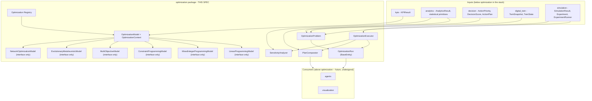
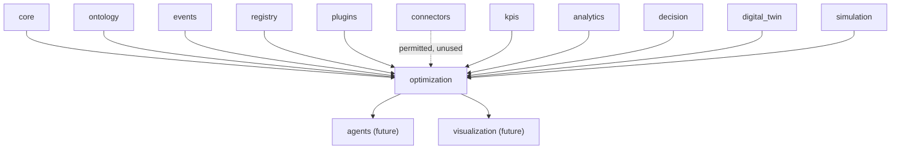
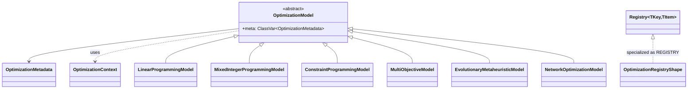
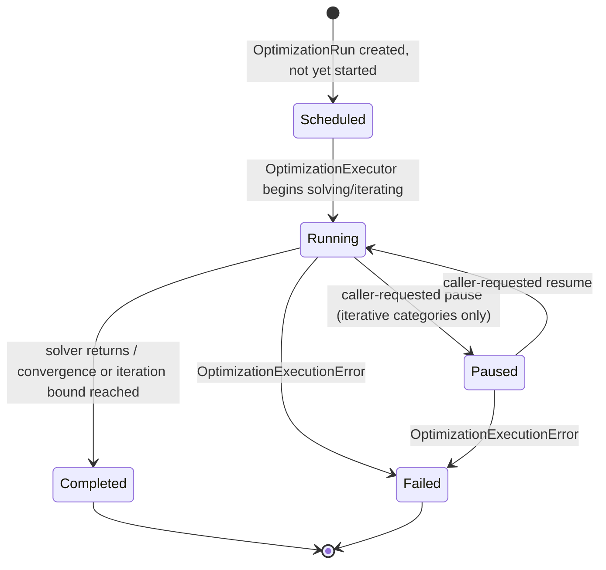
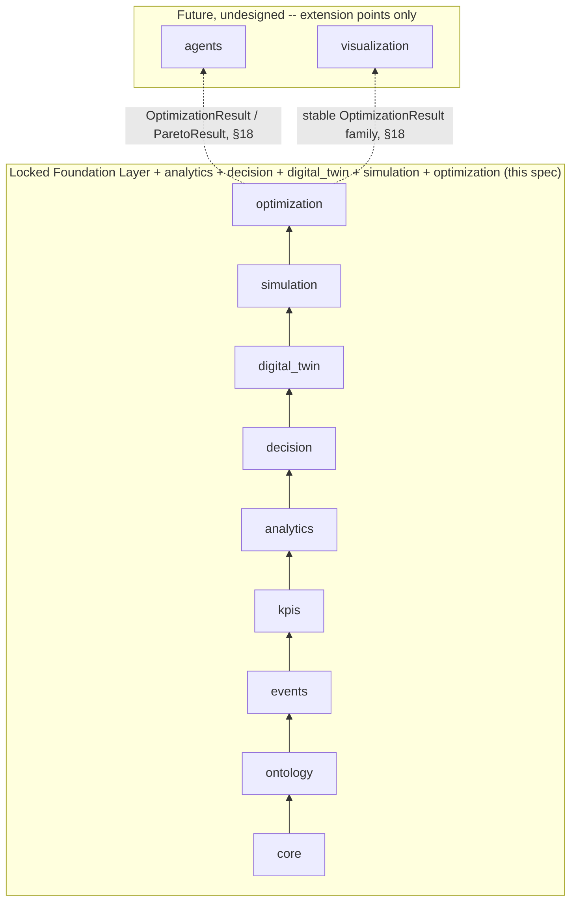

# Optimization — Design Specification

| | |
|---|---|
| **Document ID** | AH-DS-10 |
| **Package** | `mineproductivity.optimization` |
| **Status** | Draft — Design Complete, Pending Implementation |
| **Version** | 1.0.0 |
| **Conforms to** | Master Architecture Handbook v1.0; Reference Implementation Blueprint v1.0; Developer & Cookbook Guide Parts I–III |
| **Builds on** | Core Foundation Library v0.2.0 (LOCKED); Event Framework spec 01 (LOCKED, `events` v0.3.0); Ontology Framework spec 02 (LOCKED, `ontology` v0.4.0); Registry Framework spec 03 (LOCKED, `registry`/`plugins` v0.5.0); Connector Framework spec 04 (LOCKED, `connectors` v0.6.0); KPI Engine spec 05 (LOCKED, `kpis` v0.7.0); Analytics Engine spec 06 (LOCKED, `analytics` v0.8.0); Decision Intelligence spec 07 (LOCKED, `decision` v0.9.0); Digital Twin spec 08 (LOCKED, `digital_twin` v1.0.0); Simulation spec 09 (LOCKED, `simulation` v1.1.0) |
| **Author** | Chief Software Architect, MineProductivity |
| **Classification** | Public — Open Source Design Documentation |

## Document Control

Design specification only — no implementation. This document designs `mineproductivity.optimization`, the fifth package built on top of the Foundation Layer, sitting directly above the now-locked `simulation`. Nothing in this specification proposes, requires, or hints at a change to any file, public API, or dependency rule in `core`, `events`, `ontology`, `registry`, `plugins`, `connectors`, `kpis`, `analytics`, `decision`, `digital_twin`, or `simulation`. Every object model, class name, and enum member cited from a lower package is taken verbatim from that package's own `__init__.py` public export list or its own governing design specification. Section numbering below (1–37) is locked before drafting and does not change during it: seven front-matter sections (Purpose through Public API), twenty-two sections domain-specific to this package's own required topics (Optimization Abstractions through Metadata), and eight closing sections (Extension Points through Future Roadmap) — the same *documentation structure*, *validation requirements*, *terminology-consistency discipline*, and *per-module seven-field package-structure treatment* as specs 06, 07, 08, and 09.

Cross-references to spec 06 (`analytics`) in this document are given as plain-text citations (`spec 06 §N`), never as Markdown links: `06_Analytics_Engine_Design_Specification.md` exists only on the as-yet-unmerged `feature/analytics-engine` branch, not on `main`, and a Markdown link to a file absent from the current branch is a broken link (this exact failure mode was found and fixed in `ADR-0007-Decision-Intelligence.md`'s header table earlier in this series). Cross-references to specs 07, 08, and 09 (`decision`, `digital_twin`, `simulation`), which **are** present on `main`, are given as ordinary Markdown links where appropriate.

---

## 1. Purpose

Optimization answers a question no package below it was ever chartered to answer: *given the current state of a mining system, its computed KPIs, its statistically-characterized trends, a projected future under one or more scenarios, and an explicit set of constraints and objectives, what is the best achievable operational plan?* `kpis` measures what happened; `analytics` characterizes it statistically; `decision` recommends and ranks candidate actions against already-known facts; `digital_twin` represents current state and offers a bridge to hypothetical futures; `simulation` projects that state forward under a scenario. None of the eight packages below `optimization` searches a solution space for the single best combination of decisions under explicit constraints — Decision Intelligence's own locked specification says so directly: decision "never searches a solution space for an optimal plan (that is `optimization`)" (spec 07 §3.1). Optimization is the package that supplies that missing search-and-solve layer — translating objectives, constraints, and decision variables into a solvable mathematical program and returning the best feasible solution found — while still declining to choose *which* solving paradigm (linear programming, mixed-integer programming, constraint programming, multi-objective search, an evolutionary or metaheuristic method, or a specialized network algorithm) is correct for any given problem, leaving that choice to pluggable, independently-versioned models (§11–§16).

Optimization is, concretely, the first package positioned to fulfill three separate promises made by name across three already-locked specifications, each written before this package existed. Decision Intelligence's own Future Roadmap named `optimization` as the anticipated consumer of `ActionPriority`/`DecisionScore` "as objective-function inputs when searching for an optimal action sequence" (spec 07 §36). Digital Twin's own Future Roadmap named it the anticipated consumer of `TwinSnapshot`/`TwinState` "as scenario inputs when searching an optimal action sequence over a twin's represented condition" (spec 08 §34). Simulation's own Future Roadmap went furthest: it named `optimization` "the most direct consumer of `Experiment`/`ExperimentResult`" and positioned it to become "the first concrete implementer of `CalibrationModel`, since parameter-fitting against historical ground truth is itself a search problem" (spec 09 §37). This specification makes all three promises concrete: Optimization consumes `decision`'s prioritized, scored actions; `digital_twin`'s current and snapshot state; and `simulation`'s experiment infrastructure directly, composing rather than re-deriving each.

Optimization holds no KPI formulas, no statistical computation of its own, no business-decision or ranking logic, no simulation-execution logic, no AI-agent reasoning, no rendering, and no telemetry ingestion — all of those already exist, one or more layers down, or are explicitly out of scope, and are consumed rather than re-implemented (§3). It does not execute the plan it produces: an `OptimizationResult`'s solution is a recommended assignment of values to decision variables, not an instruction dispatched to any system, mechanical or human.

## 2. Business Objectives

1. **Turn already-known facts and already-projected futures into the single best achievable plan, not a ranked list of guesses.** `decision` ranks and recommends; `optimization` solves. Where multiple objectives conflict, Optimization surfaces the trade-off (§14) rather than silently picking a winner on the caller's behalf.
2. **Make every optimization run traceable to the problem, model, and evidence that produced it**, so a plan can be reproduced, audited, and compared exactly as rigorously as a computed KPI, a synchronized twin, or a simulated projection.
3. **Let a mine express constraints and objectives once, in a solver-independent shape, and swap the underlying solving paradigm without rewriting the problem.** An `OptimizationProblem` (§9) is defined in terms of `Objective`/`Constraint`/`DecisionVariable` value objects, never in terms of a specific library's own modeling API.
4. **Provide one shared extension point for each major optimization paradigm** (linear programming, mixed-integer programming, constraint programming, multi-objective search, evolutionary/metaheuristic methods, and network optimization, §11–§16), so a future OR-Tools, Pyomo, PuLP, or SciPy Optimize adapter plugin does not have to invent its own notion of "how does a solver plug into this platform." These six paradigms are expected to cover the recurring mining-operations problem shapes this package's brief names by name — resource allocation and goal programming (§11, §12), scheduling and routing (§13, §16), and portfolio optimization (§14) — as problem-authoring patterns against the six categories, never as additional categories of their own (§12, §16).
5. **Delegate statistical treatment of optimization outputs to `analytics`, never re-derive it.** Plan comparison and post-optimality analysis (§19–§20) produce raw `OptimizationResult` collections and hand them to `analytics`' existing statistical primitives — Optimization does not own Analytics (per this package's own charter, §3.2) and does not grow a second, competing statistics surface.
6. **Reuse `simulation`'s experiment infrastructure for searches over candidate scenarios, rather than inventing a parallel one.** Where an optimization search is naturally expressed as running many candidate `simulation.Scenario`s and comparing outcomes, this package composes `simulation.ExperimentRunner` directly (§17), exactly as Simulation's own Future Roadmap anticipated (spec 09 §37).

## 3. Architectural Principles

1. **Solving, not measurement, characterization, recommendation, projection, or representation.** Optimization searches a constrained solution space for the best feasible assignment of decision variables; it never computes a KPI, never performs the statistical characterization `analytics` owns, never ranks or recommends a business action the way `decision` does, never projects a system's state forward the way `simulation` does, and never maintains a synchronized representation the way `digital_twin` does (out of scope entirely, §4). Where a capability is deliberately deferred to a pluggable model, this design defines an interface for it (§11–§16) rather than a placeholder implementation.
2. **Consumption without redefinition.** Optimization never recomputes a KPI value, a statistical judgment, a recommendation's priority or score, a twin's current state, or a simulated projection. `OptimizationContext` (§8) carries `kpi_results`, `analytics_results`, `decision_results`, `twin_snapshot`, and `simulation_results` exactly as `kpis.KPIResult`, `analytics.AnalyticsResult`, `decision.DecisionResult` (and its `ActionPriority`/`DecisionScore` subtypes), `digital_twin.TwinSnapshot`, and `simulation.SimulationResult` already define them — read, never re-derived. This is the single most important boundary in this specification (§8, §34).
3. **State as a solved record, never a mutable scratchpad.** `OptimizationRun` (§10) follows `simulation.SimulationRun`'s own precedent (spec 09 §3.3, §10), which itself followed `digital_twin.Twin`'s (spec 08 §3.3, §8): it subclasses `core.BaseEntity[str]`, and every solve or iteration produces a new instance via a `with_state()`-style helper, never an in-place mutation. Optimization is the third package in this series to reach for this idiom, not the first to invent it.
4. **Reuse over reinvention, including literal inheritance and direct composition where the shape genuinely fits.** `OptimizationRunRepository` **is** `core.BaseRepository[OptimizationRun, str]` (§24), exactly mirroring `simulation.SimulationRunRepository`'s own literal reuse (spec 09 §24) — the third occurrence of this exact pattern. Plan comparison and post-optimality analysis compose `analytics`' existing statistical primitives (§19–§20) rather than reimplementing them; a search over candidate scenarios composes `simulation.ExperimentRunner` directly (§17) rather than defining a second one. Where no dedicated new mechanism is needed at all, this package says so explicitly rather than inventing one for its own sake (§26).
5. **Interfaces before algorithms, where the algorithm is a modeling, solver, or search-strategy choice.** Linear programming, mixed-integer programming, constraint programming, multi-objective, evolutionary/metaheuristic, and network-optimization solving logic are each declared as stable abstract contracts now (§11–§16); no specific solver or algorithm is chosen or shipped for any of the six. This is the fifth package in the series to apply this discipline (after `analytics`' forecasting/anomaly/outlier interfaces, `decision`'s root-cause/what-if interfaces, `digital_twin`'s simulation interface, and `simulation`'s Monte Carlo/discrete-event/system-dynamics/calibration interfaces) — the pattern is now a platform-wide convention, not a one-off, and this package applies it across more categories (six) than any prior package.
6. **Zero upward leakage.** No lower package (`core` through `simulation`) imports `optimization`, mechanically enforced by the same AST-based `TestNoForbiddenDependencies` pattern every existing package already uses.
7. **One extension mechanism, platform-wide.** New optimization categories, models, and solver adapters are added exactly the way a new KPI, connector, ontology entity type, Analytics model, Decision strategy, twin type, or simulation model is added: subclass, register, discover via entry points (§30, §31). No bespoke Optimization-specific plugin mechanism is invented.

## 4. Overall Architecture

Optimization occupies exactly one position in the platform's dependency chain — directly above `simulation`, and (as of this specification) at the top of the currently-designed stack:

```
core → ontology → events → kpis → analytics → decision → digital_twin → simulation → optimization
```

Everything below `optimization` exists, from its point of view, to produce well-formed inputs: `kpis.KPIResult` and `analytics.AnalyticsResult` for already-correct measurement and characterization; `decision.ActionPriority`/`DecisionScore` for already-computed urgency/impact/effort and scoring components an objective function may weight directly; `digital_twin.TwinSnapshot`/`TwinState` for a current-condition starting point; `simulation.SimulationResult`/`Experiment`/`ExperimentResult` for projected outcomes under one or more scenarios. Everything above `optimization` (`agents`, `visualization` — future, undesigned packages, §37) exists to consume `optimization`'s outputs.



Optimization is deliberately **not** a sixth computation engine competing with `kpis`/`analytics`/`decision`, nor a second stateful-representation layer competing with `digital_twin`, nor a second projection layer competing with `simulation`. It has no formula language, no statistics library, no rule engine, no independent notion of "current asset condition," and no scenario-projection algorithm of its own — it borrows evidence from every package below it and hands its own statistical questions to `analytics`.

Every package below `optimization` that defines a central "as-object" abstraction (`kpis.BaseKPI`, `analytics.AnalyticsModel`, `decision.DecisionModel`, `simulation.SimulationModel`) makes it stateless; `digital_twin.Twin` broke from that pattern because representing a persisting asset is inherently about accumulated history, and `simulation.SimulationRun` inherited that statefulness one layer up for a related reason: a running simulation is itself a piece of history the instant it starts. `optimization.OptimizationRun` inherits it again for the analogous reason, while `OptimizationModel` itself stays stateless — an established, three-package-deep precedent, not a novel decision.

**Runtime request flow**, walking the diagram above for the single most common entry point (`OptimizationExecutor.execute`, §10): a caller supplies a `run_id`, an `OptimizationProblem`, and an `OptimizationContext` already carrying whatever lower-package evidence the problem's authoring process considered relevant. The executor never reaches back into a lower package on its own initiative for more — every fact arrives pre-fetched, exactly once per call. Execution touches only this package's own object model until it produces an `OptimizationResult`, the one type every future consumer above `optimization` (§37) is expected to read — the same "gather evidence once, at the boundary" shape every package below it already follows at its own layer.

## 5. Dependency Graph

**Permitted imports (platform layering rule, verbatim from this package's brief):** `optimization` may import `mineproductivity.core`, `mineproductivity.ontology`, `mineproductivity.events`, `mineproductivity.registry`, `mineproductivity.plugins`, `mineproductivity.connectors`, `mineproductivity.kpis`, `mineproductivity.analytics`, `mineproductivity.decision`, `mineproductivity.digital_twin`, and `mineproductivity.simulation`, and nothing else.

**Actually exercised by this design:** `core` (`BaseEntity`, `BaseRepository`/`InMemoryRepository`, `BaseSpecification`, `Result`/`Maybe`, `BaseValueObject`, `serialization`, exceptions), `kpis`/`decision` (`KPIResult`, `DecisionResult` and its `ActionPriority`/`DecisionScore`/`ActionPlan` subtypes — read into `OptimizationContext` and, for the latter three, directly into objective-function construction, §8, §9), `digital_twin` (`TwinSnapshot`, `TwinState` — a problem's starting condition, §9), `simulation` (`SimulationResult`, `Experiment`, `ExperimentRunner` — evidence and, for the latter, direct composition for candidate-scenario search, §9, §17), and `analytics` (`AnalyticsResult`, plus statistical primitives — `describe`, `confidence_interval`, `StatisticalSummary`, `DistributionSummary` — consumed directly by plan comparison and post-optimality analysis, §19–§20). `ontology` is available for a problem's scope vocabulary (mirroring `simulation.Scenario`'s identical use, spec 09 §5) but introduces no new concept. `events` is available for `AsOf` framing but not otherwise exercised — `optimization` reads already-computed evidence, never raw event history. `connectors` is permitted but, exactly as in every package above it, **not** exercised — Optimization operates on already-computed, already-projected facts, never a vendor-specific wire format (§34).



**Depended on by (future, undesigned):** `agents`, `visualization`.

**Forbidden, mechanically enforced:**
- `optimization` MUST NOT be imported by `core`, `ontology`, `events`, `registry`, `plugins`, `connectors`, `kpis`, `analytics`, `decision`, `digital_twin`, or `simulation` — checked by an AST walk exactly like every existing package's `TestNoForbiddenDependencies` test.
- `optimization` MUST NOT import `agents` or `visualization` — those are all strictly above it and, as of this specification, do not yet exist.
- No cycle exists or is introduced: `core → ontology → events → kpis → analytics → decision → digital_twin → simulation → optimization` is a strict total order for every symbol this package uses.

## 6. Package Structure

```
src/mineproductivity/optimization/
├── __init__.py            # public API surface (§7)
├── abstractions.py          # OptimizationModel (ABC), OptimizationContext
├── metadata.py                # OptimizationMetadata, OptimizationCategory
├── problem.py                    # Objective, Constraint, DecisionVariable, OptimizationProblem, ProblemStatus, and their enums
├── run.py                           # OptimizationRun (BaseEntity[str], concrete), RunStatus
├── state.py                           # OptimizationState
├── linear_programming.py                 # LinearProgrammingModel (ABC) -- interface only, §11
├── mixed_integer_programming.py             # MixedIntegerProgrammingModel (ABC) -- interface only, §12
├── constraint_programming.py                   # ConstraintProgrammingModel (ABC) -- interface only, §13
├── multi_objective.py                             # MultiObjectiveModel (ABC) -- interface only, §14
├── evolutionary.py                                   # EvolutionaryMetaheuristicModel (ABC) -- interface only, §15
├── network_optimization.py                              # NetworkOptimizationModel (ABC) -- interface only, §16
├── executor.py                                             # OptimizationExecutor
├── comparison.py                                              # PlanComparator
├── sensitivity.py                                                # SensitivityAnalyzer
├── discovery.py                                                     # by_category(), by_scope()
├── persistence.py                                                     # OptimizationRunRepository
├── result.py                                                             # OptimizationResult, ParetoResult
├── _registry.py                                                            # REGISTRY, register
├── exceptions.py
└── README.md
```

Nineteen implementation modules plus `__init__.py` and `README.md` — fewer than `simulation`'s twenty-one (spec 09 §6) despite covering more paradigms (six categories versus four), for two deliberate reasons documented in full at §26 and §17: no dedicated cache module, and no dedicated experiment-orchestration module, because this package composes `simulation.ExperimentRunner` directly rather than defining a second one. Every module below is specified against the same seven fields specs 06–09 used: Purpose, Responsibilities, Public Classes, Public Functions, Public API, Dependencies, and Extension Points.

### `abstractions.py`
- **Purpose:** the "Optimization-as-object" root, and the collaborator bundle a concrete model needs.
- **Responsibilities:** define the common metadata slot every optimization model carries; bundle `OptimizationContext`'s evidence fields. Deliberately does **not** define a single shared abstract solve method (see §8) — linear programming, mixed-integer programming, constraint programming, multi-objective search, evolutionary/metaheuristic iteration, and network optimization are structurally different enough that forcing one shared signature would either lose information or need an escape-hatch `Any`-typed payload.
- **Public Classes:** `OptimizationModel` (ABC), `OptimizationContext`.
- **Public Functions:** None.
- **Public API:** `OptimizationModel`, `OptimizationContext`.
- **Dependencies:** `core` (`Result`), `kpis` (`KPIResult`), `analytics` (`AnalyticsResult`), `decision` (`DecisionResult`), `digital_twin` (`TwinSnapshot`), `simulation` (`SimulationResult`).
- **Extension Points:** every category base in `linear_programming.py`/`mixed_integer_programming.py`/`constraint_programming.py`/`multi_objective.py`/`evolutionary.py`/`network_optimization.py` subclasses `OptimizationModel`.

### `metadata.py`
- **Purpose:** the minimal registration schema for a discoverable `OptimizationModel` type (§29).
- **Responsibilities:** carry just enough structured information for registry introspection and entry-point discovery; enforce the closed `OptimizationCategory` namespace.
- **Public Classes:** `OptimizationMetadata`, `OptimizationCategory` (enum).
- **Public Functions:** None.
- **Public API:** `OptimizationMetadata`, `OptimizationCategory`.
- **Dependencies:** `core` (`BaseMetadata`, `ValidationError`).
- **Extension Points:** a new `OptimizationCategory` member is a closed-enum, governance-reviewed change, mirroring `simulation.SimulationCategory`'s/`digital_twin.TwinCategory`'s closed-enum rule (spec 09 §29, spec 08 §26).

### `problem.py`
- **Purpose:** problems as versioned, governed artifacts (§9) — the problem-definition responsibility.
- **Responsibilities:** bundle a named, versioned specification of objectives, constraints, decision variables, and starting evidence; carry a governance lifecycle.
- **Public Classes:** `Objective`, `ObjectiveDirection` (enum), `Constraint`, `ConstraintOperator` (enum), `DecisionVariable`, `VariableDomain` (enum), `OptimizationProblem`, `ProblemStatus` (enum).
- **Public Functions:** None.
- **Public API:** all eight names listed above.
- **Dependencies:** `core` (`BaseValueObject`, `ValidationError`), `digital_twin` (`TwinSnapshot`), `events` (`AsOf`).
- **Extension Points:** a new `OptimizationProblem` is authored and registered exactly like a new `simulation.Scenario`/`decision.Policy` (§30, §31); an existing `OptimizationProblem` is never edited in place — a changed problem is a new version with the old one moved to `Superseded` (§9, §25).

### `run.py`
- **Purpose:** optimization execution's stateful core (§10).
- **Responsibilities:** subclass `core.BaseEntity[str]` directly; carry the current `OptimizationState`; expose the non-mutating `with_state()` update helper.
- **Public Classes:** `OptimizationRun`, `RunStatus` (enum).
- **Public Functions:** None.
- **Public API:** `OptimizationRun`, `RunStatus`.
- **Dependencies:** `core` (`BaseEntity`), `state.py` (`OptimizationState`).
- **Extension Points:** none — `OptimizationRun`'s shape is closed; a new optimization methodology is a new `OptimizationModel` category (§11–§16), never a change to `OptimizationRun` itself.

### `state.py`
- **Purpose:** an optimization run's current condition (§10).
- **Responsibilities:** represent one run's current candidate solution, incumbent objective value(s), and search progress as of the last executed solve or iteration.
- **Public Classes:** `OptimizationState`.
- **Public Functions:** None.
- **Public API:** `OptimizationState`.
- **Dependencies:** `core` (`BaseValueObject`, `ValidationError`).
- **Extension Points:** a new model-specific attribute is carried in `OptimizationState.attributes` (an open `Mapping[str, Any]`), never as a new typed field on the shared shape — mirrors `simulation.SimulationState.attributes`'s identical escape hatch (spec 09 §10).

### `linear_programming.py` / `mixed_integer_programming.py` / `constraint_programming.py` / `network_optimization.py`
- **Purpose:** interface-only extension points (§11–§13, §16) — no concrete implementation in any of the four modules.
- **Responsibilities:** define a stable abstract contract a future solver-adapter plugin implements against, one per paradigm.
- **Public Classes:** `LinearProgrammingModel` (ABC, `linear_programming.py`), `MixedIntegerProgrammingModel` (ABC, `mixed_integer_programming.py`), `ConstraintProgrammingModel` (ABC, `constraint_programming.py`), `NetworkOptimizationModel` (ABC, `network_optimization.py`).
- **Public Functions:** None.
- **Public API:** all four classes listed above.
- **Dependencies:** `abstractions.py`, `problem.py`, `result.py` (for return-type annotations only).
- **Extension Points:** the entire purpose of these four modules — a concrete subclass of any one is a first-class extension (§30.2), never added inside these modules themselves (§34).

### `multi_objective.py`
- **Purpose:** interface-only extension point (§14) — no concrete implementation.
- **Responsibilities:** define a stable abstract contract for producing a Pareto front of non-dominated solutions across two or more conflicting objectives.
- **Public Classes:** `MultiObjectiveModel` (ABC).
- **Public Functions:** None.
- **Public API:** `MultiObjectiveModel`.
- **Dependencies:** `abstractions.py`, `problem.py`, `result.py`.
- **Extension Points:** same as the four modules above — interface only (§30.2, §34).

### `evolutionary.py`
- **Purpose:** interface-only extension point (§15) — no concrete implementation.
- **Responsibilities:** define a stable abstract contract for one generation/iteration of a population- or trajectory-based metaheuristic search.
- **Public Classes:** `EvolutionaryMetaheuristicModel` (ABC).
- **Public Functions:** None.
- **Public API:** `EvolutionaryMetaheuristicModel`.
- **Dependencies:** `abstractions.py`, `problem.py`, `state.py`.
- **Extension Points:** same as the modules above — interface only (§30.2, §34).

### `executor.py`
- **Purpose:** orchestrates one `OptimizationRun` (§10).
- **Responsibilities:** dispatch to the registered `OptimizationModel`'s category-specific method, iterate to convergence or a termination bound where the category is iterative, persist the resulting state.
- **Public Classes:** `OptimizationExecutor`.
- **Public Functions:** None.
- **Public API:** `OptimizationExecutor`.
- **Dependencies:** `persistence.py` (`OptimizationRunRepository`), `result.py` (`OptimizationResult`).
- **Extension Points:** none — a new execution mode is a new `OptimizationModel` category, not a change to the executor's own dispatch logic (§30).

### `comparison.py`
- **Purpose:** plan comparison (§19).
- **Responsibilities:** compare `OptimizationResult` collections across two or more problems or solver configurations by delegating statistical treatment to `analytics`.
- **Public Classes:** `PlanComparator`.
- **Public Functions:** None.
- **Public API:** `PlanComparator`.
- **Dependencies:** `analytics` (`describe`, `StatisticalSummary`), `result.py`.
- **Extension Points:** a new comparison dimension is an additive change to `PlanComparator.compare`'s inputs, never a new statistics implementation here.

### `sensitivity.py`
- **Purpose:** post-optimality (sensitivity) analysis (§20).
- **Responsibilities:** characterize how an optimal solution's objective value and feasibility respond to perturbations in constraint bounds or objective coefficients, handing the resulting `OptimizationResult` collection to `analytics` for distributional/statistical treatment.
- **Public Classes:** `SensitivityAnalyzer`.
- **Public Functions:** None.
- **Public API:** `SensitivityAnalyzer`.
- **Dependencies:** `analytics` (`DistributionSummary`, `confidence_interval`), `problem.py`, `result.py`.
- **Extension Points:** a new perturbation strategy (e.g. simultaneous multi-parameter ranging) is an additive method here, never a new statistics implementation.

### `discovery.py`
- **Purpose:** optimization discovery (§22) — category/scope-based lookup over currently-known runs.
- **Responsibilities:** provide named `core.BaseSpecification` factory functions for the two most common lookup predicates, mirroring `simulation.discovery`'s identical pattern (spec 09 §22).
- **Public Classes:** None.
- **Public Functions:** `by_category`, `by_scope`.
- **Public API:** `by_category`, `by_scope`.
- **Dependencies:** `core` (`BaseSpecification`, `PredicateSpecification`), `run.py` (`OptimizationRun`).
- **Extension Points:** a new named lookup predicate is a new function here, composing `core.PredicateSpecification`, never a new query mechanism.

### `persistence.py`
- **Purpose:** where optimization runs are stored (§24).
- **Responsibilities:** define the storage contract for run instances, keyed by their own identity.
- **Public Classes:** None (`OptimizationRunRepository` is a `type` alias, not a new class).
- **Public Functions:** None.
- **Public API:** `OptimizationRunRepository`.
- **Dependencies:** `core` (`BaseRepository`, `InMemoryRepository`), `run.py` (`OptimizationRun`).
- **Extension Points:** a production-grade backend (SQL, document store) implements `core.BaseRepository[OptimizationRun, str]` directly — no `optimization`-specific ABC exists to implement instead (§3.4, §24).

### `result.py`
- **Purpose:** every concrete outcome type this package produces (§18).
- **Responsibilities:** define one shared envelope (`OptimizationResult`) and the concrete results built on it.
- **Public Classes:** `OptimizationResult`, `ParetoResult`.
- **Public Functions:** None.
- **Public API:** both classes listed above.
- **Dependencies:** `core` (`BaseValueObject`), `state.py` (`OptimizationState`).
- **Extension Points:** a new concrete result type is added only alongside a new capability that produces it.

### `_registry.py`
- **Purpose:** the Optimization Registry (§21), following the exact pattern `simulation._registry`/`digital_twin._registry`/`decision._registry`/`analytics._registry` established (spec 09 §21, spec 08 §17, spec 07 §32, spec 06 §33) rather than reimplementing registration.
- **Responsibilities:** hold the process-wide `Registry[str, type[OptimizationModel]]` instance; validate a non-empty `code`; reject a duplicate, non-identical re-registration.
- **Public Classes:** None.
- **Public Functions:** `register`.
- **Public API:** `REGISTRY`, `register`.
- **Dependencies:** `registry` (`Registry`), `metadata.py`, `exceptions.py`.
- **Extension Points:** none within this module itself — it is the extension mechanism (§31) other modules and third-party plugins use.

### `exceptions.py`
- **Purpose:** the package's exception hierarchy, used throughout §8–§31.
- **Responsibilities:** define every raised error type this package's public API can produce.
- **Public Classes:**
  ```python
  class OptimizationValidationError(ValidationError):
      """An OptimizationMetadata, OptimizationProblem, or
      OptimizationState failed validation (§29, §9, §10) -- e.g. an
      empty code, a Problem with no objectives, or a State with empty
      attributes."""

  class OptimizationRunNotFoundError(NotFoundError):
      """OptimizationRunRepository.get(run_id) found no run for that
      id, or REGISTRY.get(code) found no registered OptimizationModel
      for that code."""

  class OptimizationExecutionError(MineProductivityError):
      """OptimizationExecutor raised for a solve or iteration that
      should have been structurally valid -- distinct from a
      legitimately-infeasible-problem case (§8's 'qualify, don't
      coerce' rule), which returns an OptimizationResult carrying a
      warning and infeasible=True instead of raising."""

  class OptimizationVersionConflictError(RegistrationError):
      """A plugin attempted to re-register an existing
      OptimizationModel type code with materially different metadata
      without a version bump, mirroring
      simulation.SimulationVersionConflictError (spec 09 §6)."""

  class ProblemConflictError(RegistrationError):
      """A governance action attempted to re-register an existing,
      Active OptimizationProblem code with different objectives,
      constraints, or variables without a version bump -- the
      Problem-layer analogue of OptimizationVersionConflictError,
      mirroring simulation.ScenarioConflictError's identical
      reasoning (spec 09 §6)."""
  ```
- **Public Functions:** None.
- **Public API:** all five exception classes listed above.
- **Dependencies:** `core` (`ValidationError`, `NotFoundError`, `MineProductivityError`), `registry` (`RegistrationError`).
- **Extension Points:** a new exception type is added only alongside the specific failure mode it represents.

## 7. Public API

```python
from mineproductivity.optimization import (
    # Abstractions
    OptimizationModel, OptimizationContext,
    # Metadata
    OptimizationMetadata, OptimizationCategory,
    # Problem definition
    Objective, ObjectiveDirection, Constraint, ConstraintOperator,
    DecisionVariable, VariableDomain, OptimizationProblem, ProblemStatus,
    # Execution
    OptimizationRun, RunStatus, OptimizationExecutor,
    # State
    OptimizationState,
    # Interfaces only -- no concrete implementation (§11-§16)
    LinearProgrammingModel, MixedIntegerProgrammingModel,
    ConstraintProgrammingModel, MultiObjectiveModel,
    EvolutionaryMetaheuristicModel, NetworkOptimizationModel,
    # Comparison and sensitivity (delegate to analytics)
    PlanComparator, SensitivityAnalyzer,
    # Discovery
    by_category, by_scope,
    # Persistence
    OptimizationRunRepository,
    # Result models
    OptimizationResult, ParetoResult,
    # Registry (Registry Framework specialization)
    register, REGISTRY,
    # Exceptions
    OptimizationValidationError, OptimizationRunNotFoundError,
    OptimizationExecutionError, OptimizationVersionConflictError,
    ProblemConflictError,
)
```

Every name above is intended to be **stable once implementation begins**, per the same "prefer fewer, carefully designed interfaces" discipline specs 06–09 already applied — no speculative "maybe useful" symbol is included; each name maps directly to one of the sections below.

## 8. Optimization Abstractions

```python
class OptimizationContext:
    """Bundles the collaborators and evidence an OptimizationModel may
    need -- the optimization-layer counterpart to
    simulation.SimulationContext (spec 09 §8), one layer up, extended
    with digital_twin and simulation evidence directly since
    optimization is permitted to consume both. Carries the
    KPIResult/AnalyticsResult/DecisionResult evidence already gathered,
    plus optional TwinSnapshot and simulation results a problem's
    authoring process considered relevant."""

    def __init__(
        self,
        *,
        kpi_results: "Sequence[KPIResult]" = (),
        analytics_results: "Sequence[AnalyticsResult]" = (),
        decision_results: "Sequence[DecisionResult]" = (),
        twin_snapshot: "TwinSnapshot | None" = None,
        simulation_results: "Sequence[SimulationResult]" = (),
    ) -> None: ...


class OptimizationModel(ABC):
    """The root of every registrable optimization model type --
    'Optimization-as-object,' the direct counterpart of
    kpis.BaseKPI/analytics.AnalyticsModel/decision.DecisionModel/
    digital_twin.Twin/simulation.SimulationModel, five/four/three/two/
    one layers down respectively. Deliberately carries no shared
    abstract solve method: linear programming, mixed-integer
    programming, constraint programming, multi-objective search,
    evolutionary/metaheuristic iteration, and network optimization are
    structurally different enough (§11-§16) that a single shared
    signature would either lose information or need an escape-hatch
    Any-typed payload -- the identical reasoning
    simulation.MonteCarloModel/DiscreteEventModel/SystemDynamicsModel
    already applied one layer down (spec 09 §8)."""

    meta: ClassVar[OptimizationMetadata]
```



Unlike `simulation.CalibrationModel` (spec 09 §16), which is deliberately **not** a `SimulationModel` subclass because calibration is a conceptually distinct operation from running a model forward, every one of Optimization's six category interfaces genuinely **is** an `OptimizationModel` — each answers the same underlying question ("what is the best assignment of these decision variables"), differing only in *how* it searches, not in *what* it is being asked. `OptimizationModel` subclasses are stateless (§29) — statefulness in this package lives entirely in `OptimizationRun` (§10), never in a model implementation.

## 9. Problem Definition

```python
class ObjectiveDirection(Enum):
    """Whether an Objective is minimized or maximized."""

    MINIMIZE = "minimize"
    MAXIMIZE = "maximize"


@dataclasses.dataclass(frozen=True, slots=True)
class Objective(BaseValueObject):
    """One term of an OptimizationProblem's objective function. A
    single-objective problem declares exactly one; a multi-objective
    problem (§14) declares two or more, each carrying its own
    direction and an optional weight a MultiObjectiveModel
    implementation may use for scalarization -- though a Pareto-search
    implementation is free to ignore weight entirely and search the
    full trade-off surface instead."""

    name: str
    direction: ObjectiveDirection
    weight: float = dataclasses.field(default=1.0, kw_only=True)


class ConstraintOperator(Enum):
    """The relational operator an OptimizationProblem's Constraint
    enforces between its expression and its bound."""

    LESS_EQUAL = "<="
    GREATER_EQUAL = ">="
    EQUAL = "="


@dataclasses.dataclass(frozen=True, slots=True)
class Constraint(BaseValueObject):
    """One constraint an OptimizationProblem's feasible region must
    satisfy. `expression` is a solver-independent string naming which
    decision variables and coefficients participate (e.g.
    '2*trucks_route_a + 3*trucks_route_b'); this package never
    parses or evaluates it -- a concrete OptimizationModel
    implementation's own translation into its solver library's native
    modeling API is where `expression` is actually interpreted (§17)."""

    name: str
    expression: str
    operator: ConstraintOperator
    bound: float


class VariableDomain(Enum):
    """The domain a DecisionVariable's optimal value is drawn from."""

    CONTINUOUS = "continuous"
    INTEGER = "integer"
    BINARY = "binary"


@dataclasses.dataclass(frozen=True, slots=True)
class DecisionVariable(BaseValueObject):
    """One variable an OptimizationModel solves for. `lower_bound`/
    `upper_bound` default to an unbounded-below/unbounded-above
    convention (None) rather than a magic sentinel float, matching
    core's own None-over-sentinel convention platform-wide."""

    name: str
    domain: VariableDomain
    lower_bound: "float | None" = dataclasses.field(default=None, kw_only=True)
    upper_bound: "float | None" = dataclasses.field(default=None, kw_only=True)


class ProblemStatus(Enum):
    """The OptimizationProblem lifecycle -- mirrors
    simulation.ScenarioStatus (spec 09 §9) exactly, which itself
    mirrors decision.DecisionStatus (spec 07 §12), applied here to
    governed optimization-problem artifacts rather than to simulation
    configurations or business policies."""

    PROPOSED = "proposed"
    ACTIVE = "active"
    SUPERSEDED = "superseded"
    RETIRED = "retired"


@dataclasses.dataclass(frozen=True, slots=True)
class OptimizationProblem(BaseValueObject):
    """A named, versioned optimization problem statement -- the
    governed artifact this package owns, analogous to
    simulation.Scenario (spec 09 §9) one layer down."""

    code: str                                          # e.g. "FLEET.NightShiftAllocation"
    version: str = dataclasses.field(default="1.0.0", kw_only=True)
    status: ProblemStatus = dataclasses.field(
        default_factory=lambda: ProblemStatus.PROPOSED, kw_only=True
    )
    model_code: str = dataclasses.field(kw_only=True)   # OptimizationMetadata.code to run
    objectives: "tuple[Objective, ...]" = dataclasses.field(kw_only=True)
    constraints: "tuple[Constraint, ...]" = dataclasses.field(default=(), kw_only=True)
    variables: "tuple[DecisionVariable, ...]" = dataclasses.field(kw_only=True)
    parameters: "Mapping[str, Any]" = dataclasses.field(default_factory=dict, kw_only=True)
    initial_state: "TwinSnapshot | None" = dataclasses.field(default=None, kw_only=True)
    as_of: "AsOf | None" = dataclasses.field(default=None, kw_only=True)

    def validate(self) -> None:
        if not self.code.strip():
            raise ValidationError("OptimizationProblem.code must not be empty")
        if not self.model_code.strip():
            raise ValidationError("OptimizationProblem.model_code must not be empty")
        if not self.objectives:
            raise ValidationError("OptimizationProblem.objectives must not be empty")
        if not self.variables:
            raise ValidationError("OptimizationProblem.variables must not be empty")
```

`OptimizationProblem.initial_state` reuses `digital_twin.TwinSnapshot` directly (spec 08 §13) rather than defining a second "starting condition" concept, exactly as `simulation.Scenario.initial_state` already does one layer down (spec 09 §9) — optimizing from the fleet's actual current condition versus a purely hypothetical one is the same `OptimizationProblem` shape either way. `OptimizationProblem.parameters` is the same open `Mapping[str, Any]` escape hatch `simulation.Scenario.parameters`/`kpis.KPIMetadata.attributes` already establish (spec 09 §9, spec 05 §10.1) — a `NetworkOptimizationModel` implementation, for instance, is expected to encode its graph structure there rather than this package growing a graph-specific value object used by exactly one category.

An `Active` `OptimizationProblem`, like an `Active` `simulation.Scenario` or `decision.Policy`, is a public contract: it is never edited in place. A changed problem is published as a new version; the prior version transitions to `Superseded`, never silently repointed — enforced by `ProblemConflictError` (§6) raised when a governance action attempts to re-register an existing, `Active` problem code with materially different objectives, constraints, or variables without a version bump.

Unlike `kpis.DependencyGraph` (spec 05 §10.8) and `decision.ActionPlanner`'s own topological ordering (spec 07 §21), `OptimizationProblem`'s constraints and decision variables carry no inherent dependency order to resolve — every constraint is imposed simultaneously on the same feasible region, and a solver evaluates them jointly, not in a sequence this package needs to compute. No dependency-graph-shaped mechanism is introduced here for that reason; there is nothing analogous for it to resolve.

## 10. Optimization Execution

```python
class RunStatus(Enum):
    """An OptimizationRun's own operational lifecycle -- mirrors
    simulation.RunStatus (spec 09 §10) exactly in shape (both track
    an instance-level execution progression, not a governance
    lifecycle), applied here to a solving or completed optimization
    attempt instead of a running or completed simulation."""

    SCHEDULED = "scheduled"
    RUNNING = "running"
    PAUSED = "paused"
    COMPLETED = "completed"
    FAILED = "failed"


@dataclasses.dataclass(frozen=True, slots=True, eq=False)
class OptimizationRun(BaseEntity[str]):
    """The root of one executing or completed optimization attempt --
    'Run-as-entity,' following simulation.SimulationRun's own
    precedent (spec 09 §3.3, §10) exactly, which itself followed
    digital_twin.Twin's (spec 08 §3.3, §8): id (inherited) is the
    run's identity, and representing a state change means producing a
    NEW OptimizationRun instance via with_state(), never mutating
    fields in place."""

    problem_code: str
    state: "OptimizationState"
    status: RunStatus = dataclasses.field(default=RunStatus.SCHEDULED)

    def with_state(self, state: "OptimizationState", *, status: "RunStatus | None" = None) -> "OptimizationRun":
        """Returns a NEW OptimizationRun instance with `state` (and
        optionally `status`) replacing the current ones -- the
        dataclasses.replace-style helper core.BaseEntity's own
        docstring anticipates, identical to SimulationRun.with_state()
        (spec 09 §10) and Twin.with_state() (spec 08 §8)."""
        return dataclasses.replace(self, state=state, status=status or self.status)
```



`OptimizationRun` carries no `_apply`/`_solve`-style abstract method of its own — unlike `Twin`, which advances via a single category-independent `_apply`, an `OptimizationRun`'s next `OptimizationState` is produced by whichever `OptimizationModel` category method (§11–§16) `OptimizationExecutor` (§6) dispatches to on the run's behalf, exactly as `simulation.SimulationRun` already delegates to whichever `SimulationModel` category method `SimulationExecutor` dispatches to (spec 09 §10). This is a deliberate difference from `Twin`, recorded because a reader familiar with spec 08 might otherwise expect an identical method shape here; `OptimizationRun` is the *record* of an execution, not the executor itself.

```mermaid
sequenceDiagram
    participant Caller
    participant Exec as OptimizationExecutor
    participant Repo as OptimizationRunRepository
    participant Model as OptimizationModel (category subclass)

    Caller->>Exec: execute(run_id, problem, context)
    Exec->>Repo: get(run_id)
    Repo-->>Exec: OptimizationRun (status=Scheduled)
    Exec->>Repo: remove(run_id); add(run.with_state(state, status=Running))
    alt single-shot category (LP / MIP / CP / Network / MultiObjective)
        Exec->>Model: dispatch to _solve_lp / _solve_mip / _solve_cp / _solve_network / _solve_pareto (§11-§14, §16)
        Model-->>Exec: OptimizationResult (or ParetoResult)
    else iterative category (Evolutionary/Metaheuristic)
        loop until convergence or iteration bound
            Exec->>Model: dispatch to _iterate (§15)
            Model-->>Exec: next OptimizationState
            Exec->>Repo: remove(run_id); add(run.with_state(next_state))
        end
    end
    Exec->>Repo: remove(run_id); add(run.with_state(final_state, status=Completed))
    Exec-->>Caller: OptimizationResult
```

`OptimizationExecutor.execute` is the one place in this package where the dispatch decision — which category method to call, and whether to call it once or loop it to convergence — is made, and it makes that decision exactly once per run, by reading the registered `OptimizationModel`'s `OptimizationCategory` (§29) off `OptimizationProblem.model_code`, never by branching on the model's concrete Python type. Every `remove`-then-`add` pair against `OptimizationRunRepository` above is this package's own instance of the same single, narrow, already-audited mutable operation `registry.Registry.register()`, `analytics.IncrementalAccumulator`, `decision.DecisionAuditTrail`, and `simulation.SimulationExecutor`'s own identical pair (spec 09 §10) each already concentrate their own one point of mutation into (§32) — `core.BaseRepository` exposes no dedicated "replace" method, so a conforming `OptimizationRunRepository` implementation is expected to make that `remove`/`add` pair atomic per `run_id`, exactly as `simulation.SimulationRunRepository` and `digital_twin.TwinRepository` are already required to (spec 09 §32, spec 08 §29). The loop body itself never mutates an `OptimizationRun` in place — each iteration produces a new instance via `with_state()` before the repository swap.

A legitimately infeasible problem is not a special case requiring separate error handling: it is an ordinary, expected outcome for the LP/MIP/CP/Network categories, surfaced as an `OptimizationResult` with `feasible=False` and a warning (§28), never as a raised exception.

## 11. Linear Programming Interfaces (interface only)

```python
class LinearProgrammingModel(OptimizationModel, ABC):
    """The contract a future linear-programming solver adapter
    implements. THIS MODULE SHIPS NO CONCRETE SUBCLASS -- choosing a
    specific LP algorithm (simplex, interior-point) or solver library
    (SciPy Optimize's linprog, an OR-Tools GLOP wrapper) is exactly
    the kind of modeling decision this package's charter (§3.1, §3.5,
    §4) excludes."""

    @abstractmethod
    def _solve_lp(
        self, problem: "OptimizationProblem", *, context: OptimizationContext
    ) -> "OptimizationResult": ...
```

Every `DecisionVariable` a registered `LinearProgrammingModel` implementation is handed has `domain=VariableDomain.CONTINUOUS` by construction of the problems that name it — a `Problem` mixing integer/binary variables and an LP-category `model_code` is a validation error (§27, §29), never a silent relaxation to continuous. `_solve_lp` is expected to be deterministic: identical `problem`/`context` inputs produce identical `OptimizationResult`s, since linear programming carries no randomness the way `MonteCarloModel._trial` (spec 09 §13) does. Resource allocation — dividing a limited pool of trucks, shifts, or fuel across competing demands to maximize throughput or minimize cost — is this category's most common consumer in practice, and is expressed as an ordinary `OptimizationProblem` naming this category, not a distinct interface.

## 12. Mixed Integer Programming Interfaces (interface only)

```python
class MixedIntegerProgrammingModel(OptimizationModel, ABC):
    """The contract a future mixed-integer-programming solver adapter
    implements. THIS MODULE SHIPS NO CONCRETE SUBCLASS -- choosing a
    branch-and-bound/branch-and-cut strategy or solver library (PuLP's
    CBC binding, an OR-Tools CP-SAT-as-MIP wrapper, a Pyomo model
    solved via an external MIP solver) is a modeling decision this
    package does not make on the implementer's behalf."""

    @abstractmethod
    def _solve_mip(
        self, problem: "OptimizationProblem", *, context: OptimizationContext
    ) -> "OptimizationResult": ...
```

`MixedIntegerProgrammingModel` is the category `OptimizationProblem`s naming at least one `INTEGER` or `BINARY` `DecisionVariable` alongside continuous ones are expected to declare via `model_code` — the "mixed" in the name is structural, not incidental: a concrete implementation's job includes deciding how to branch on the integer/binary subset, not merely restricting an LP relaxation's output to the nearest integers after the fact (a documented anti-pattern, §34). Goal programming — expressing a set of target-deviation objectives as a single weighted-deviation minimization — is not a separate category: it is, structurally, an `OptimizationProblem` whose `Objective`s and auxiliary `DecisionVariable`s encode deviation-from-target terms, solved by a registered `MixedIntegerProgrammingModel` (or `LinearProgrammingModel`, if every variable is continuous) exactly like any other problem naming that category — no dedicated `GoalProgrammingModel` interface is introduced for what is a problem-authoring pattern, not a distinct solving paradigm.

## 13. Constraint Programming Interfaces (interface only)

```python
class ConstraintProgrammingModel(OptimizationModel, ABC):
    """The contract a future constraint-programming solver adapter
    implements. THIS MODULE SHIPS NO CONCRETE SUBCLASS -- choosing a
    constraint-propagation/search strategy or solver library (an
    OR-Tools CP-SAT wrapper being the canonical example) is a modeling
    decision this package does not make on the implementer's behalf."""

    @abstractmethod
    def _solve_cp(
        self, problem: "OptimizationProblem", *, context: OptimizationContext
    ) -> "OptimizationResult": ...
```

Constraint programming differs from LP/MIP in the *kind* of problem it is typically reached for — scheduling and routing problems (§2) with combinatorial, often non-linear-expressible constraints (e.g. no two overlapping shift assignments) — but shares the same "single-shot solve" call shape, so `_solve_cp`'s signature is identical to `_solve_lp`/`_solve_mip`. A `ConstraintProgrammingModel` implementation may return a *feasible*, non-optimizing result (`objective_value=None`, `feasible=True`) for a problem whose `objectives` tuple is a single "no-op" objective declared only to satisfy `validate()` (§9) — pure constraint-satisfaction is a legitimate, common special case, not a malformed input.

## 14. Multi-Objective Optimization Interfaces (interface only)

```python
class MultiObjectiveModel(OptimizationModel, ABC):
    """The contract a future multi-objective solver adapter
    implements. THIS MODULE SHIPS NO CONCRETE SUBCLASS -- choosing a
    scalarization strategy, an epsilon-constraint method, or a
    Pareto-search algorithm (e.g. NSGA-II) is a modeling decision this
    package does not make on the implementer's behalf."""

    @abstractmethod
    def _solve_pareto(
        self, problem: "OptimizationProblem", *, context: OptimizationContext
    ) -> "ParetoResult": ...
```

`MultiObjectiveModel` is the one category whose abstract method returns `ParetoResult` (§18) rather than a plain `OptimizationResult` — a multi-objective search's honest answer is a *set* of mutually non-dominated candidate solutions, not a single winner, since weighing one objective's improvement against another's degradation is a value judgment this package does not make on the caller's behalf (mirroring `ScenarioComparator`'s identical refusal, spec 09 §19). A `Problem` naming exactly one `Objective` and this category's `model_code` is a validation error (§27) — single-objective problems belong to the other five categories' single-`OptimizationResult` shape. Portfolio optimization — balancing a capital-equipment or exploration portfolio's expected return against its risk — is this category's most natural business framing: an efficient frontier *is* a Pareto front, expressed here as two `Objective`s (maximize return, minimize risk) rather than a bespoke portfolio-specific type.

## 15. Evolutionary & Metaheuristic Interfaces (interface only)

```python
class EvolutionaryMetaheuristicModel(OptimizationModel, ABC):
    """The contract a future evolutionary-algorithm or metaheuristic
    solver adapter implements (genetic algorithms, simulated
    annealing, tabu search, particle swarm optimization, and similar
    population- or trajectory-based methods). THIS MODULE SHIPS NO
    CONCRETE SUBCLASS -- choosing a specific metaheuristic and its
    operators (mutation, crossover, acceptance criterion) is a
    modeling decision this package does not make on the implementer's
    behalf."""

    @abstractmethod
    def _iterate(
        self, problem: "OptimizationProblem", state: "OptimizationState", *, context: OptimizationContext
    ) -> "OptimizationState": ...
```

Unlike the single-shot LP/MIP/CP/Network/MultiObjective categories, `EvolutionaryMetaheuristicModel` is deliberately shaped like `simulation.SystemDynamicsModel._step` (spec 09 §15): one call advances the search by exactly one generation or iteration, returning the next `OptimizationState` (population, incumbent, and iteration count in its open `attributes`, §10), and `OptimizationExecutor` (§10) loops it to a termination bound — never the model itself, keeping termination policy in one place. A concrete implementation holds no mutable state across `_iterate` calls beyond what `OptimizationState` carries (§32, §34's recorded anti-pattern) — randomness derives from a seed in `problem.parameters`/`state.attributes`, never an instance-held generator, mirroring `MonteCarloModel`'s identical reproducibility contract one layer down (spec 09 §13, §33).

## 16. Network Optimization Interfaces (interface only)

```python
class NetworkOptimizationModel(OptimizationModel, ABC):
    """The contract a future network-optimization solver adapter
    implements (minimum-cost flow, shortest path, maximum flow,
    assignment, and similar graph-structured problems). THIS MODULE
    SHIPS NO CONCRETE SUBCLASS -- choosing a specialized graph
    algorithm (network simplex, Dijkstra, the Hungarian algorithm) or
    treating the problem as a generic LP/MIP instance instead is a
    modeling decision this package does not make on the implementer's
    behalf."""

    @abstractmethod
    def _solve_network(
        self, problem: "OptimizationProblem", *, context: OptimizationContext
    ) -> "OptimizationResult": ...
```

A network-optimization problem's graph structure (nodes, edges, capacities, per-edge costs) lives in `OptimizationProblem.parameters` (§9), not a first-class `Node`/`Edge` value object — network optimization is the one named paradigm in this package's brief (§2) whose natural input shape does not fit the objective/constraint/decision-variable triple every other category shares. Routing problems (§2) are the most common consumer of this category in practice, though a routing problem with irregular side constraints (e.g. driver-specific time windows) is equally well expressed as a `ConstraintProgrammingModel`-category problem instead — this package does not mandate which category a routing problem must use.

## 17. Solver Adapter Pattern

Every one of the six category interfaces above (§11–§16) exists specifically so that a third-party plugin package can wrap one specific solver library behind it without this package ever importing, referencing, or depending on that library. This is the mechanism by which `optimization` "supports" OR-Tools, Pyomo, PuLP, and SciPy Optimize (per this package's own brief) while remaining, itself, solver-independent: none of the four appears anywhere in this package's own dependency list (§5), `pyproject.toml`, or object model.

A plugin author wanting to back `LinearProgrammingModel` with SciPy Optimize's `linprog`, for instance, is expected to structure their plugin roughly as follows — illustrative only, not part of this package, and not a commitment to any specific translation strategy:

```python
# illustrative third-party plugin sketch -- NOT shipped by this package
from mineproductivity.optimization import (
    LinearProgrammingModel, OptimizationContext, OptimizationMetadata,
    OptimizationCategory, OptimizationResult, register,
)

@register
class ScipyLinprogModel(LinearProgrammingModel):
    meta = OptimizationMetadata(
        code="LP.ScipyLinprog", category=OptimizationCategory.LINEAR_PROGRAMMING,
        description="SciPy Optimize linprog-backed LP solver.",
    )

    def _solve_lp(self, problem, *, context):
        # translate problem.objectives/constraints/variables into
        # scipy.optimize.linprog's own c/A_ub/b_ub/bounds arguments
        # here -- entirely this plugin's own concern, invisible to
        # `optimization` itself, which only ever sees the returned
        # OptimizationResult.
        ...
```

The same shape applies to a Pyomo- or PuLP-backed `MixedIntegerProgrammingModel`/`LinearProgrammingModel` adapter, an OR-Tools CP-SAT-backed `ConstraintProgrammingModel` adapter, or an OR-Tools routing-library-backed `NetworkOptimizationModel` adapter: subclass the matching category ABC, translate `OptimizationProblem` into the target library's native modeling API, translate its solution back into `OptimizationResult`, and register via the same entry-point mechanism every other plugin already uses (§31). No adapter base class narrower than the six category ABCs is introduced for any specific library — doing so would reintroduce exactly the coupling this section exists to prevent.

Where a candidate-scenario search is the more natural framing than a direct constrained solve (e.g. "which of these ten staffing configurations performs best under projected demand"), this package composes `simulation.ExperimentRunner` directly instead: one `simulation.Scenario` per candidate, `ExperimentRunner.run_trials` (spec 09 §17), and the resulting `Experiment`'s `SimulationResult`s handed to `PlanComparator` (§19) — exactly the composition Simulation's own Future Roadmap anticipated (spec 09 §37). No second experiment-orchestration mechanism is defined here for that reason.

## 18. Optimization Outputs

```python
@dataclasses.dataclass(frozen=True, slots=True)
class OptimizationResult(BaseValueObject):
    """The shared envelope every concrete optimization outcome
    composes -- mirrors simulation.SimulationResult's role (spec 09
    §18), one layer down."""

    run_id: str = dataclasses.field(default="")
    computed_at: datetime = dataclasses.field(
        default_factory=lambda: datetime.now(timezone.utc)
    )
    warnings: "tuple[str, ...]" = dataclasses.field(default=())
    feasible: bool = dataclasses.field(default=True, kw_only=True)
    objective_value: "float | None" = dataclasses.field(default=None, kw_only=True)
    solution: "Mapping[str, float]" = dataclasses.field(default_factory=dict, kw_only=True)


@dataclasses.dataclass(frozen=True, slots=True)
class ParetoResult(OptimizationResult):
    """The outcome of a MultiObjectiveModel search (§14) -- a set of
    mutually non-dominated candidate solutions, not a single winner.
    `OptimizationResult.objective_value`/`solution` on the envelope
    itself are left at their defaults (None/empty); the actual
    trade-off surface lives entirely in `front`."""

    front: "tuple[OptimizationResult, ...]" = dataclasses.field(kw_only=True)
```

`OptimizationResult.solution` — a mapping from each `DecisionVariable.name` to its optimal value — **is** the operational plan this package produces; no separate `Plan` wrapper type is introduced, since translating a solution into a named business action (dispatching a truck, opening a shift) is this package's explicit non-responsibility (§1, §3.1). `OptimizationState` (§10) is deliberately **not** an `OptimizationResult` subclass, for the same reason `simulation.SimulationState` is not a `SimulationResult` subclass (spec 09 §18): it represents the run's condition itself, not the outcome of an orchestration call about it. `ParetoResult`'s shape — a shared envelope plus a `front` of the same result type — structurally echoes `simulation.ExperimentResult`'s own `trial_results` tuple (spec 09 §18), the same "collection of the same result type" pattern applied here to a Pareto front instead of a set of Monte Carlo trials.

## 19. Plan Comparison

```python
class PlanComparator:
    """Compares OptimizationResults across two or more Problems or
    solver configurations by delegating statistical treatment to
    analytics -- never computing descriptive statistics itself.
    Optimization does not own Analytics, per this package's own
    charter (§3.2); this class exists precisely to make that boundary
    concrete rather than aspirational, mirroring
    simulation.ScenarioComparator's identical posture (spec 09 §19)."""

    def compare(
        self, results_by_problem: "Mapping[str, Sequence[OptimizationResult]]"
    ) -> "Mapping[str, StatisticalSummary]":
        """For each problem key, extracts objective_value (and,
        optionally, named solution-variable values) from its
        OptimizationResult sequence and calls analytics.describe() --
        never re-implements mean/percentile computation here."""
```

`PlanComparator` is a thin orchestration layer: its entire value is in assembling the right `Sequence[float]` per problem from raw `OptimizationResult.objective_value`/`solution` values and handing it to `analytics.describe()` (spec 06 §17) — the comparison judgment itself (which plan is "better" once trade-offs are visible) is left to the caller, since that is a `decision`-layer judgment (spec 07 §3.1), not something this package or `analytics` decides. This is the third package in this series whose comparison layer is a thin delegation to `analytics`, after `decision`'s `ConfidenceScoring` (spec 07 §24, delegating to `analytics.DataQualityScore`) and `simulation`'s `ScenarioComparator`/`SensitivityAnalyzer` (spec 09 §19–§20).

## 20. Sensitivity & Post-Optimality Analysis

```python
class SensitivityAnalyzer:
    """Performs post-optimality (sensitivity) analysis on a solved
    OptimizationResult: how does the optimal objective value and
    feasibility respond to perturbing a constraint's bound or an
    objective's coefficient. Not to be confused with
    simulation.SensitivityAnalyzer (spec 09 §20), which sweeps
    simulation scenario parameters -- both are standard,
    domain-appropriate uses of the same operations-research term for
    two different kinds of perturbation, in two different packages'
    own namespaces. Hands the resulting OptimizationResult collection
    to analytics for distributional treatment, mirroring
    simulation.SensitivityAnalyzer's identical delegation (spec 09
    §20)."""

    def sweep(
        self, base_problem: "OptimizationProblem", *, target: str, values: "Sequence[float]", context: OptimizationContext
    ) -> "Sequence[OptimizationResult]":
        """Produces one re-solve per value in `values`, each a copy
        of `base_problem` with the named constraint bound or
        objective weight (`target`) overridden -- the resulting
        sequence is ordered to match `values`' order, so a caller can
        zip them back together for analytics' own correlation/
        regression primitives to consume."""
```

Post-optimality analysis in this package is, structurally, a specialized batch of re-solves — one run per perturbed value rather than one run per random trial or per Pareto point — reusing `OptimizationExecutor`'s machinery once per value rather than a second execution path, the identical reuse posture `simulation.SensitivityAnalyzer` already applies to `SimulationExecutor` (spec 09 §20).

## 21. Optimization Registry

Identical mechanism to every other domain package's plugin registry — a direct specialization of `registry.Registry`, keyed by `OptimizationMetadata.code`:

```python
# optimization/_registry.py
from mineproductivity.registry import Registry

REGISTRY: "Registry[str, type[OptimizationModel]]" = Registry(name="optimization")

def register(cls: "type[OptimizationModel]") -> "type[OptimizationModel]":
    """Register cls into REGISTRY, keyed by cls.meta.code -- same
    shape as simulation.register/digital_twin.register/
    decision.register/analytics.register, raising
    OptimizationValidationError for an empty code and
    OptimizationVersionConflictError for a duplicate, non-identical
    re-registration."""
```

This registry answers *"which optimization model **types** does this installation know about"* — a type-level question, entirely distinct from `OptimizationRunRepository` (§24, an instance-level question: *"which runs currently exist"*) and from `discovery.py` (§22, a query-facade over that instance-level store). The three are related but never conflated, mirroring `simulation`'s identical three-way distinction (spec 09 §21).

## 22. Optimization Discovery

```python
def by_category(category: "OptimizationCategory") -> "BaseSpecification[OptimizationRun]": ...
def by_scope(scope: "Mapping[str, str]") -> "BaseSpecification[OptimizationRun]": ...
```

Both are plain `core.PredicateSpecification` factories, composed with `OptimizationRunRepository.list(specification)` (§24) — `core.BaseRepository.list` already accepts an optional `BaseSpecification[TEntity]` filter natively, so "which runs match this category/scope" requires no new query mechanism. Neither function raises for an empty result; an empty sequence is a legitimate answer, not an error — the identical convention `simulation.discovery` already establishes (spec 09 §22).

## 23. Serialization

Every value type this package defines — `OptimizationState`, `Objective`, `Constraint`, `DecisionVariable`, `OptimizationProblem`, `OptimizationResult` and its subclasses — is a `core.BaseValueObject` and serializes via `core.serialization` (`DataclassSerializer`/`to_dict`) with no bespoke per-type serializer, exactly as every prior package's own result/state types already do (spec 05 §21, spec 06 §30, spec 07 §28, spec 08 §19, spec 09 §23). `OptimizationRun` itself, as a `core.BaseEntity` subclass, serializes the same way — the distinction between entity and value object is about equality semantics, not serializability (spec 09 §23's identical point, restated here).

## 24. Persistence

```python
type OptimizationRunRepository = BaseRepository[OptimizationRun, str]
```

A literal type alias over `core.BaseRepository[OptimizationRun, str]` — not a new ABC, not a structural echo — because `OptimizationRun` genuinely satisfies `BaseRepository`'s `TEntity: BaseEntity[Any]` bound, exactly mirroring `simulation.SimulationRunRepository`'s own identical reuse (spec 09 §24), which itself mirrored `digital_twin.TwinRepository`'s (spec 08 §20) — the third occurrence of this exact reuse in the series. The reference implementation is `core.InMemoryRepository[OptimizationRun, str]()`, reused as-is with zero new persistence code. A production-grade backend implements `core.BaseRepository[OptimizationRun, str]` directly; this package never gains its own parallel repository ABC.

## 25. Versioning

Two independent versioning axes apply, mirroring the multi-axis discipline `simulation` spec 09 §25 and `decision` spec 07 §29 already established:

1. **`OptimizationMetadata.version`** (§29) — a registered `OptimizationModel` *type*'s own SemVer, independent of any `OptimizationProblem`'s version.
2. **`OptimizationProblem.version`** (§9) — a governed configuration artifact's own SemVer, independent of any `OptimizationModel` implementation's version. Changing a `Problem`'s constraints is not the same event as upgrading the model it names via `model_code`, and each is versioned separately for the same reason `simulation.Scenario.version` and `simulation.SimulationMetadata.version` are kept independent (spec 09 §25).

`OptimizationVersionConflictError` governs axis 1; `ProblemConflictError` governs axis 2 — both raised at registration/publication time, never deferred.

## 26. Caching

Unlike `digital_twin.TwinStateCache` (spec 08 §22), `simulation.SimulationStateCache` (spec 09 §26), and `kpis.ResultCache` (spec 05 §10.8), this package introduces **no dedicated cache of its own** — a deliberate design decision, not an oversight. Every prior cache in this series exists to avoid a genuinely expensive re-derivation step this package's own responsibility performs directly: `TwinStateCache` avoids redundant `KPIEngine`/`AnalyticsPipeline`/`DecisionPipeline` re-fetches across synchronization cycles; `SimulationStateCache` avoids redundant `EventStore.replay()` calls across Monte Carlo trials sharing one historical seed. Optimization performs no analogous expensive seeding step of its own: `OptimizationContext` (§8) is assembled once, by the caller, from evidence each lower package has already computed and, where applicable, already cached on its own side (`kpis.ResultCache`, `digital_twin.TwinStateCache`, `simulation.SimulationStateCache` each already cover their own layer's re-derivation cost). Introducing a fourth cache here to hold the same evidence a second time would duplicate state across two caches with no new expensive operation to justify it — the same "shape looks similar, coupling doesn't fit" discipline this series already applies to non-reuse decisions (spec 07 §21, spec 08 §22, spec 09 §26), applied here to the decision not to introduce a mechanism at all, rather than to decline reusing an existing one.

## 27. Validation

- **`OptimizationMetadata.validate()`** (§29) — non-empty `code`, matching the closed `OptimizationCategory` namespace.
- **`OptimizationProblem.validate()`** (§9) — non-empty `code` and `model_code`; non-empty `objectives` and `variables`; exactly one `Objective` when `model_code` names a single-objective category, two or more when it names the `MULTI_OBJECTIVE` category (§14); every `DecisionVariable.domain` consistent with the named category (§11's continuous-only rule for `LINEAR_PROGRAMMING`).
- **`OptimizationState.validate()`** (§10) — non-empty `attributes`.
- **`OptimizationModel` category subclasses' own namespace-convention checks**, identical in spirit to `simulation`'s/`kpis`'s per-category namespace assertions (spec 09 §27, spec 05 §10.4).

## 28. Error Handling

Full hierarchy defined in §6 (`exceptions.py`): `OptimizationValidationError`, `OptimizationRunNotFoundError`, `OptimizationExecutionError`, `OptimizationVersionConflictError`, `ProblemConflictError` — each subclassing the matching `core` exception, exactly as every other domain package's exceptions do. **Central rule:** no `OptimizationModel` category method raises for a legitimately infeasible problem; it returns an `OptimizationResult` with `feasible=False` and a warning instead — raising is reserved for genuinely exceptional conditions (a malformed `OptimizationProblem` that should have been rejected upstream by `validate()` reaching execution anyway; a repository-level write-serialization violation, §32).

## 29. Metadata

```python
class OptimizationCategory(Enum):
    """Closed enum -- adding a member is a governance-reviewed change,
    mirroring simulation.SimulationCategory's/digital_twin.TwinCategory's
    closed-enum rule (spec 09 §29, spec 08 §26)."""

    LINEAR_PROGRAMMING = "linear_programming"
    MIXED_INTEGER_PROGRAMMING = "mixed_integer_programming"
    CONSTRAINT_PROGRAMMING = "constraint_programming"
    MULTI_OBJECTIVE = "multi_objective"
    EVOLUTIONARY_METAHEURISTIC = "evolutionary_metaheuristic"
    NETWORK_OPTIMIZATION = "network_optimization"


@dataclasses.dataclass(frozen=True, slots=True)
class OptimizationMetadata(BaseMetadata):
    """The minimal registration schema for a discoverable
    OptimizationModel type -- as light as simulation.SimulationMetadata/
    digital_twin.TwinMetadata (spec 09 §29, spec 08 §26), not as heavy
    as kpis.KPIMetadata, because an OptimizationModel type is a
    computational strategy, not itself a governed business artifact
    (that weight belongs to OptimizationProblem, §9)."""

    code: str
    category: "OptimizationCategory" = dataclasses.field(kw_only=True)
    description: str = dataclasses.field(kw_only=True)
    version: str = dataclasses.field(default="1.0.0", kw_only=True)

    def validate(self) -> None:
        if not self.code.strip():
            raise ValidationError("OptimizationMetadata.code must not be empty")
```

`OptimizationMetadata.code` names a **type** (e.g. `"MIP.FleetShiftAllocation"`), never a **run** — the same distinction spec 09 §29 draws between `SimulationMetadata.code` and `SimulationRun.id`, applied here between a model type's code and an `OptimizationRun.id`.

## 30. Extension Points

1. **New concrete model within an existing category.** Subclass `LinearProgrammingModel`, `MixedIntegerProgrammingModel`, `ConstraintProgrammingModel`, `MultiObjectiveModel`, `EvolutionaryMetaheuristicModel`, or `NetworkOptimizationModel`, complete `OptimizationMetadata`, implement the category's own abstract method, decorate with `@register` (§31). No existing model class is ever edited to add a new one.
2. **A concrete solver-adapter implementation** (OR-Tools, Pyomo, PuLP, SciPy Optimize, or any other library, §17). The first such subclass to exist, whether first-party or third-party, is exactly as "first-class" as any built-in model; the ABCs make no distinction.
3. **A new `OptimizationProblem`.** Authored and registered like any other governed artifact (§9) — no code change required to add a new problem.
4. **A new `OptimizationCategory`.** A closed-enum change requiring governance (§29).
5. **A production-grade `OptimizationRunRepository` backend.** Implements `core.BaseRepository[OptimizationRun, str]` directly (§24) — no code change to this package required.

## 31. Plugin Integration

Identical mechanism to every other extension point in the platform, specialized for Optimization exactly as `simulation._registry`/`digital_twin._registry`/`decision._registry` specialize it (spec 09 §31, spec 08 §28, spec 07 §32):

```toml
[project.entry-points."mineproductivity.optimization"]
sitepack = "mineproductivity_sitepack.optimization"
```

Discovery uses `registry.EntryPointDiscovery`/`registry.EntryPointSpec` (spec 03) exactly as `kpis`, `connectors`, `analytics`, `decision`, `digital_twin`, and `simulation` already do — `EntryPointSpec(group="mineproductivity.optimization", target_registry="optimization")` — with the identical per-entry-point isolation guarantee (spec 03 §11).

## 32. Thread Safety

- **`OptimizationModel` instances (of every category) are stateless** — trivially safe to read and share across threads; per-solve/per-iteration calls carry no instance-level mutation (§8, §29).
- **`OptimizationRun` instances are immutable** (§3.3, §10) — trivially safe to read and share; no locking is ever needed to *read* a run's `state`/`status`.
- **The one mutable operation in this package is `OptimizationRunRepository`'s "replace the current instance for this id" write**, invoked by `OptimizationExecutor`. A conforming `OptimizationRunRepository` implementation MUST serialize concurrent writes for the same `id`, mirroring `simulation.SimulationRunRepository`'s identical contract (spec 09 §32). `core.InMemoryRepository` itself provides no locking of its own — the reference implementation, reused as-is (§24), is suitable for tests and prototypes, not production use; any concurrent-write test against it must add external synchronization itself.
- **`optimization.REGISTRY`** inherits `Registry`'s own thread-safety contract unchanged (spec 03 §24: read-only and thread-safe after startup discovery).

## 33. Concurrency

- **Independent `OptimizationRun`s (different `id`s) execute fully in parallel** — this is what makes a post-optimality sweep (§20) practical: each perturbed value's re-solve targets a distinct repository key, never contending with any other re-solve's write.
- **`EvolutionaryMetaheuristicModel._iterate`'s reliance on `problem.parameters`/`state.attributes`-carried seeds, not instance-held random-number-generator state, is the concurrency contract's anchor**: because randomness is derived externally and the model itself is stateless (§32), concurrent runs of the same registered model against different problems are reproducible independent of execution order and of each other — a property that would not hold if a concrete implementation held mutable internal random-number-generator state across `_iterate` calls (§34's recorded anti-pattern).
- Optimization introduces no cache and therefore no cache-key concurrency contract to document (§26) — the entire concurrency surface of this package is `OptimizationRunRepository`'s per-`run_id` write serialization, described above.

## 34. Anti-Patterns

- ❌ **Recomputing a KPI value, an Analytics result, a Decision recommendation's priority or score, a twin's state, or a simulated projection inside `optimization`** instead of reading `kpis.KPIResult`/`analytics.AnalyticsResult`/`decision.ActionPriority`/`decision.DecisionScore`/`digital_twin.TwinSnapshot`/`simulation.SimulationResult` directly. If a fact is shaped by a lower package, it comes from that layer, full stop (§3.2).
- ❌ **Computing descriptive or inferential statistics over `OptimizationResult` data directly inside `optimization`** instead of delegating to `analytics` via `PlanComparator`/`SensitivityAnalyzer` (§19, §20) — Optimization does not own Analytics, per this package's own charter.
- ❌ **Mutating an `OptimizationRun` instance's `state`/`status` fields in place** instead of producing a new instance via `with_state()` (§10) — identical rule to `simulation.SimulationRun` (spec 09 §34) and `digital_twin.Twin` (spec 08 §31).
- ❌ **Shipping a concrete `LinearProgrammingModel`/`MixedIntegerProgrammingModel`/`ConstraintProgrammingModel`/`MultiObjectiveModel`/`EvolutionaryMetaheuristicModel`/`NetworkOptimizationModel` implementation** in this package, or a solver-specific adapter base class narrower than the six category ABCs (§17). Interface only, by explicit design (§11–§16); adding a concrete subclass or a per-library adapter base here is a scope violation of the "orchestration layer, not a computation engine" boundary (§3.1, §4), not a convenience.
- ❌ **A concrete `EvolutionaryMetaheuristicModel` implementation holding mutable random-number-generator state across `_iterate` calls** instead of deriving all randomness from a seed carried in `problem.parameters`/`state.attributes` — breaks the reproducibility and concurrency guarantees §33 depends on.
- ❌ **Rounding an LP relaxation's continuous solution to the nearest integers** and calling it a `MixedIntegerProgrammingModel` result, instead of a concrete implementation actually branching on the integer/binary subset (§12) — a rounded LP solution is not guaranteed feasible, let alone optimal, for the original MIP.
- ❌ **Editing an `Active` `OptimizationProblem` in place** instead of publishing a new version and moving the prior one to `Superseded` (§9, §25) — identical rule to never silently repointing a `simulation.Scenario` (spec 09 §9) or a `decision.Policy` (spec 07 §12).
- ❌ **Defining a second experiment-orchestration mechanism** parallel to `simulation.Experiment`/`ExperimentRunner` (§17) for searching over candidate scenarios — this package composes `simulation.ExperimentRunner` directly, never a competing implementation.
- ❌ **Introducing a dedicated `OptimizationStateCache`** "for consistency with `simulation`/`digital_twin`" without a genuinely expensive re-derivation step to justify it (§26) — consistency with a pattern is not, by itself, a reason to introduce a mechanism this package has no use for.
- ❌ **Importing `mineproductivity.connectors` for anything beyond the permitted-but-unexercised layering rule** (§5) — `optimization` operates on already-computed, already-projected facts, never on a vendor-specific wire format.
- ❌ **Conflating `OptimizationMetadata.version` with `OptimizationProblem.version`** (§25) — a model type upgrade and a problem republication are independent events; treating them as one loses the ability to reason about either in isolation.

## 35. Testing Strategy

- **Unit tests per concrete model category** — at least one flagship model per category (§11–§16), each tested against a scripted problem with a known, hand-computed optimal solution, mirroring the platform's "hand-computed reference value" testing discipline (spec 05 §29, spec 06 §35, spec 07 §34, spec 08 §32, spec 09 §35).
- **Reproducibility tests** — `EvolutionaryMetaheuristicModel._iterate` called twice with the same seed (carried via `problem.parameters`/`state.attributes`) produces byte-identical `OptimizationState` trajectories; called with two different seeds produces (with overwhelming probability) different trajectories (§33).
- **Identity/equality tests** — two `OptimizationRun` instances with the same `id` but different `state` compare equal; two with different `id`s never compare equal regardless of `state`, proving `BaseEntity`-inherited `__eq__`/`__hash__` behave correctly for this subclass (§10).
- **Infeasibility tests** — a scripted infeasible problem per single-shot category returns `OptimizationResult(feasible=False, ...)` carrying a warning, never a raised exception (§28).
- **Delegation tests** — `PlanComparator`/`SensitivityAnalyzer` calls into `analytics` are asserted by inspecting the actual primitive invoked (e.g. `describe`), never by re-deriving the expected statistic independently (which would only prove the test's own arithmetic, not the delegation).
- **Registry/discovery isolation tests** — mirror `tests/integration/test_registry_plugin_discovery.py`'s healthy/broken fixture-plugin pattern, specialized for `OptimizationModel` (§31).
- **Interface-only ABC contract tests** — all six category ABCs tested only for their ABC contract (bare-ABC instantiation raises `TypeError`); no algorithmic-correctness test exists for any of them (§11–§16).
- **`simulation.ExperimentRunner` composition tests** — a scripted candidate-scenario search built on `ExperimentRunner.run_trials` (§17) proven to produce the expected `Experiment`, without this package ever constructing a `simulation.SimulationRun` directly.
- **Concurrency stress tests** — concurrent re-solves for *different* `OptimizationRun`s proven non-interfering (§32, §33).

**Package acceptance proofs**, mirroring specs 06–09's shape:

1. **No fact-recomputation proof:** a static analysis of every module in `src/mineproductivity/optimization/` contains zero direct KPI/statistical/decision/twin-state/simulation-projection computation — every such value entering this package's tests arrives via the corresponding lower package's own public API or a fixture standing in for it.
2. **No-statistics-reimplementation proof:** a static analysis of `comparison.py`/`sensitivity.py` contains zero direct mean/percentile/correlation arithmetic — every such computation is a call into `analytics`.
3. **Immutability proof:** no method on `OptimizationRun` mutates `self`'s fields; every state change is proven to occur via a new instance.
4. **Interface-purity proof:** `LinearProgrammingModel`, `MixedIntegerProgrammingModel`, `ConstraintProgrammingModel`, `MultiObjectiveModel`, `EvolutionaryMetaheuristicModel`, and `NetworkOptimizationModel` each have zero concrete, non-test subclasses anywhere in `src/mineproductivity/optimization/`.
5. **No architectural drift:** `optimization` appears in the platform's dependency graph exactly per §5; the forbidden-imports check (no lower package imports `optimization`; `optimization` imports nothing above itself) passes mechanically.
6. **No-solver-coupling proof:** a static analysis of `src/mineproductivity/optimization/` contains no import of, or string reference to, `ortools`, `pyomo`, `pulp`, or `scipy` — this package's own source never names a specific solver library, only the six category interfaces a plugin implements against.

## 36. Performance Considerations

- **`OptimizationRunRepository` lookups are O(1)** per run id via the reference in-memory implementation; a production backend is expected to preserve this bound for the hot "get current run" path.
- **A post-optimality sweep's re-solves are independently parallelizable by default, not an optimization applied later** — the same "assume unbounded scale from the start" discipline `analytics`' `IncrementalAccumulator`-first posture already established (spec 06 §33), applied here to sweep-value count, mirroring `simulation.ExperimentRunner`'s trial parallelism one layer down (spec 09 §36).
- **`EvolutionaryMetaheuristicModel._iterate`'s per-call cost, not a fixed iteration-count budget, drives `OptimizationExecutor`'s wall-clock behavior** — this package places no platform-level cap on iteration count; a concrete implementation's own termination criterion (convergence, a caller-supplied bound in `problem.parameters`) governs how long a run takes, since an optimization run's real running time is a genuine resource cost this package's executor does not attempt to bound on the implementer's behalf.
- **Evidence assembly happens once, at `OptimizationContext` construction, never per-solve or per-iteration** — mirroring the "gather evidence once, at the boundary" posture §4 establishes; a concrete implementation re-fetching `kpi_results`/`analytics_results` on every `_iterate` call would silently reintroduce the re-derivation cost `TwinStateCache`/`SimulationStateCache` exist to avoid one and two layers down, without a cache here to absorb it (§26).

## 37. Future Roadmap

This section describes **extension points only** for packages that do not yet exist and are explicitly out of scope for design in this document. No object model, API, or dependency for any of the following packages is proposed here.



- **`agents`** will likely consume `OptimizationResult`/`ParetoResult` (§18) as structured, machine-readable evidence for autonomous "what should we do" reasoning, and may drive `OptimizationExecutor` directly to explore many candidate problems without a human in the loop — the extension point is that every type here already returns structured objects rather than prose, the same rationale `kpis` §18, `analytics` §37, and `simulation` §37 already established for their own consumers.
- **`visualization`** will likely render the `OptimizationResult`/`ParetoResult` family directly, including plotting a multi-objective search's Pareto front or a post-optimality sweep's sensitivity curve — the extension point is that every result type already serializes via `core.serialization` with no bespoke per-type contract to learn.

None of the two items above constitutes a design for `agents` or `visualization` — each is restricted to naming which of *this* package's already-specified public types that future package is expected to consume. As with every future-roadmap section in this series, the absence of a concrete design here is deliberate: this specification's job is to leave those packages a stable, already-locked contract to build against, exactly as specs 06 through 09 each left `decision`, `digital_twin`, `simulation`, and `optimization`, respectively, a contract to build against before each of those packages existed.

---

*End of Optimization Design Specification. See [`docs/design/10_Optimization_Implementation_Checklist.md`](../design/10_Optimization_Implementation_Checklist.md) for the actionable implementation contract, and [`docs/adr/ADR-0010-Optimization.md`](../adr/ADR-0010-Optimization.md) for the architecture decision record governing this package's existence as a separate layer.*
