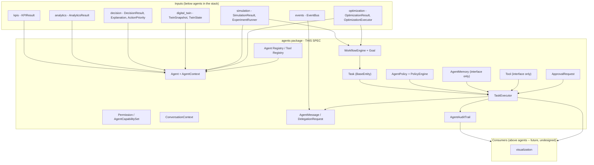
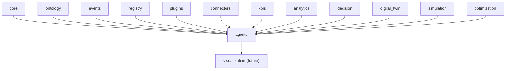
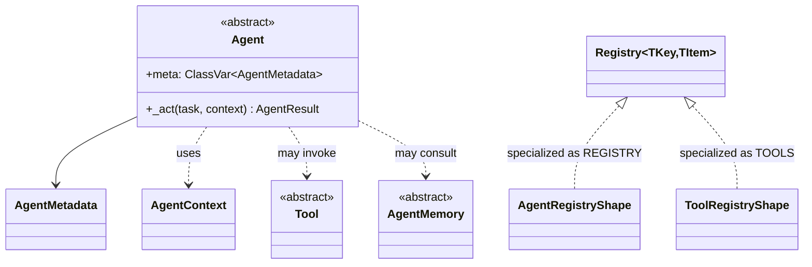
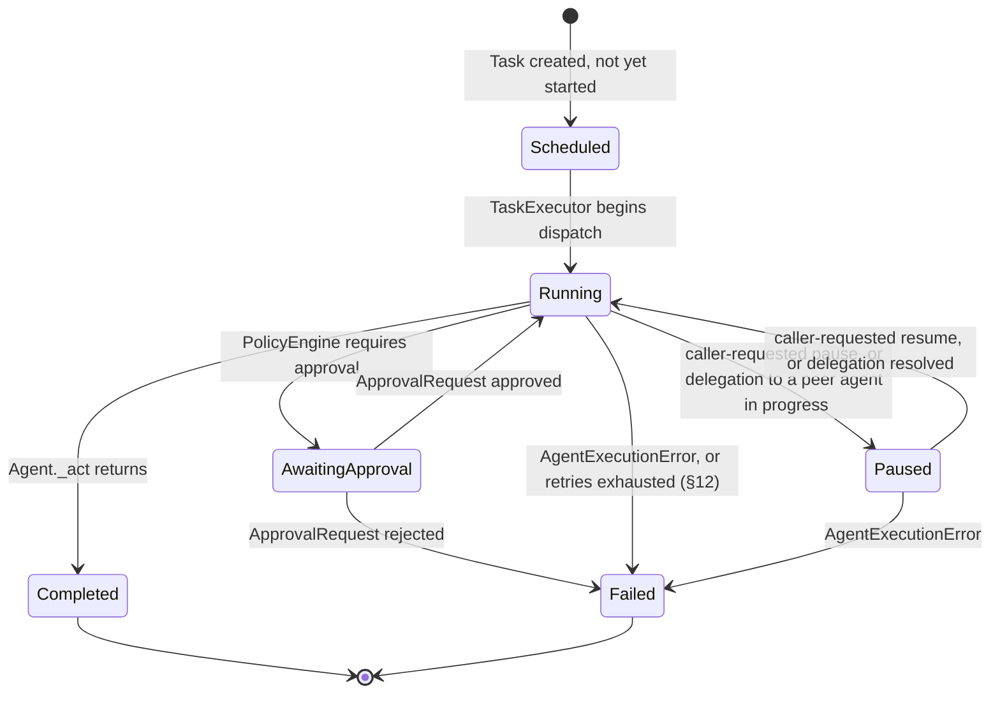
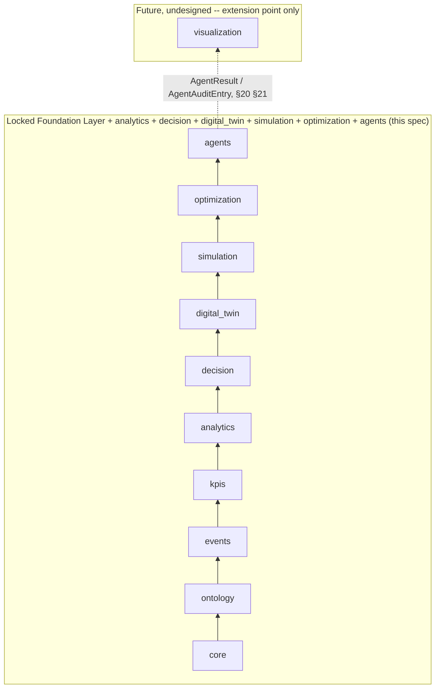

# AI Agents — Design Specification

| | |
|---|---|
| **Document ID** | AH-DS-11 |
| **Package** | `mineproductivity.agents` |
| **Status** | Draft — Design Complete, Pending Implementation |
| **Version** | 1.0.0 |
| **Conforms to** | Master Architecture Handbook v1.0; Reference Implementation Blueprint v1.0; Developer & Cookbook Guide Parts I–III |
| **Builds on** | Core Foundation Library v0.2.0 (LOCKED); Event Framework spec 01 (LOCKED, `events` v0.3.0); Ontology Framework spec 02 (LOCKED, `ontology` v0.4.0); Registry Framework spec 03 (LOCKED, `registry`/`plugins` v0.5.0); Connector Framework spec 04 (LOCKED, `connectors` v0.6.0); KPI Engine spec 05 (LOCKED, `kpis` v0.7.0); Analytics Engine spec 06 (LOCKED, `analytics` v0.8.0); Decision Intelligence spec 07 (LOCKED, `decision` v0.9.0); Digital Twin spec 08 (LOCKED, `digital_twin` v1.0.0); Simulation spec 09 (LOCKED, `simulation` v1.1.0); Optimization spec 10 (LOCKED, `optimization` v1.2.0) |
| **Author** | Chief Software Architect, MineProductivity |
| **Classification** | Public — Open Source Design Documentation |

## Document Control

Design specification only — no implementation. This document designs `mineproductivity.agents`, the sixth package built on top of the Foundation Layer, sitting directly above the now-locked `optimization`. Nothing in this specification proposes, requires, or hints at a change to any file, public API, or dependency rule in `core`, `events`, `ontology`, `registry`, `plugins`, `connectors`, `kpis`, `analytics`, `decision`, `digital_twin`, `simulation`, or `optimization`. Every object model, class name, and enum member cited from a lower package is taken verbatim from that package's own `__init__.py` public export list or its own governing design specification. Section numbering below (1–37) is locked before drafting and does not change during it: seven front-matter sections (Purpose through Public API), twenty-two sections domain-specific to this package's own required topics (Agent Abstractions through Metadata), and eight closing sections (Error Handling through Future Roadmap). Two closing sections each fold two related, previously-separate topics into one heading (`Extension Points & Plugin Integration`, `Thread Safety & Concurrency`) — a deliberate, explicitly-recorded consolidation, not an oversight, made to leave room for the eleven genuinely new domain topics this package's brief requires that no prior package needed (Memory Model, Conversation Context, Human Approval, Tool Invocation, Inter-Agent Communication, Multi-Agent Collaboration, Policy Engine, Failure Recovery, and their three supporting closing sections). State, sequence, and class diagrams appear embedded within their own most relevant section throughout, exactly as specs 06–10 already do, rather than as separate top-level sections.

Cross-references to spec 06 (`analytics`) in this document are given as plain-text citations (`spec 06 §N`), never as Markdown links: `06_Analytics_Engine_Design_Specification.md` exists only on the as-yet-unmerged `feature/analytics-engine` branch, not on `main`, and a Markdown link to a file absent from the current branch is a broken link (this exact failure mode was found and fixed in `ADR-0007-Decision-Intelligence.md`'s header table earlier in this series). Cross-references to specs 07 through 10 (`decision`, `digital_twin`, `simulation`, `optimization`), which **are** present on `main`, are given as ordinary Markdown links where appropriate.

---

## 1. Purpose

Agents answers a question no package below it was ever chartered to answer: *given everything already measured, characterized, recommended, represented, projected, and solved by the eight packages beneath it, who decides what to actually do next, moment to moment, across production, dispatch, fleet, maintenance, drill-and-blast, shift supervision, ESG, safety, planning, and executive advisory — and who coordinates the many specialized reasoners that decision spans across?* `kpis` measures; `analytics` characterizes; `decision` recommends against already-known facts; `digital_twin` represents current state; `simulation` projects hypothetical futures; `optimization` solves for the single best plan under constraints. None of the nine packages below `agents` performs Analytics, Optimization, Simulation, Digital Twin synchronization, or Event storage in an autonomous, self-directed, multi-step loop — `agents` is the package that supplies that missing orchestration layer, coordinating many specialized agents, each scoped to one operational domain, each free to consult any lower package's already-computed evidence, request a simulation, request an optimized plan, invoke a tool, delegate to a peer agent, or pause for human approval — while still declining to choose *which* reasoning backend (a specific large language model provider, a local model, or a rule-based engine) powers any given agent's own decisions, leaving that choice to a pluggable, independently-versioned model behind one stable interface (§8).

Agents is, concretely, the first package positioned to fulfill four separate promises made by name across four already-locked specifications, each written before this package existed. Decision Intelligence's own Future Roadmap named `agents` the anticipated consumer of `Explanation` "as the structured, evidence-linked justification an agent needs to act autonomously or to explain its own action to a human," and a plausible eventual implementer of `RootCauseAnalyzer` (spec 07 §36). Digital Twin's own Future Roadmap named it the anticipated consumer of `TwinState`/`TwinSnapshot` "for autonomous monitoring" (spec 08 §34). Simulation's named it the anticipated consumer of `SimulationResult`/`SimulationState`, observing it "may drive `ExperimentRunner` directly to explore many hypotheses without a human in the loop" (spec 09 §37). Optimization's went furthest: it named `agents` the anticipated consumer of `OptimizationResult`/`ParetoResult`, observing it "may drive `OptimizationExecutor` directly to explore many candidate problems without a human in the loop" (spec 10 §37). This specification makes all four promises concrete: Agents consumes `decision`'s explained recommendations and `digital_twin`'s current state, and directly drives `simulation.ExperimentRunner`/`optimization.OptimizationExecutor` (§13) when a task calls for exploring hypotheses or candidate plans.

Agents holds no KPI formulas, no statistical computation, no business-decision or ranking logic of its own, no simulation-execution logic, no solver logic, no digital-twin synchronization logic, and no event storage — all of those already exist, one or more layers down, and are orchestrated rather than re-implemented (§3). It is not a large-language-model wrapper: an `Agent` (§8) is a stable, model-independent contract a future OpenAI-, Anthropic-, Gemini-, Llama-, local-model-, or rule-based-backed plugin implements against, exactly the same interface-first discipline this series has applied at every prior layer, now extended to a reasoning backend rather than a numerical solver.

## 2. Business Objectives

1. **Coordinate, never duplicate, the nine packages below.** An `Agent` never recomputes a KPI, a statistical judgment, a recommendation, a twin's state, a simulated projection, or an optimized plan — it reads each one as already-structured evidence and decides what to do next (§3.2's own consumption-without-redefinition rule).
2. **Make every agent action traceable to the task, the evidence, and the explanation that produced it**, so an autonomous decision can be audited exactly as rigorously as a computed KPI or a solved optimization plan, never as an unaccountable black box.
3. **Support the ten named enterprise agent categories** (Production, Dispatch, Fleet, Maintenance, Drill & Blast, Shift Supervisor, ESG, Safety, Executive Advisor, Planning, §29) as one shared, closed taxonomy over one shared `Agent` contract, so a future site does not have to invent its own notion of "what kind of agent is this."
4. **Keep every human genuinely in the loop wherever a task's `AgentPolicy` requires it** (§16), never as an afterthought bolted onto an already-autonomous pipeline — approval is a first-class `TaskStatus` (§11), not a side channel.
5. **Remain reasoning-backend-independent for the entire lifetime of this package.** No specific LLM provider, local model runtime, or rule engine is chosen or shipped (§8, §17); every one of them is an equally first-class plugin behind the same `Agent`/`Tool`/`AgentMemory` interfaces.
6. **Delegate statistical, projective, and solver-level reasoning to the packages that already own it**, composing `analytics`' primitives, `simulation.ExperimentRunner`, and `optimization.OptimizationExecutor` directly (§13) rather than re-deriving any of their outputs — Agents does not own Analytics, Optimization, or Simulation (per this package's own charter, §3.2).

## 3. Architectural Principles

1. **Orchestration, not computation, decision, projection, solving, representation, or storage.** Agents coordinates the outputs of `kpis`/`analytics`/`decision`/`digital_twin`/`simulation`/`optimization`/`events`; it never performs any of their work itself (out of scope entirely, §4). Where a capability is deliberately deferred to a pluggable reasoning backend or an invokable action, this design defines an interface for it (§8, §17) rather than a placeholder implementation.
2. **Consumption without redefinition.** Agents never recomputes a KPI value, a statistical judgment, a recommendation, a twin's state, a simulated projection, or a solved plan. `AgentContext` (§8) carries `kpi_results`, `analytics_results`, `decision_results`, `twin_snapshot`, `simulation_results`, and `optimization_results` exactly as each lower package already defines them — read, never re-derived. This is the single most important boundary in this specification (§8, §34).
3. **State as an executed record, never a mutable scratchpad.** `Task` (§11) follows `optimization.OptimizationRun`'s own precedent (spec 10 §3.3, §10): it subclasses `core.BaseEntity[str]`, and every step of execution produces a new instance via a `with_state()`-style helper, never an in-place mutation. Agents is the fourth package in this series to reach for this idiom, not the first to invent it.
4. **Reuse over reinvention, including literal composition where the shape genuinely fits.** `TaskRepository` **is** `core.BaseRepository[Task, str]` (§25), exactly mirroring `optimization.OptimizationRunRepository`'s own literal reuse (spec 10 §24) — the fourth occurrence of this exact pattern. Inter-agent messaging composes `events.EventBus` directly (§18); a hypothesis-exploration task composes `simulation.ExperimentRunner` and a candidate-plan-search task composes `optimization.OptimizationExecutor` directly (§13); `AgentResult.explanation` reuses `decision.Explanation` directly (§20). Where the coupling does not fit even though the interface looks similar, this package documents a deliberate non-reuse instead of forcing it (`AgentPolicy` vs. `decision.Policy`, §10).
5. **Interfaces before algorithms, where the algorithm is a reasoning, memory, or tool-integration choice.** `Agent`, `AgentMemory`, and `Tool` are each declared as stable abstract contracts now (§8, §14, §17); no specific LLM provider, memory backend, or tool implementation is chosen or shipped for any of the three. This is the sixth package in the series to apply this discipline (after `analytics`' forecasting/anomaly/outlier interfaces, `decision`'s root-cause/what-if interfaces, `digital_twin`'s simulation interface, `simulation`'s four methodology interfaces, and `optimization`'s six paradigm interfaces) — the pattern is now a platform-wide convention, not a one-off.
6. **Zero upward leakage.** No lower package (`core` through `optimization`) imports `agents`, mechanically enforced by the same AST-based `TestNoForbiddenDependencies` pattern every existing package already uses.
7. **One extension mechanism, platform-wide.** New agent categories, memory backends, and tool integrations are added exactly the way a new KPI, connector, ontology entity type, Analytics model, Decision strategy, twin type, simulation model, or optimization model is added: subclass, register, discover via entry points (§31). No bespoke Agents-specific plugin mechanism is invented.
8. **Every autonomous action is policy-checked and auditable before it is taken.** `PolicyEngine.evaluate()` (§10) runs before `TaskExecutor` dispatches to an `Agent`'s reasoning call, and `AgentAuditTrail` (§21) records every produced `AgentResult` — accountability is structural, not optional instrumentation added after the fact.

## 4. Overall Architecture

Agents occupies exactly one position in the platform's dependency chain — directly above `optimization`, and (as of this specification) at the top of the currently-designed stack:

```
core → ontology → events → kpis → analytics → decision → digital_twin → simulation → optimization → agents
```

Everything below `agents` exists, from its point of view, to produce well-formed inputs or callable machinery: `kpis.KPIResult`/`analytics.AnalyticsResult` for measurement and characterization; `decision.DecisionResult`/`Explanation`/`ActionPriority` for already-explained recommendations; `digital_twin.TwinSnapshot`/`TwinState` for current condition; `simulation.SimulationResult`/`ExperimentRunner` for projected hypotheses an agent may explore directly; `optimization.OptimizationResult`/`OptimizationExecutor` for solved plans an agent may search directly; `events.EventBus` for inter-agent and human-approval message transport. Everything above `agents` (`visualization` — the one remaining future, undesigned package, §37) exists to consume `agents`' outputs.



Agents is deliberately **not** a seventh computation engine competing with `kpis`/`analytics`/`decision`, a second stateful-representation layer competing with `digital_twin`, a second projection layer competing with `simulation`, or a second search-and-solve layer competing with `optimization`. It has no formula language, no statistics library, no rule-threshold engine of its own, no scenario-projection algorithm, and no constrained solver — it borrows evidence and machinery from every package below it and hands its own reasoning to a pluggable `Agent` backend.

Every package below `agents` that defines a central "as-object" abstraction makes it stateless; `digital_twin.Twin`, `simulation.SimulationRun`, and `optimization.OptimizationRun` are each stateful because each represents a piece of history the instant it starts. `agents.Task` inherits that statefulness for the identical reason, while `Agent` itself stays as stateless as `decision.DecisionModel` (spec 07 §8) — the one package whose central abstraction this design most directly mirrors: like `DecisionModel`, `Agent` shares one abstract reasoning method across every category, since every named agent category (§29) answers the same underlying question, differing only in domain, unlike `simulation`/`optimization`'s categories, which differ in computational shape and therefore share no abstract method at all.

**Runtime request flow**, walking the diagram above for the single most common entry point (`TaskExecutor.execute`, §12): a caller supplies a `task_id`, a `Task`, and an `AgentContext` already carrying whatever lower-package evidence the task's authoring process considered relevant. `PolicyEngine.evaluate()` runs first; if it requires approval, the task transitions to `AWAITING_APPROVAL` and execution pauses until `ApprovalRequest.status` resolves. Once cleared, `TaskExecutor` dispatches to the registered `Agent`'s reasoning call, which may invoke a `Tool`, consult `AgentMemory`, drive `simulation.ExperimentRunner`/`optimization.OptimizationExecutor`, or delegate via `AgentMessage`/`DelegationRequest`. Every produced `AgentResult` is appended to `AgentAuditTrail` before returning — the same "gather evidence once, compute forward, hand back one structured result" shape every package below it follows, with an explicit approval gate and audit step this layer's own charter adds.

## 5. Dependency Graph

**Permitted imports (platform layering rule, verbatim from this package's brief):** `agents` may import `mineproductivity.core`, `mineproductivity.ontology`, `mineproductivity.events`, `mineproductivity.registry`, `mineproductivity.plugins`, `mineproductivity.connectors`, `mineproductivity.kpis`, `mineproductivity.analytics`, `mineproductivity.decision`, `mineproductivity.digital_twin`, `mineproductivity.simulation`, and `mineproductivity.optimization`, and nothing else.

**Actually exercised by this design:** `core` (`BaseEntity`, `BaseRepository`/`InMemoryRepository`, `BaseSpecification`, `Result`/`Maybe`, `BaseValueObject`, `BaseConfiguration`, `serialization`, exceptions), `events` (`EventBus` — inter-agent and approval message transport, §18), `kpis`/`analytics`/`decision` (`KPIResult`, `AnalyticsResult`, `DecisionResult`, and the sibling `Explanation`/`ActionPriority` value objects attached to it — read into `AgentContext` and, for `Explanation`, directly into `AgentResult`, §8, §20), `digital_twin` (`TwinSnapshot`, `TwinState` — current-condition evidence, §8), `simulation` (`SimulationResult`, `ExperimentRunner` — evidence and, for the latter, direct composition for hypothesis exploration, §8, §13), and `optimization` (`OptimizationResult`, `OptimizationExecutor` — evidence and, for the latter, direct composition for candidate-plan search, §8, §13). `connectors` is a permitted import under the platform-wide layering rule and is exercised narrowly: `RetryPolicy`/`BackoffStrategy` (spec 04 §10) are reused directly as configuration value objects for `Task` failure recovery (§12), though this package's own retry loop, not a connector's, executes them — `agents` still never touches a vendor-specific wire format directly. `ontology` is available for the vocabulary a task's scope is expressed in (mirroring `digital_twin.Twin.scope`'s original use, spec 08 §9) but introduces no new concept.



**Depended on by (future, undesigned):** `visualization`.

**Forbidden, mechanically enforced:**
- `agents` MUST NOT be imported by `core`, `ontology`, `events`, `registry`, `plugins`, `connectors`, `kpis`, `analytics`, `decision`, `digital_twin`, `simulation`, or `optimization` — checked by an AST walk exactly like every existing package's `TestNoForbiddenDependencies` test.
- `agents` MUST NOT import `visualization` — it is strictly above it and, as of this specification, does not yet exist.
- No cycle exists or is introduced: `core → ontology → events → kpis → analytics → decision → digital_twin → simulation → optimization → agents` is a strict total order for every symbol this package uses.

## 6. Package Structure

```
src/mineproductivity/agents/
├── __init__.py            # public API surface (§7)
├── abstractions.py          # Agent (ABC), AgentContext
├── metadata.py                # AgentMetadata, AgentCategory
├── capability.py                 # Permission, AgentCapabilitySet
├── policy.py                        # AgentPolicy, PolicyStatus, PolicyEngine
├── task.py                             # Task (BaseEntity[str], concrete), TaskStatus
├── state.py                               # TaskState
├── memory.py                                 # AgentMemory (ABC) -- interface only, §14
├── conversation.py                              # ConversationTurn, ConversationContext
├── approval.py                                     # ApprovalRequest, ApprovalStatus
├── tool.py                                            # Tool (ABC) -- interface only, §17; ToolMetadata, ToolInvocation
├── communication.py                                      # AgentMessage, DelegationRequest
├── goal.py                                                  # Goal
├── workflow.py                                                # WorkflowEngine
├── executor.py                                                   # TaskExecutor
├── result.py                                                        # AgentResult
├── audit.py                                                            # AgentAuditTrail, AgentAuditEntry
├── discovery.py                                                           # by_category(), by_scope()
├── persistence.py                                                           # TaskRepository
├── _registry.py                                                               # REGISTRY, TOOLS, register, register_tool
├── exceptions.py
└── README.md
```

Twenty implementation modules plus `__init__.py` and `README.md` — fewer than `simulation`'s twenty-one (spec 09 §6) despite introducing more genuinely new concepts than any prior package, for the same reason `optimization` needed fewer modules than `simulation` (spec 10 §6): extensive, explicit reuse. `communication.py` composes `events.EventBus` rather than defining a new bus; a hypothesis-exploration or candidate-plan-search task composes `simulation.ExperimentRunner`/`optimization.OptimizationExecutor` directly (§18) rather than this package growing its own; `AgentResult.explanation` reuses `decision.Explanation` directly rather than a second justification type (§20). Every module below is specified against the same seven fields specs 06–10 used: Purpose, Responsibilities, Public Classes, Public Functions, Public API, Dependencies, and Extension Points.

### `abstractions.py`
- **Purpose:** the "Agent-as-object" root, and the collaborator bundle a concrete agent needs.
- **Responsibilities:** define the common metadata slot and shared reasoning method every agent carries; bundle `AgentContext`'s evidence fields.
- **Public Classes:** `Agent` (ABC), `AgentContext`.
- **Public Functions:** None.
- **Public API:** `Agent`, `AgentContext`.
- **Dependencies:** `core` (`Result`), `kpis` (`KPIResult`), `analytics` (`AnalyticsResult`), `decision` (`DecisionResult`), `digital_twin` (`TwinSnapshot`), `simulation` (`SimulationResult`), `optimization` (`OptimizationResult`).
- **Extension Points:** a future reasoning-backend plugin subclasses `Agent` and implements `_act` (§8).

### `metadata.py`
- **Purpose:** the minimal registration schema for a discoverable `Agent` type (§29).
- **Responsibilities:** carry just enough structured information for registry introspection and entry-point discovery; enforce the closed `AgentCategory` namespace.
- **Public Classes:** `AgentMetadata`, `AgentCategory` (enum).
- **Public Functions:** None.
- **Public API:** `AgentMetadata`, `AgentCategory`.
- **Dependencies:** `core` (`BaseMetadata`, `ValidationError`).
- **Extension Points:** a new `AgentCategory` member is a closed-enum, governance-reviewed change, mirroring `optimization.OptimizationCategory`'s/`simulation.SimulationCategory`'s closed-enum rule (spec 10 §29, spec 09 §29).

### `capability.py`
- **Purpose:** authorization for autonomous action (§9).
- **Responsibilities:** declare what a registered `Agent` instance is permitted to do, scoped to a piece of equipment, pit, shift, or other ontology-expressed scope.
- **Public Classes:** `Permission`, `AgentCapabilitySet`.
- **Public Functions:** None.
- **Public API:** `Permission`, `AgentCapabilitySet`.
- **Dependencies:** `core` (`BaseValueObject`), `ontology` (scope vocabulary).
- **Extension Points:** a new `Permission.capability` string is an additive, reviewed change — no code change to this module.

### `policy.py`
- **Purpose:** guardrails on autonomous action (§10) — a distinct concern from `decision.Policy`'s business-recommendation thresholds (§10's own recorded non-reuse).
- **Responsibilities:** define a versioned, governed guardrail artifact and the engine that evaluates a `Task` against the currently `Active` set before execution.
- **Public Classes:** `AgentPolicy`, `PolicyStatus` (enum), `PolicyEngine`.
- **Public Functions:** None.
- **Public API:** `AgentPolicy`, `PolicyStatus`, `PolicyEngine`.
- **Dependencies:** `core` (`BaseValueObject`, `Result`), `capability.py` (`AgentCapabilitySet`).
- **Extension Points:** a new `AgentPolicy` is authored and registered exactly like a new `decision.Policy` (§31); an existing one is never edited in place (§10, §26).

### `task.py`
- **Purpose:** agent execution's stateful core (§11).
- **Responsibilities:** subclass `core.BaseEntity[str]` directly; carry the current `TaskState`; expose the non-mutating `with_state()` update helper.
- **Public Classes:** `Task`, `TaskStatus` (enum).
- **Public Functions:** None.
- **Public API:** `Task`, `TaskStatus`.
- **Dependencies:** `core` (`BaseEntity`), `state.py` (`TaskState`).
- **Extension Points:** none — `Task`'s shape is closed; a new agent category is a new `AgentCategory` member (§29), never a change to `Task` itself.

### `state.py`
- **Purpose:** a task's current condition (§11).
- **Responsibilities:** represent one task's progress, intermediate reasoning artifacts, and delegation chain as of the last executed step.
- **Public Classes:** `TaskState`.
- **Public Functions:** None.
- **Public API:** `TaskState`.
- **Dependencies:** `core` (`BaseValueObject`, `ValidationError`).
- **Extension Points:** a new agent-specific attribute is carried in `TaskState.attributes` (an open `Mapping[str, Any]`), never as a new typed field — mirrors `optimization.OptimizationState.attributes`'s identical escape hatch (spec 10 §11).

### `memory.py`
- **Purpose:** interface-only extension point (§14) — no concrete implementation.
- **Responsibilities:** define a stable abstract contract for an agent to persist and recall information across tasks.
- **Public Classes:** `AgentMemory` (ABC).
- **Public Functions:** None.
- **Public API:** `AgentMemory`.
- **Dependencies:** `abstractions.py`.
- **Extension Points:** the entire purpose of this module — a concrete subclass (a vector store, a key-value store, a windowed in-context buffer) is a first-class extension (§31.2), never added inside this module itself (§34).

### `conversation.py`
- **Purpose:** dialogue-turn history for one task (§15).
- **Responsibilities:** accumulate an ordered record of who said what, to whom, and when, across a task's execution.
- **Public Classes:** `ConversationTurn`, `ConversationContext`.
- **Public Functions:** None.
- **Public API:** `ConversationTurn`, `ConversationContext`.
- **Dependencies:** `core` (`BaseValueObject`).
- **Extension Points:** a new `ConversationTurn.speaker` value (a new agent category, "human", or a tool) requires no code change — it is an open string, not a closed enum.

### `approval.py`
- **Purpose:** the human-in-the-loop gate (§16).
- **Responsibilities:** represent one pending, approved, or rejected request for a human to authorize a task before it proceeds.
- **Public Classes:** `ApprovalRequest`, `ApprovalStatus` (enum).
- **Public Functions:** None.
- **Public API:** `ApprovalRequest`, `ApprovalStatus`.
- **Dependencies:** `core` (`BaseValueObject`).
- **Extension Points:** none — the three-state approval lifecycle is closed; a new approval *policy* (who must approve what) is an `AgentPolicy` concern (§10), not a change here.

### `tool.py`
- **Purpose:** interface-only extension point (§17) — no concrete implementation.
- **Responsibilities:** define a stable abstract contract for an invokable external action, and the value objects describing one invocation.
- **Public Classes:** `Tool` (ABC), `ToolMetadata`, `ToolInvocation`.
- **Public Functions:** None.
- **Public API:** `Tool`, `ToolMetadata`, `ToolInvocation`.
- **Dependencies:** `abstractions.py`.
- **Extension Points:** the entire purpose of this module — a concrete `Tool` subclass (a dispatch-system query, an ERP call) is a first-class extension (§31.2), never added inside this module itself (§34).

### `communication.py`
- **Purpose:** inter-agent messaging and delegation (§18).
- **Responsibilities:** define the structured message and delegation-request shapes exchanged between agents, or between an agent and a human supervisor, composing `events.EventBus` for transport.
- **Public Classes:** `AgentMessage`, `DelegationRequest`.
- **Public Functions:** None.
- **Public API:** `AgentMessage`, `DelegationRequest`.
- **Dependencies:** `core` (`BaseValueObject`), `events` (`EventBus`).
- **Extension Points:** a new message-content shape is carried in `AgentMessage.content` (an open `Mapping[str, Any]`), never a new message class.

### `goal.py`
- **Purpose:** the input a workflow decomposes (§13).
- **Responsibilities:** represent one named objective and its success criteria, prior to decomposition into one or more `Task`s.
- **Public Classes:** `Goal`.
- **Public Functions:** None.
- **Public API:** `Goal`.
- **Dependencies:** `core` (`BaseValueObject`).
- **Extension Points:** a new `Goal.success_criteria` shape is an additive change to its open `Mapping`, never a new typed field.

### `workflow.py`
- **Purpose:** goal decomposition and multi-agent orchestration (§13, §19).
- **Responsibilities:** decompose a `Goal` into one or more `Task`s, each assigned to a registered `Agent` category, and coordinate delegation between them.
- **Public Classes:** `WorkflowEngine`.
- **Public Functions:** None.
- **Public API:** `WorkflowEngine`.
- **Dependencies:** `goal.py`, `task.py`, `communication.py`, `simulation` (`ExperimentRunner`), `optimization` (`OptimizationExecutor`).
- **Extension Points:** a new decomposition strategy is an additive method here, never a new orchestration mechanism.

### `executor.py`
- **Purpose:** orchestrates one `Task` (§12).
- **Responsibilities:** evaluate policy, dispatch to the registered `Agent`'s reasoning call, gate on approval where required, apply failure-recovery retries, persist the resulting state, append to the audit trail.
- **Public Classes:** `TaskExecutor`.
- **Public Functions:** None.
- **Public API:** `TaskExecutor`.
- **Dependencies:** `persistence.py` (`TaskRepository`), `policy.py` (`PolicyEngine`), `approval.py`, `audit.py`, `connectors` (`RetryPolicy`, `BackoffStrategy`), `result.py` (`AgentResult`).
- **Extension Points:** none — a new agent category is a new `Agent` subclass (§8), never a change to the executor's own dispatch logic (§31).

### `result.py`
- **Purpose:** every concrete outcome type this package produces (§20).
- **Responsibilities:** define the shared envelope every agent action's outcome composes.
- **Public Classes:** `AgentResult`.
- **Public Functions:** None.
- **Public API:** `AgentResult`.
- **Dependencies:** `core` (`BaseValueObject`), `decision` (`Explanation`), `tool.py` (`ToolInvocation`).
- **Extension Points:** a new concrete result field is added only alongside a new capability that produces it.

### `audit.py`
- **Purpose:** accountability for autonomous action (§21), mirroring `decision.DecisionAuditTrail`'s pattern (spec 07 §27).
- **Responsibilities:** append-only record of every `AgentResult` ever produced by any `TaskExecutor` run in this process.
- **Public Classes:** `AgentAuditTrail`, `AgentAuditEntry`.
- **Public Functions:** None.
- **Public API:** `AgentAuditTrail`, `AgentAuditEntry`.
- **Dependencies:** `core` (`BaseValueObject`, `serialization`), `result.py` (`AgentResult`).
- **Extension Points:** none — the audit shape is closed; a new evidence field belongs on `AgentResult` (§20), not here.

### `discovery.py`
- **Purpose:** agent discovery (§23) — category/scope-based lookup over currently-known tasks.
- **Responsibilities:** provide named `core.BaseSpecification` factory functions for the two most common lookup predicates, mirroring `optimization.discovery`'s identical pattern (spec 10 §22).
- **Public Classes:** None.
- **Public Functions:** `by_category`, `by_scope`.
- **Public API:** `by_category`, `by_scope`.
- **Dependencies:** `core` (`BaseSpecification`, `PredicateSpecification`), `task.py` (`Task`).
- **Extension Points:** a new named lookup predicate is a new function here, composing `core.PredicateSpecification`, never a new query mechanism.

### `persistence.py`
- **Purpose:** where tasks are stored (§25).
- **Responsibilities:** define the storage contract for task instances, keyed by their own identity.
- **Public Classes:** None (`TaskRepository` is a `type` alias, not a new class).
- **Public Functions:** None.
- **Public API:** `TaskRepository`.
- **Dependencies:** `core` (`BaseRepository`, `InMemoryRepository`), `task.py` (`Task`).
- **Extension Points:** a production-grade backend (SQL, document store) implements `core.BaseRepository[Task, str]` directly — no `agents`-specific ABC exists to implement instead (§3.4, §25).

### `_registry.py`
- **Purpose:** the Agent Registry and the Tool Registry (§22), the first package in this series to hold two distinct `Registry` instances rather than one, following the exact pattern `optimization._registry`/`simulation._registry`/`digital_twin._registry` established (spec 10 §21, spec 09 §21, spec 08 §17) applied twice, since an `Agent` type and a `Tool` type are orthogonal registrable concepts.
- **Responsibilities:** hold the process-wide `Registry[str, type[Agent]]` and `Registry[str, type[Tool]]` instances; validate a non-empty `code`; reject a duplicate, non-identical re-registration in either.
- **Public Classes:** None.
- **Public Functions:** `register`, `register_tool`.
- **Public API:** `REGISTRY`, `TOOLS`, `register`, `register_tool`.
- **Dependencies:** `registry` (`Registry`), `metadata.py`, `tool.py`, `exceptions.py`.
- **Extension Points:** none within this module itself — it is the extension mechanism (§31) other modules and third-party plugins use.

### `exceptions.py`
- **Purpose:** the package's exception hierarchy, used throughout §8–§31.
- **Responsibilities:** define every raised error type this package's public API can produce.
- **Public Classes:**
  ```python
  class AgentValidationError(ValidationError):
      """An AgentMetadata, Task, or TaskState failed validation
      (§29, §11) -- e.g. an empty code, a Task with no assigned
      agent category, or a State with empty attributes."""

  class TaskNotFoundError(NotFoundError):
      """TaskRepository.get(task_id) found no task for that id, or
      REGISTRY.get(code) found no registered Agent for that code."""

  class AgentExecutionError(MineProductivityError):
      """TaskExecutor raised for a step that should have been
      structurally valid -- distinct from a legitimately-denied or
      legitimately-pending case (§30's 'qualify, don't coerce' rule),
      which returns an AgentResult carrying a warning instead of
      raising."""

  class AgentVersionConflictError(RegistrationError):
      """A plugin attempted to re-register an existing Agent or
      Tool type code with materially different metadata without a
      version bump, mirroring optimization.OptimizationVersionConflictError
      (spec 10 §6)."""

  class PolicyConflictError(RegistrationError):
      """A governance action attempted to re-register an existing,
      Active AgentPolicy code with a different rule without a
      version bump -- the Policy-layer analogue of
      AgentVersionConflictError, mirroring
      optimization.ProblemConflictError's identical reasoning
      (spec 10 §6)."""

  class PermissionDeniedError(MineProductivityError):
      """PolicyEngine.evaluate() rejected a Task outright (as
      opposed to routing it to AWAITING_APPROVAL) -- the one case
      in this package where a policy violation is not a warning but
      a hard stop, since dispatching to an Agent lacking the
      required Permission is never a legitimate outcome to persist
      as a completed AgentResult (§10, §28)."""
  ```
- **Public Functions:** None.
- **Public API:** all six exception classes listed above.
- **Dependencies:** `core` (`ValidationError`, `NotFoundError`, `MineProductivityError`), `registry` (`RegistrationError`).
- **Extension Points:** a new exception type is added only alongside the specific failure mode it represents.

## 7. Public API

```python
from mineproductivity.agents import (
    # Abstractions
    Agent, AgentContext,
    # Metadata
    AgentMetadata, AgentCategory,
    # Capabilities and permissions
    Permission, AgentCapabilitySet,
    # Policy engine
    AgentPolicy, PolicyStatus, PolicyEngine,
    # Task model and lifecycle
    Task, TaskStatus, TaskState,
    # Memory (interface only)
    AgentMemory,
    # Conversation
    ConversationTurn, ConversationContext,
    # Human approval
    ApprovalRequest, ApprovalStatus,
    # Tool invocation (interface only)
    Tool, ToolMetadata, ToolInvocation,
    # Inter-agent communication
    AgentMessage, DelegationRequest,
    # Workflow and goals
    Goal, WorkflowEngine,
    # Execution
    TaskExecutor,
    # Outputs
    AgentResult,
    # Explainability and audit
    AgentAuditTrail, AgentAuditEntry,
    # Discovery
    by_category, by_scope,
    # Persistence
    TaskRepository,
    # Registry (Registry Framework specialization, applied twice)
    register, register_tool, REGISTRY, TOOLS,
    # Exceptions
    AgentValidationError, TaskNotFoundError, AgentExecutionError,
    AgentVersionConflictError, PolicyConflictError, PermissionDeniedError,
)
```

Every name above is intended to be **stable once implementation begins**, per the same "prefer fewer, carefully designed interfaces" discipline specs 06–10 already applied — no speculative "maybe useful" symbol is included; each name maps directly to one of the sections below.

## 8. Agent Abstractions

```python
class AgentContext:
    """Bundles the collaborators and evidence an Agent may need -- the
    agents-layer counterpart to optimization.OptimizationContext (spec
    10 §8), one layer up, extended with one new evidence field
    (optimization_results, since an agent may read an already-solved
    plan that a not-yet-solved OptimizationProblem could never
    reference) -- every fact an agent reasons over still has a stable,
    structured home in a lower package, never a re-derivation of its
    own. Carries the KPIResult/AnalyticsResult/DecisionResult/
    TwinSnapshot/SimulationResult/OptimizationResult evidence a task's
    authoring process already gathered. Per decision.DecisionContext's
    own established convention (spec 07 §8), this package uses the
    caller-assembles pattern exclusively:
    an agent already has its own control loop deciding when to gather
    fresh evidence, so no session-assembles variant is defined here."""

    def __init__(
        self,
        *,
        kpi_results: "Sequence[KPIResult]" = (),
        analytics_results: "Sequence[AnalyticsResult]" = (),
        decision_results: "Sequence[DecisionResult]" = (),
        twin_snapshot: "TwinSnapshot | None" = None,
        simulation_results: "Sequence[SimulationResult]" = (),
        optimization_results: "Sequence[OptimizationResult]" = (),
    ) -> None: ...


class Agent(ABC):
    """The root of every registrable agent type -- 'Agent-as-object,'
    the direct counterpart of kpis.BaseKPI/analytics.AnalyticsModel/
    decision.DecisionModel/simulation.SimulationModel/
    optimization.OptimizationModel, six/five/four/three/two layers
    down respectively. Unlike simulation's/optimization's category
    ABCs, which deliberately share no abstract method because their
    categories differ in computational shape, every Agent category
    (§29) answers the same underlying question -- given a task and
    context, decide what should happen next -- so Agent shares one
    abstract method across all ten categories, mirroring
    decision.DecisionModel's identical shared-_decide posture (spec
    07 §8) rather than simulation's/optimization's no-shared-method
    posture. THIS MODULE SHIPS NO CONCRETE SUBCLASS -- choosing a
    specific reasoning backend (a named LLM provider, a local model,
    a rule engine) is exactly the kind of implementation decision
    this package's charter (§3.1, §3.5, §4) excludes."""

    meta: ClassVar[AgentMetadata]

    @abstractmethod
    def _act(self, task: "Task", *, context: AgentContext) -> "AgentResult": ...
```



`Agent` is deliberately the sixth package-defining "as-object" root in this series to ship zero concrete implementations, but the first whose category members (§29) are domain roles rather than algorithmic paradigms — a `ProductionAgent`, `DispatchAgent`, or `SafetyAgent` differs from another category not in *how* it decides but in *what evidence and permissions* it is scoped to, which is why `AgentCategory` (§29) is a closed enum exactly like `OptimizationCategory`/`SimulationCategory`, not ten separate ABCs. `Agent` instances are stateless (§32) — statefulness in this package lives entirely in `Task` (§11), never in an agent implementation, so that the same registered `Agent` type can execute many concurrent `Task`s safely.

## 9. Agent Capabilities and Permissions

```python
@dataclasses.dataclass(frozen=True, slots=True)
class Permission(BaseValueObject):
    """One capability a registered Agent is authorized to exercise,
    scoped the same way digital_twin.Twin.scope and simulation's/
    optimization's own scope-vocabulary reuse already are (spec 08
    §9)."""

    capability: str                              # e.g. "approve_shutdown"
    scope: "Mapping[str, str]" = dataclasses.field(default_factory=dict, kw_only=True)


@dataclasses.dataclass(frozen=True, slots=True)
class AgentCapabilitySet(BaseValueObject):
    """The full set of Permissions a registered Agent type carries.
    Never inferred from an Agent's own code -- an AgentCapabilitySet
    is authored and governed the same way an OptimizationProblem or a
    Scenario is (§31), so a capability grant is always an explicit,
    reviewable artifact, never implicit in a reasoning backend's own
    behavior."""

    agent_code: str
    permissions: "tuple[Permission, ...]"
```

`Permission`/`AgentCapabilitySet` are genuinely new to this series: no package below `agents` models authorization for autonomous action, since none of them acts autonomously in the first place — `kpis`/`analytics` compute, `decision` recommends, `digital_twin` represents, `simulation` projects, `optimization` solves, but none *does* anything an authorization boundary would need to gate. `PolicyEngine.evaluate()` (§10) reads a task's assigned `Agent`'s `AgentCapabilitySet` before dispatch; a task requiring a `Permission` the assigned agent's set does not carry raises `PermissionDeniedError` (§28) rather than proceeding.

## 10. Policy Engine

```python
class PolicyStatus(Enum):
    """The AgentPolicy lifecycle -- mirrors optimization.ProblemStatus
    (spec 10 §9) exactly, which itself mirrors simulation.ScenarioStatus
    (spec 09 §9) and decision.DecisionStatus (spec 07 §12), applied
    here to governed autonomous-action guardrails rather than
    optimization problems, simulation configurations, or business
    policies."""

    PROPOSED = "proposed"
    ACTIVE = "active"
    SUPERSEDED = "superseded"
    RETIRED = "retired"


@dataclasses.dataclass(frozen=True, slots=True)
class AgentPolicy(BaseValueObject):
    """A versioned, governed guardrail on autonomous action --
    deliberately NOT a reuse of decision.Policy (spec 07 §12), despite
    both being versioned, governed rule artifacts: decision.Policy
    expresses a business threshold that triggers a Recommendation
    (e.g. 'if utilization < X, recommend Y'); AgentPolicy instead
    expresses an authorization guardrail on an already-decided task
    (e.g. 'this capability always requires human approval'). Another
    occurrence in this series of the same 'shape looks similar,
    coupling doesn't fit' reasoning (after decision.ActionPlanner
    declining kpis.DependencyGraph, spec 07 §21, and two further
    occurrences one and two layers down, spec 08 §22, spec 09 §26)."""

    code: str
    version: str = dataclasses.field(default="1.0.0", kw_only=True)
    status: PolicyStatus = dataclasses.field(
        default_factory=lambda: PolicyStatus.PROPOSED, kw_only=True
    )
    rule: str                                    # e.g. "capability=approve_shutdown -> require_approval"
    requires_approval: bool = dataclasses.field(default=False, kw_only=True)
    denies: bool = dataclasses.field(default=False, kw_only=True)


class PolicyEngine:
    """Evaluates a Task against the currently Active AgentPolicy set
    and the assigned Agent's AgentCapabilitySet (§9) before
    TaskExecutor (§12) dispatches. Never parses or evaluates
    AgentPolicy.rule as executable code -- rule is a solver-independent
    string a concrete evaluation strategy interprets, the same
    'expression the platform never executes, only stores' posture
    optimization.Constraint.expression already establishes (spec 10
    §9)."""

    def evaluate(
        self, task: "Task", *, capabilities: AgentCapabilitySet, policies: "Sequence[AgentPolicy]"
    ) -> "Result[None]": ...
```

`PolicyEngine.evaluate()` returns one of three outcomes, never a fourth: `Result.ok(None)` (proceed), `Result.err` carrying a required-approval marker (transition the `Task` to `AWAITING_APPROVAL`, §11), or `Result.err` carrying `PermissionDeniedError` (a hard stop, §28) — the same three-way distinction a conforming implementation is expected to preserve regardless of how `rule` strings are ultimately evaluated. An `Active` `AgentPolicy`, like an `Active` `optimization.OptimizationProblem` or `decision.Policy`, is a public contract: it is never edited in place. A changed policy is published as a new version; the prior version transitions to `Superseded` — enforced by `PolicyConflictError` (§6) raised when a governance action attempts to re-register an existing, `Active` policy code with a different `rule` without a version bump.

## 11. Task Model and Agent Lifecycle

```python
class TaskStatus(Enum):
    """A Task's own operational lifecycle -- mirrors
    optimization.RunStatus (spec 10 §10) in shape, extended with one
    new member (AWAITING_APPROVAL) this package's own charter requires
    that no lower package's execution lifecycle needed, since none of
    them pauses for a human decision mid-execution."""

    SCHEDULED = "scheduled"
    RUNNING = "running"
    AWAITING_APPROVAL = "awaiting_approval"
    PAUSED = "paused"
    COMPLETED = "completed"
    FAILED = "failed"


@dataclasses.dataclass(frozen=True, slots=True, eq=False)
class Task(BaseEntity[str]):
    """The root of one executing or completed unit of agent work --
    'Task-as-entity,' following optimization.OptimizationRun's own
    precedent (spec 10 §3.3, §10) exactly, which itself followed
    simulation.SimulationRun's (spec 09 §3.3, §10) and, before that,
    digital_twin.Twin's (spec 08 §3.3, §8): id (inherited) is the
    task's identity, and representing a state change means producing
    a NEW Task instance via with_state(), never mutating fields in
    place."""

    goal_code: str
    agent_code: str
    state: "TaskState"
    status: TaskStatus = dataclasses.field(default=TaskStatus.SCHEDULED)

    def with_state(self, state: "TaskState", *, status: "TaskStatus | None" = None) -> "Task":
        """Returns a NEW Task instance with `state` (and optionally
        `status`) replacing the current ones -- identical to
        OptimizationRun.with_state() (spec 10 §10)."""
        return dataclasses.replace(self, state=state, status=status or self.status)
```



`Task` carries no `_apply`/`_act`-style abstract method of its own — unlike `Twin`, which advances via a single category-independent `_apply`, a `Task`'s next `TaskState` is produced by whichever registered `Agent`'s `_act` (§8) `TaskExecutor` (§12) dispatches to on the task's behalf, exactly as `optimization.OptimizationRun` already delegates to whichever `OptimizationModel` category method `OptimizationExecutor` dispatches to (spec 10 §10). `Task` is the *record* of an execution, not the executor itself.

## 12. Task Execution and Failure Recovery

```python
class TaskExecutor:
    """Orchestrates one Task: evaluates policy, dispatches to the
    registered Agent's _act, gates on approval, retries on a
    recoverable failure, persists the resulting state, and appends to
    the audit trail. Composes connectors.RetryPolicy/BackoffStrategy
    (spec 04 §10) directly as the configuration shape for its own
    retry loop -- reusing the value objects, not connectors' own
    retry-execution code, since that is coupled to
    connectors.SourceUnavailableError-style exceptions this package's
    own AgentExecutionError is not."""

    def __init__(
        self,
        *,
        repository: "TaskRepository",
        policy_engine: PolicyEngine,
        audit_trail: "AgentAuditTrail",
        retry_policy: "RetryPolicy | None" = None,
    ) -> None: ...

    def execute(self, task_id: str, task: "Task", *, context: AgentContext) -> "AgentResult": ...
```

```mermaid
sequenceDiagram
    participant Caller
    participant Exec as TaskExecutor
    participant Pol as PolicyEngine
    participant Repo as TaskRepository
    participant Agent as Agent (category subclass)
    participant Audit as AgentAuditTrail

    Caller->>Exec: execute(task_id, task, context)
    Exec->>Repo: get(task_id)
    Repo-->>Exec: Task (status=Scheduled)
    Exec->>Pol: evaluate(task, capabilities, policies)
    alt requires approval
        Exec->>Repo: remove(task_id); add(task.with_state(state, status=AwaitingApproval))
        Note over Exec,Repo: execution pauses until ApprovalRequest resolves (§16)
    else denied
        Exec-->>Caller: raise PermissionDeniedError
    else cleared
        Exec->>Repo: remove(task_id); add(task.with_state(state, status=Running))
        loop up to retry_policy.max_attempts (spec 04 §10)
            Exec->>Agent: dispatch to _act(task, context)
            alt success
                Agent-->>Exec: AgentResult
            else recoverable failure
                Exec->>Exec: backoff per retry_policy.backoff
            end
        end
        Exec->>Repo: remove(task_id); add(task.with_state(final_state, status=Completed))
        Exec->>Audit: record(AgentAuditEntry(result))
        Exec-->>Caller: AgentResult
    end
```

`TaskExecutor.execute` is the one place in this package where the dispatch decision is made, exactly once per task, by reading the registered `Agent`'s category (§29) off `Task.agent_code`. Every `remove`-then-`add` pair against `TaskRepository` above is this package's own instance of the same single, narrow, already-audited mutable operation `registry.Registry.register()`, `decision.DecisionAuditTrail`, and `optimization.OptimizationExecutor`'s own identical pair (spec 10 §10) each already concentrate their own one point of mutation into (§32); `core.BaseRepository` exposes no dedicated "replace" method, so a conforming `TaskRepository` implementation is expected to make that pair atomic per `task_id`, exactly as `optimization.OptimizationRunRepository` already is (spec 10 §32).

**Failure recovery** is scoped narrowly: `retry_policy` (defaulting to `connectors.RetryPolicy`'s own defaults, spec 04 §10 — three attempts, exponential-jitter backoff) governs only *retrying the same `Agent`'s `_act` call* after a transient failure. It never silently reassigns a `Task` to a different `Agent` — a `Task` whose retries are exhausted transitions to `Failed` (§28), and any reassignment (delegating to a peer agent, §18) is a caller- or `WorkflowEngine`-driven decision, never one `TaskExecutor` makes on its own initiative.

## 13. Workflow Engine and Goal Decomposition

```python
@dataclasses.dataclass(frozen=True, slots=True)
class Goal(BaseValueObject):
    """A named objective and its success criteria, prior to
    decomposition into one or more Tasks."""

    description: str
    success_criteria: "Mapping[str, Any]" = dataclasses.field(default_factory=dict, kw_only=True)


class WorkflowEngine:
    """Decomposes a Goal into one or more Tasks, each assigned to a
    registered Agent category, and coordinates delegation between
    them via communication.py (§18). Composes TaskExecutor (§12) for
    each individual Task rather than duplicating its dispatch/
    persistence/audit logic, the same composition-over-duplication
    posture simulation.ExperimentRunner already establishes over
    SimulationExecutor (spec 09 §17) and optimization's own composition
    of simulation.ExperimentRunner establishes one layer down (spec 10
    §17)."""

    def __init__(self, *, executor: "TaskExecutor", repository: "TaskRepository") -> None: ...

    def decompose(self, goal: Goal, *, context: AgentContext) -> "Sequence[Task]": ...

    def run(self, goal: Goal, *, context: AgentContext) -> "Sequence[AgentResult]": ...
```

`WorkflowEngine.decompose` is the one place a `Goal` becomes multiple `Task`s — a genuinely new orchestration concept in this series, since every executor one and two layers down (`SimulationExecutor`, `OptimizationExecutor`) dispatches exactly one run to exactly one registered model, never splitting one input into many differently-assigned units of work. Where a decomposed `Task` calls for exploring hypotheses rather than reasoning directly, `WorkflowEngine`/the assigned `Agent` composes `simulation.ExperimentRunner.run_trials` directly (spec 09 §17); where it calls for searching candidate plans, it composes `optimization.OptimizationExecutor`/`optimization.PlanComparator` directly (spec 10 §12, §19) — exactly the compositions Simulation's and Optimization's own Future Roadmaps anticipated (spec 09 §37, spec 10 §37), never a re-derivation of either.

## 14. Memory Model (interface only)

```python
class AgentMemory(ABC):
    """The contract a future memory-backend plugin implements (a
    vector store, a key-value store, a windowed in-context buffer, or
    any other recall mechanism). THIS MODULE SHIPS NO CONCRETE
    SUBCLASS -- choosing a specific embedding model, storage engine,
    or retention policy is exactly the kind of implementation decision
    this package's charter (§3.1, §3.5, §4) excludes. Deliberately NOT
    a reuse of kpis.ResultCache/digital_twin.TwinStateCache/
    simulation.SimulationStateCache: a cache is a performance
    optimization invisible to its caller, safe to evict at any time
    with no behavioral consequence beyond a slower re-fetch;
    AgentMemory is semantically meaningful to the Agent's own
    reasoning -- evicting it silently would change what the agent
    concludes, not merely how fast it concludes it."""

    @abstractmethod
    def remember(self, task_id: str, key: str, value: "Any", *, context: AgentContext) -> None: ...

    @abstractmethod
    def recall(self, task_id: str, key: str, *, context: AgentContext) -> "Any | None": ...
```

A `recall()` miss is never an error: it returns `None`, and a calling `Agent` implementation is expected to reason without whatever was not found, exactly as every cache miss in this platform already behaves (§10.8 of the kpis spec 05, §22 of the digital_twin spec 08, §26 of the simulation spec 09) — the one and only behavioral overlap `AgentMemory` shares with a cache, despite the two being conceptually distinct (above). Memory is scoped per `task_id`, never global, so that one task's recalled context can never silently leak into an unrelated task's reasoning.

## 15. Conversation Context

```python
@dataclasses.dataclass(frozen=True, slots=True)
class ConversationTurn(BaseValueObject):
    """One exchange in a task's dialogue -- speaker is an open string
    (an Agent's own code, 'human', or a Tool's code), never a closed
    enum, since a conversation's participants are not a governance-
    reviewed taxonomy the way AgentCategory (§29) is."""

    speaker: str
    content: str
    occurred_at: datetime


@dataclasses.dataclass(frozen=True, slots=True)
class ConversationContext(BaseValueObject):
    """An ordered history of ConversationTurns for one Task --
    distinct from AgentContext (§8), which bundles evidence FROM
    lower packages; ConversationContext instead accumulates the
    dialogue exchanged WITHIN this package's own execution of one
    Task. Genuinely new to this series: no package below `agents`
    models multi-turn dialogue, since kpis/analytics/decision/
    simulation/optimization are each single-shot computations, not
    conversations."""

    task_id: str
    turns: "tuple[ConversationTurn, ...]" = dataclasses.field(default=(), kw_only=True)
```

`ConversationContext` is append-only in spirit even though `ConversationTurn`s are stored as an immutable tuple: a new turn produces a new `ConversationContext` instance (never mutates `turns` in place), the same "represent a state change as a new instance" discipline `Task.with_state()` (§11) already applies one level up. A conversation's turns are not, themselves, evidence a `PolicyEngine` (§10) or an `Agent`'s reasoning is required to treat as authoritative fact — they are a record of what was said, not a re-statement of what `kpis`/`analytics`/`decision` already computed.

## 16. Human Approval Workflows

```python
class ApprovalStatus(Enum):
    """The three-state approval lifecycle a Task pauses on when
    PolicyEngine (§10) requires it."""

    PENDING = "pending"
    APPROVED = "approved"
    REJECTED = "rejected"


@dataclasses.dataclass(frozen=True, slots=True)
class ApprovalRequest(BaseValueObject):
    """One pending, approved, or rejected request for a human to
    authorize a Task before TaskExecutor (§12) resumes it. Genuinely
    new to this series: no package below `agents` pauses mid-
    execution for a human decision, since none of them acts
    autonomously enough to need one."""

    task_id: str
    requested_action: str
    status: ApprovalStatus = dataclasses.field(default=ApprovalStatus.PENDING, kw_only=True)
    approver: "str | None" = dataclasses.field(default=None, kw_only=True)
    resolved_at: "datetime | None" = dataclasses.field(default=None, kw_only=True)
```

An `ApprovalRequest` resolving to `APPROVED` transitions its `Task` from `AWAITING_APPROVAL` back to `RUNNING` (§11); a resolution to `REJECTED` transitions it directly to `FAILED`, carrying the rejection as a warning on the eventual `AgentResult` (§20), never as a silently-dropped outcome. `TaskExecutor` never resolves an `ApprovalRequest` itself — resolution is exclusively a caller (human-supervisor-facing) action, keeping the one genuinely human-controlled decision point in this package's entire execution path outside the executor's own dispatch logic.

## 17. Tool Invocation (interface only)

```python
@dataclasses.dataclass(frozen=True, slots=True)
class ToolMetadata(BaseMetadata):
    """The minimal registration schema for a discoverable Tool type --
    as light as optimization.OptimizationMetadata/simulation.SimulationMetadata
    (spec 10 §29, spec 09 §29)."""

    code: str
    description: str = dataclasses.field(kw_only=True)
    version: str = dataclasses.field(default="1.0.0", kw_only=True)


class Tool(ABC):
    """The contract a future tool-integration plugin implements (a
    dispatch-system query, an ERP call, a specific external API).
    THIS MODULE SHIPS NO CONCRETE SUBCLASS -- choosing a specific
    external system's integration details is exactly the kind of
    implementation decision this package's charter (§3.1, §3.5, §4)
    excludes; this is also explicitly out of scope per this
    package's own brief ('do not implement tool implementations')."""

    meta: ClassVar[ToolMetadata]

    @abstractmethod
    def invoke(self, *, arguments: "Mapping[str, Any]", context: AgentContext) -> "Mapping[str, Any]": ...


@dataclasses.dataclass(frozen=True, slots=True)
class ToolInvocation(BaseValueObject):
    """A record of one Tool.invoke() call and its result, carried on
    the eventual AgentResult (§20) for audit purposes."""

    tool_code: str
    arguments: "Mapping[str, Any]"
    result: "Mapping[str, Any]"
    invoked_at: datetime
```

`Tool` is registered separately from `Agent` (`TOOLS`, not `REGISTRY`, §22) because the two are orthogonal kinds of registrable capability: an `Agent` decides; a `Tool` acts on the world (or queries it) at an `Agent`'s direction. A concrete `Agent` implementation is expected to look up a needed `Tool` by code via `TOOLS.get()`, invoke it, and carry the resulting `ToolInvocation` on its own `AgentResult` — this package never invokes a `Tool` on an `Agent`'s behalf, since deciding *which* tool to invoke, with *which* arguments, is itself part of the reasoning this package deliberately declines to implement.

## 18. Inter-Agent Communication and Delegation

```python
@dataclasses.dataclass(frozen=True, slots=True)
class AgentMessage(BaseValueObject):
    """A structured message exchanged between two agents, or between
    an agent and a human supervisor -- composes events.EventBus
    directly (events spec 01) rather than defining a new message bus,
    exactly as digital_twin.TwinSynchronizer (spec 08 §11) and
    decision.RealTimeDecisionSession (spec 07 §25) already compose
    EventBus one and two layers down. `content` is an open
    Mapping[str, Any], never a closed schema, since a message's shape
    depends entirely on the sending Agent's own category."""

    from_agent_code: str
    to_agent_code: str
    task_id: str
    content: "Mapping[str, Any]"
    sent_at: datetime


@dataclasses.dataclass(frozen=True, slots=True)
class DelegationRequest(BaseValueObject):
    """One agent's request that another take over (or assist with) a
    Task, carrying the reason for delegation for the eventual audit
    trail (§21)."""

    task_id: str
    from_agent_code: str
    to_agent_code: str
    reason: str
```

Delegation is expressed as an ordinary `AgentMessage` whose `content` carries a `DelegationRequest`, published via `events.EventBus.publish` exactly as any other inter-agent message is — no separate delegation-transport mechanism exists alongside the general messaging one. `Task.state.attributes` (§11) is expected to carry the delegation chain (which agent handed a task to which) as an open-mapping entry, mirroring `simulation.SimulationState.attributes`'s/`optimization.OptimizationState.attributes`'s identical escape hatch (spec 09 §10, spec 10 §11) — no new typed field is added to `Task` itself for this purpose.

## 19. Multi-Agent Collaboration

**Worked example.** Illustrative of the intended end-to-end shape once implemented — a Shift Supervisor Agent coordinating a Fleet Agent and a Maintenance Agent over one goal:

```python
from mineproductivity.digital_twin import TwinSnapshot
from mineproductivity.agents import (
    Goal, WorkflowEngine, TaskExecutor, TaskRepository, AgentContext,
)

goal = Goal(
    description="Recover night-shift haulage throughput after a fleet breakdown",
    success_criteria={"target_tph": 1200.0},
)

context = AgentContext(
    twin_snapshot=fleet_twin_snapshot,          # digital_twin.TwinSnapshot, already captured
    kpi_results=[recent_tph_result],            # kpis.KPIResult, already computed
    decision_results=[maintenance_recommendation],  # decision.DecisionResult, already explained
)

engine = WorkflowEngine(executor=task_executor, repository=task_repository)
results = engine.run(goal, context=context)

for result in results:
    print(result.task_id, result.output, result.explanation)
```

`WorkflowEngine.decompose` is expected to produce, in this scenario, one `Task` assigned to `SHIFT_SUPERVISOR` (coordinating the response), one delegated to `FLEET` (reassigning trucks), and one delegated to `MAINTENANCE` (assessing the breakdown) — each executed independently by `TaskExecutor`, each producing its own audited `AgentResult`, with `AgentMessage`/`DelegationRequest` (§18) carrying the coordination between them. None of the three concrete category behaviors is defined by this specification: which evidence a `FleetAgent` implementation weighs is exactly the reasoning-backend decision this package's charter (§3.1) leaves to a future plugin. A further composition remains possible without being designed here, mirroring simulation's own "leave the door open, do not build the room" posture (spec 09 §37): a `PlanningAgent` could drive `optimization.OptimizationExecutor` to search reassignment plans, handing candidates to a `ShiftSupervisorAgent` for approval-gated selection — whether that is ever built is a decision for whoever extends this package.

## 20. Agent Outputs

```python
@dataclasses.dataclass(frozen=True, slots=True)
class AgentResult(BaseValueObject):
    """The shared envelope every concrete agent outcome composes --
    mirrors optimization.OptimizationResult's role (spec 10 §18), one
    layer down."""

    task_id: str = dataclasses.field(default="")
    computed_at: datetime = dataclasses.field(
        default_factory=lambda: datetime.now(timezone.utc)
    )
    warnings: "tuple[str, ...]" = dataclasses.field(default=())
    output: "Mapping[str, Any]" = dataclasses.field(default_factory=dict, kw_only=True)
    explanation: "Explanation | None" = dataclasses.field(default=None, kw_only=True)
    tool_invocations: "tuple[ToolInvocation, ...]" = dataclasses.field(default=(), kw_only=True)
```

`AgentResult.explanation` reuses `decision.Explanation` (spec 07 §17) directly rather than defining a second justification type — exactly the reuse Decision's own Future Roadmap anticipated ("agents will likely consume `Explanation` ... as the structured, evidence-linked justification an agent needs to act autonomously or to explain its own action to a human," spec 07 §36). `TaskState` (§11) is deliberately **not** an `AgentResult` subclass, for the same reason `optimization.OptimizationState` is not an `OptimizationResult` subclass (spec 10 §18): it represents the task's condition itself, not the outcome of an orchestration call about it. `AgentResult.output` is an open `Mapping[str, Any]` rather than a typed field, since what an agent's action *is* varies by category (§29) far more than what an optimization's solution or a simulation's projection is.

## 21. Explainability and Audit Trails

```python
@dataclasses.dataclass(frozen=True, slots=True)
class AgentAuditEntry(BaseValueObject):
    recorded_at: datetime
    result: AgentResult
    agent_code: str
    scope: "Mapping[str, str]"


class AgentAuditTrail:
    """Append-only record of every AgentResult ever produced by any
    TaskExecutor run in this process -- mirrors
    decision.DecisionAuditTrail's identical pattern and rationale
    (spec 07 §27), the accountability mechanism an autonomous-action
    system requires even more urgently than a purely recommending one
    does. Serializes via core.serialization exactly as every other
    value object in this platform does."""

    def record(self, entry: AgentAuditEntry) -> None: ...
    def query(self, *, scope: "Mapping[str, str] | None" = None) -> "Sequence[AgentAuditEntry]": ...
```

Like `decision.DecisionAuditTrail` (spec 07 §27), `AgentAuditTrail` is deliberately mutable (`record()` appends) and is expected to serialize concurrent `record()` calls internally, so that many concurrently-executing `Task`s can share one trail instance safely (§32); `query()` is read-only and never blocks on a concurrent `record()`. Every `AgentResult`'s `explanation` (§20) and every `ToolInvocation` it carries are preserved verbatim in the recorded entry — an agent's audit record is never a summary, always the full, structured outcome.

## 22. Agent Registry

Identical mechanism to every other domain package's plugin registry — a direct specialization of `registry.Registry`, applied here to two orthogonal registrable concepts rather than one:

```python
# agents/_registry.py
from mineproductivity.registry import Registry

REGISTRY: "Registry[str, type[Agent]]" = Registry(name="agents")
TOOLS: "Registry[str, type[Tool]]" = Registry(name="agents.tools")

def register(cls: "type[Agent]") -> "type[Agent]":
    """Register cls into REGISTRY, keyed by cls.meta.code -- same
    shape as optimization.register/simulation.register/decision.register,
    raising AgentValidationError for an empty code and
    AgentVersionConflictError for a duplicate, non-identical
    re-registration."""

def register_tool(cls: "type[Tool]") -> "type[Tool]":
    """Register cls into TOOLS, keyed by cls.meta.code -- identical
    shape and identical error semantics as register(), specialized
    for Tool rather than Agent."""
```

This registry answers *"which agent **types** does this installation know about"* — a type-level question, entirely distinct from `TaskRepository` (§25, an instance-level question: *"which tasks currently exist"*) and from `discovery.py` (§23, a query-facade over that instance-level store), mirroring `optimization`'s identical three-way distinction (spec 10 §21). `TOOLS` answers the analogous type-level question for invokable actions rather than reasoning agents — the two registries are never merged into one, since conflating "what can decide" with "what can be invoked" would blur the exact boundary `Agent`/`Tool` (§8, §17) exists to keep sharp.

## 23. Agent Discovery

```python
def by_category(category: "AgentCategory") -> "BaseSpecification[Task]": ...
def by_scope(scope: "Mapping[str, str]") -> "BaseSpecification[Task]": ...
```

Both are plain `core.PredicateSpecification` factories, composed with `TaskRepository.list(specification)` (§25) — `core.BaseRepository.list` already accepts an optional `BaseSpecification[TEntity]` filter natively, so "which tasks match this category/scope" requires no new query mechanism. Neither function raises for an empty result — the identical convention `optimization.discovery` already establishes (spec 10 §22).

## 24. Serialization

Every value type this package defines — `TaskState`, `Permission`, `AgentCapabilitySet`, `AgentPolicy`, `ConversationTurn`, `ConversationContext`, `ApprovalRequest`, `ToolMetadata`, `ToolInvocation`, `AgentMessage`, `DelegationRequest`, `Goal`, `AgentResult`, `AgentAuditEntry` — is a `core.BaseValueObject` and serializes via `core.serialization` (`DataclassSerializer`/`to_dict`) with no bespoke per-type serializer, exactly as every prior package's own result/state types already do (spec 05 §21, spec 06 §30, spec 07 §28, spec 08 §19, spec 09 §23, spec 10 §23). `Task` itself, as a `core.BaseEntity` subclass, serializes the same way — the distinction between entity and value object is about equality semantics, not serializability.

## 25. Persistence

```python
type TaskRepository = BaseRepository[Task, str]
```

A literal type alias over `core.BaseRepository[Task, str]` — not a new ABC, not a structural echo — because `Task` genuinely satisfies `BaseRepository`'s `TEntity: BaseEntity[Any]` bound, exactly mirroring `optimization.OptimizationRunRepository`'s own identical reuse (spec 10 §24) — the fourth occurrence of this exact reuse in the series. The reference implementation is `core.InMemoryRepository[Task, str]()`, reused as-is with zero new persistence code.

## 26. Versioning

Two independent versioning axes apply, mirroring the multi-axis discipline `optimization` spec 10 §25 already established:

1. **`AgentMetadata.version`/`ToolMetadata.version`** (§29, §17) — a registered `Agent`/`Tool` *type*'s own SemVer, independent of any `AgentPolicy`'s version.
2. **`AgentPolicy.version`** (§10) — a governed guardrail artifact's own SemVer, independent of any `Agent`/`Tool` implementation's version.

`AgentVersionConflictError` governs axis 1 (for either registry); `PolicyConflictError` governs axis 2 — both raised at registration/publication time, never deferred.

## 27. Caching

Unlike `digital_twin.TwinStateCache` (spec 08 §22), `simulation.SimulationStateCache` (spec 09 §26), and `kpis.ResultCache` (spec 05 §10.8), this package introduces **no dedicated cache of its own**, for the same deliberate reason `optimization` already established one layer down (spec 10 §26): `AgentContext` is assembled once, by the caller, from evidence each lower package has already computed and, where applicable, already cached on its own side. `AgentMemory` (§14) is explicitly **not** a substitute for this absence — it is semantically consulted by an agent's own reasoning, not a transparent performance optimization, and the distinction is documented in full at §14 rather than conflated here.

## 28. Validation

- **`AgentMetadata.validate()`**/**`ToolMetadata.validate()`** (§29, §17) — non-empty `code`, matching the closed `AgentCategory` namespace where applicable.
- **`Task.validate()`** (§11) — non-empty `goal_code` and `agent_code`.
- **`TaskState.validate()`** (§11) — non-empty `attributes`.
- **`AgentPolicy.validate()`** (§10) — non-empty `code` and `rule`.
- **`PolicyEngine.evaluate()`'s three-outcome contract** (§10) is validated, not merely documented: a conforming implementation is proven to never return a fourth outcome.

## 29. Metadata

```python
class AgentCategory(Enum):
    """Closed enum -- adding a member is a governance-reviewed change,
    mirroring optimization.OptimizationCategory's/simulation.SimulationCategory's
    closed-enum rule (spec 10 §29, spec 09 §29). The ten members below
    are this package's own brief, named exactly as given."""

    PRODUCTION = "production"
    DISPATCH = "dispatch"
    FLEET = "fleet"
    MAINTENANCE = "maintenance"
    DRILL_AND_BLAST = "drill_and_blast"
    SHIFT_SUPERVISOR = "shift_supervisor"
    ESG = "esg"
    SAFETY = "safety"
    EXECUTIVE_ADVISOR = "executive_advisor"
    PLANNING = "planning"


@dataclasses.dataclass(frozen=True, slots=True)
class AgentMetadata(BaseMetadata):
    """The minimal registration schema for a discoverable Agent type
    -- as light as optimization.OptimizationMetadata/simulation.SimulationMetadata
    (spec 10 §29, spec 09 §29), not as heavy as kpis.KPIMetadata,
    because an Agent type is a reasoning strategy, not itself a
    governed business artifact (that weight belongs to AgentPolicy,
    §10)."""

    code: str
    category: "AgentCategory" = dataclasses.field(kw_only=True)
    description: str = dataclasses.field(kw_only=True)
    version: str = dataclasses.field(default="1.0.0", kw_only=True)

    def validate(self) -> None:
        if not self.code.strip():
            raise ValidationError("AgentMetadata.code must not be empty")
```

`AgentMetadata.code` names a **type** (e.g. `"FLEET.ReassignmentAdvisor"`), never a **task** — the same distinction spec 10 §29 draws between `OptimizationMetadata.code` and `OptimizationRun.id`, applied here between a reasoning-strategy code and a `Task.id`.

## 30. Error Handling

Full hierarchy defined in §6 (`exceptions.py`): `AgentValidationError`, `TaskNotFoundError`, `AgentExecutionError`, `AgentVersionConflictError`, `PolicyConflictError`, `PermissionDeniedError` — each subclassing the matching `core` exception. **Central rule:** no `Agent._act` implementation raises for a legitimately incomplete or ambiguous task; it returns an `AgentResult` carrying a warning instead — raising is reserved for genuinely exceptional conditions (a malformed `Task` that should have been rejected upstream by `validate()`; a repository-level write-serialization violation, §32; a `PolicyEngine` hard denial, which is the one case in this package where a policy outcome itself is an exception rather than a warning, since dispatching to an unauthorized agent is never a legitimate `AgentResult` to persist, §9).

## 31. Extension Points & Plugin Integration

**Extension points:**
1. **A new concrete `Agent` implementation** (an OpenAI-, Anthropic-, Gemini-, Llama-, local-model-, or rule-based-backed reasoning strategy, within any existing `AgentCategory`). Subclass `Agent`, complete `AgentMetadata`, implement `_act`, decorate with `@register`. No existing agent class is ever edited to add a new one.
2. **A new concrete `Tool` implementation**, decorated with `@register_tool`, following the identical pattern.
3. **A new `AgentPolicy` or `AgentCapabilitySet`.** Authored and registered like any other governed artifact (§10, §9) — no code change required.
4. **A new `AgentCategory`.** A closed-enum change requiring governance (§29).
5. **A production-grade `TaskRepository` backend.** Implements `core.BaseRepository[Task, str]` directly (§25) — no code change to this package required.
6. **A new `AgentMemory` backend.** Subclass `AgentMemory` (§14) — no registry entry required, since memory backends are wired per-agent, not globally discovered.

**Plugin integration**, identical mechanism to every other extension point in the platform, specialized for Agents exactly as `optimization._registry`/`simulation._registry`/`decision._registry` specialize it (spec 10 §31, spec 09 §31, spec 07 §32), applied twice:

```toml
[project.entry-points."mineproductivity.agents"]
sitepack = "mineproductivity_sitepack.agents"

[project.entry-points."mineproductivity.agents.tools"]
sitepack = "mineproductivity_sitepack.agents.tools"
```

Discovery uses `registry.EntryPointDiscovery`/`registry.EntryPointSpec` (spec 03) exactly as every prior domain package already does, with the identical per-entry-point isolation guarantee (spec 03 §11).

## 32. Thread Safety & Concurrency

- **`Agent` instances (of every category) are stateless** — trivially safe to read and share across threads; per-`_act` calls carry no instance-level mutation (§8, §29).
- **`Task` instances are immutable** (§3.3, §11) — trivially safe to read and share; no locking is ever needed to *read* a task's `state`/`status`.
- **The one mutable operation in `task.py`/`executor.py` is `TaskRepository`'s "replace the current instance for this id" write**, invoked by `TaskExecutor`. A conforming `TaskRepository` implementation MUST serialize concurrent writes for the same `id`, mirroring `optimization.OptimizationRunRepository`'s identical contract (spec 10 §32).
- **`AgentAuditTrail.record()` is the second mutable operation** (§21), required to serialize concurrent appends internally, mirroring `decision.DecisionAuditTrail`'s identical contract (spec 07 §27) — `query()` never blocks on it.
- **Independent `Task`s (different `id`s) execute fully in parallel** — this is what makes `WorkflowEngine`'s multi-agent decomposition (§13) practical: each delegated sub-task targets a distinct repository key, never contending with any other's write.
- **`agents.REGISTRY`/`agents.TOOLS`** each inherit `Registry`'s own thread-safety contract unchanged (spec 03 §24: read-only and thread-safe after startup discovery).

## 33. Security

Security in this package is inseparable from `PolicyEngine` (§10) and `AgentCapabilitySet` (§9): every autonomous action is evaluated against a governed, versioned guardrail *before* dispatch, never trusted implicitly because a reasoning backend produced it. Three concerns specific to this layer, none present in any package below it, are called out explicitly:

- **A reasoning backend's own output is untrusted input, not a command.** An `Agent._act` implementation's proposed action is only ever an `AgentResult` this package's own `PolicyEngine`/`TaskExecutor` evaluate and gate — never executed directly against a `Tool` or a downstream system. This holds regardless of which reasoning backend (§8) produced the proposal, including one susceptible to prompt injection from data it consumed — the platform-side gate does not depend on the backend having resisted the attempt.
- **`Tool.invoke()` arguments are exactly as trusted as the `Agent` that constructed them, never more.** A concrete `Tool` implementation validates its own `arguments` independently rather than assuming an `Agent`'s `AgentCapabilitySet` (§9) already constrains what a malfunctioning backend could pass — permission-checking authorizes *that* an action category may be attempted, not that every argument value is safe.
- **`AgentMemory` (§14) is per-task-scoped specifically to prevent cross-task information leakage** — sharing it globally without an explicit, reviewed reason would silently reintroduce the exact leakage task-scoping exists to prevent, a documented anti-pattern (§34).

No new cryptographic, network, or credential-handling surface is introduced by this package — `agents` reads already-computed evidence and dispatches to already-permitted `Tool`s; any actual credential or network boundary remains `connectors`' exclusive concern (spec 04), unchanged by this specification.

## 34. Anti-Patterns

- ❌ **Recomputing a KPI value, an Analytics result, a Decision recommendation, a twin's state, a simulated projection, or a solved plan inside `agents`** instead of reading the corresponding lower-package type directly. If a fact is shaped by a lower package, it comes from that layer, full stop (§3.2).
- ❌ **Executing a `Tool` invocation or a reasoning backend's proposed action without passing it through `PolicyEngine`/`TaskExecutor`'s own dispatch path** — every action is policy-checked and audited before it is taken (§3.8, §33).
- ❌ **Mutating a `Task` instance's `state`/`status` fields in place** instead of producing a new instance via `with_state()` (§11) — identical rule to `optimization.OptimizationRun` (spec 10 §34).
- ❌ **Shipping a concrete `Agent`, `Tool`, or `AgentMemory` implementation** in this package, or coupling any module to a specific LLM provider's SDK. Interface only, by explicit design (§8, §14, §17); doing so is a scope violation of the "orchestration layer, not a reasoning engine" boundary (§3.1, §4), not a convenience.
- ❌ **Reusing `decision.Policy` for `AgentPolicy`** instead of the dedicated guardrail artifact this package defines (§10) — the shapes look similar, but a business-recommendation threshold and an autonomous-action guardrail are different concerns with different failure consequences.
- ❌ **Sharing `AgentMemory` globally across tasks** instead of scoping it per `task_id` (§14, §33) — silently reintroduces cross-task information leakage.
- ❌ **Reassigning a `Task` to a different `Agent` mid-retry** instead of exhausting `retry_policy` against the originally-dispatched agent and letting a caller or `WorkflowEngine` make any reassignment decision explicitly (§12).
- ❌ **A `TaskExecutor` resolving its own `ApprovalRequest`** instead of leaving resolution exclusively to a human-supervisor-facing caller (§16) — the one genuinely human-controlled decision point in this package must never be automated away.
- ❌ **Defining a second inter-agent message bus** parallel to `events.EventBus` (§18) — this package composes `EventBus` directly, never a competing implementation.
- ❌ **Introducing a dedicated cache** "for consistency with `simulation`/`digital_twin`/`optimization`" without a genuinely expensive re-derivation step to justify it (§27) — consistency with a pattern is not, by itself, a reason to introduce a mechanism this package has no use for.
- ❌ **Conflating `AgentMetadata.version` with `AgentPolicy.version`** (§26) — a reasoning-strategy upgrade and a guardrail republication are independent events; treating them as one loses the ability to reason about either in isolation.

## 35. Testing Strategy

- **Unit tests per concrete agent category** — at least one flagship agent per `AgentCategory` (§29), each tested against a scripted task with a known expected `AgentResult`, mirroring the platform's "hand-computed reference value" testing discipline (spec 05 §29, spec 06 §35, spec 07 §34, spec 08 §32, spec 09 §35, spec 10 §35).
- **Identity/equality tests** — two `Task` instances with the same `id` but different `state` compare equal; two with different `id`s never compare equal regardless of `state`, proving `BaseEntity`-inherited `__eq__`/`__hash__` behave correctly for this subclass (§11).
- **Policy-gate tests** — a scripted `AgentPolicy` requiring approval produces `AWAITING_APPROVAL`, never silent execution; a scripted denial-policy raises `PermissionDeniedError`, never a completed `AgentResult` (§10, §28).
- **Approval-lifecycle tests** — an `ApprovalRequest` resolving to `APPROVED`/`REJECTED` drives the exact `Task` transition (§16) documented in §11's state diagram.
- **Failure-recovery tests** — a scripted transient failure retries per `retry_policy` and succeeds on a later attempt; a scripted permanent failure exhausts retries and transitions to `Failed`, never retrying indefinitely (§12).
- **Delegation tests** — a scripted `DelegationRequest` composed as `AgentMessage.content` (§18) is proven to be published via `events.EventBus.publish`, never a competing transport.
- **`simulation.ExperimentRunner`/`optimization.OptimizationExecutor` composition tests** — a scripted hypothesis-exploration or candidate-plan-search task is proven to produce the expected `Experiment`/`OptimizationResult` via direct composition, without this package reimplementing either (§13, §18).
- **Interface-only ABC contract tests** — `Agent`, `Tool`, and `AgentMemory` each tested only for their ABC contract (bare-ABC instantiation raises `TypeError`); no reasoning-correctness test exists for any of the three (§8, §14, §17).
- **Registry/discovery isolation tests** — mirror `tests/integration/test_registry_plugin_discovery.py`'s healthy/broken fixture-plugin pattern, specialized for both `Agent` and `Tool` (§31).
- **Concurrency stress tests** — concurrent `Task`s for *different* `id`s proven non-interfering; concurrent `AgentAuditTrail.record()` calls proven to serialize correctly (no lost entry, §32).

**Package acceptance proofs**, mirroring specs 06–10's shape:

1. **No fact-recomputation proof:** a static analysis of every module in `src/mineproductivity/agents/` contains zero direct KPI/statistical/decision/twin-state/simulation-projection/solved-plan computation.
2. **Immutability proof:** no method on `Task` mutates `self`'s fields; every state change is proven to occur via a new instance.
3. **Interface-purity proof:** `Agent`, `Tool`, and `AgentMemory` each have zero concrete, non-test subclasses anywhere in `src/mineproductivity/agents/`.
4. **No architectural drift:** `agents` appears in the platform's dependency graph exactly per §5; the forbidden-imports check (no lower package imports `agents`; `agents` imports nothing above itself) passes mechanically.
5. **No-provider-coupling proof:** a static analysis of `src/mineproductivity/agents/` contains no import of, or string reference to, `openai`, `anthropic`, `google.generativeai`, or any LLM provider SDK.
6. **Policy-enforcement proof:** every `TaskExecutor.execute()` code path is proven to call `PolicyEngine.evaluate()` before dispatching to `Agent._act` — mechanically verified, not merely documented.

## 36. Performance Considerations

- **`TaskRepository` lookups are O(1)** per task id via the reference in-memory implementation; a production backend is expected to preserve this bound for the hot "get current task" path.
- **`WorkflowEngine`'s decomposed sub-tasks are independently parallelizable by default, not an optimization applied later** — the same "assume unbounded scale from the start" discipline `analytics`' `IncrementalAccumulator`-first posture already established (spec 06 §33), applied here to sub-task count, mirroring `simulation.ExperimentRunner`'s/`optimization`'s own trial/re-solve parallelism two and one layers down (spec 09 §36, spec 10 §36).
- **A reasoning backend's own inference latency, not a fixed per-call budget, drives `TaskExecutor`'s wall-clock behavior** — this package places no platform-level cap on how long `Agent._act` may take; `retry_policy` (§12) bounds *attempts*, not *duration*, leaving latency budgets to the concrete backend and its own deployment configuration.
- **Evidence assembly happens once, at `AgentContext` construction, never per-retry or per-delegation** — mirroring the "gather evidence once, at the boundary" posture §4 establishes; a concrete `Agent` implementation that re-fetches evidence on every retry would silently reintroduce re-derivation costs the packages below it already avoid on their own side.

## 37. Future Roadmap

This section describes **extension points only** for the one package that does not yet exist and is explicitly out of scope for design in this document. No object model, API, or dependency for it is proposed here.



- **`visualization`** will likely render the `AgentResult`/`AgentAuditTrail` family directly, including a live view of a `WorkflowEngine`'s in-progress multi-agent decomposition, an `ApprovalRequest` queue awaiting human action, and a `ConversationContext`'s turn history — the extension point is that every type here already serializes via `core.serialization` with no bespoke per-type contract to learn, the same rationale `kpis` §18, `analytics` §37, `simulation` §37, and `optimization` §37 already established for their own consumers.

The item above does not constitute a design for `visualization` — it is restricted to naming which of *this* package's already-specified public types that future package is expected to consume. As with every future-roadmap section in this series, the absence of a concrete design here is deliberate: this specification's job is to leave `visualization` a stable, already-locked contract to build against, exactly as specs 06 through 10 each left `decision`, `digital_twin`, `simulation`, `optimization`, and `agents`, respectively, before each existed. Every promise specs 07 through 10 made to `agents` by name (§1) is fulfilled directly above (§18–§20), leaving only `visualization` — the platform's final, presentation-layer package — with no design yet written on its behalf.

---

*End of AI Agents Design Specification. See [`docs/design/11_AI_Agents_Implementation_Checklist.md`](../design/11_AI_Agents_Implementation_Checklist.md) for the actionable implementation contract, and [`docs/adr/ADR-0011-AI-Agents.md`](../adr/ADR-0011-AI-Agents.md) for the architecture decision record governing this package's existence as a separate layer.*
