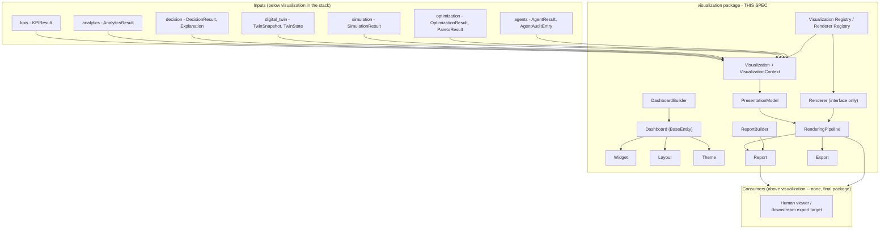
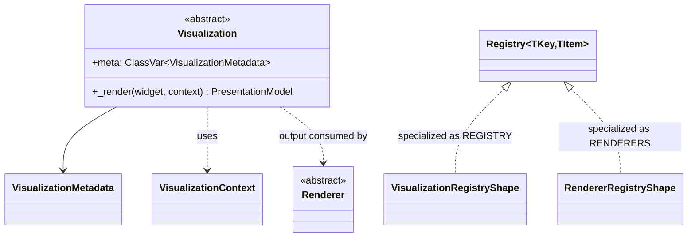
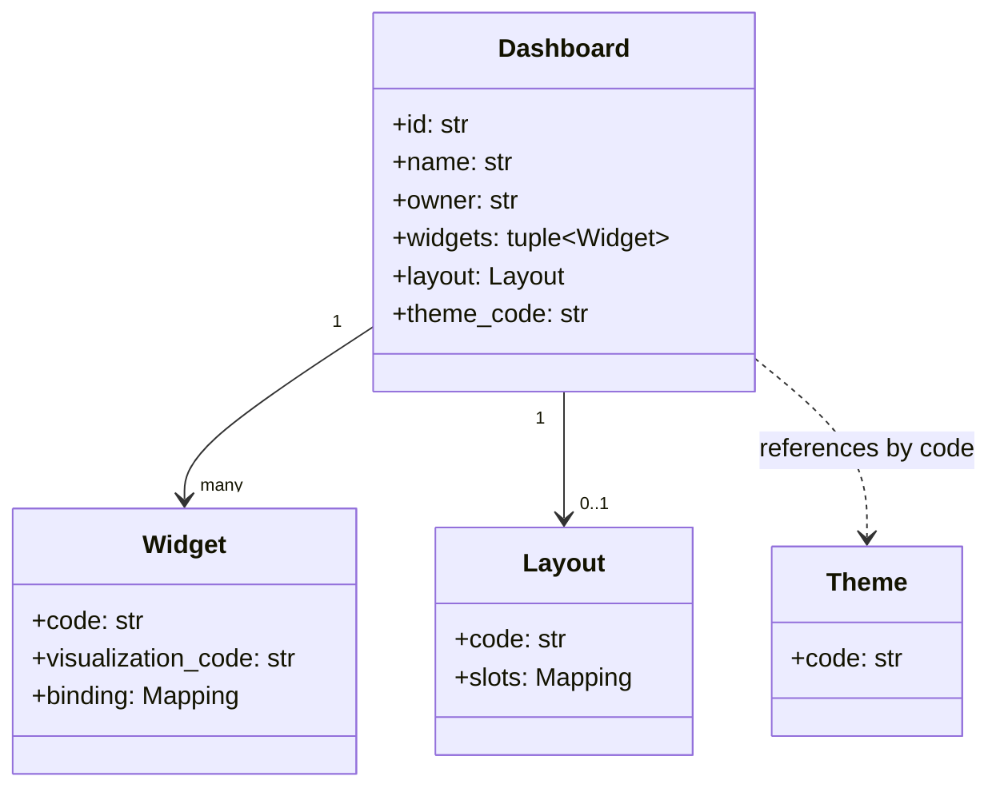
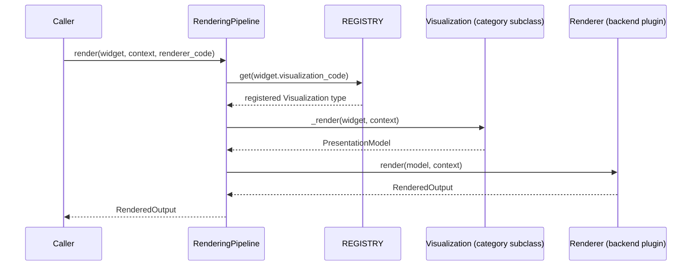
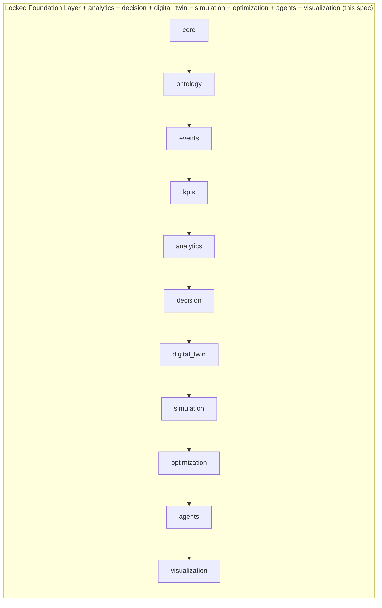

# Visualization — Design Specification

| | |
|---|---|
| **Document ID** | AH-DS-12 |
| **Package** | `mineproductivity.visualization` |
| **Status** | Draft — Design Complete, Pending Implementation |
| **Version** | 1.0.0 |
| **Conforms to** | Master Architecture Handbook v1.0; Reference Implementation Blueprint v1.0; Developer & Cookbook Guide Parts I–III |
| **Builds on** | Core Foundation Library v0.2.0 (LOCKED); Event Framework spec 01 (LOCKED, `events` v0.3.0); Ontology Framework spec 02 (LOCKED, `ontology` v0.4.0); Registry Framework spec 03 (LOCKED, `registry`/`plugins` v0.5.0); Connector Framework spec 04 (LOCKED, `connectors` v0.6.0); KPI Engine spec 05 (LOCKED, `kpis` v0.7.0); Analytics Engine spec 06 (LOCKED, `analytics` v0.8.0); Decision Intelligence spec 07 (LOCKED, `decision` v0.9.0); Digital Twin spec 08 (LOCKED, `digital_twin` v1.0.0); Simulation spec 09 (LOCKED, `simulation` v1.1.0); Optimization spec 10 (LOCKED, `optimization` v1.2.0); AI Agents spec 11 (LOCKED, `agents` v1.3.0) |
| **Author** | Chief Software Architect, MineProductivity |
| **Classification** | Public — Open Source Design Documentation |

## Document Control

Design specification only — no implementation. This document designs `mineproductivity.visualization`, the seventh package built on top of the Foundation Layer and the **final** package in the platform's architecture, sitting directly above the now-locked `agents`. Nothing in this specification proposes, requires, or hints at a change to any file, public API, or dependency rule in `core`, `events`, `ontology`, `registry`, `plugins`, `connectors`, `kpis`, `analytics`, `decision`, `digital_twin`, `simulation`, `optimization`, or `agents`. Every object model, class name, and enum member cited from a lower package is taken verbatim from that package's own `__init__.py` public export list or its own governing design specification. Section numbering below (1–34) is locked before drafting and does not change during it: seven front-matter sections (Purpose through Public API), nineteen sections domain-specific to this package's own required topics (Visualization Abstractions through Visualization Discovery), and eight closing sections (Serialization through Future Roadmap). State, sequence, and class diagrams appear embedded within their own most relevant section throughout, exactly as specs 06–11 already do, rather than as separate top-level sections.

Cross-references to spec 06 (`analytics`) in this document are given as plain-text citations (`spec 06 §N`), never as Markdown links: `06_Analytics_Engine_Design_Specification.md` exists only on the as-yet-unmerged `feature/analytics-engine` branch, not on `main`, and a Markdown link to a file absent from the current branch is a broken link. Cross-references to specs 07 through 11 (`decision`, `digital_twin`, `simulation`, `optimization`, `agents`), which **are** present on `main`, are given as ordinary Markdown links where appropriate.

---

## 1. Purpose

Visualization answers the one question no package below it was ever chartered to answer: *given everything already measured, characterized, recommended, represented, projected, solved, and decided by the ten packages beneath it, how does a human actually see any of it?* `kpis` measures; `analytics` characterizes; `decision` recommends; `digital_twin` represents current state; `simulation` projects hypothetical futures; `optimization` solves for the best plan; `agents` decides and acts autonomously. None of the ten packages below `visualization` renders a chart, lays out a dashboard, or produces a human-facing document — each returns a structured, machine-readable value object and stops there, by its own explicit design. `visualization` is the package that turns those structured objects into something a shift supervisor, a mine manager, or an executive can actually look at.

Visualization is, concretely, the package positioned to fulfill six separate promises made by name across six already-locked specifications, each written before this package existed. KPI Engine's own `KPIMetadata` schema carries a dedicated `visualization_hint` field (field 18 of the Standard Library's 29-field template, spec 05 §10.1) precisely so a future renderer knows what chart shape a metric expects without inventing its own heuristic, and `KPIResult` already ships `plot()`/`pareto()` methods (spec 05 §10.6) that this package's own `Visualization` types are the natural eventual backing for. Decision Intelligence's own Future Roadmap named `visualization` the anticipated renderer of the `DecisionResult` family (spec 07 §36, citing §28). Digital Twin's own Future Roadmap named it the anticipated renderer of the `TwinResult`/`TwinState`/`TwinSnapshot` family (spec 08 §34). Simulation's named it the anticipated renderer of the `SimulationResult`/`Experiment` family, explicitly anticipating "animating a `SimulationRun`'s state trajectory over its `time_horizon`" (spec 09 §37). Optimization's named it the anticipated renderer of the `OptimizationResult`/`ParetoResult` family, explicitly anticipating "plotting a multi-objective search's Pareto front or a post-optimality sweep's sensitivity curve" (spec 10 §37). AI Agents' went furthest of the six: it named `visualization` the anticipated renderer of the `AgentResult`/`AgentAuditTrail` family, "including a live view of a `WorkflowEngine`'s in-progress multi-agent decomposition, an `ApprovalRequest` queue awaiting human action, and a `ConversationContext`'s turn history" (spec 11 §37). This specification makes all six promises concrete: Visualization renders every one of these already-structured types directly, never recomputing or reinterpreting the facts inside them.

Visualization holds no KPI formula, no statistical model, no business-decision logic, no twin-synchronization logic, no simulation-execution logic, no solver logic, and no autonomous-reasoning logic of its own — all of those already exist, one or more layers down, and are rendered rather than re-derived. It is not a charting-library wrapper: a `Visualization` (§8) is a stable, backend-independent contract a future Plotly-, Matplotlib-, D3-, terminal-, or PDF-backed `Renderer` (§16) plugin implements against, exactly the same interface-first discipline this series has applied at every prior layer, now extended to a presentation backend rather than a numerical solver or a reasoning model.

## 2. Business Objectives

1. **Render, never recompute, the ten packages below.** A `Visualization` never recalculates a KPI, a statistical judgment, a recommendation, a twin's state, a simulated projection, a solved plan, or an autonomous agent's decision — it reads each one as already-structured evidence and produces a presentation of it (§3.2's own consumption-without-redefinition rule).
2. **Make every rendered artifact traceable to the exact evidence it presents**, so a chart, a dashboard, or an exported report can always be traced back to the `KPIResult`/`AnalyticsResult`/`DecisionResult`/`TwinSnapshot`/`SimulationResult`/`OptimizationResult`/`AgentResult` it was built from, never as an unaccountable picture with no data lineage.
3. **Support the eight named presentation categories** (Chart, Graph, KPI Card, Timeline, Simulation Playback View, Digital Twin View, Optimization Comparison View, Agent Explanation View, §26) as one shared, closed taxonomy over one shared `Visualization` contract, so a future site does not have to invent its own notion of "what kind of view is this."
4. **Let a user compose a persistent, editable `Dashboard`** (§10) from many `Widget`s, each bound to one piece of already-computed evidence, without this package ever owning what that evidence means.
5. **Remain rendering-backend-independent for the entire lifetime of this package.** No specific charting library, templating engine, or document-generation library is chosen or shipped (§8, §16); every one of them is an equally first-class plugin behind the same `Visualization`/`Renderer` interfaces.
6. **Produce durable, exportable artifacts** (`Report`, §13; `Export`, §18) from the same underlying presentation machinery used for live, on-screen rendering, so a mine manager's PDF handout and a shift supervisor's live dashboard are never two independently-maintained code paths.

## 3. Architectural Principles

1. **Presentation, not computation, decision, projection, solving, or autonomy.** Visualization coordinates the outputs of `kpis`/`analytics`/`decision`/`digital_twin`/`simulation`/`optimization`/`agents`/`events`; it never performs any of their work itself (out of scope entirely, §4). Where a capability is deliberately deferred to a pluggable rendering backend, this design defines an interface for it (§8, §16) rather than a placeholder implementation.
2. **Consumption without redefinition.** Visualization never recomputes a KPI value, a statistical judgment, a recommendation, a twin's state, a simulated projection, a solved plan, or an agent's decision. `VisualizationContext` (§8) carries `kpi_results`, `analytics_results`, `decision_results`, `twin_snapshot`, `simulation_results`, `optimization_results`, and `agent_audit_entries` exactly as each lower package already defines them — read, never re-derived. This is the single most important boundary in this specification (§8, §31).
3. **State as a configuration record, never a process record.** `Dashboard` (§10) follows `optimization.OptimizationRun`'s/`agents.Task`'s own precedent of subclassing `core.BaseEntity[str]` directly and producing a new instance on every change — but, unlike those two, `Dashboard` carries no execution-lifecycle `status` and no `with_state()` method, because a saved dashboard is a configuration a user edits, not a process that runs to completion (§10's own recorded departure from the pattern).
4. **Reuse over reinvention, including literal composition where the shape genuinely fits.** `DashboardRepository` **is** `core.BaseRepository[Dashboard, str]` (§22), exactly mirroring `agents.TaskRepository`'s own literal reuse (spec 11 §25) — the fifth occurrence of this exact pattern. `DashboardBuilder`/`ReportBuilder` (§12, §14) are the first concrete subclasses of `core.BaseBuilder[T]` anywhere in this series to actually be adopted, closing out a framework capability `core` has carried unused since the Foundation Layer. `Widget.binding` and `Layout.slots` are solver-independent strings this package never parses, exactly the same "never executes, only stores" posture `optimization.Constraint.expression` (spec 10 §9) and `agents.AgentPolicy.rule` (spec 11 §10) already establish. Where the coupling does not fit even though the interface looks similar, this package documents a deliberate non-reuse instead of forcing it (`Export` vs. `connectors`, §18).
5. **Interfaces before algorithms, where the algorithm is a rendering-backend choice.** `Visualization` and `Renderer` are each declared as stable abstract contracts now (§8, §16); no specific charting library, templating engine, or document-generation library is chosen or shipped for either. This is the seventh package in the series to apply this discipline (after `analytics`' forecasting/anomaly/outlier interfaces, `decision`'s root-cause/what-if interfaces, `digital_twin`'s simulation interface, `simulation`'s four methodology interfaces, `optimization`'s six paradigm interfaces, and `agents`' three interfaces) — the pattern is now a platform-wide convention, not a one-off.
6. **Zero upward leakage.** No lower package (`core` through `agents`) imports `visualization`, mechanically enforced by the same AST-based `TestNoForbiddenDependencies` pattern every existing package already uses. Nothing imports `visualization` in turn, since it is the final package in the chain (§5).
7. **One extension mechanism, platform-wide.** New visualization categories, renderer backends, and export formats are added exactly the way a new KPI, connector, ontology entity type, Analytics model, Decision strategy, twin type, simulation model, optimization model, or agent category is added: subclass, register, discover via entry points (§28). This package holds two independent `Registry` instances — `REGISTRY` for `Visualization` types and `RENDERERS` for `Renderer` types — following the exact precedent `agents` established for `Agent`/`Tool` (spec 11 §22), not inventing a new exception to "one extension mechanism" but reapplying an already-accepted one.
8. **Every rendered artifact is traceable to its evidence.** A `PresentationModel` (§9) and every `RenderedOutput`/`Report` (§13) built from it carry enough reference information to identify exactly which `KPIResult`/`AnalyticsResult`/`DecisionResult`/`TwinSnapshot`/`SimulationResult`/`OptimizationResult`/`AgentAuditEntry` produced it — accountability is structural, not optional instrumentation added after the fact.

## 4. Overall Architecture



Visualization is deliberately **not** an eighth computation engine competing with `kpis`/`analytics`/`decision`, a second stateful-representation layer competing with `digital_twin`, a second projection layer competing with `simulation`, a second search-and-solve layer competing with `optimization`, or a second autonomous-orchestration layer competing with `agents`. It has no formula language, no statistics library, no rule-threshold engine, no scenario-projection algorithm, no constrained solver, and no reasoning-backend contract of its own — it borrows already-computed evidence from every package below it and hands its own presentation logic to a pluggable `Renderer` backend.

Every package below `visualization` that defines a central "as-object" abstraction shares (or deliberately does not share) an abstract method depending on whether its categories differ in domain or in computational shape. `Visualization` shares one abstract `_render` method across all eight categories (§8), mirroring `decision.DecisionModel`'s and `agents.Agent`'s identical shared-method posture (spec 07 §8, spec 11 §8) rather than `simulation`'s/`optimization`'s no-shared-method posture — every named visualization category answers the same underlying question, *given evidence and a rendering context, produce a structured presentation of it*, differing only in what evidence it binds and how it lays it out, never in computational shape.

**Runtime request flow**, walking the diagram above for the single most common entry point (`RenderingPipeline.render`, §11): a caller supplies a `Widget`, a `VisualizationContext` already carrying whatever lower-package evidence the dashboard's authoring process considered relevant, and a `renderer_code`. The pipeline resolves the `Widget.visualization_code` against `REGISTRY`, dispatches to the registered `Visualization`'s `_render`, and hands the resulting `PresentationModel` to the `Renderer` resolved from `RENDERERS` via `renderer_code`. The concrete rendering backend never reaches back into `kpis`, `analytics`, `decision`, `digital_twin`, `simulation`, `optimization`, or `agents` on its own initiative — every fact arrives pre-fetched, in `VisualizationContext`, exactly once per call, the same "gather evidence once, at the boundary" shape every package below it already follows at its own layer.

**Visualization as the platform's capstone, not its eighth layer of business logic.** Every package from `kpis` through `agents` was designed, at the time it was written, against a promise that some future package would eventually make its output visible to a human (§1). This specification is where every one of those promises is redeemed at once, not staggered across several future specifications the way `agents` itself was staggered across specs 07 through 10. That is why this package's own object model is unusually narrow relative to its evidence surface: seven packages' worth of already-structured output, and only two genuinely new interface-only contracts (`Visualization`, `Renderer`) plus one genuinely new persisted entity (`Dashboard`) are needed to present all of it. A wider object model here would be a signal that this package had started recomputing facts instead of presenting them.

## 5. Dependency Graph

```
core → ontology → events → kpis → analytics → decision → digital_twin → simulation → optimization → agents → visualization
```

**Permitted imports (platform layering rule, verbatim from this package's brief):** `visualization` may import `mineproductivity.core`, `mineproductivity.ontology`, `mineproductivity.events`, `mineproductivity.registry`, `mineproductivity.plugins`, `mineproductivity.connectors`, `mineproductivity.kpis`, `mineproductivity.analytics`, `mineproductivity.decision`, `mineproductivity.digital_twin`, `mineproductivity.simulation`, `mineproductivity.optimization`, and `mineproductivity.agents`, and nothing else.

**Actually exercised by this design:** `core` (`BaseEntity`, `BaseRepository`/`InMemoryRepository`, `BaseSpecification`, `BaseBuilder`, `Result`/`Maybe`, `BaseValueObject`, `BaseConfiguration`, `serialization`, exceptions), `kpis`/`analytics`/`decision` (`KPIResult`, `AnalyticsResult`, `DecisionResult`, and the sibling `Explanation` value object attached to a `Recommendation` — read into `VisualizationContext`, §8), `digital_twin` (`TwinSnapshot`, `TwinState` — current-condition evidence, §8), `simulation` (`SimulationResult` — projected-outcome evidence, §8), `optimization` (`OptimizationResult`, `ParetoResult` — solved-plan evidence, §8), and `agents` (`AgentAuditEntry`, which itself already carries the `AgentResult` it recorded — autonomous-decision evidence, §8). `connectors` is a permitted import under the platform-wide layering rule and is **not** exercised: `visualization` renders already-computed, already-synchronized facts, never a vendor-specific wire format, and `Export` (§18) is deliberately not built on `connectors` despite the surface-level similarity of "moving structured data across a boundary" (§18's own recorded non-reuse). `ontology` is available for the vocabulary a `Widget`'s scope is expressed in, mirroring `digital_twin.Twin.scope`'s original use (spec 08 §9), but introduces no new concept. `registry`/`plugins` back `REGISTRY`/`RENDERERS` (§20) exactly as every prior domain package's own registry already does.

**Depended on by:** nothing. `visualization` is the eleventh and final package in the platform's own core dependency chain; no future package is anticipated above it.

- `visualization` MUST NOT import any package that does not yet exist, and none currently do.
- No lower package (`core` through `agents`) may import `visualization` — mechanically enforced (§28).

## 6. Package Structure

```
src/mineproductivity/visualization/
├── __init__.py            # public API surface (§7)
├── abstractions.py          # Visualization (ABC), VisualizationContext
├── presentation.py             # PresentationModel
├── theme.py                       # Theme
├── layout.py                         # Layout
├── widget.py                            # Widget
├── dashboard.py                            # Dashboard (BaseEntity[str], concrete)
├── dashboard_builder.py                       # DashboardBuilder (BaseBuilder[Dashboard])
├── report.py                                     # Report
├── report_builder.py                                # ReportBuilder (BaseBuilder[Report])
├── renderer.py                                         # Renderer (ABC) -- interface only, §16; RendererMetadata, RenderedOutput
├── pipeline.py                                            # RenderingPipeline
├── export.py                                                 # ExportRequest, ExportResult
├── discovery.py                                                 # by_theme(), by_owner()
├── persistence.py                                                  # DashboardRepository
├── _registry.py                                                       # REGISTRY, RENDERERS, register, register_renderer
├── exceptions.py
└── README.md
```

Sixteen implementation modules plus `__init__.py` and `README.md` — fewer than every prior consumer package (`agents`'s twenty, spec 11 §6; `optimization`'s twenty-one, spec 10 §6) despite this package's own presentation surface spanning eight named view categories, for the same reason `agents` needed fewer modules than `simulation`: extensive, explicit reuse. There is no dedicated `policy.py`, `capability.py`, `approval.py`, `conversation.py`, `communication.py`, or `workflow.py` — Visualization has no autonomous action to gate, delegate, or approve; it only presents what other packages already decided. Every module below is specified against the same seven fields specs 06–11 used: Purpose, Responsibilities, Public Classes, Public Functions, Public API, Dependencies, and Extension Points.

### `abstractions.py`
- **Purpose:** the "Visualization-as-object" root, and the collaborator bundle a concrete visualization needs.
- **Responsibilities:** define the common metadata slot and shared rendering method every visualization type carries; bundle `VisualizationContext`'s evidence fields.
- **Public Classes:** `Visualization` (ABC), `VisualizationContext`.
- **Dependencies:** `core` (`Result`), `kpis` (`KPIResult`), `analytics` (`AnalyticsResult`), `decision` (`DecisionResult`), `digital_twin` (`TwinSnapshot`), `simulation` (`SimulationResult`), `optimization` (`OptimizationResult`, `ParetoResult`), `agents` (`AgentAuditEntry`).
- **Extension Points:** a future rendering-backend plugin subclasses `Visualization` and implements `_render` (§8).

### `presentation.py`
- **Purpose:** the structured, backend-independent output of `_render` (§9).
- **Responsibilities:** carry exactly what should be shown (series, labels, category hint, evidence references) without committing to any concrete medium.
- **Public Classes:** `PresentationModel`.
- **Dependencies:** `core` (`BaseValueObject`).
- **Extension Points:** none — a new presentation shape is an additive entry in `PresentationModel.series` (an open `Mapping[str, Any]`), never a new typed field.

### `theme.py`
- **Purpose:** shared visual styling (§21).
- **Responsibilities:** carry a named palette/font configuration a `Dashboard` and its `Widget`s reference by code.
- **Public Classes:** `Theme`.
- **Dependencies:** `core` (`BaseValueObject`).
- **Extension Points:** a new `Theme` is authored and referenced by code, never a new typed styling field.

### `layout.py`
- **Purpose:** widget arrangement (§10).
- **Responsibilities:** map each `Widget.code` to an opaque, renderer-interpreted position spec.
- **Public Classes:** `Layout`.
- **Dependencies:** `core` (`BaseValueObject`).
- **Extension Points:** a new arrangement is a new `Layout.slots` entry, never a new geometry model.

### `widget.py`
- **Purpose:** one bound, placed unit of presentation on a `Dashboard` (§10).
- **Responsibilities:** reference a registered `Visualization` type and the evidence it binds to.
- **Public Classes:** `Widget`.
- **Dependencies:** `core` (`BaseValueObject`).
- **Extension Points:** a new evidence reference shape is carried in `Widget.binding` (an open `Mapping[str, str]`), never a new typed field.

### `dashboard.py`
- **Purpose:** the persistent, editable configuration entity (§10).
- **Responsibilities:** subclass `core.BaseEntity[str]` directly; carry the current widgets, layout, and theme reference.
- **Public Classes:** `Dashboard`.
- **Dependencies:** `core` (`BaseEntity`), `widget.py`, `layout.py`.
- **Extension Points:** none — `Dashboard`'s shape is closed; a new presentation need is a new `Widget`, never a change to `Dashboard` itself.

### `dashboard_builder.py`
- **Purpose:** fluent, step-by-step `Dashboard` construction (§12).
- **Responsibilities:** accumulate widgets, layout, and theme choices, then produce a `Dashboard` via `build()`.
- **Public Classes:** `DashboardBuilder`.
- **Dependencies:** `core` (`BaseBuilder`), `dashboard.py`.
- **Extension Points:** a new construction step is an additive fluent method here, never a new builder mechanism.

### `report.py`
- **Purpose:** a durable, point-in-time generated document (§13).
- **Responsibilities:** carry an ordered set of already-rendered outputs as one exportable artifact.
- **Public Classes:** `Report`.
- **Dependencies:** `core` (`BaseValueObject`), `renderer.py` (`RenderedOutput`).
- **Extension Points:** none — a new report shape is a new set of sections at build time, never a new typed field.

### `report_builder.py`
- **Purpose:** fluent, step-by-step `Report` construction (§14).
- **Responsibilities:** accumulate one or more rendering requests, drive `RenderingPipeline` for each, and assemble the final `Report`.
- **Public Classes:** `ReportBuilder`.
- **Dependencies:** `core` (`BaseBuilder`), `pipeline.py`, `report.py`.
- **Extension Points:** a new assembly step is an additive fluent method here, never a new builder mechanism.

### `renderer.py`
- **Purpose:** interface-only extension point (§16) — no concrete implementation.
- **Responsibilities:** define a stable abstract contract for converting a `PresentationModel` into a concrete medium, and the value objects describing one rendering.
- **Public Classes:** `Renderer` (ABC), `RendererMetadata`, `RenderedOutput`.
- **Dependencies:** `presentation.py`, `abstractions.py`.
- **Extension Points:** the entire purpose of this module — a concrete `Renderer` subclass (an HTML renderer, a PDF renderer, a terminal renderer) is a first-class extension (§28), never added inside this module itself (§30).

### `pipeline.py`
- **Purpose:** orchestrates one rendering request (§11).
- **Responsibilities:** dispatch to the registered `Visualization`'s `_render`, then to the registered `Renderer`'s `render`.
- **Public Classes:** `RenderingPipeline`.
- **Dependencies:** `_registry.py`, `abstractions.py`, `renderer.py`.
- **Extension Points:** none — a new visualization category is a new `Visualization` subclass (§8), never a change to the pipeline's own dispatch logic (§28).

### `export.py`
- **Purpose:** converting a rendered artifact into a downloadable form (§18).
- **Responsibilities:** carry the request and result shape for exporting a `Report` or a live `Dashboard` rendering.
- **Public Classes:** `ExportRequest`, `ExportResult`.
- **Dependencies:** `core` (`BaseValueObject`), `renderer.py` (`RenderedOutput`).
- **Extension Points:** a new export medium is a new `Renderer` implementation (§16), never a new export mechanism.

### `discovery.py`
- **Purpose:** dashboard discovery (§27) — theme/owner-based lookup over currently-saved dashboards.
- **Responsibilities:** provide named `core.BaseSpecification` factory functions for the two most common lookup predicates, mirroring `agents.discovery`'s identical pattern (spec 11 §23).
- **Public Functions:** `by_theme`, `by_owner`.
- **Dependencies:** `core` (`BaseSpecification`, `PredicateSpecification`), `dashboard.py`.
- **Extension Points:** a new named lookup predicate is a new function here, composing `core.PredicateSpecification`, never a new query mechanism.

### `persistence.py`
- **Purpose:** where dashboards are stored (§22).
- **Responsibilities:** define the storage contract for dashboard instances, keyed by their own identity.
- **Public API:** `DashboardRepository` (a `type` alias, not a new class).
- **Dependencies:** `core` (`BaseRepository`, `InMemoryRepository`), `dashboard.py`.
- **Extension Points:** a production-grade backend (SQL, document store) implements `core.BaseRepository[Dashboard, str]` directly — no `visualization`-specific ABC exists to implement instead (§3.4, §22).

### `_registry.py`
- **Purpose:** the Visualization Registry and the Renderer Registry (§20), the second package in this series to hold two distinct `Registry` instances rather than one, following the exact pattern `agents._registry` established (spec 11 §22), since a `Visualization` type and a `Renderer` type are orthogonal registrable concepts.
- **Public Functions:** `register`, `register_renderer`.
- **Public API:** `REGISTRY`, `RENDERERS`, `register`, `register_renderer`.
- **Dependencies:** `registry` (`Registry`), presentation-facing metadata, `renderer.py`, `exceptions.py`.
- **Extension Points:** none within this module itself — it is the extension mechanism (§28) other modules and third-party plugins use.

### `exceptions.py`
- **Purpose:** the package's exception hierarchy, used throughout §8–§30.
- **Responsibilities:** define every raised error type this package's public API can produce.
- **Public Classes:**
  ```python
  class VisualizationValidationError(ValidationError):
      """A VisualizationMetadata, Dashboard, Widget, or Layout failed
      validation (§26, §10) -- e.g. an empty code, a Widget with no
      bound visualization_code, or a Layout with no slots."""

  class DashboardNotFoundError(NotFoundError):
      """DashboardRepository.get(dashboard_id) found no dashboard for
      that id, or REGISTRY.get(code)/RENDERERS.get(code) found no
      registered type for that code."""

  class RenderingError(MineProductivityError):
      """RenderingPipeline raised for a step that should have been
      structurally valid -- distinct from a legitimately-incomplete
      widget binding (§30's 'qualify, don't coerce' rule), which
      returns a PresentationModel/RenderedOutput carrying a warning
      instead of raising."""

  class VisualizationVersionConflictError(RegistrationError):
      """A plugin attempted to re-register an existing Visualization
      or Renderer type code with materially different metadata
      without a version bump, mirroring
      agents.AgentVersionConflictError's identical reasoning
      (spec 11 §6)."""
  ```
- **Dependencies:** `core` (`ValidationError`, `NotFoundError`, `MineProductivityError`), `registry` (`RegistrationError`).
- **Extension Points:** a new exception type is added only alongside the specific failure mode it represents.

## 7. Public API

```python
from mineproductivity.visualization import (
    # Abstractions
    Visualization, VisualizationContext,
    # Presentation
    PresentationModel,
    # Styling and layout
    Theme, Layout,
    # Dashboard domain model
    Widget, Dashboard, DashboardBuilder,
    # Report
    Report, ReportBuilder,
    # Rendering
    RenderingPipeline, Renderer, RendererMetadata, RenderedOutput,
    # Export
    ExportRequest, ExportResult,
    # Discovery
    by_theme, by_owner,
    # Persistence
    DashboardRepository,
    # Registry (Registry Framework specialization, applied twice)
    register, register_renderer, REGISTRY, RENDERERS,
    # Metadata
    VisualizationMetadata, VisualizationCategory,
    # Exceptions
    VisualizationValidationError, DashboardNotFoundError,
    RenderingError, VisualizationVersionConflictError,
)
```

Every name above is intended to be **stable once implementation begins**, per the same "prefer fewer, carefully designed interfaces" discipline specs 06–11 already applied — no speculative "maybe useful" symbol is included; each name maps directly to one of the sections below.

## 8. Visualization Abstractions

```python
class VisualizationContext:
    """Bundles the collaborators and evidence a Visualization may need --
    the visualization-layer counterpart to agents.AgentContext (spec 11
    §8), one layer up, extended with one new evidence field
    (agent_audit_entries, since each AgentAuditEntry already carries the
    AgentResult it recorded, so no separate agent_results field is
    needed) -- every fact this package renders still has a stable,
    structured home in a lower package. Per decision.DecisionContext's
    own established convention (spec 07 §8), this package uses the
    caller-assembles pattern exclusively: a caller building a Dashboard
    or Report already knows which evidence it wants shown, so no
    session-assembles variant is defined here."""

    def __init__(
        self,
        *,
        kpi_results: "Sequence[KPIResult]" = (),
        analytics_results: "Sequence[AnalyticsResult]" = (),
        decision_results: "Sequence[DecisionResult]" = (),
        twin_snapshot: "TwinSnapshot | None" = None,
        simulation_results: "Sequence[SimulationResult]" = (),
        optimization_results: "Sequence[OptimizationResult]" = (),
        agent_audit_entries: "Sequence[AgentAuditEntry]" = (),
    ) -> None: ...


class Visualization(ABC):
    """The root of every registrable visualization type -- 'Visualization-
    as-object,' the direct counterpart of kpis.BaseKPI/analytics.
    AnalyticsModel/decision.DecisionModel/simulation.SimulationModel/
    optimization.OptimizationModel/agents.Agent, seven/six/five/three/
    two/one layers down respectively. Like decision.DecisionModel and
    agents.Agent, and unlike simulation's/optimization's category ABCs,
    Visualization shares one abstract method across all eight categories
    (§26), since every category answers the same underlying question --
    given evidence and a rendering context, produce a structured
    presentation of it -- differing only in which evidence it binds and
    how it lays it out, never in computational shape. THIS MODULE SHIPS
    NO CONCRETE SUBCLASS -- choosing a specific charting library,
    templating engine, or document-generation library is exactly the
    kind of implementation decision this package's charter (§3.1, §3.5,
    §4) excludes."""

    meta: ClassVar[VisualizationMetadata]

    @abstractmethod
    def _render(self, widget: "Widget", *, context: VisualizationContext) -> "PresentationModel": ...
```



`Visualization` is the eighth package-defining "as-object" root in this series, and the second (after `agents.Agent`) whose category members (§26) are presentation roles rather than algorithmic paradigms — a `Chart`, a `Timeline`, or a `SimulationPlaybackView` differs from another category not in *how* it produces a `PresentationModel` but in *what evidence and layout* it is scoped to, which is why `VisualizationCategory` (§26) is a closed enum exactly like `AgentCategory`, not eight separate ABCs. `Visualization` instances are stateless (§29) — statefulness in this package lives entirely in `Dashboard` (§10), never in a visualization implementation, so that the same registered `Visualization` type can back many concurrent `Widget`s safely.

## 9. Presentation Model

```python
@dataclasses.dataclass(frozen=True, slots=True)
class PresentationModel(BaseValueObject):
    """The structured, backend-independent output of Visualization._render
    -- 'View Model' and 'Presentation Model' in this package's own brief
    name the same concept; this specification uses PresentationModel as
    the single canonical name to avoid shipping two near-duplicate
    types for one responsibility. Deliberately carries no rendered
    bytes, HTML, or pixels of its own -- that is exactly the
    Renderer's (§16) responsibility, never this package's."""

    category: "VisualizationCategory"
    title: str
    series: "Mapping[str, Any]" = dataclasses.field(default_factory=dict, kw_only=True)
    evidence_refs: "tuple[str, ...]" = dataclasses.field(default=(), kw_only=True)
    warnings: "tuple[str, ...]" = dataclasses.field(default=(), kw_only=True)
```

`PresentationModel.evidence_refs` carries the exact `KPIResult.code`/`AnalyticsResult.model_code`/`DecisionResult.model_code`/`OptimizationResult.run_id`/`AgentAuditEntry.agent_code`-shaped references a consuming system can re-fetch to verify a rendered claim independently, exactly the same "structured contract over prose" rationale `decision.Explanation.evidence_refs` already establishes one layer down (spec 07 §17) -- Visualization's own evidence-linking is a direct continuation of that idiom, applied to a presentation rather than a recommendation. `PresentationModel.series` is an open `Mapping[str, Any]` rather than a family of typed per-category fields, since what one category's data shape looks like (a Pareto front's two axes; a timeline's ordered events; an agent's turn history) varies far more than what a `KPIResult`'s or `OptimizationResult`'s own shape does.

## 10. Dashboard Domain Model

```python
@dataclasses.dataclass(frozen=True, slots=True)
class Widget(BaseValueObject):
    """One bound, placed unit of presentation on a Dashboard. `binding`
    is an open Mapping[str, str] naming which evidence this widget
    reads (e.g. {'kpi_code': 'PROD.TPH', 'scope': 'site=Karara'}) --
    never a typed reference, since what a widget binds to varies by
    VisualizationCategory (§26) far more than a Dashboard's own shape
    does."""

    code: str
    visualization_code: str
    binding: "Mapping[str, str]" = dataclasses.field(default_factory=dict, kw_only=True)


@dataclasses.dataclass(frozen=True, slots=True)
class Layout(BaseValueObject):
    """Maps each Widget.code to an opaque, renderer-interpreted position
    spec (e.g. a CSS grid area, a terminal row/column pair, a PDF page
    region) -- this package never parses slots, exactly the same
    'never executes, only stores' posture optimization.Constraint.
    expression (spec 10 §9) and agents.AgentPolicy.rule (spec 11 §10)
    already establish, applied here to layout geometry instead of an
    optimization constraint or a governance guardrail."""

    code: str
    slots: "Mapping[str, str]" = dataclasses.field(default_factory=dict, kw_only=True)


@dataclasses.dataclass(frozen=True, slots=True, eq=False)
class Dashboard(BaseEntity[str]):
    """The root of one saved, editable presentation configuration --
    'Dashboard-as-entity,' following agents.Task's own precedent (spec
    11 §3.3, §11) exactly, which itself followed optimization.
    OptimizationRun's (spec 10 §3.3, §10): id (inherited) is the
    dashboard's identity, and representing a change means producing a
    NEW Dashboard instance via dataclasses.replace, never mutating
    fields in place. Deliberately carries no status/with_state() of its
    own, unlike every prior BaseEntity subclass in this series -- a
    Dashboard is a configuration a user edits, not a process that runs
    to completion, so there is no lifecycle to track (§3.3)."""

    name: str
    owner: str
    widgets: "tuple[Widget, ...]" = dataclasses.field(default=(), kw_only=True)
    layout: "Layout | None" = dataclasses.field(default=None, kw_only=True)
    theme_code: str = dataclasses.field(default="", kw_only=True)
```



`Dashboard` carries no `_apply`/`_act`/`_render`-style abstract method of its own — unlike `Visualization`, which produces a `PresentationModel` via a single category-independent `_render`, a `Dashboard`'s widgets are each rendered independently by whichever registered `Visualization` type `RenderingPipeline` (§11) dispatches to on the widget's behalf. `Dashboard` is the *configuration record*, not the renderer itself, exactly the same distinction `agents.Task` draws relative to `Agent._act` (spec 11 §11) one layer down.

## 11. Rendering Pipeline

```python
class RenderingPipeline:
    """Orchestrates one rendering request: resolves widget.visualization_code
    against REGISTRY, dispatches to the registered Visualization's
    _render, then resolves renderer_code against RENDERERS and hands the
    resulting PresentationModel to that Renderer's render. Composes
    REGISTRY/RENDERERS (§20) directly -- no bespoke lookup mechanism of
    its own."""

    def __init__(self, *, registry: "Registry[str, type[Visualization]]", renderers: "Registry[str, type[Renderer]]") -> None: ...

    def render(
        self, widget: "Widget", *, context: VisualizationContext, renderer_code: str
    ) -> "RenderedOutput": ...
```



`RenderingPipeline.render` is the one place in this package where the dispatch decision — which `Visualization` type produces the model, which `Renderer` backend turns it into a concrete artifact — is made, and it makes that decision exactly once per call, by reading `widget.visualization_code` and the caller-supplied `renderer_code` directly, never by branching on a concrete Python type. A widget bound to evidence that has not yet been computed (an empty `context`) is not a special case requiring separate error handling: `_render` returns a `PresentationModel` carrying a warning (§30), never a raised exception, exactly the same "qualify, don't coerce" rule every prior "as-object" abstraction in this platform already follows (Cookbook Part I, Ch. 6; spec 05 §10.3; spec 08 §8; spec 09 §8).

## 12. Dashboard Builder

```python
class DashboardBuilder(BaseBuilder["Dashboard"]):
    """Fluent, step-by-step Dashboard construction -- the first concrete
    subclass of core.BaseBuilder anywhere in this series (§3.4): every
    prior package's own builder-shaped need (e.g. decision.
    ExplanationBuilder, spec 07 §17) was a plain, non-generic utility
    class rather than a formal core.BaseBuilder[T] subclass. Dashboard
    construction has enough optional steps (add a widget, set a layout,
    choose a theme) that BaseBuilder's own guidance -- 'prefer over a
    constructor... when construction has many optional steps that read
    better as chained method calls' -- applies directly."""

    def __init__(self, *, owner: str) -> None: ...

    def with_name(self, name: str) -> "Self": ...
    def with_widget(self, widget: "Widget") -> "Self": ...
    def with_layout(self, layout: "Layout") -> "Self": ...
    def with_theme(self, theme_code: str) -> "Self": ...

    def build(self) -> "Dashboard": ...
```

`DashboardBuilder.build()` raises `VisualizationValidationError` for a `Dashboard` with no `name` or an empty `owner` — the same incomplete-state failure `core.BaseBuilder.build()`'s own docstring anticipates ("may raise on incomplete state") and `core.BuilderError`'s docstring names directly. `DashboardBuilder.build_result()` — inherited, unoverridden, from `core.BaseBuilder` — is the non-raising alternative a caller uses when it prefers a `Result[Dashboard]` over a raised exception; this package adds no second non-raising variant of its own; reusing the one `core.BaseBuilder` already provides.

## 13. Report Model

```python
@dataclasses.dataclass(frozen=True, slots=True)
class Report(BaseValueObject):
    """A durable, point-in-time generated document composed of already-
    rendered sections -- deliberately a BaseValueObject, not a
    BaseEntity, since a Report is an immutable, produced-once artifact
    exactly like optimization.OptimizationResult/agents.AgentResult,
    never a long-lived configuration a user edits in place the way a
    Dashboard (§10) is. No ReportRepository exists for the same reason
    no OptimizationResultRepository or AgentResultRepository exists one
    and two layers down: a Result-shaped output is handed back to its
    caller, never independently persisted by this package."""

    report_code: str
    generated_at: datetime
    sections: "tuple[RenderedOutput, ...]" = dataclasses.field(default=(), kw_only=True)
    warnings: "tuple[str, ...]" = dataclasses.field(default=(), kw_only=True)
```

A `Report`'s `sections` are fully-rendered `RenderedOutput`s (§16), not raw `PresentationModel`s — a `Report` is, by definition, the finished document a human reads or downloads, exactly as `Export` (§18) is; the intermediate, backend-independent `PresentationModel` is an internal artifact of `RenderingPipeline` (§11), never something a `Report` itself exposes.

## 14. Report Builder

```python
class ReportBuilder(BaseBuilder["Report"]):
    """Fluent, step-by-step Report construction, composing
    RenderingPipeline (§11) once per requested section rather than
    duplicating its dispatch logic -- the same composition-over-
    duplication posture agents.WorkflowEngine already establishes over
    agents.TaskExecutor (spec 11 §13)."""

    def __init__(self, *, report_code: str, pipeline: "RenderingPipeline") -> None: ...

    def with_section(self, widget: "Widget", *, context: VisualizationContext, renderer_code: str) -> "Self": ...

    def build(self) -> "Report": ...
```

`ReportBuilder.with_section` is the one place a widget-plus-context-plus-renderer request becomes one `Report` section — each call composes `RenderingPipeline.render` (§11) directly rather than re-deriving what it already does. `ReportBuilder.build()` never raises for a section that produced a warning-carrying `RenderedOutput`; the warning is preserved on the final `Report.warnings` instead, consistent with §30's central rule.

## 15. Worked Example — Multi-Source Dashboard Rendering

**Worked example.** Illustrative of the intended end-to-end shape once implemented — a shift-handover dashboard combining a KPI card, an optimization comparison, and an agent explanation view, with the collaborators (`dashboard_repository`, `pipeline`) assumed already configured by the caller, exactly as the equivalent already-configured collaborators are assumed in specs 07–09's own worked examples:

```python
from mineproductivity.visualization import (
    DashboardBuilder, Widget, Layout, VisualizationContext, RenderingPipeline,
)

widgets = (
    Widget(code="tph_card", visualization_code="KPI_CARD.Standard",
           binding={"kpi_code": "PROD.TPH", "scope": "site=Karara"}),
    Widget(code="plan_compare", visualization_code="OPTIMIZATION_COMPARISON.Standard",
           binding={"run_id": "OPT-2026-041"}),
    Widget(code="agent_note", visualization_code="AGENT_EXPLANATION.Standard",
           binding={"agent_code": "SHIFT_SUPERVISOR.HandoverAdvisor"}),
)

dashboard = (
    DashboardBuilder(owner="shift-supervisor-a")
    .with_name("Night Shift Handover")
    .with_widget(widgets[0]).with_widget(widgets[1]).with_widget(widgets[2])
    .with_layout(Layout(code="handover_grid", slots={
        "tph_card": "row=1;col=1", "plan_compare": "row=1;col=2", "agent_note": "row=2;col=1;span=2",
    }))
    .with_theme("DARK_HIGH_CONTRAST")
    .build()
)
dashboard_repository.add(dashboard)

context = VisualizationContext(
    kpi_results=[recent_tph_result],                 # kpis.KPIResult, already computed
    optimization_results=[fleet_reassignment_plan],  # optimization.OptimizationResult, already solved
    agent_audit_entries=[handover_recommendation],   # agents.AgentAuditEntry, already recorded
)

for widget in dashboard.widgets:
    output = pipeline.render(widget, context=context, renderer_code="HTML.Standard")
    print(widget.code, output.format)
```

None of the three concrete category behaviors is defined by this specification: which series shape a `KPI_CARD.Standard` implementation renders, or which layout a `HTML.Standard` renderer produces, is exactly the rendering-backend decision this package's charter (§3.1) leaves to a future plugin. A further composition remains possible without being designed here, mirroring `agents`' own "leave the door open, do not build the room" posture (spec 11 §19): a `ReportBuilder` could assemble the same three widgets into a single exportable PDF `Report` instead of three live dashboard panels, reusing every collaborator above unchanged.

## 16. Renderer (interface only)

```python
@dataclasses.dataclass(frozen=True, slots=True)
class RendererMetadata(BaseMetadata):
    """The minimal registration schema for a discoverable Renderer type
    -- as light as agents.ToolMetadata/optimization.OptimizationMetadata
    (spec 11 §17, spec 10 §29)."""

    code: str
    description: str = dataclasses.field(kw_only=True)
    version: str = dataclasses.field(default="1.0.0", kw_only=True)


class Renderer(ABC):
    """The contract a future rendering-backend plugin implements (an
    HTML renderer, a PDF renderer, a terminal renderer, a Plotly- or
    Matplotlib-backed renderer). THIS MODULE SHIPS NO CONCRETE SUBCLASS
    -- choosing a specific charting or document-generation library is
    exactly the kind of implementation decision this package's charter
    (§3.1, §3.5, §4) excludes; this is also explicitly out of scope per
    this package's own brief ('never performs business computation')."""

    meta: ClassVar[RendererMetadata]

    @abstractmethod
    def render(self, model: "PresentationModel", *, context: VisualizationContext) -> "RenderedOutput": ...


@dataclasses.dataclass(frozen=True, slots=True)
class RenderedOutput(BaseValueObject):
    """A record of one Renderer.render() call and its result."""

    format: str
    payload: "Any"
    warnings: "tuple[str, ...]" = dataclasses.field(default=(), kw_only=True)
```

`Renderer` is registered separately from `Visualization` (`RENDERERS`, not `REGISTRY`, §20) because the two are orthogonal kinds of registrable capability: a `Visualization` decides *what* to show; a `Renderer` decides *how* to actually draw it in one concrete medium. A concrete `Renderer` implementation is expected to interpret `Layout.slots`/`Widget.binding` in whatever way its own medium requires (a CSS grid area for an HTML renderer; a monospace row/column for a terminal renderer) — this package never interprets either on a `Renderer`'s behalf, since deciding *how* to lay out one specific medium is itself part of the rendering this package deliberately declines to implement.

## 17. Domain-Specific Presentation Views

`VisualizationCategory` (§26) names four domain-specific views directly, alongside four general-purpose ones (`CHART`, `GRAPH`, `KPI_CARD`, `TIMELINE`, each binding to `kpi_results`/`analytics_results`/`decision_results` in `VisualizationContext`, §8). The four domain-specific members each bind to exactly the evidence field the corresponding lower package's own Future Roadmap anticipated:

- **`SIMULATION_PLAYBACK`** renders a `SimulationResult`'s state trajectory over its `time_horizon`, per Simulation's own anticipation of "animating a `SimulationRun`'s state trajectory" (spec 09 §37). A concrete implementation's `PresentationModel.series` is expected to carry a time-indexed sequence rather than a single snapshot, distinguishing it from `DIGITAL_TWIN_VIEW` below.
- **`DIGITAL_TWIN_VIEW`** renders a `TwinSnapshot`/`TwinState`, per Digital Twin's own anticipation of rendering "the `TwinResult`/`TwinState`/`TwinSnapshot` family directly" (spec 08 §34) — a single point-in-time representation of current asset condition, never a projected future the way `SIMULATION_PLAYBACK` is.
- **`OPTIMIZATION_COMPARISON`** renders an `OptimizationResult`'s or `ParetoResult`'s Pareto front or a post-optimality sweep's sensitivity curve, per Optimization's own anticipation (spec 10 §37) — `PresentationModel.series` is expected to carry either a single solved plan's key metrics or a `ParetoResult.front`-shaped collection of comparable solutions.
- **`AGENT_EXPLANATION`** renders an `AgentAuditEntry`'s embedded `AgentResult.explanation` — reusing `decision.Explanation` directly (§8), never a second justification type — alongside the audit metadata (`recorded_at`, `agent_code`, `scope`) that entry already carries, per Agents' own anticipation of rendering "a live view of a `WorkflowEngine`'s in-progress multi-agent decomposition... and a `ConversationContext`'s turn history" (spec 11 §37).

None of the four is a separate ABC or a separate object model — each is an ordinary `VisualizationCategory` member behind the one shared `Visualization._render` (§8), exactly as `agents.AgentCategory`'s ten domain members are each an ordinary category behind the one shared `Agent._act` (spec 11 §8), not ten separate ABCs. A concrete implementation is free to bind more than one evidence field at once (an `OPTIMIZATION_COMPARISON` widget legitimately reads both `optimization_results` and, for context, `simulation_results` if the compared plans were themselves scenario-tested) — `VisualizationContext` (§8) places no restriction on how many of its fields a single `_render` call consults.

## 18. Export

```python
@dataclasses.dataclass(frozen=True, slots=True)
class ExportRequest(BaseValueObject):
    """A request to convert a Dashboard's current rendering or an
    already-built Report into a single downloadable artifact."""

    renderer_code: str
    dashboard_id: "str | None" = dataclasses.field(default=None, kw_only=True)
    report: "Report | None" = dataclasses.field(default=None, kw_only=True)


@dataclasses.dataclass(frozen=True, slots=True)
class ExportResult(BaseValueObject):
    """The outcome of one export request."""

    format: str
    payload: "Any"
    exported_at: datetime
```

`Export` is deliberately **not** a reuse of `connectors`, despite both moving structured data across a system boundary: a `connectors.BaseConnector` reads an external vendor system *into* the platform (spec 04 §3); `Export` writes an already-rendered artifact *out of* the platform, in the opposite direction, to a human or an external file system — the two share no code and are never confused for one another. Exporting is not a third registrable concept alongside `Visualization`/`Renderer`: an export is simply one more `RenderingPipeline.render` (§11) call targeting a file-producing `Renderer` (a PDF-, CSV-, or PNG-backed implementation), wrapped in an `ExportResult` rather than displayed live — this package introduces no separate export-execution mechanism.

## 19. Worked Example — Exporting a Report

```python
from mineproductivity.visualization import ReportBuilder, ExportRequest

report = (
    ReportBuilder(report_code="SHIFT.Handover.2026-07-06", pipeline=pipeline)
    .with_section(widgets[0], context=context, renderer_code="PDF.Standard")
    .with_section(widgets[1], context=context, renderer_code="PDF.Standard")
    .build()
)

export_result = pipeline.render(
    widgets[2], context=context, renderer_code="PDF.Standard"
)  # a further section rendered directly, mirroring the identical call shape §11 already establishes
```

Every export path composes the same `RenderingPipeline`/`Renderer` machinery a live dashboard uses (§11, §16) — there is exactly one rendering code path in this package, never two independently-maintained ones for "live" versus "exported" output.

## 20. Visualization Registry and Renderer Registry

Identical mechanism to every other domain package's plugin registry — a direct specialization of `registry.Registry`, applied here to two orthogonal registrable concepts rather than one, following `agents`' own precedent (spec 11 §22):

```python
# visualization/_registry.py
from mineproductivity.registry import Registry

REGISTRY: "Registry[str, type[Visualization]]" = Registry(name="visualization")
RENDERERS: "Registry[str, type[Renderer]]" = Registry(name="visualization.renderers")

def register(cls: "type[Visualization]") -> "type[Visualization]":
    """Register cls into REGISTRY, keyed by cls.meta.code -- same shape
    as agents.register/optimization.register, raising
    VisualizationValidationError for an empty code and
    VisualizationVersionConflictError for a duplicate, non-identical
    re-registration."""

def register_renderer(cls: "type[Renderer]") -> "type[Renderer]":
    """Register cls into RENDERERS, keyed by cls.meta.code -- identical
    shape and identical error semantics as register(), specialized for
    Renderer rather than Visualization."""
```

This registry answers *"which visualization **types** does this installation know about"* — a type-level question, entirely distinct from `DashboardRepository` (§22, an instance-level question: *"which dashboards currently exist"*) and from `discovery.py` (§27, a query facade over that instance-level store), mirroring `agents`'/`optimization`'s identical three-way distinction (spec 11 §22, spec 10 §21). `RENDERERS` answers the analogous type-level question for rendering backends rather than presentation types — the two registries are never merged into one, since conflating "what can be shown" with "how it is drawn" would blur the exact boundary `Visualization`/`Renderer` (§8, §16) exists to keep sharp.

## 21. Theme

```python
@dataclasses.dataclass(frozen=True, slots=True)
class Theme(BaseValueObject):
    """A small, named visual styling configuration referenced by a
    Dashboard via theme_code (§10) rather than embedded inline, so the
    same theme can be shared across many dashboards without
    duplication. palette/typography are open Mapping[str, str] fields
    -- a renderer-interpreted color/font specification, never a typed
    per-property schema, since what a theme configures varies by
    Renderer backend (§16) far more than a Dashboard's own shape
    does."""

    code: str
    palette: "Mapping[str, str]" = dataclasses.field(default_factory=dict, kw_only=True)
    typography: "Mapping[str, str]" = dataclasses.field(default_factory=dict, kw_only=True)
```

`Theme` is a plain `BaseValueObject` referenced by a `Dashboard` via `theme_code`. It is not independently registrable: introducing a third `Registry` for themes would over-serve a need this package does not have, since a theme carries no behavior to dispatch to, unlike a `Visualization` or a `Renderer` — it is pure configuration data, validated (§25) but never looked up polymorphically. A concrete `Renderer` implementation resolves a `Dashboard.theme_code` against whatever theme store its own deployment configures — this package defines the `Theme` shape and nothing about where instances of it live, the same narrow-responsibility posture it takes toward `Widget.binding` and `Layout.slots` (§10).

## 22. Persistence

```python
type DashboardRepository = BaseRepository[Dashboard, str]
```

A literal type alias over `core.BaseRepository[Dashboard, str]` — not a new ABC, not a structural echo — because `Dashboard` genuinely satisfies `BaseRepository`'s `TEntity: BaseEntity[Any]` bound, exactly mirroring `agents.TaskRepository`'s own identical reuse (spec 11 §25) — the fifth occurrence of this exact reuse in the series (after `digital_twin.TwinRepository`, `simulation.SimulationRunRepository`, `optimization.OptimizationRunRepository`, and `agents.TaskRepository`). The reference implementation is `core.InMemoryRepository[Dashboard, str]()`, reused as-is with zero new persistence code. No equivalent repository exists for `Report` (§13) — a produced-once value object, never independently persisted by this package, the same treatment every prior `*Result` type already receives.

## 23. Versioning

Two independent versioning axes apply, mirroring the multi-axis discipline `agents` spec 11 §26 already established:

1. **`VisualizationMetadata.version`/`RendererMetadata.version`** (§26, §16) — a registered `Visualization`/`Renderer` *type*'s own SemVer, independent of any `Dashboard`'s own contents.
2. **`Dashboard`'s own contents** change freely via `dataclasses.replace` and carry no separate governed version number of their own, since a `Dashboard` is a personal or team configuration, not a published, governance-reviewed artifact the way an `AgentPolicy` or `OptimizationProblem` is (§3.3) — there is no `Active`/`Superseded` lifecycle to enforce here.

`VisualizationVersionConflictError` (§6) governs axis 1 for either registry, raised at registration time for a materially-different re-registration under an existing `VisualizationMetadata`/`RendererMetadata` code without a version bump — never deferred, exactly as `agents.AgentVersionConflictError` already establishes (spec 11 §26). Axis 2 has no equivalent conflict error, and deliberately so: two callers independently saving a `Dashboard` under the same `name` is an ordinary, expected occurrence (a "Night Shift Handover" dashboard belonging to one shift supervisor is not in conflict with a same-named one belonging to another), never a registration-style collision this package needs to detect or reject.

`VisualizationVersionConflictError` governs axis 1 (for either registry); axis 2 has no equivalent conflict error, since two different users' `Dashboard`s with the same `name` are not in conflict — `Dashboard.id`, not `Dashboard.name`, is the identity `DashboardRepository` keys on.

## 24. Caching

Unlike `kpis.ResultCache` (spec 05 §10.8), `digital_twin.TwinStateCache` (spec 08 §22), and `simulation.SimulationStateCache` (spec 09 §26), this package introduces **no dedicated cache of its own** — the third package in the series to decline one, after `optimization` (spec 10 §26) and `agents` (spec 11 §27), though for a distinct reason from either: `PresentationModel` construction is comparatively cheap (formatting and layout over already-fetched, already-cached evidence), and where a specific `Renderer` implementation's own conversion step genuinely is expensive (e.g. PDF generation), that cost is backend-specific and best memoized inside that `Renderer`'s own implementation, not by a single shared cache shape this package would otherwise have to generalize across wildly different media. A concrete `Renderer` MAY memoize its own output keyed by a content fingerprint; this package neither mandates nor provides that mechanism.

## 25. Validation

- **`VisualizationMetadata.validate()`**/**`RendererMetadata.validate()`** (§26, §16) — non-empty `code`, category matches the closed `VisualizationCategory` namespace where applicable.
- **`Dashboard.validate()`** (§10) — non-empty `name` and `owner`.
- **`Widget.validate()`** (§10) — non-empty `code` and `visualization_code`.
- **`Layout.validate()`** (§10) — non-empty `slots`.
- **`Theme.validate()`** (§21) — non-empty `code`.

## 26. Metadata

```python
class VisualizationCategory(Enum):
    """Closed enum -- adding a member is a governance-reviewed change,
    mirroring agents.AgentCategory's/optimization.OptimizationCategory's
    closed-enum rule (spec 11 §29, spec 10 §29). The eight members
    below are this package's own brief, named exactly as given: four
    general-purpose presentation shapes and four domain-specific views
    (§17)."""

    CHART = "chart"
    GRAPH = "graph"
    KPI_CARD = "kpi_card"
    TIMELINE = "timeline"
    SIMULATION_PLAYBACK = "simulation_playback"
    DIGITAL_TWIN_VIEW = "digital_twin_view"
    OPTIMIZATION_COMPARISON = "optimization_comparison"
    AGENT_EXPLANATION = "agent_explanation"


@dataclasses.dataclass(frozen=True, slots=True)
class VisualizationMetadata(BaseMetadata):
    """The minimal registration schema for a discoverable Visualization
    type -- as light as agents.AgentMetadata/optimization.
    OptimizationMetadata (spec 11 §29, spec 10 §29)."""

    code: str
    category: "VisualizationCategory" = dataclasses.field(kw_only=True)
    description: str = dataclasses.field(kw_only=True)
    version: str = dataclasses.field(default="1.0.0", kw_only=True)

    def validate(self) -> None:
        if not self.code.strip():
            raise ValidationError("VisualizationMetadata.code must not be empty")
```

`VisualizationMetadata.code` names a **type** (e.g. `"KPI_CARD.Standard"`), never a **widget instance** — the same distinction spec 11 §29 draws between `AgentMetadata.code` and `Task.id`, applied here between a rendering-strategy code and a `Widget.code`.

## 27. Discovery

```python
def by_theme(theme_code: str) -> "BaseSpecification[Dashboard]": ...
def by_owner(owner: str) -> "BaseSpecification[Dashboard]": ...
```

Both are plain `core.PredicateSpecification` factories, composed with `DashboardRepository.list(specification)` (§22) — `core.BaseRepository.list` already accepts an optional `BaseSpecification[TEntity]` filter natively, so "which dashboards use this theme/belong to this owner" requires no new query mechanism. Neither function raises for an empty result — the identical convention `agents.discovery`/`optimization.discovery` already establish (spec 11 §23, spec 10 §22).

## 28. Extension Points & Plugin Integration

**Extension points:**
1. **A new concrete `Visualization` implementation** (a Plotly-, Matplotlib-, or rule-based-backed rendering strategy, within any existing `VisualizationCategory`). Subclass `Visualization`, complete `VisualizationMetadata`, implement `_render`, decorate with `@register`. No existing visualization class is ever edited to add a new one.
2. **A new concrete `Renderer` implementation**, decorated with `@register_renderer`, following the identical pattern.
3. **A new `VisualizationCategory`.** A closed-enum change requiring governance (§26).
4. **A production-grade `DashboardRepository` backend.** Implements `core.BaseRepository[Dashboard, str]` directly (§22) — no code change to this package required.

**Plugin integration**, identical mechanism to every other extension point in the platform, specialized for Visualization exactly as `agents._registry`/`optimization._registry` specialize it (spec 11 §31, spec 10 §31), applied twice:

```toml
[project.entry-points."mineproductivity.visualization"]
sitepack = "mineproductivity_sitepack.visualization"

[project.entry-points."mineproductivity.visualization.renderers"]
sitepack = "mineproductivity_sitepack.visualization.renderers"
```

Discovery uses `registry.EntryPointDiscovery`/`registry.EntryPointSpec` (spec 03) exactly as every prior domain package already does, with the identical per-entry-point isolation guarantee (spec 03 §11).

## 29. Thread Safety & Concurrency

- **`Visualization` instances (of every category) are stateless** — trivially safe to read and share across threads; per-`_render` calls carry no instance-level mutation (§8, §26).
- **`Dashboard` instances are immutable** (§3.3, §10) — trivially safe to read and share; no locking is ever needed to *read* a dashboard's `widgets`/`layout`.
- **The one mutable operation in `dashboard.py`/`persistence.py` is `DashboardRepository`'s "replace the current instance for this id" write.** A conforming `DashboardRepository` implementation MUST serialize concurrent writes for the same `id`, mirroring `agents.TaskRepository`'s identical contract (spec 11 §32).
- **Independent `Widget` renders (different widgets, or the same widget under different contexts) execute fully in parallel** — `RenderingPipeline.render` carries no shared mutable state across calls.
- **`visualization.REGISTRY`/`visualization.RENDERERS`** each inherit `Registry`'s own thread-safety contract unchanged (spec 03 §24: read-only and thread-safe after startup discovery).

## 30. Error Handling

Full hierarchy defined in §6 (`exceptions.py`): `VisualizationValidationError`, `DashboardNotFoundError`, `RenderingError`, `VisualizationVersionConflictError` — each subclassing the matching `core` or `registry` exception (`VisualizationVersionConflictError` subclasses `registry.RegistrationError`; the rest subclass a `core` exception). **Central rule:** no `Visualization._render`/`Renderer.render` implementation raises for a legitimately incomplete widget binding or empty evidence; it returns a `PresentationModel`/`RenderedOutput` carrying a warning instead — raising is reserved for genuinely exceptional conditions (a malformed `Dashboard`/`Widget` that should have been rejected upstream by `validate()`; a repository-level write-serialization violation, §29).

## 31. Security

Visualization never re-implements `agents.PolicyEngine`/`agents.AgentCapabilitySet` (spec 11 §9, §10), and never decides on its own whose data a user is authorized to see — that authorization boundary belongs entirely to the packages below it (an `ontology`-expressed scope, a `kpis.KPIResult.scope`, an `agents.Permission`). This package renders exactly the evidence a caller-assembled `VisualizationContext` (§8) already contains; it never fetches additional evidence on its own initiative, so a `Dashboard`/`Widget` can never surface data its caller did not already have. `Export` (§18) carries the same posture: it renders and packages what the caller already assembled, and introduces no new cryptographic, network, or credential-handling surface of its own — any actual credential or network boundary remains `connectors`' exclusive concern (spec 04), unchanged by this specification.

Two concerns specific to this layer are called out explicitly, since neither is present in any package below it:

- **A `Widget.binding`/`Layout.slots` value is untrusted, renderer-interpreted configuration, not executable code.** Every concrete `Renderer` implementation is expected to treat both as data to interpret for its own medium, never as a template or expression it evaluates dynamically — the same posture `agents.AgentPolicy.rule` (spec 11 §10) already establishes for a governance-authored string this platform stores but never executes.
- **A `Dashboard`'s `owner` field is an identity reference, not an access-control decision.** `by_owner` (§27) is a convenience query over already-visible dashboards, not an authorization boundary; a production deployment's own access-control layer, outside this package's scope entirely, is responsible for deciding which caller may construct a `VisualizationContext` containing which evidence in the first place.

## 32. Anti-Patterns

- ❌ **Recomputing a KPI value, an Analytics result, a Decision recommendation, a twin's state, a simulated projection, a solved plan, or an agent's decision inside `visualization`** instead of reading the corresponding lower-package type directly. If a fact is shaped by a lower package, it comes from that layer, full stop (§3.2).
- ❌ **Shipping a concrete `Visualization` or `Renderer` implementation** in this package, or coupling any module to a specific charting/templating/document-generation library. Interface only, by explicit design (§8, §16); doing so is a scope violation of the "presentation layer, not a rendering engine" boundary (§3.1, §4), not a convenience.
- ❌ **Mutating a `Dashboard` instance's `widgets`/`layout`/`theme_code` fields in place** instead of producing a new instance via `dataclasses.replace` (§10) — identical rule to `agents.Task` (spec 11 §34).
- ❌ **Giving `Dashboard` a `status`/`with_state()` it does not need**, imitating `Twin`/`SimulationRun`/`OptimizationRun`/`Task` mechanically instead of recognizing a configuration entity has no execution lifecycle to track (§10, §3.3).
- ❌ **Reusing `connectors` for `Export`** instead of the dedicated, opposite-direction mechanism this package defines (§18) — the shapes look similar, but reading external data in and writing rendered data out are different concerns with different failure consequences.
- ❌ **Introducing a third `Registry` for `Theme`** instead of treating it as plain, non-polymorphic configuration data (§21) — a theme carries no behavior to dispatch to.
- ❌ **Introducing a dedicated rendering-output cache** "for consistency with `kpis`/`digital_twin`/`simulation`" without a genuinely expensive backend-specific re-derivation step to justify it (§24) — consistency with a pattern is not, by itself, a reason to introduce a mechanism this package has no platform-wide use for.
- ❌ **A `Renderer` interpreting `Widget.binding`/`Layout.slots` differently from how it was authored, or this package attempting to parse either on a `Renderer`'s behalf** — both are backend-interpreted, solver-independent strings (§10), never structured data this package's own code branches on.

## 33. Testing Strategy

- **Unit tests per concrete visualization category** — at least one flagship visualization per `VisualizationCategory` (§26), each tested against a scripted widget and context with a known expected `PresentationModel`, mirroring the platform's "hand-computed reference value" testing discipline (spec 05 §29, spec 07 §34, spec 08 §32, spec 09 §35, spec 10 §35, spec 11 §35).
- **Identity/equality tests** — two `Dashboard` instances with the same `id` but different `widgets` compare equal; two with different `id`s never compare equal regardless of `widgets`, proving `BaseEntity`-inherited `__eq__`/`__hash__` behave correctly for this subclass (§10).
- **Builder contract tests** — `DashboardBuilder`/`ReportBuilder` each proven to satisfy `core.BaseBuilder`'s own contract (`build()` raises on incomplete state; `build_result()` captures the same failure as `Result.err` instead), mirroring `core.BaseBuilder`'s own doctest (§12, §14).
- **Rendering-dispatch tests** — a scripted `RenderingPipeline.render` call is proven to dispatch to exactly the `Visualization`/`Renderer` pair named by `widget.visualization_code`/`renderer_code`, never a different registered type (§11).
- **Interface-only ABC contract tests** — `Visualization` and `Renderer` each tested only for their ABC contract (bare-ABC instantiation raises `TypeError`); no rendering-correctness test exists for either (§8, §16).
- **Registry/discovery isolation tests** — mirror `tests/integration/test_registry_plugin_discovery.py`'s healthy/broken fixture-plugin pattern, specialized for both `Visualization` and `Renderer` (§28).
- **Concurrency stress tests** — concurrent renders of *different* widgets proven non-interfering; concurrent `DashboardRepository` writes to different `id`s proven non-contending (§29).
- **Export round-trip tests** — a scripted `ExportRequest` targeting a fixture file-producing `Renderer` is proven to produce an `ExportResult` whose `payload` matches what the equivalent live `RenderingPipeline.render` call would have produced for the same widget and context, proving the two code paths never diverge (§18, §19).
- **Warning-propagation tests** — a scripted widget bound to incomplete evidence is proven to produce a `PresentationModel`/`RenderedOutput` carrying a warning, never a raised exception, and that warning is proven to survive unchanged into the final `Report.warnings` when composed via `ReportBuilder` (§14, §30).

**Package acceptance proofs**, mirroring specs 06–11's shape:

1. **No fact-recomputation proof:** a static analysis of every module in `src/mineproductivity/visualization/` contains zero direct KPI/statistical/decision/twin-state/simulation-projection/solved-plan/agent-decision computation.
2. **Immutability proof:** no method on `Dashboard` mutates `self`'s fields; every change is proven to occur via a new instance.
3. **Interface-purity proof:** `Visualization` and `Renderer` each have zero concrete, non-test subclasses anywhere in `src/mineproductivity/visualization/`.
4. **No architectural drift:** `visualization` appears in the platform's dependency graph exactly per §5; the forbidden-imports check (no package imports `visualization`; `visualization` imports nothing above itself) passes mechanically.
5. **No-backend-coupling proof:** a static analysis of `src/mineproductivity/visualization/` contains no import of, or string reference to, a specific charting, templating, or document-generation library.

## 34. Future Roadmap

This section describes **extension points only** — Visualization is the final package in this platform's architecture; no future package is anticipated above it, so there is no "promise made on this package's behalf" to fulfill the way every prior spec's own Future Roadmap fulfilled one.



- **First concrete `Visualization`/`Renderer` implementations**, whenever they arrive — expected to land as plugins (a Plotly-, Matplotlib-, D3-, or terminal-backed adapter being the most plausible first instances) against the already-stable interfaces this design defines, exactly as every prior package's own first concrete implementation is expected to arrive the same way (§28).
- **A production-grade `DashboardRepository` backend** (SQL, document store) implementing `core.BaseRepository[Dashboard, str]` directly — no code change to this package required (§22).
- **A future certification or benchmark suite package**, should one ever be chartered, would consume this package's own `Report`/`RenderedOutput` types to render its own results — the extension point is that every type here already serializes via `core.serialization` with no bespoke per-type contract to learn, the same rationale every prior package's own Future Roadmap already established for its consumers.

This specification's job, unlike every prior one in the series, is not to leave a stable contract for a named future package to build against — it is to close out the platform's own architecture. Every promise specs 05 and 07 through 11 made to `visualization` by name (§1) is fulfilled directly above (§8, §16, §17): `kpis`' `visualization_hint`/`plot`/`pareto` surface (§1) is the eventual backing target for a `KPI_CARD`/`CHART`-category `Visualization` implementation; `decision`'s, `digital_twin`'s, `simulation`'s, `optimization`'s, and `agents`' own promised result families are each read directly into `VisualizationContext` (§8) and rendered through one of the eight `VisualizationCategory` members (§17, §26). No package remains with an unfulfilled forward reference.

---

*End of Visualization Design Specification. See [`docs/design/12_Visualization_Implementation_Checklist.md`](../design/12_Visualization_Implementation_Checklist.md) for the actionable implementation contract, and [`docs/adr/ADR-0012-Visualization.md`](../adr/ADR-0012-Visualization.md) for the architecture decision record governing this package's existence as the platform's final layer.*
